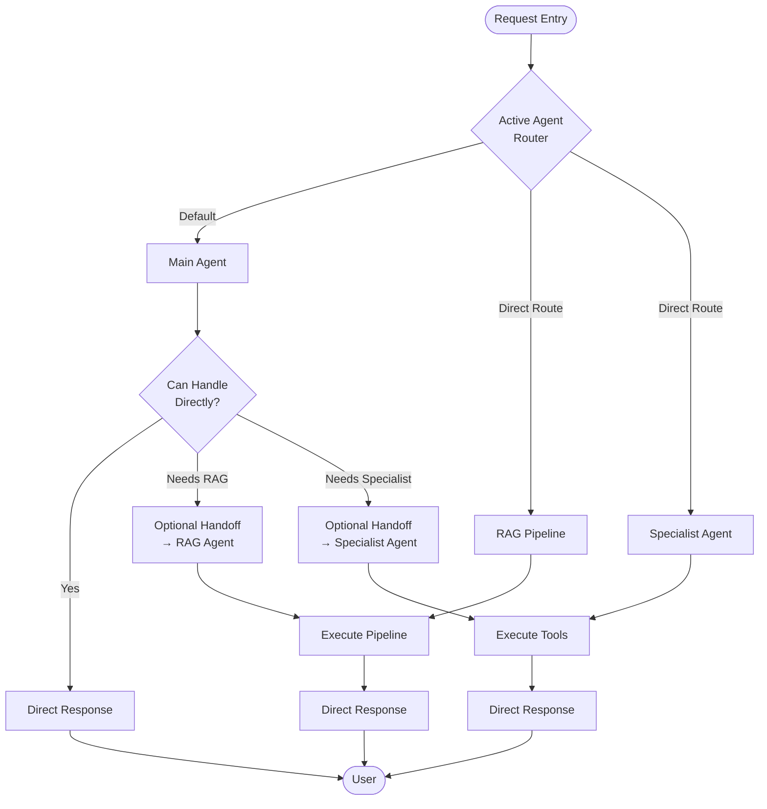
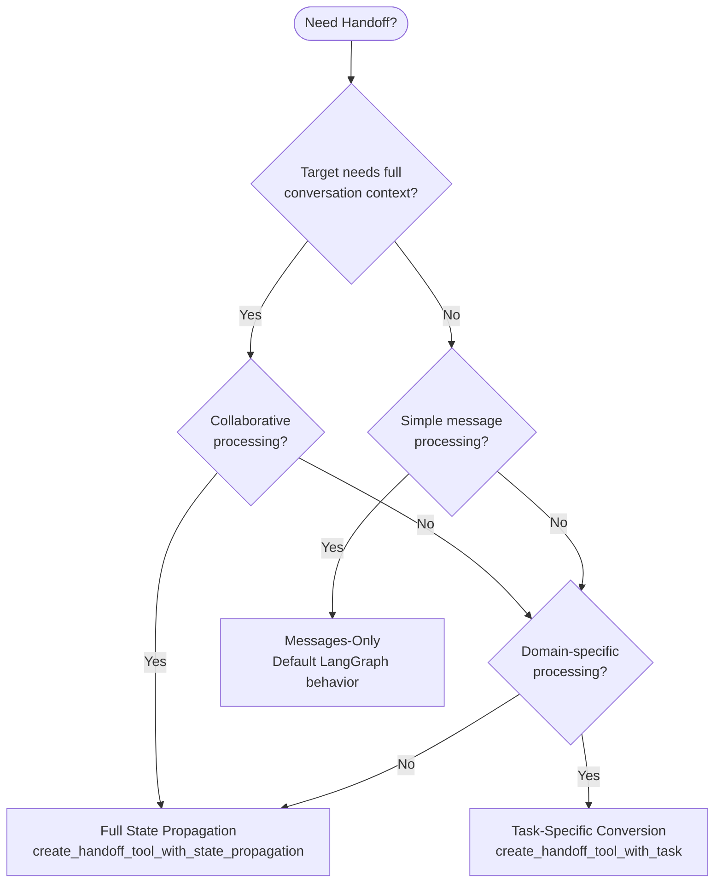
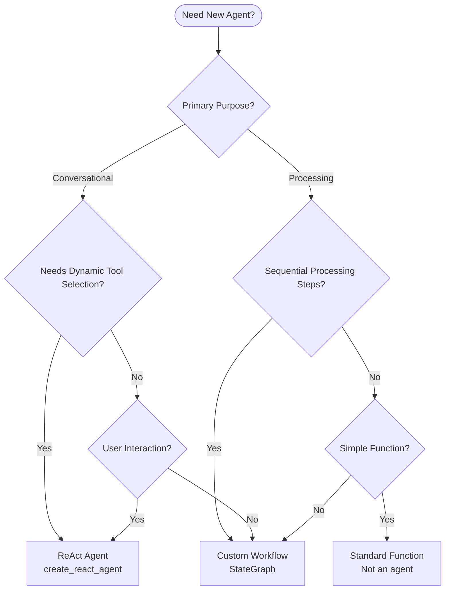

# Multi-Agent Swarm Architecture | LLM Implementation Guide

**Version:** 1.0 | **Framework:** LangGraph StateGraph

---

## 1. ARCHITECTURAL FOUNDATION

### 1.1. Multi-Agent Swarm Core

**Multi-Agent Swarm Architecture** = distributed coordination where autonomous specialized agents collaborate on complex problems.

**Characteristics:**
- **Autonomy**: Each agent operates independently, responds directly to users
- **Specialization**: Domain-specific expertise in dedicated agents
- **Collaboration**: Intelligent handoffs when specialized expertise required
- **Responsiveness**: Direct response eliminates routing overhead

**Advantages:** Scalability (modular agent addition), Maintainability (focused domains), Performance (distributed processing), Robustness (failure isolation)

### 1.2. Out-of-Box vs Custom Components

**Included (No Implementation Needed, JUST CUSTOMIZATION):**
- **RAG Agent** - 11-node document processing pipeline
- **AgentBuilder** - Dynamic agent construction with prompt management
- **Three-State Architecture Templates** - Base schemas for domain extension
- **Handoff utilities** - State propagation, task-specific transfers
- **State schema patterns** - SwarmState base, RAGState, conversions
- **Quality control** - Validation with retry logic
- **Tool patterns** - Command pattern, structured outputs

**Configure/Customize:**
- **State schemas** (extend base templates for domain)
- Agent identities & responsibilities
- Custom tools (business logic)
- Prompt templates (domain behavior)
- Handoff configuration
- Workflow routing

### 1.3. Standard Agent Topology

**Three agent types:**
- **Main Agent** - Coordinator, general queries, routing, context maintenance
- **RAG Agent** - Pre-built document pipeline (out-of-box)
- **Specialist Agent** - Domain tools, external systems, API orchestration

---

## 2. FIVE ENGINEERING DISCIPLINES

### 2.1. State Engineering

**Three-State Architecture (Templates for Domain Customization):**

```python
workflow = StateGraph(
    state_schema=DomainSwarmState,        # Customize for domain
    input_schema=DomainInputState,        # Domain-specific controls
    output_schema=DomainOutputState,      # Domain-specific exposure
    config_schema=WorkflowConfiguration,
)
```

**State Schema Templates (Customize for Domain):**

```python
# 1. Domain SwarmState - Extend base template
class DomainSwarmState(SwarmState):  # Base: messages, active_agent, user_id, session_id
    # Add domain-specific fields:
    domain_context: Optional[Dict]
    business_rules: Optional[List[str]]
    custom_metadata: Optional[Dict]

# 2. Domain Input Schema - Control entry
class DomainInputState(DomainSwarmState):
    # Base toggles + domain controls:
    enable_web_search: bool
    enable_external_systems: bool
    enable_rag_processing: bool
    # Domain-specific input controls:
    domain_feature_flags: Dict[str, bool]
    business_context: Optional[str]

# 3. Domain Output Schema - Client exposure
class DomainOutputState:
    query: str
    final_response: str
    # Domain-specific outputs:
    domain_data: Optional[Dict]
    business_metrics: Optional[Dict]
    metadata: Dict[str, Any]
```

### 2.2. Flow Engineering

**Primary Flow Pattern:**



- Single entry point → Router determines optimal agent
- Autonomous response (no consolidation required)
- Optional handoffs when specialized expertise needed
- No return loops

**Pipeline Flow Pattern:**
- Sequential processing through specialized stages
- Conditional branching based on requirements
- Quality loops with retry logic
- Graceful degradation on max retries

### 2.3. Prompt Engineering

**Dynamic Prompt Generation:**

```jinja2
# DYNAMIC_CONTEXT: {{ current_datetime }}
## Agent Identity
You are {{ agent_identity }}.

## Core Responsibilities

- {{ responsibility }}


## Current Context
{{ dynamic_context_block }}

## Available Tools

- `{{ tool.name }}`: {{ tool.description }}


## Behavioral Constraints

- {{ constraint }}


## Response Format Requirements
{{ response_format_instructions }}
```

### 2.4. Tooling Engineering

**Command Pattern Implementation:**

```python
def domain_tool(
    parameter: str,
    tool_call_id: Annotated[str, InjectedToolCallId] = None,
) -> Command:
    result: DomainResponse = process_domain_request(parameter)
    return Command(
        update={
            "query": parameter,
            "domain_response": result,
            "messages": [
                ToolMessage(
                    content=f"Processed {parameter}: {result}",
                    tool_call_id=tool_call_id,
                )
            ],
        }
    )
```

### 2.5. Handoff Engineering

**Three Handoff Types:**

**1. Full State Propagation**
```python
agent_handoff = create_handoff_tool_with_state_propagation(
    agent_name="Target_Agent",
    description="Transfer with complete state preservation"
)
```
- Transfers: Complete SwarmState, all conversation history
- Use for: Agent collaboration, bidirectional transfers, full context needs

**2. Messages-Only (LangGraph Default)**
```python
def simple_node_handoff(state):
    return {"messages": [AIMessage(content="Processed result")]}
```
- Transfers: Only messages field
- Use for: Simple sequential processing, lightweight operations

**3. Task-Specific Conversion**
```python
rag_agent_handoff = create_handoff_tool_with_task(
    agent_name="RAG_Agent",
    description="Convert to specialized task processing"
)
```
- Transfers: SwarmState → SpecializedState → SwarmState
- Use for: Domain processing (Main → RAG), specialized workflows

**Decision Framework:**



- **Full State**: Collaborative processing, context-heavy transfer
- **Messages-Only**: Simple processing, lightweight operations
- **Task-Specific**: Specialized pipelines, domain processing

#### 2.5.1. Integration Between Agent Types (Critical)

**ReAct → Custom Workflow Integration:**

```python
# Entry node: Extract message content for pipeline processing
def pipeline_entry_node(state: CustomWorkflowState) -> CustomWorkflowState:
    # MANDATORY: Extract last message content
    last_message_content = state.messages[-1].content
    
    return state.copy(update={
        "original_query": last_message_content,  # Pipeline input field
        "processing_started": True,
    })

# Exit node: Format output for next ReAct agent
def pipeline_exit_node(state: CustomWorkflowState) -> CustomWorkflowState:
    # MANDATORY: Format for conversational agent
    response_message = AIMessage(
        content=state.final_response,  # Pipeline output
        additional_kwargs={"metadata": state.processing_metadata}
    )
    
    return state.copy(update={
        "messages": state.messages + [response_message]
    })
```

**Custom Workflow → ReAct Integration:**

```python
# Custom workflow END node must include messages formatting
def workflow_to_react_transition(state: CustomWorkflowState) -> SwarmState:
    # MANDATORY: Convert pipeline output to conversational format
    return {
        "messages": state.messages + [
            AIMessage(content=state.final_response)
        ],
        "active_agent": "Target_React_Agent",
        # Preserve other SwarmState fields
    }
```

#### 2.5.2. State Cleanup (Critical for Stateful Workflows)

**MANDATORY State Cleanup Before END:**

```python
# Pre-END cleanup node: Clear processing-specific state
def workflow_cleanup_node(state: CustomWorkflowState) -> CustomWorkflowState:
    # MANDATORY: Reset processing state to avoid interference in next execution
    return state.copy(update={
        # Clear processing flags
        "processing_started": False,
        "needs_rewrite": False,
        "quality_score": None,
        "retry_count": 0,
        
        # Clear temporary data
        "intermediate_results": None,
        "processing_metadata": {},
        "error_state": None,
        
        # Preserve persistent data
        # "original_query": state.original_query,  # Keep if needed
        # "final_response": state.final_response,  # Keep for output
    })

# Workflow structure with cleanup
workflow.add_node("process", main_processing_node)
workflow.add_node("cleanup", workflow_cleanup_node)  # MANDATORY
workflow.add_node("end", workflow_to_react_transition)

workflow.add_edge("process", "cleanup")
workflow.add_edge("cleanup", "end")
```

**State Cleanup Rules:**
- **Reset processing flags** (processing_started, needs_rewrite, retry_count)
- **Clear temporary data** (intermediate_results, error_state, metadata)
- **Preserve essential output** (original_query, final_response)
- **Always add cleanup node** before END in stateful workflows

---

## 3. AGENT TYPE DECISION

### 3.1. ReAct Agent vs Custom Workflow

**ReAct Agent (create_react_agent):**
```python
def build_react_agent():
    return create_react_agent(
        model=bound_model,
        tools=agent_tools,
        pre_model_hook=dynamic_prompt_hook,
        name="Agent_Name",
        state_schema=SwarmState,
        checkpointer=MemorySaver(),
    )
```

**Use ReAct When:**
- Conversational interaction required
- Tool decision-making needs reasoning
- Multi-turn dialog management
- General problem-solving
- Human-in-the-loop interaction
- Dynamic tool selection

**Custom Workflow (StateGraph):**
```python
def build_custom_workflow():
    workflow = StateGraph(
        state_schema=SpecializedState,
        input_schema=InputState,
        output_schema=OutputState,
    )
    workflow.add_node("step_1", processing_node_1)
    workflow.add_node("step_2", processing_node_2)
    workflow.add_conditional_edges("step_1", decision_function)
    return workflow.compile()
```

**Use Custom Workflow When:**
- Deterministic processing pipeline
- Sequential specialized steps
- Domain-specific state management (50+ fields)
- Quality control loops with retry
- Conditional branching on processing results
- Non-conversational processing

**Decision Tree:**



**Decision Matrix:**

| Requirement | ReAct Agent | Custom Workflow |
|-------------|-------------|-----------------|
| User conversation | ✅ Required | ❌ Not suitable |
| Tool reasoning | ✅ Excellent | ⚠️ Manual logic |
| Sequential pipeline | ⚠️ Can work | ✅ Ideal |
| Quality loops | ⚠️ Basic retry | ✅ Advanced control |
| Specialized state | ❌ Limited | ✅ Full control |
| Conditional branching | ⚠️ Tool-based | ✅ Built-in |
| Deterministic output | ⚠️ Variable | ✅ Consistent |

---

## 4. RAG AGENT (OUT-OF-BOX)

### 4.1. Pre-Built RAG Pipeline

**Included Features:**
- Complete 11-node pipeline with conditional branching
- Quality control with automatic retry (0.7 threshold)
- Document ingestion (Docling + Chonkie integration)
- Vector database setup and collection management
- Hybrid retrieval (semantic + keyword search)
- Citation generation with source attribution

### 4.2. Implementation Usage

**Import Pre-built RAG:**
```python
from src.agents.rag.graph import build_rag_agent

rag_agent = build_rag_agent()
workflow.add_node(
    rag_agent,
    destinations=("Main_Agent", "Search_Agent"),
    metadata={"agent_type": "pipeline", "tags": ["autonomous"]},
)
```

**Handoff to RAG:**
```python
from src.utils import create_handoff_tool_with_task

rag_agent_handoff = create_handoff_tool_with_task(
    agent_name="RAG_Agent",
    description="Transfer to RAG pipeline for document processing"
)
```

**RAG Triggers:** Legislation queries, document citations, knowledge base lookup, document analysis

**Processing:** SwarmState → RAGState → 11-node pipeline → RAGState → SwarmState

---

## 5. IMPLEMENTATION GUIDELINES

### 5.1. Technology Stack

**Core Dependencies:**
- LangGraph (multi-agent framework)
- LangChain (LLM integration)
- Pydantic v2 (type safety)
- FastAPI (API layer, optional)

**LLM Integration:**
- OpenAI/Azure OpenAI: GPT-4o (main), GPT-4o-mini (auxiliary)
- Embeddings: text-embedding-3-large

**Storage:**
- PostgreSQL/SQLite (state persistence)
- ChromaDB/LanceDB/Azure AI Search (vector)
- Local/cloud storage (documents)

### 5.2. Project Structure

```
src/
├── agents/
│   ├── builder.py            # AgentBuilder (out-of-box)
│   ├── graph.py              # Main swarm StateGraph
│   ├── main_agent.py         # Coordinator
│   ├── search_agent.py       # Specialist
│   ├── states.py             # State schemas
│   ├── tools.py              # Tool implementations
│   └── rag/                  # RAG pipeline (out-of-box)
│       ├── graph.py          # RAG StateGraph
│       ├── models/           # RAG schemas
│       ├── nodes/            # Processing nodes
│       └── processors/       # Document integration
├── evaluations/              # Evaluation system
├── prompts/                  # Jinja2 templates
└── utils.py                  # Handoff utilities
```

### 5.3. AgentBuilder Usage

```python
from src.agents.builder import AgentBuilder
from src.agents.tools import human_in_the_loop
from src.agents.states import SwarmState

def build_domain_agent(model, handoff_tools=None):
    return AgentBuilder(
        name="Domain_Agent",
        model=model,
        tools=[domain_tool_1, domain_tool_2, human_in_the_loop] + (handoff_tools or []),
        agent_identity="Domain Specialist",
        responsibilities=["Capability 1", "Capability 2"],
        state_schema=SwarmState,
        prompt_template_path="prompts/domain/agent.jinja2",
        dynamic_block_template_path="prompts/base_agent_prompt.jinja2",
        additional_pre_hooks=handoff_tools,
    ).build()
```

### 5.4. Adding New Agents

```python
# Follow existing pattern
def build_new_agent(model, handoff_tools=None):
    return AgentBuilder(
        name="New_Agent",
        model=model,
        tools=[specialized_tool_1, specialized_tool_2, human_in_the_loop],
        agent_identity="Specialist Role",
        responsibilities=["Specific capability 1", "Specific capability 2"],
        state_schema=SwarmState,
        prompt_template_path="prompts/domain/new_agent.jinja2",
        additional_pre_hooks=handoff_tools,
    ).build()

# Add to workflow
workflow.add_node(
    new_agent,
    destinations=("Main_Agent", "RAG_Agent", "Search_Agent"),
    metadata={"agent_type": "specialist", "tags": ["autonomous"]},
)
```

### 5.6. Implementation Methodology

**Structured approach for implementing any multi-agent swarm project using this architecture.**

**Why This Methodology Is Critical:**

Multi-agent swarm systems require **systematic analysis and planning** before implementation due to their distributed, stateful, and collaborative nature. Unlike monolithic systems, swarm architectures involve:

- **Complex state management** across autonomous agents with different schemas
- **Dynamic coordination patterns** requiring precise handoff logic
- **Recursive workflow depth** with nested sub-agents and specialized pipelines  
- **Adaptive prompt engineering** that responds to workflow state changes
- **Multi-level tool strategies** spanning plain text, command patterns, and state updates

**The methodology ensures:**
- **Complete domain coverage** without gaps in agent responsibilities
- **Correct agent type selection** (ReAct vs Custom Workflow) based on requirements
- **Proper state architecture** with cleanup, persistence, and UI integration
- **Validated coordination flows** between agents and workflow components
- **Documentation-first implementation** preventing architectural drift

**Implementation phases must be followed sequentially** - each phase builds critical foundation for subsequent phases.

#### Phase 1: Domain Analysis & Architecture Planning

**1.1. Domain Analysis**
- **Group functionalities** by business domain and technical affinity
- **Group contexts** by data requirements and processing patterns
- **Group profiles & responsibilities** by expertise areas and decision authority
- **Analyze domain specifics** for each identified group (constraints, rules, integrations)

**1.2. Workflow Orchestration Design**
- **Determine agent types** per domain group:
  - **ReAct Agent**: Autonomous conversational with dynamic tool selection
  - **Custom Workflow**: Deterministic pipelines with loops, branching, quality control
- **Define coordination patterns**: Direct response (workflow finalization) vs handoff requirements
- **Map inter-agent dependencies**: Which agents need collaboration

**1.3. State Architecture Design**
- **Define entry parameters**: What data enters each workflow
- **Define exit parameters**: 
  - Data for next agent in collaboration chain
  - UI integration fields (CopilotKit compatibility)
- **Design domain state extensions**: Extend base SwarmState templates / Use a new TypeDict
- **Plan state cleanup strategy**: Which fields persist vs reset between executions

#### Phase 2: Workflow Component Definition

**2.1. Custom Workflow Specification**
- **Define processing nodes**: Single responsibility, structured outputs
- **Define transformation logic**: Input → Processing → Output contracts
- **Design conditional branching**: Decision logic and routing rules
- **Plan quality control loops**: Retry logic, validation thresholds
- **Specify sub-workflows**: Recursive depth analysis for nested agentic components

**2.2. State Contract Definition**
- **Refine state schemas**: Based on workflow requirements
- **Define sub-states**: For nested workflows and specialized processing
- **Specify state transitions**: Between workflow components
- **Design Nodes output contracts**: All nodes MUST return structured outputs (Pydantic/TypedDict)

**2.3. Node Output Standards**
- **Mandatory structured outputs**: No plain text returns
- **Pydantic model definitions**: For complex data structures
- **TypedDict compliance**: State updates must match workflow schema
- **Output transformation nodes**: Convert Pydantic → TypedDict when needed

#### Phase 3: Tool Strategy & Integration

**3.1. ReAct Agent Tool Design**
- **Tool categorization by return strategy**:
  
  **Plain Text/JSON Tools**:
  - Agent includes result in message thread
  - Agent decides next action (final response vs multi-hop iteration)
  - Use for: Information retrieval, external API calls, simple calculations
  
  **Command Pattern Tools**:
  - Update workflow state directly
  - Enable other workflow nodes to use updated fields
  - Use for: State management, cross-node data sharing, workflow control

**3.2. Handoff Tool Configuration**
- **Intra-swarm handoffs**: Between main swarm agents
- **Inter-workflow handoffs**: Between sub-graphs and main agents
- **Cross-level handoffs**: Between workflow layers (main → sub → nested)
- **Handoff descriptions**: Aligned with agent responsibilities and contexts

#### Phase 4: Dynamic Prompt Engineering

**4.1. Adaptive Prompt Architecture**
- **State-driven conditionals**: Jinja2 templates with state-based logic
- **Context enrichment**: Experience, trajectories, domain observations
- **Adaptive content blocks**: Include/exclude instructions based on state variables, but includes the entire scope of functionalities in the same file,surround by conditionals, lopps, etc.


**4.2. Prompt Structure Design**
(includes as jinja2 temlates indize promtps/fragments folder)
```jinja2

## New User Greeting Instructions
{{ greeting_block }}



## Domain-Specific Context 
# more conditionals, loops, etc.
{{ domain_context }}


## Agent Responsibilities

- {{ responsibility }}

```

**4.3. Handoff Prompt Alignment**
- **Precise responsibility definitions**: Enable accurate handoff decisions
- **Context-aware descriptions**: Dynamic based on current workflow state
- **Fragment organization**: Dedicated directory structure for prompt components
- **Base prompt integration**: Fragments inserted in `Behavior` section

#### Phase 5: Validation & Testing Strategy

**5.1. Scenario Development**
- **Diversified test cases**: Cover all trajectory combinations
- **Edge case scenarios**: Error conditions, boundary cases
- **Multi-agent workflows**: End-to-end collaboration patterns
- **State transition validation**: Verify cleanup and persistence logic

**5.2. Development Validation**
- **Component testing**: Individual nodes and tools
- **Integration testing**: Agent-to-agent handoffs
- **State consistency validation**: Verify state management across executions
- **UI integration testing**: CopilotKit compatibility validation

#### Phase 6: Documentation-First Implementation

**6.1. Pre-Implementation Documentation (MANDATORY)**
- **Create project root markdown file**: Complete specification before coding
- **Document all components**: States, contracts, contexts, tools
- **Specify all transformations**: Data flow and processing logic
- **Define validation criteria**: Success metrics and test scenarios

**6.2. Implementation Execution**
- **Follow documented specifications**: No improvisation during coding
- **Validate against contracts**: Ensure outputs match defined schemas
- **Test incremental delivery**: Validate each component before integration
- **Maintain documentation sync**: Update specs with implementation learnings

**Critical Success Factors:**
- **Documentation-first approach**: Complete specification before implementation
- **Recursive analysis depth**: Properly analyze nested workflow requirements
- **State management discipline**: Mandatory cleanup and structured outputs
- **Tool strategy alignment**: Match tool types to workflow requirements
- **Prompt-state integration**: Dynamic prompts that adapt to workflow state
