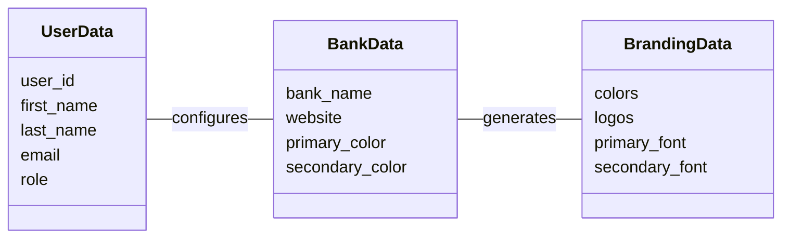
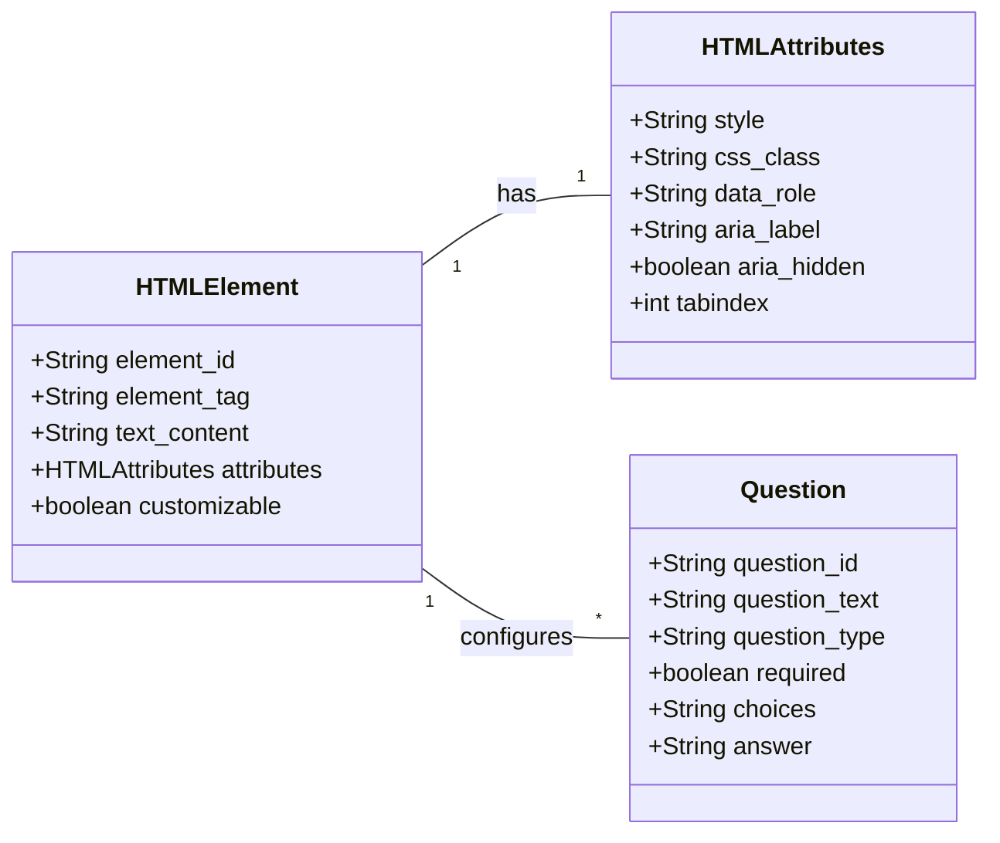
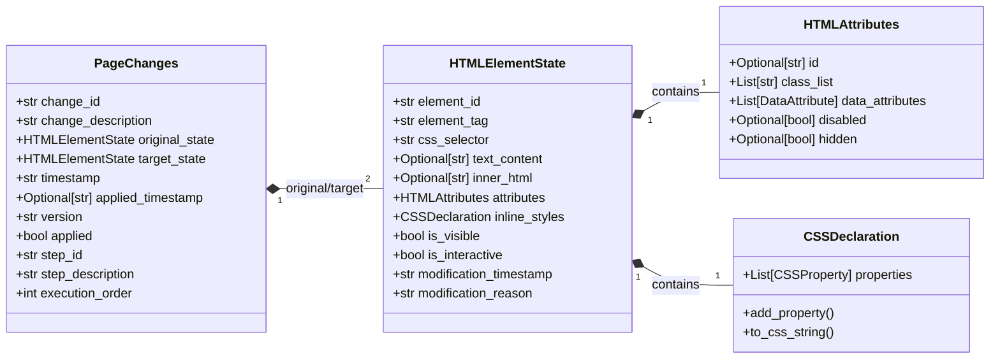
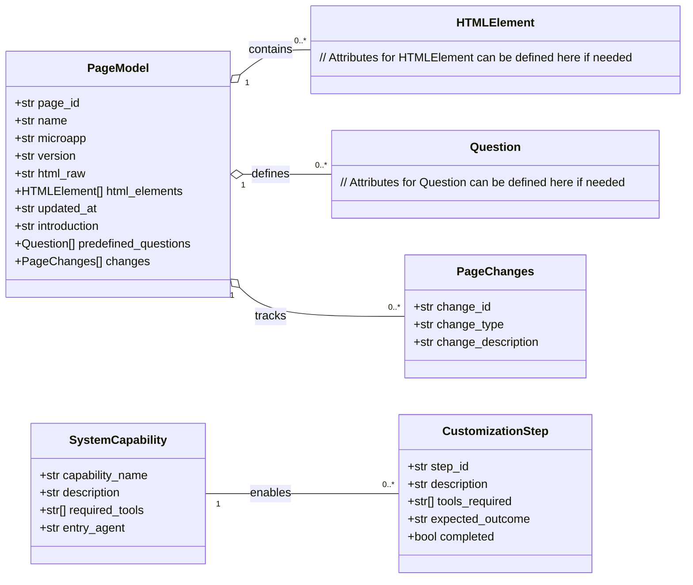
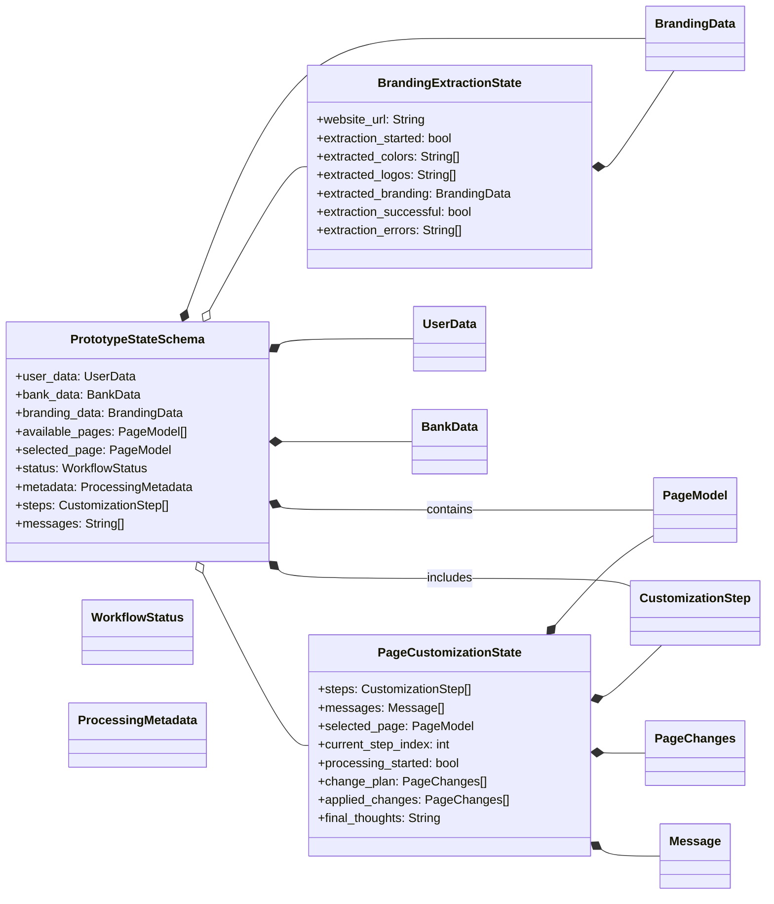
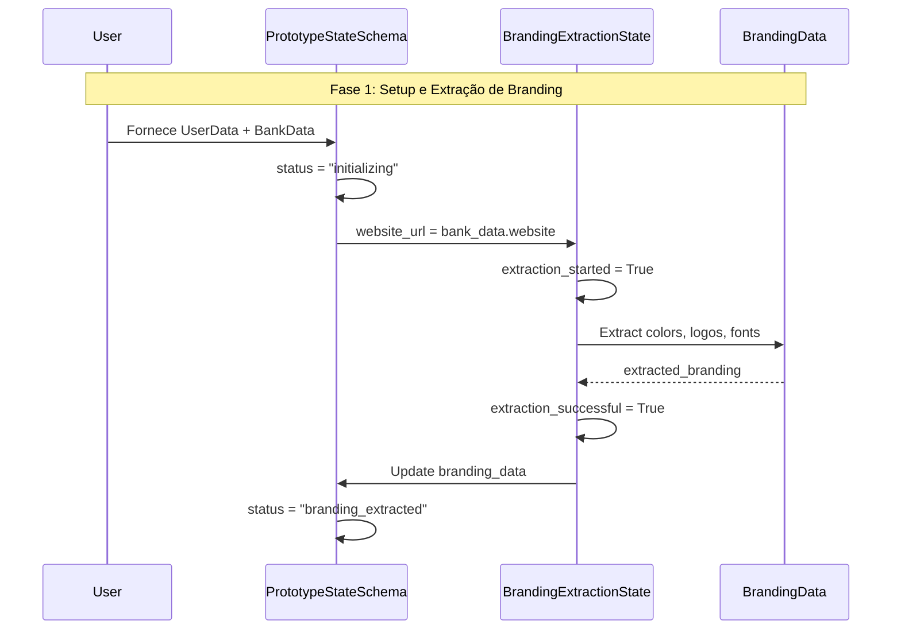
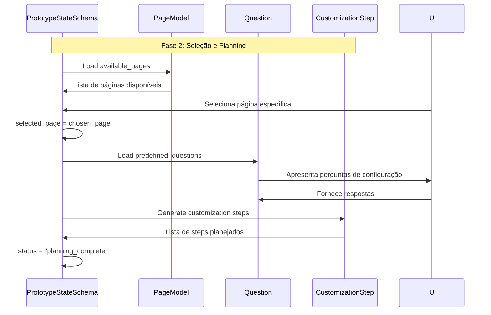
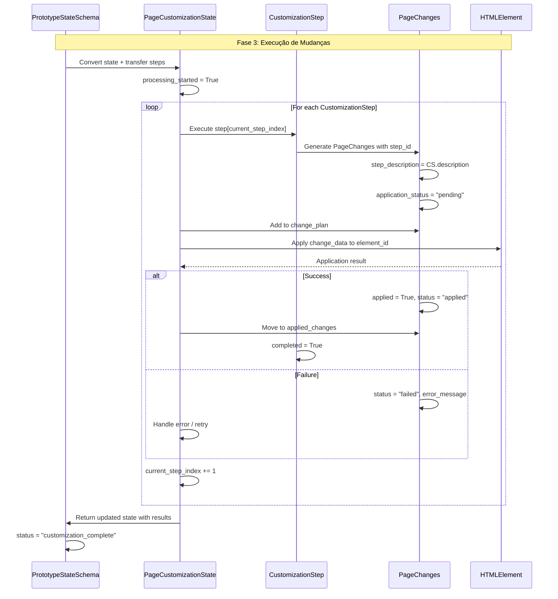
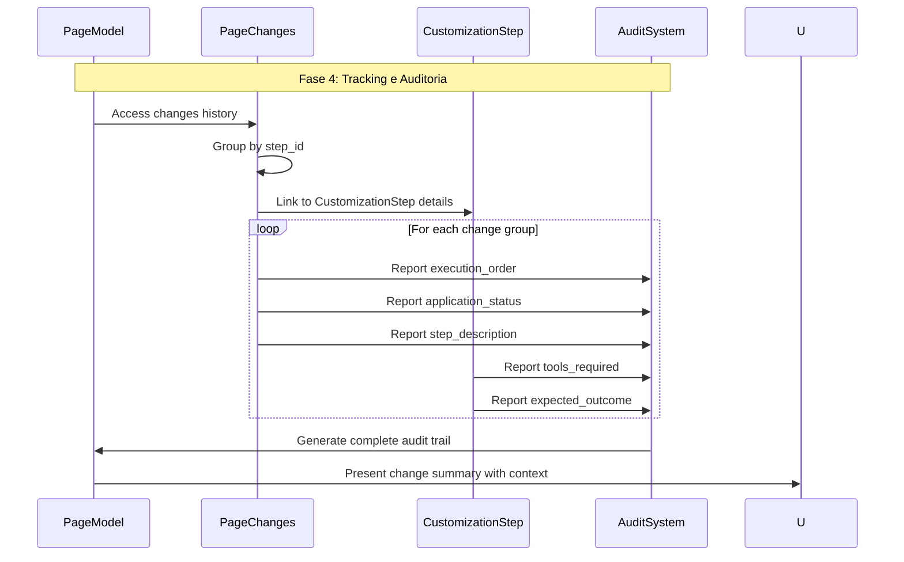

# Análise Completa do Workflow Multi-Agente: Estados, Fluxos e Conexões


```python
class PageChanges(BaseModel):
    """Estado completo de mudança em elemento HTML - auto-contido para aplicação"""
    change_id: str
    change_description: str
    original_state: HTMLElementState  # Estado completo antes da mudança
    target_state: HTMLElementState    # Estado completo desejado
    timestamp: str
    applied_timestamp: Optional[str]
    version: str  # Versionamento semântico (x.y.z) para rollback
    applied: bool = False
    
    # NOVA CONEXÃO COM WORKFLOW
    step_id: str = Field(description="ID do CustomizationStep que gerou esta mudança")
    step_description: str = Field(description="Descrição do step para contexto")
    execution_order: int = Field(description="Ordem de execução dentro do step")
    
    # CONTEXTO ADICIONAL PARA TRACKING
    application_status: Literal["pending", "applied", "failed", "rolled_back"] = "pending"
    error_message: Optional[str] = Field(description="Erro se aplicação falhou")

class HTMLElementState(BaseModel):
    """Estado completo auto-contido de um elemento HTML"""
    element_id: str
    element_tag: str
    css_selector: str
    text_content: Optional[str]
    inner_html: Optional[str]
    attributes: HTMLAttributes
    inline_styles: CSSDeclaration
    is_visible: bool = True
    is_interactive: bool = True
    parent_selector: Optional[str]
    children_selectors: List[str]
    modification_timestamp: str
    modification_reason: str
```

## Arquitetura Completa: Storytelling dos Modelos

### **Camada 1: Dados Fundamentais (Foundation Layer)**

**Propósito:** Representar informações básicas do domínio



**História:** Um usuário (`UserData`) configura dados do banco (`BankData`) que são usados para extrair informações de branding (`BrandingData`) do website institucional.

### **Camada 2: Estruturas HTML (Content Layer)**

**Propósito:** Representar elementos de página que podem ser modificados



**História:** Elementos HTML (`HTMLElement`) possuem atributos estruturados (`HTMLAttributes`) e podem ser configurados através de perguntas (`Question`) feitas ao usuário.

### **Camada 3: Mudanças e Transformações (Change Layer)**

**Propósito:** Representar transformações aplicadas aos elementos



**História:** Estados completos de elementos HTML (`HTMLElementState`) representam tanto o estado original quanto o estado desejado, encapsulados em `PageChanges` que conecta as transformações com contexto completo de workflow. Cada estado é auto-contido com todos os dados necessários para aplicação direta.

### **Camada 4: Workflow e Steps (Process Layer)**

**Propósito:** Orquestrar a execução de mudanças através de steps estruturados



**História:** Steps de customização (`CustomizationStep`) geram mudanças (`PageChanges`) que são aplicadas a páginas (`PageModel`) usando capacidades do sistema (`SystemCapability`).

### **Camada 5: Estados de Workflow (State Layer)**

**Propósito:** Gerenciar estado e progressão através dos workflows



**História:** Estados principais (`PrototypeStateSchema`) orquestram sub-workflows (`PageCustomizationState`, `BrandingExtractionState`) que executam operações específicas e mantêm tracking detalhado de progresso.

## Fluxo de Execução Completo

### **Sequência 1: Inicialização e Setup**



### **Sequência 2: Seleção de Página e Planning**



### **Sequência 3: Execução de Customização**



### **Sequência 4: Tracking e Auditoria**



## Storytelling Completo: A Jornada do Workflow

### **Ato I: O Usuário e Sua Necessidade**
A história começa quando um usuário (`UserData`) acessa o sistema com a necessidade de customizar uma página bancária. Ele fornece dados básicos do banco (`BankData`) incluindo o website institucional. O sistema então inicia um sub-workflow de extração (`BrandingExtractionState`) que analisa o website e extrai cores, logos e fontes, criando um perfil de branding (`BrandingData`) completo.

### **Ato II: Descoberta e Planejamento**
Com o branding extraído, o sistema apresenta páginas disponíveis (`PageModel`) que contêm elementos customizáveis (`HTMLElement`) com atributos estruturados (`HTMLAttributes`). O usuário responde perguntas predefinidas (`Question`) que orientam o processo de customização. Baseado nessas respostas e no branding extraído, o sistema gera uma série de steps de customização (`CustomizationStep`) que descrevem exatamente o que será modificado.

### **Ato III: Execução e Transformação**
O workflow entra na fase de execução (`PageCustomizationState`) onde cada step é processado sequencialmente. Para cada step, o sistema gera mudanças específicas (`PageChanges`) que capturam o **estado completo** do elemento antes (`original_state`) e depois (`target_state`) das modificações. Cada `HTMLElementState` é auto-contido com todos os atributos, estilos e dados necessários para aplicação direta. **Crucialmente**, cada mudança está conectada ao step que a gerou através de `step_id`, `step_description` e `execution_order`, criando rastreabilidade completa.

### **Ato IV: Aplicação e Validação**
As mudanças são aplicadas aos elementos HTML com tracking detalhado de status (`application_status`). Se uma aplicação falha, o erro é capturado (`error_message`) e o rollback é feito através do histórico versionado de mudanças. O sistema mantém listas separadas de mudanças planejadas (`change_plan`) e aplicadas (`applied_changes`), permitindo comparação e auditoria baseada em versões semânticas.

### **Ato V: Auditoria e Conclusão**
Ao final, o sistema possui uma trilha completa de auditoria onde cada mudança pode ser rastreada até o step específico que a originou, com contexto completo sobre tools utilizadas, outcomes esperados, e status de execução. Isso permite debugging eficiente, rollbacks seletivos, e relatórios detalhados para o usuário.
