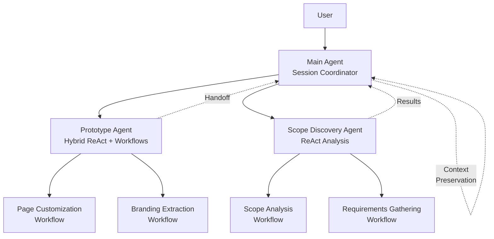
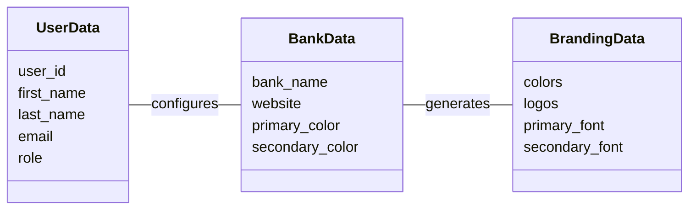
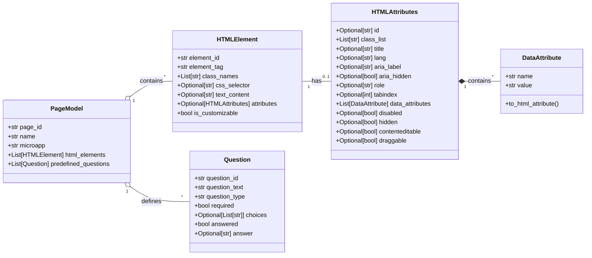
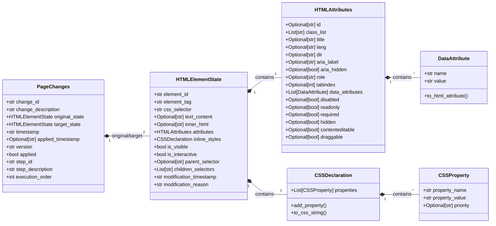
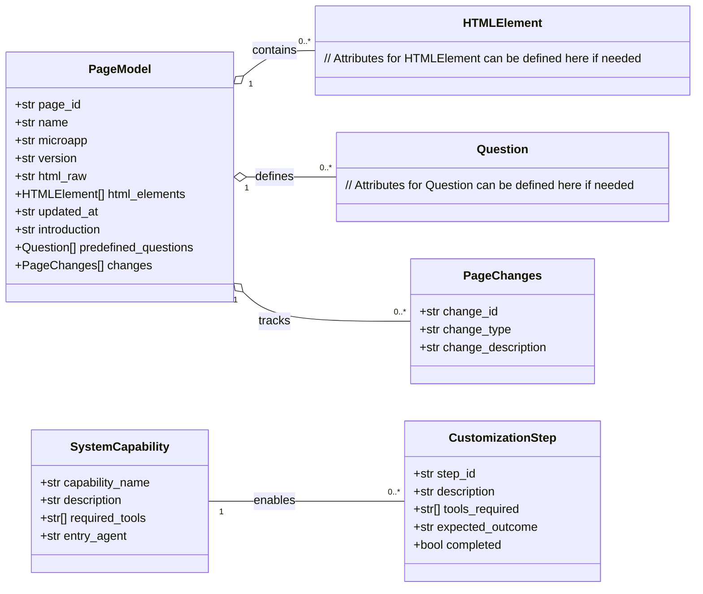
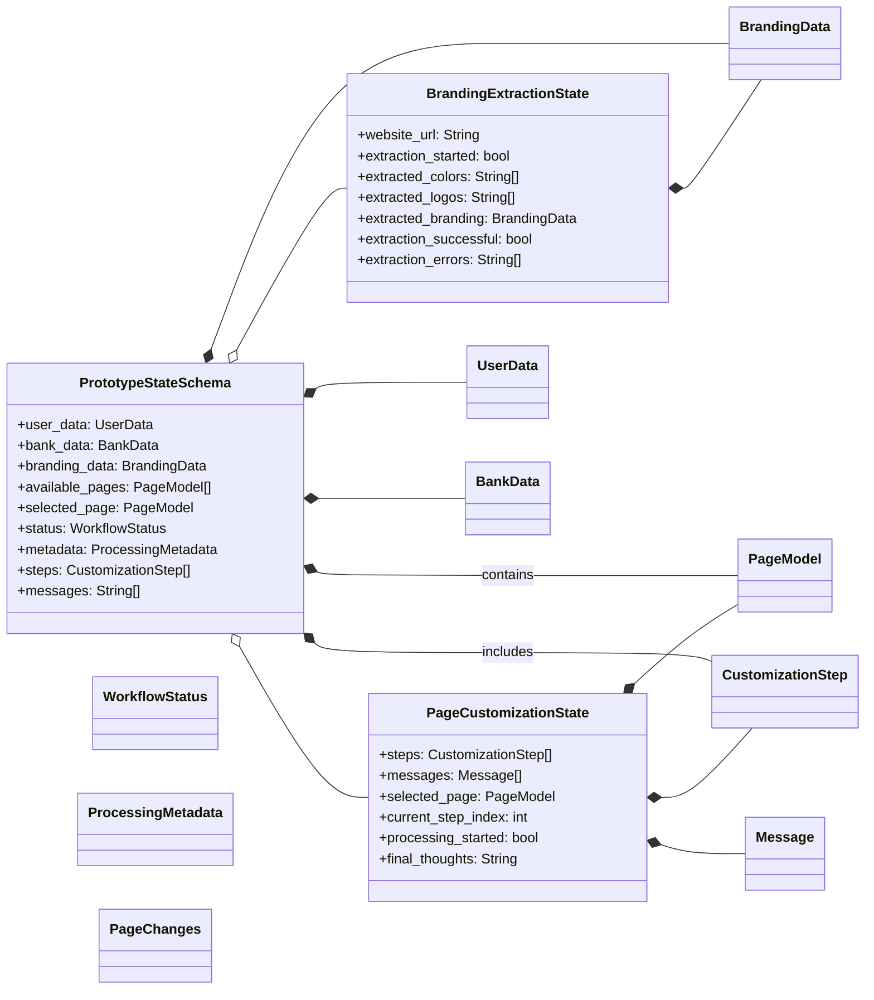
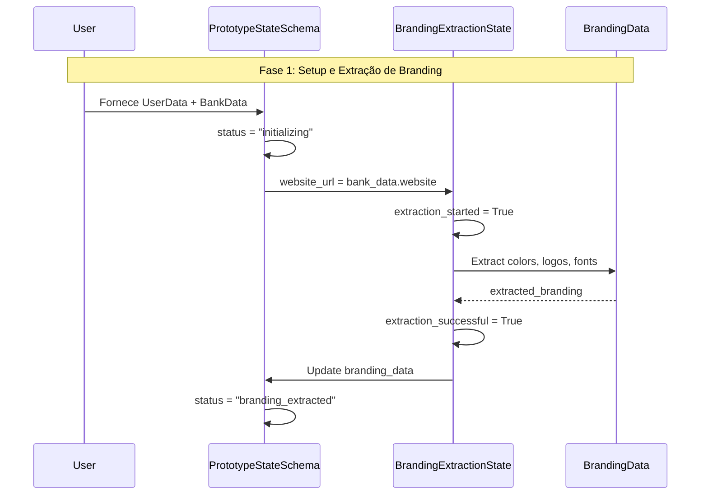
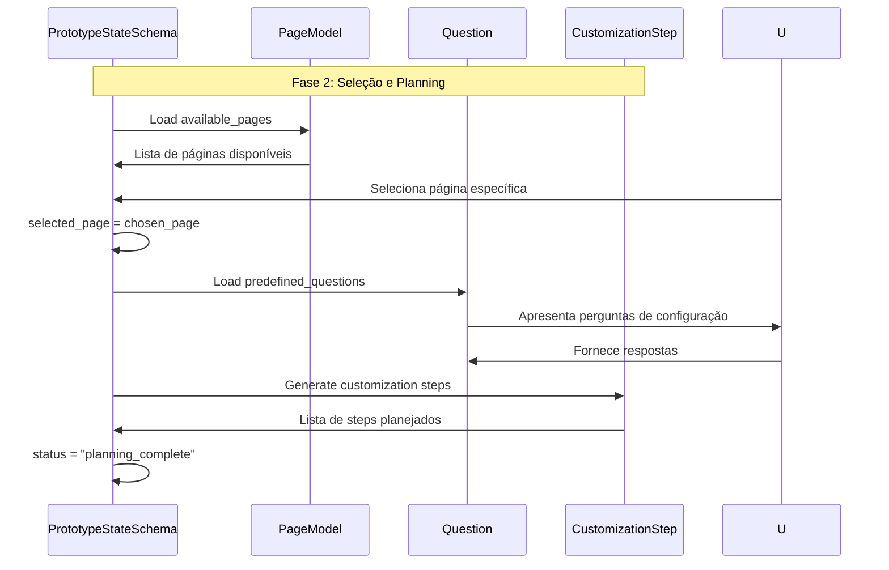
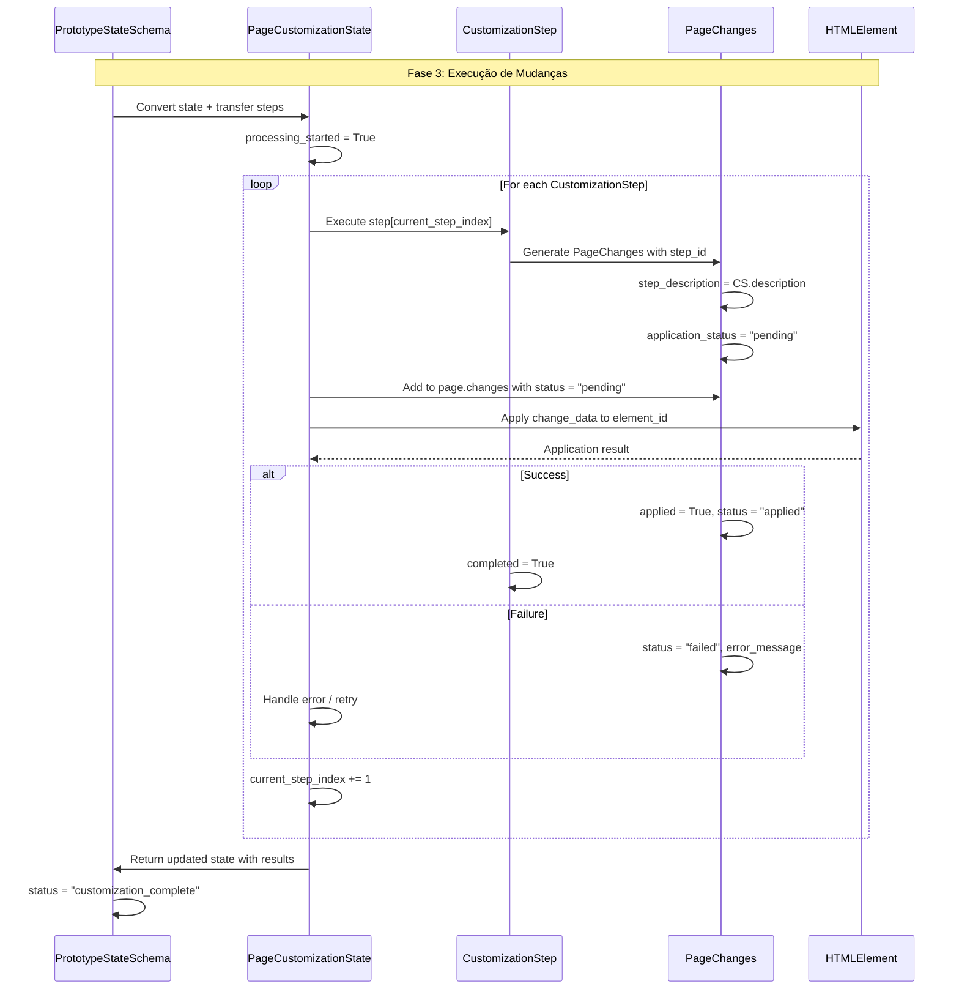
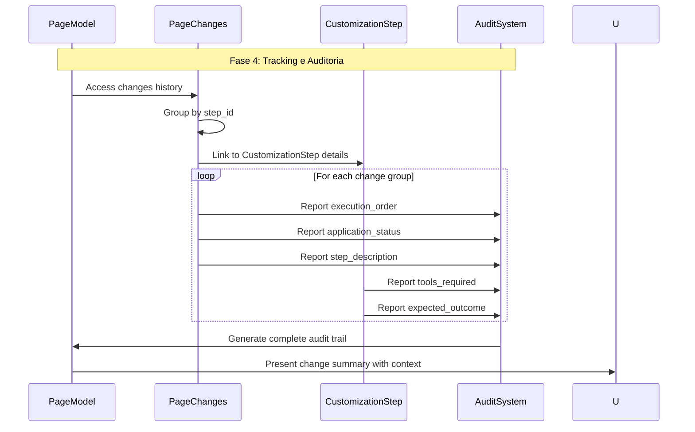

# Fincoder Multi-Agent Swarm Architecture | Banking App Development Assistant

**Version:** 1.0 | **Framework:** LangGraph StateGraph | **Domain:** Banking Application Development
**Autor**: João Gabriel Lima

## Introdução

**Fincoder** é um sistema multi-agente para **prototipação e customização assistida por IA** de aplicações bancárias Temenos, construído sobre LangGraph StateGraph.

**Arquitetura:** 3 workflows especializados executados por 2 agentes ReAct e 1 agente híbrido, oferecendo capacidades de session management, prototype development e project scope discovery.

**Público-alvo:** Documentação técnica para desenvolvedores implementando ou mantendo o sistema Fincoder.

---

## 1. DOMAIN ANALYSIS & ARCHITECTURE REFINEMENT

### 1.1. Real-World Scenario Analysis

**Domain Functionality Grouping** based on actual user flows:

**Grupo 1: User Session & Context Management**
- User profile management e autenticação automática
- Session state restoration e continuidade
- Context preservation entre sessões
- Adaptive conversation management baseado em timing

**Grupo 2: Banking App Prototyping (Hybrid ReAct + Custom Workflow)**
- Temenos Digital Customization workflow
- Page selection e branding data extraction
- Interactive element identification e modification
- Sub-workflow orchestration para customização detalhada

**Grupo 3: Project Scope Discovery**
- Structured scope analysis workflow
- Requirements gathering e documentation
- Project planning e milestone tracking

### 1.2. Agent Architecture

**Main Agent (Session Coordinator)**
- **Tipo:** ReAct Agent (conversational, adaptive timing)
- **Responsabilidades:**
  - User welcome vs returning user detection
  - System capabilities presentation
  - Intelligent routing baseado em user intent
  - Session continuity management

**Prototype Agent (Hybrid Architecture)**
- **Tipo:** ReAct + Custom Workflow Combination
- **Responsabilidades:**
  - Branding data collection/extraction
  - Page selection e management
  - Interactive element manipulation
  - Sub-workflow orchestration for detailed customization

**Scope Discovery Agent (ReAct)**
- **Tipo:** ReAct Agent (structured analysis)
- **Responsabilidades:**
  - Project scope analysis workflow
  - Requirements documentation
  - Milestone planning

## 2. STATE ARCHITECTURE

### 2.1. Core Data Models

```python
from pydantic import BaseModel, Field
from typing import Optional, List, Literal
from datetime import datetime
from enum import Enum

# ================================
# CORE DATA STRUCTURES
# ================================

class UserData(BaseModel):
    """User profile with session management"""
    # PROPÓSITO: Identificação única do usuário
    # SETADO EM: user_lookup_tool via fetch_user_profile()
    # USADO EM: user_lookup_tool, session management, handoff_tools
    # EXEMPLO: "usr_12345"
    user_id: str
    
    # PROPÓSITO: Contato do usuário para comunicação
    # SETADO EM: user_lookup_tool via fetch_user_profile()  
    # USADO EM: Prompts de personalização, notificações
    # EXEMPLO: "joao@banco.com"
    email: str
    
    # PROPÓSITO: Nome para personalização de mensagens
    # SETADO EM: user_lookup_tool via fetch_user_profile()
    # USADO EM: Main agent prompt templates, welcome messages
    # EXEMPLO: "João Silva"
    name: Optional[str] = None
    
    # PROPÓSITO: Função do usuário para contexto de trabalho
    # SETADO EM: user_lookup_tool via fetch_user_profile()
    # USADO EM: Main agent prompts, capability filtering
    # EXEMPLO: "Product Manager"
    role: Optional[str] = None
    
    # PROPÓSITO: Idioma preferido para interface
    # SETADO EM: user_lookup_tool via fetch_user_profile()
    # USADO EM: Response generation, prompt templates
    # EXEMPLO: "pt-BR"
    language: str = "pt-BR"
    
    # PROPÓSITO: Detecta primeiro acesso para welcome flow
    # SETADO EM: user_lookup_tool baseado em historical data
    # USADO EM: conversation_continuity_tool, main agent prompts
    # IMPACTO: Determina tipo de welcome (novo vs retornando)
    # EXEMPLO: True para primeira sessão
    is_new_user: bool = True
    
    # PROPÓSITO: Rastreamento de última atividade
    # SETADO EM: user_lookup_tool via fetch_user_profile()
    # USADO EM: conversation_continuity_tool para timing decisions
    # EXEMPLO: "2024-01-15T10:30:00Z"
    last_login: Optional[str] = None
    
    # PROPÓSITO: Tempo desde última atividade para contexto conversacional
    # SETADO EM: user_lookup_tool via calculate_time_interval()
    # USADO EM: conversation_continuity_tool, main agent prompt conditionals
    # IMPACTO: Determina estilo conversacional (continue/recap/welcome back)
    # EXEMPLO: 45 (minutos)
    interval_since_latest_update: Optional[int] = None

class BankData(BaseModel):
    """Bank information and context"""
    # PROPÓSITO: Nome do banco para contexto de customização
    # SETADO EM: user_lookup_tool via fetch_bank_data()
    # USADO EM: Prompts de personalização, branding context
    # EXEMPLO: "Banco do Brasil"
    bank_name: str
    
    # PROPÓSITO: Website do banco para extração de branding
    # SETADO EM: user_lookup_tool via fetch_bank_data()
    # USADO EM: branding_extraction_handoff_tool, prototype agent routing
    # IMPACTO: Determina se branding pode ser extraído automaticamente
    # EXEMPLO: "https://bb.com.br"
    website: Optional[str] = None
    
    # PROPÓSITO: Versão do Temenos Digital que o banco está utilizando
    # SETADO EM: user_lookup_tool via fetch_bank_data()
    # USADO EM: Compatibilidade de features, page selection, customization constraints
    # IMPACTO: Determina features disponíveis e limitações de customização
    # EXEMPLO: "14.6.2", "15.1.0"
    temenos_version: Optional[str] = None

class BrandingData(BaseModel):
    """Branding configuration with source tracking"""
    # PROPÓSITO: Cor primária do banco para customização de UI
    # SETADO EM: branding_extraction_workflow ou human_in_the_loop
    # USADO EM: page customization, HTML styling, UI generation
    # EXEMPLO: "#003366"
    primary_color: Optional[str] = None
    
    # PROPÓSITO: Cor secundária do banco para customização de UI
    # SETADO EM: branding_extraction_workflow ou human_in_the_loop
    # USADO EM: page customization, HTML styling, UI generation
    # EXEMPLO: "#FFD700"
    secondary_color: Optional[str] = None
    
    # PROPÓSITO: URL ou path do logo do banco
    # SETADO EM: branding_extraction_workflow ou human_in_the_loop
    # USADO EM: page customization, header elements, branding context
    # EXEMPLO: "https://banco.com/logo.png"
    bank_logo: Optional[str] = None
    
    # PROPÓSITO: Origem dos dados de branding para auditoria
    # SETADO EM: branding_extraction_workflow (EXTRACTED) ou human_in_the_loop (USER)
    # USADO EM: Quality validation, branding confidence assessment
    # EXEMPLO: "EXTRACTED"
    source: Literal[ "USER", "EXTRACTED"] = "USER"
    
    # PROPÓSITO: Completude dos dados para workflow routing
    # SETADO EM: mark_complete() method, branding validation
    # USADO EM: prototype agent routing decisions, conditional prompts
    # IMPACTO: Determina se branding extraction é necessária
    # EXEMPLO: True quando todos os campos obrigatórios estão preenchidos
    is_complete: bool = False
    
    def mark_complete(self) -> bool:
        """Check if all required branding data is present"""
        self.is_complete = all([
            self.primary_color,
            self.secondary_color,
            self.bank_logo
        ])
        return self.is_complete

class HTMLElement(BaseModel):
    """HTML Element representation for customization"""
    # PROPÓSITO: Identificador único do elemento HTML
    # SETADO EM: get_available_pages_tool via page loading
    # USADO EM: ui_highlight_elements_tool, get_element_by_id_tool
    # EXEMPLO: "header-logo-container"
    element_id: str
    
    # PROPÓSITO: Tag HTML do elemento para customização adequada
    # SETADO EM: get_available_pages_tool via page parsing
    # USADO EM: html_change_planner_tool, customization constraints
    # EXEMPLO: "div", "button", "span"
    element_tag: str
    
    # PROPÓSITO: Classes CSS para identificação e styling
    # SETADO EM: get_available_pages_tool via page parsing
    # USADO EM: find_elements_tool, CSS customization planning
    # EXEMPLO: ["btn", "btn-primary", "large"]
    class_names: List[str] = Field(default_factory=list)
    
    # PROPÓSITO: Seletor CSS para localização do elemento
    # SETADO EM: get_available_pages_tool via page parsing
    # USADO EM: ui_highlight_elements_tool, element manipulation
    # EXEMPLO: "#header .logo-container"
    css_selector: Optional[str] = None
    
    # PROPÓSITO: Conteúdo textual para customização
    # SETADO EM: get_available_pages_tool via page parsing
    # USADO EM: html_change_planner_tool, content modification
    # EXEMPLO: "Welcome to Your Bank"
    text_content: Optional[str] = None


class CSSProperty(BaseModel):
    """Propriedade CSS individual fortemente tipada"""
    # PROPÓSITO: Nome da propriedade CSS para aplicação específica
    # SETADO EM: html_change_planner_tool, branding_extraction_workflow
    # USADO EM: apply_element_changes, CSS generation, style application
    # EXEMPLO: "background-color", "font-size", "border-radius"
    property_name: str = Field(description="Nome da propriedade CSS")
    
    # PROPÓSITO: Valor da propriedade CSS para aplicação
    # SETADO EM: html_change_planner_tool, user customization inputs
    # USADO EM: apply_element_changes, inline style generation
    # EXEMPLO: "#FF5733", "16px", "5px solid #000"
    property_value: str = Field(description="Valor da propriedade CSS")
    
    # PROPÓSITO: Prioridade CSS para controle de especificidade
    # SETADO EM: html_change_planner_tool baseado em business rules
    # USADO EM: CSS generation, style conflict resolution
    # EXEMPLO: "important" para estilos críticos de branding
    priority: Optional[Literal["important"]] = Field(description="Prioridade CSS")

class CSSDeclaration(BaseModel):
    """Conjunto de propriedades CSS para um elemento"""
    # PROPÓSITO: Lista de propriedades CSS estruturadas para aplicação
    # SETADO EM: html_change_planner_tool via CSS analysis
    # USADO EM: apply_element_changes, style generation
    # EXEMPLO: [CSSProperty("color", "#FF5733"), CSSProperty("font-size", "16px")]
    properties: List[CSSProperty] = Field(default_factory=list)
    
    def add_property(self, name: str, value: str, priority: Optional[str] = None):
        """Add CSS property to declaration"""
        self.properties.append(CSSProperty(
            property_name=name,
            property_value=value,
            priority=priority
        ))
    
    def to_css_string(self) -> str:
        """Convert to CSS string for direct application"""
        css_parts = []
        for prop in self.properties:
            css_value = prop.property_value
            if prop.priority:
                css_value += f" !{prop.priority}"
            css_parts.append(f"{prop.property_name}: {css_value}")
        return "; ".join(css_parts)

class DataAttribute(BaseModel):
    """Data attribute estruturado - zero dicionários"""
    # PROPÓSITO: Nome do data attribute sem prefixo data-
    # SETADO EM: get_available_pages_tool via page parsing
    # USADO EM: HTML generation, data attribute application
    # EXEMPLO: "role", "target", "config"
    name: str = Field(description="Nome do data attribute (sem data-)")
    
    # PROPÓSITO: Valor do data attribute para funcionalidade
    # SETADO EM: html_change_planner_tool, user customization
    # USADO EM: HTML generation, JavaScript interaction
    # EXEMPLO: "button", "#header", '{"theme": "dark"}'
    value: str = Field(description="Valor do data attribute")
    
    def to_html_attribute(self) -> str:
        """Convert to HTML attribute string"""
        return f'data-{self.name}="{self.value}"'

class HTMLAttributes(BaseModel):
    """Atributos HTML específicos - completamente estruturados"""
    
    # ATRIBUTOS UNIVERSAIS
    # PROPÓSITO: ID único do elemento no DOM
    # SETADO EM: get_available_pages_tool, html_change_planner_tool
    # USADO EM: Element targeting, CSS selectors, JavaScript access
    # EXEMPLO: "header-logo-container"
    id: Optional[str] = None
    
    # PROPÓSITO: Lista de classes CSS para styling e targeting
    # SETADO EM: html_change_planner_tool, class modification workflows
    # USADO EM: CSS application, element selection, styling
    # EXEMPLO: ["btn", "btn-primary", "custom-banking-style"]
    class_list: List[str] = Field(default_factory=list, description="Lista de classes CSS")
    
    # PROPÓSITO: Título tooltip para acessibilidade
    # SETADO EM: html_change_planner_tool, accessibility workflows
    # USADO EM: Tooltip display, accessibility support
    # EXEMPLO: "Click to view account details"
    title: Optional[str] = None
    
    # PROPÓSITO: Idioma do conteúdo do elemento
    # SETADO EM: user_data.language, internationalization workflows
    # USADO EM: Browser language handling, screen readers
    # EXEMPLO: "pt-BR", "en-US"
    lang: Optional[str] = None
    
    # PROPÓSITO: Direção do texto para internacionalização
    # SETADO EM: internationalization workflows, RTL support
    # USADO EM: Text direction rendering, layout adjustment
    # EXEMPLO: "ltr" para português, "rtl" para árabe
    dir: Optional[Literal["ltr", "rtl", "auto"]] = None
    
    # ATRIBUTOS DE ACESSIBILIDADE
    # PROPÓSITO: Label acessível para screen readers
    # SETADO EM: accessibility workflows, html_change_planner_tool
    # USADO EM: Screen reader announcements, accessibility compliance
    # EXEMPLO: "Banking dashboard navigation menu"
    aria_label: Optional[str] = None
    
    # PROPÓSITO: Ocultar elemento de screen readers
    # SETADO EM: accessibility workflows, UI optimization
    # USADO EM: Screen reader filtering, accessibility control
    # EXEMPLO: True para elementos decorativos
    aria_hidden: Optional[bool] = None
    
    # PROPÓSITO: Estado expandido para elementos interativos
    # SETADO EM: UI interaction workflows, dropdown management
    # USADO EM: Screen reader state announcements, UI behavior
    # EXEMPLO: True para menu expandido
    aria_expanded: Optional[bool] = None
    
    # PROPÓSITO: Estado selecionado para elementos de lista
    # SETADO EM: selection workflows, list management
    # USADO EM: Screen reader state announcements, UI feedback
    # EXEMPLO: True para item atualmente selecionado
    aria_selected: Optional[bool] = None
    
    # PROPÓSITO: Role semântico do elemento
    # SETADO EM: accessibility workflows, semantic structure
    # USADO EM: Screen reader context, semantic navigation
    # EXEMPLO: "button", "navigation", "main"
    role: Optional[str] = None
    
    # PROPÓSITO: Ordem de navegação por teclado
    # SETADO EM: accessibility workflows, keyboard navigation
    # USADO EM: Tab order control, keyboard accessibility
    # EXEMPLO: 0 para ordem natural, -1 para remover do tab order
    tabindex: Optional[int] = None
    
    # ATRIBUTOS DE DADOS ESTRUTURADOS
    # PROPÓSITO: Data attributes para configuração e JavaScript
    # SETADO EM: html_change_planner_tool, configuration workflows
    # USADO EM: JavaScript interaction, configuration storage
    # EXEMPLO: [DataAttribute("theme", "banking"), DataAttribute("config", "{}")]
    data_attributes: List[DataAttribute] = Field(default_factory=list)
    
    # ATRIBUTOS DE INTERAÇÃO
    # PROPÓSITO: Estado de habilitação do elemento
    # SETADO EM: UI state workflows, form management
    # USADO EM: User interaction control, form validation
    # EXEMPLO: False para desabilitar botões durante processamento
    disabled: Optional[bool] = None
    
    # PROPÓSITO: Estado de somente leitura
    # SETADO EM: form workflows, data protection
    # USADO EM: Form control, data editing prevention
    # EXEMPLO: True para campos calculados
    readonly: Optional[bool] = None
    
    # PROPÓSITO: Campo obrigatório em formulários
    # SETADO EM: form validation workflows, required field marking
    # USADO EM: Form validation, user guidance
    # EXEMPLO: True para campos obrigatórios
    required: Optional[bool] = None
    
    # ATRIBUTOS DE ESTADO
    # PROPÓSITO: Elemento oculto da renderização
    # SETADO EM: visibility workflows, conditional display
    # USADO EM: Element hiding, conditional rendering
    # EXEMPLO: True para elementos condicionalmente ocultos
    hidden: Optional[bool] = None
    
    # PROPÓSITO: Conteúdo editável pelo usuário
    # SETADO EM: content editing workflows, inline editing
    # USADO EM: Inline content editing, user content modification
    # EXEMPLO: True para áreas de texto editáveis
    contenteditable: Optional[bool] = None
    
    # PROPÓSITO: Elemento arrastável para drag & drop
    # SETADO EM: drag & drop workflows, interactive UI
    # USADO EM: Drag & drop functionality, UI interaction
    # EXEMPLO: True para elementos movíveis
    draggable: Optional[bool] = None
    
    def to_attribute_dict(self) -> dict:
        """Convert to HTML attribute dictionary for application"""
        attrs = {}
        
        if self.id:
            attrs['id'] = self.id
        if self.class_list:
            attrs['class'] = ' '.join(self.class_list)
        if self.title:
            attrs['title'] = self.title
        if self.lang:
            attrs['lang'] = self.lang
        if self.dir:
            attrs['dir'] = self.dir
        if self.aria_label:
            attrs['aria-label'] = self.aria_label
        if self.aria_hidden is not None:
            attrs['aria-hidden'] = str(self.aria_hidden).lower()
        if self.role:
            attrs['role'] = self.role
        if self.tabindex is not None:
            attrs['tabindex'] = str(self.tabindex)
        if self.disabled is not None:
            attrs['disabled'] = str(self.disabled).lower()
        if self.hidden is not None:
            attrs['hidden'] = str(self.hidden).lower()
        
        # Add data attributes
        for data_attr in self.data_attributes:
            attrs[f'data-{data_attr.name}'] = data_attr.value
            
        return attrs

class HTMLElementState(BaseModel):
    """Estado completo de um elemento HTML - auto-contido para aplicação"""
    
    # IDENTIFICAÇÃO DO ELEMENTO
    # PROPÓSITO: ID único do elemento no DOM para targeting
    # SETADO EM: get_available_pages_tool via page parsing
    # USADO EM: apply_element_changes, element location, targeting
    # EXEMPLO: "header-logo-container"
    element_id: str = Field(description="ID único do elemento no DOM")
    
    # PROPÓSITO: Tag HTML do elemento para validation e constraints
    # SETADO EM: get_available_pages_tool via page parsing
    # USADO EM: apply_element_changes, HTML validation, constraint checking
    # EXEMPLO: "div", "button", "span", "img"
    element_tag: str = Field(description="Tag HTML do elemento")
    
    # PROPÓSITO: Seletor CSS para localização exata do elemento
    # SETADO EM: get_available_pages_tool via page analysis
    # USADO EM: apply_element_changes, DOM querying, element location
    # EXEMPLO: "#header .logo-container", ".btn.btn-primary"
    css_selector: str = Field(description="Seletor CSS para localização")
    
    # ESTADO DO CONTEÚDO
    # PROPÓSITO: Conteúdo textual do elemento
    # SETADO EM: html_change_planner_tool, content modification workflows
    # USADO EM: apply_element_changes, content updates, text display
    # EXEMPLO: "Welcome to Your Bank", "Login", "Account Balance"
    text_content: Optional[str] = Field(description="Conteúdo textual do elemento")
    
    # PROPÓSITO: HTML interno do elemento para estrutura complexa
    # SETADO EM: html_change_planner_tool, complex content workflows
    # USADO EM: apply_element_changes, structural modifications
    # EXEMPLO: "<span class='icon'></span> Click Here"
    inner_html: Optional[str] = Field(description="HTML interno do elemento")
    
    # ESTADO DOS ATRIBUTOS ESTRUTURADOS
    # PROPÓSITO: Todos os atributos HTML do elemento estruturados
    # SETADO EM: html_change_planner_tool, attribute modification workflows
    # USADO EM: apply_element_changes, attribute application
    # EXEMPLO: HTMLAttributes with complete attribute set
    attributes: HTMLAttributes = Field(default_factory=HTMLAttributes)
    
    # ESTADO DOS ESTILOS
    # PROPÓSITO: Estilos inline do elemento estruturados
    # SETADO EM: html_change_planner_tool, style modification workflows
    # USADO EM: apply_element_changes, CSS application, styling
    # EXEMPLO: CSSDeclaration with color, font-size, etc.
    inline_styles: CSSDeclaration = Field(default_factory=CSSDeclaration)
    
    # ESTADO DE VISIBILIDADE E INTERAÇÃO
    # PROPÓSITO: Estado de visibilidade do elemento
    # SETADO EM: visibility workflows, conditional display logic
    # USADO EM: apply_element_changes, visibility control, UI state
    # EXEMPLO: False para elementos condicionalmente ocultos
    is_visible: bool = Field(default=True, description="Se elemento está visível")
    
    # PROPÓSITO: Se elemento aceita interação do usuário
    # SETADO EM: interaction workflows, form state management
    # USADO EM: apply_element_changes, interaction control, UX behavior
    # EXEMPLO: False para elementos desabilitados durante loading
    is_interactive: bool = Field(default=True, description="Se elemento aceita interação")
    
    # CONTEXTO HIERÁRQUICO PARA APLICAÇÃO
    # PROPÓSITO: Seletor do elemento pai para contexto estrutural
    # SETADO EM: get_available_pages_tool via DOM analysis
    # USADO EM: apply_element_changes, structural validation, hierarchy checks
    # EXEMPLO: "#main-container", ".page-wrapper"
    parent_selector: Optional[str] = Field(description="Seletor do elemento pai")
    
    # PROPÓSITO: Seletores dos elementos filhos para impact analysis
    # SETADO EM: get_available_pages_tool via DOM analysis
    # USADO EM: apply_element_changes, child element management
    # EXEMPLO: [".child-element", ".nested-content"]
    children_selectors: List[str] = Field(default_factory=list, description="Seletores dos filhos")
    
    # METADADOS PARA APLICAÇÃO
    # PROPÓSITO: Timestamp da modificação para auditoria temporal
    # SETADO EM: html_change_planner_tool durante change creation
    # USADO EM: apply_element_changes, audit trail, temporal tracking
    # EXEMPLO: "2024-01-15T10:30:00Z"
    modification_timestamp: str = Field(description="Timestamp da modificação")
    
    # PROPÓSITO: Razão da modificação para contexto e auditoria
    # SETADO EM: html_change_planner_tool based on user request
    # USADO EM: audit trail, user feedback, change documentation
    # EXEMPLO: "Update logo color to match brand identity"
    modification_reason: str = Field(description="Razão da modificação")
    
    # PROPÓSITO: Atributos HTML para customização avançada
    # SETADO EM: get_available_pages_tool via page parsing
    # USADO EM: html_change_planner_tool, attribute modification
    attributes: Optional[HTMLAttributes] = None
    
    # PROPÓSITO: Flag para controlar se elemento pode ser customizado
    # SETADO EM: get_available_pages_tool baseado em business rules
    # USADO EM: get_customizable_elements() method, UI filtering
    # IMPACTO: Elementos não customizáveis são ignorados nos workflows
    # EXEMPLO: True para elementos de branding, False para estruturais
    is_customizable: bool = True

class Question(BaseModel):
    """Predefined question structure for pages"""
    # PROPÓSITO: Identificador único da pergunta
    # SETADO EM: get_available_pages_tool via page configuration
    # USADO EM: human_in_the_loop, question tracking, UI generation
    # EXEMPLO: "q1_primary_color"
    question_id: str
    
    # PROPÓSITO: Texto da pergunta para o usuário
    # SETADO EM: get_available_pages_tool via page configuration
    # USADO EM: human_in_the_loop prompts, UI question display
    # EXEMPLO: "What is your primary brand color?"
    question_text: str
    
    # PROPÓSITO: Tipo de input esperado para validação
    # SETADO EM: get_available_pages_tool via page configuration
    # USADO EM: human_in_the_loop validation, UI input type
    # EXEMPLO: "color" para color picker, "text" para texto livre
    question_type: Literal["text", "color", "url", "boolean", "choice"] = "text"
    
    # PROPÓSITO: Flag para marcar pergunta obrigatória
    # SETADO EM: get_available_pages_tool via page configuration
    # USADO EM: get_unanswered_questions(), workflow validation
    # IMPACTO: Perguntas obrigatórias bloqueiam progresso se não respondidas
    # EXEMPLO: True para dados essenciais
    required: bool = True
    
    # PROPÓSITO: Opções para perguntas tipo choice
    # SETADO EM: get_available_pages_tool via page configuration
    # USADO EM: human_in_the_loop quando question_type="choice"
    # EXEMPLO: ["Option A", "Option B", "Option C"]
    choices: Optional[List[str]] = None
    
    # PROPÓSITO: Flag para tracking de resposta
    # SETADO EM: human_in_the_loop após resposta do usuário
    # USADO EM: get_unanswered_questions(), workflow progression
    # IMPACTO: Determina se pergunta ainda precisa ser feita
    # EXEMPLO: True após usuário responder
    answered: bool = False
    
    # PROPÓSITO: Resposta fornecida pelo usuário
    # SETADO EM: human_in_the_loop após input do usuário
    # USADO EM: page customization, branding data, UI generation
    # EXEMPLO: "#FF5733" para question_type="color"
    answer: Optional[str] = None

class PageChanges(BaseModel):
    """Estado completo de mudança em elemento HTML - auto-contido para aplicação"""
    
    # IDENTIFICAÇÃO DA MUDANÇA
    # PROPÓSITO: Identificador único da mudança para auditoria
    # SETADO EM: html_change_planner_tool, page_customization_workflow
    # USADO EM: apply_element_changes, change tracking, rollback
    # EXEMPLO: "change_001_logo_color"
    change_id: str = Field(description="ID único da mudança")
    
    # PROPÓSITO: Descrição humanizada da mudança para contexto
    # SETADO EM: html_change_planner_tool baseado em user request
    # USADO EM: User feedback, audit trail, change documentation
    # EXEMPLO: "Change primary logo color to match brand identity"
    change_description: str = Field(description="Descrição da mudança")
    
    # ESTADO COMPLETO DO ELEMENTO (ANTES E DEPOIS)
    # PROPÓSITO: Estado original do elemento para rollback e auditoria
    # SETADO EM: apply_element_changes antes da modificação
    # USADO EM: Rollback operations, change comparison, audit trail
    # EXEMPLO: HTMLElementState com estado atual completo
    original_state: HTMLElementState = Field(description="Estado original do elemento")
    
    # PROPÓSITO: Estado desejado do elemento após aplicação
    # SETADO EM: html_change_planner_tool baseado em user requirements
    # USADO EM: apply_element_changes para aplicação direta
    # EXEMPLO: HTMLElementState com todas as modificações
    target_state: HTMLElementState = Field(description="Estado desejado do elemento")
    
    # TIMESTAMP E CONTEXTO TEMPORAL
    # PROPÓSITO: Timestamp da criação da mudança para auditoria
    # SETADO EM: html_change_planner_tool ao criar mudança
    # USADO EM: Change history, auditing, temporal tracking
    # EXEMPLO: "2024-01-15T10:30:00Z"
    timestamp: str = Field(description="Timestamp da criação da mudança")
    
    # PROPÓSITO: Timestamp da aplicação para tracking de execução
    # SETADO EM: apply_element_changes após aplicação bem-sucedida
    # USADO EM: Execution tracking, performance monitoring
    # EXEMPLO: "2024-01-15T10:30:15Z"
    applied_timestamp: Optional[str] = Field(description="Timestamp da aplicação")
    
    # VERSIONAMENTO SEMÂNTICO PARA ROLLBACK
    # PROPÓSITO: Versão semântica da mudança para controle de rollback
    # SETADO EM: html_change_planner_tool baseado em semantic versioning
    # USADO EM: Rollback operations, version control, change history navigation
    # IMPACTO: Permite rollback preciso para qualquer versão anterior
    # EXEMPLO: "1.2.3", "2.0.0", "1.5.1-hotfix"
    version: str = Field(description="Versão semântica da mudança (x.y.z)")
    
    # STATUS DE APLICAÇÃO
    # PROPÓSITO: Flag para tracking se mudança foi aplicada
    # SETADO EM: apply_element_changes após aplicação
    # USADO EM: Workflow progression, change validation
    # IMPACTO: Determina se mudança ainda precisa ser aplicada
    # EXEMPLO: True após aplicação bem-sucedida
    applied: bool = Field(default=False, description="Se mudança foi aplicada")
    
    # NOVA CONEXÃO COM WORKFLOW PARA RASTREABILIDADE
    # PROPÓSITO: ID do CustomizationStep que gerou esta mudança
    # SETADO EM: execute_customization_steps durante planning
    # USADO EM: Auditoria, debugging, rollback, progress tracking
    # EXEMPLO: "step_001_change_logo"
    step_id: str = Field(description="ID do CustomizationStep que gerou esta mudança")
    
    # PROPÓSITO: Descrição do step para contexto
    # SETADO EM: execute_customization_steps copiado de CustomizationStep.description  
    # USADO EM: User feedback, audit trails, debugging context
    # EXEMPLO: "Change primary logo color to match brand"
    step_description: str = Field(description="Descrição do step para contexto")
    
    # PROPÓSITO: Ordem de execução dentro do step
    # SETADO EM: execute_customization_steps durante sequenciamento
    # USADO EM: Rollback em ordem correta, dependency tracking
    # EXEMPLO: 1, 2, 3 (primeira, segunda, terceira mudança do step)
    execution_order: int = Field(description="Ordem de execução dentro do step")
    
    # PROPÓSITO: Status detalhado da aplicação
    # SETADO EM: apply_element_changes baseado no resultado
    # USADO EM: Error handling, retry logic, user feedback
    # EXEMPLO: "applied" se sucesso, "failed" se erro
    application_status: Literal["pending", "applied", "failed", "rolled_back"] = "pending"
    
    # PROPÓSITO: Mensagem de erro se aplicação falhou
    # SETADO EM: apply_element_changes durante exception handling
    # USADO EM: Debugging, user feedback, retry decisions
    # EXEMPLO: "Element not found: header-logo-container"
    error_message: Optional[str] = Field(description="Erro se aplicação falhou")
    


class PageModel(BaseModel):
    """Complete page model for customization"""
    # PROPÓSITO: Identificador único da página
    # SETADO EM: get_available_pages_tool via fetch_available_pages()
    # USADO EM: Page selection, tracking, UI references
    # EXEMPLO: "temenos_dashboard_v2"
    page_id: str
    
    # PROPÓSITO: Nome humanizado da página para apresentação
    # SETADO EM: get_available_pages_tool via fetch_available_pages()
    # USADO EM: UI display, user selection options, prompts
    # EXEMPLO: "Dashboard Principal"
    name: str
    
    # PROPÓSITO: Microapp ao qual a página pertence
    # SETADO EM: get_available_pages_tool via fetch_available_pages()
    # USADO EM: Categorization, workflow context, capabilities
    # EXEMPLO: "Banking Dashboard"
    microapp: str
    
    # PROPÓSITO: Versão da página para controle de compatibilidade
    # SETADO EM: get_available_pages_tool via fetch_available_pages()
    # USADO EM: Version control, compatibility checks
    # EXEMPLO: "2.1.0"
    version: str
    
    # PROPÓSITO: HTML raw da página para parsing e manipulation
    # SETADO EM: LAZY LOAD - fetch_page_html(page_id) quando necessário
    # USADO EM: Element extraction, page rendering, customization base
    # LAZY LOAD: Campo não armazenado em memória para evitar overhead no checkpoint
    # ACESSO VIA: get_html_content() method que faz lazy loading
    # EXEMPLO: "<html><head>...</head><body>...</body></html>"
    html_raw: Optional[str] = Field(default=None, exclude=True)
    
    # PROPÓSITO: Lista de elementos customizáveis da página
    # SETADO EM: LAZY LOAD - parse_page_elements(page_id) quando necessário
    # USADO EM: ui_highlight_elements_tool, get_customizable_elements()
    # LAZY LOAD: Campo não armazenado em memória para evitar overhead no checkpoint
    # ACESSO VIA: get_html_elements() method que faz lazy loading
    # EXEMPLO: [HTMLElement(...), HTMLElement(...)]
    html_elements: List[HTMLElement] = Field(default_factory=list, exclude=True)
    
    # PROPÓSITO: Timestamp da última atualização da página
    # SETADO EM: get_available_pages_tool via fetch_available_pages()
    # USADO EM: Version tracking, cache invalidation
    # EXEMPLO: "2024-01-15T10:30:00Z"
    updated_at: str
    
    # PROPÓSITO: Texto introdutório da página para contexto
    # SETADO EM: get_available_pages_tool via page configuration
    # USADO EM: User guidance, page presentation, context setting
    # EXEMPLO: "This dashboard provides main banking overview"
    introduction: str
    
    # PROPÓSITO: Perguntas predefinidas para coleta de dados
    # SETADO EM: get_available_pages_tool via page configuration
    # USADO EM: get_unanswered_questions(), human_in_the_loop
    # EXEMPLO: [Question(...), Question(...)]
    predefined_questions: List[Question] = Field(default_factory=list)
    
    # PROPÓSITO: Histórico de mudanças aplicadas à página
    # SETADO EM: page_customization_workflow, apply_element_changes
    # USADO EM: Change tracking, rollback, audit trail
    # EXEMPLO: [PageChanges(...), PageChanges(...)]
    changes: List[PageChanges] = Field(default_factory=list)
    
    def get_unanswered_questions(self) -> List[Question]:
        """Get questions that haven't been answered yet"""
        return [q for q in self.predefined_questions if not q.answered]
    
    def get_html_content(self) -> str:
        """Lazy load HTML content when needed - PERFORMANCE CRITICAL"""
        if self.html_raw is None:
            # Lazy load HTML from external source to avoid memory bloat
            self.html_raw = fetch_page_html(self.page_id)
        return self.html_raw
    
    def get_html_elements(self) -> List[HTMLElement]:
        """Lazy load HTML elements when needed - PERFORMANCE CRITICAL"""
        if not self.html_elements:
            # Lazy load elements from external source to avoid memory bloat
            self.html_elements = parse_page_elements(self.page_id)
        return self.html_elements
    
    def get_customizable_elements(self) -> List[HTMLElement]:
        """Get elements that can be customized - USES LAZY LOADING"""
        elements = self.get_html_elements()  # Lazy load if needed
        return [e for e in elements if e.is_customizable]
    
    def get_changes_by_version(self, target_version: str) -> List[PageChanges]:
        """Get all changes up to a specific version"""
        return [change for change in self.changes if self._version_lte(change.version, target_version)]
    
    def get_rollback_target_state(self, target_version: str) -> Optional[PageChanges]:
        """Get the state to rollback to based on version"""
        eligible_changes = self.get_changes_by_version(target_version)
        if not eligible_changes:
            return None
        # Return the latest change within the target version
        return max(eligible_changes, key=lambda c: c.timestamp)
    
    def _version_lte(self, version1: str, version2: str) -> bool:
        """Compare semantic versions (version1 <= version2)"""
        # Use the robust compare_versions utility function
        return compare_versions(version1, version2) <= 0
    
    def add_change_with_auto_version(self, change: PageChanges, change_type: str = "auto") -> str:
        """Add a change with automatic version generation"""
        # Get current version
        current_version = self.changes[-1].version if self.changes else "0.0.0"
        
        # Generate next version using utilities
        if change_type == "auto":
            next_version = rotate_version(current_version)
        else:
            next_version = generate_next_version(current_version, change_type)
        
        # Validate and set version
        if not validate_version(next_version):
            raise ValueError(f"Generated invalid version: {next_version}")
        
        change.version = next_version
        self.changes.append(change)
        
        return next_version
    
    def get_version_history(self) -> List[str]:
        """Get chronological list of all versions"""
        versions = [change.version for change in self.changes if validate_version(change.version)]
        return sorted(versions, key=lambda v: [int(x) for x in v.split('.')])
    
    def get_latest_version(self) -> str:
        """Get the latest valid version"""
        versions = [change.version for change in self.changes]
        return get_latest_version(versions)
    
    def get_pending_changes(self) -> List[PageChanges]:
        """Get changes with pending status"""
        return [change for change in self.changes if change.application_status == "pending"]
    
    def get_applied_changes(self) -> List[PageChanges]:
        """Get changes with applied status"""
        return [change for change in self.changes if change.application_status == "applied"]
    
    def get_failed_changes(self) -> List[PageChanges]:
        """Get changes with failed status"""
        return [change for change in self.changes if change.application_status == "failed"]
    
    def get_changes_by_status(self, status: Literal["pending", "applied", "failed", "rolled_back"]) -> List[PageChanges]:
        """Get changes filtered by application status"""
        return [change for change in self.changes if change.application_status == status]
```


## **Especificação: Lazy Loading para Campos de Grande Volume**

A arquitetura implementa **lazy loading obrigatório** para campos que podem causar problemas de memória e performance, especialmente com LangGraph checkpoint.

### **Implementação de Lazy Loading:**

```python
class PageModel(BaseModel):
    # Campos básicos carregados normalmente
    page_id: str
    name: str
    microapp: str
    version: str
    updated_at: str
    introduction: str
    predefined_questions: List[Question] = Field(default_factory=list)
    
    # Campos com lazy loading (exclude=True para checkpoint otimizado)
    html_raw: Optional[str] = Field(default=None, exclude=True)
    html_elements: List[HTMLElement] = Field(default_factory=list, exclude=True)
    
    def get_html_content(self) -> str:
        """Lazy load HTML content quando necessário"""
        if self.html_raw is None:
            self.html_raw = fetch_page_html(self.page_id)
        return self.html_raw
    
    def get_html_elements(self) -> List[HTMLElement]:
        """Lazy load elementos quando necessário"""
        if not self.html_elements:
            self.html_elements = parse_page_elements(self.page_id)
        return self.html_elements
```

### **Padrão de Acesso:**

```python
# Acesso a HTML content
page = PageModel(page_id="dashboard_v1", name="Dashboard", ...)
html_content = page.get_html_content()  # Carrega sob demanda

# Acesso aos elementos
elements = page.get_html_elements()  # Carrega e faz cache
customizable = page.get_customizable_elements()  # Usa lazy loading internamente

# Busca específica
specific_element = find_element_in_page(page, "header-logo")
```

### **Implementação em Ferramentas:**

```python
def get_available_pages_tool() -> Command:
    """Retrieve available pages com lazy loading otimizado"""
    pages_data = fetch_available_pages()
    
    pages = [
        PageModel(
            page_id=page["id"],
            name=page["name"],
            microapp=page["microapp"],
            version=page["version"],
            updated_at=page["updated_at"],
            introduction=page.get("introduction", ""),
            predefined_questions=[Question(**q) for q in page.get("questions", [])]
            # html_raw e html_elements não carregados aqui
        )
        for page in pages_data
    ]
    
    return Command(update={"available_pages": pages})

def ui_highlight_elements_tool(page: PageModel, element_ids: List[str]) -> Command:
    """Tool que usa elementos com lazy loading"""
    elements = page.get_html_elements()  # Carrega quando necessário
    target_elements = [e for e in elements if e.element_id in element_ids]
    # Resto da lógica...

def html_change_planner_tool(page: PageModel, user_request: str) -> Command:
    """Tool que usa HTML content com lazy loading"""
    html_content = page.get_html_content()  # Carrega quando necessário
    # Parse e análise do HTML...
```

### **Benefícios Técnicos:**

- **Checkpoint otimizado:** Campos lazy são excluídos da serialização
- **Memória eficiente:** HTML/elementos carregados apenas quando usados
- **Cache automático:** Dados carregados uma vez ficam em memória
- **Performance escalar:** Múltiplas páginas sem degradação
- **Interface simples:** Métodos `get_*()` transparentes para ferramentas

## **Especificação: Rollback Inteligente via Histórico Versionado**

A arquitetura implementa um **sistema de rollback baseado em versionamento semântico** e **ordem cronológica**, eliminando a necessidade de dados de rollback armazenados separadamente.

### **Princípios do Sistema de Rollback:**

#### **1. Versionamento Semântico (x.y.z)**
```python
# Cada PageChanges possui uma versão semântica
change_v1_0_0 = PageChanges(
    version="1.0.0",  # Primeira implementação
    timestamp="2024-01-15T10:00:00Z",
    # ... outros campos
)

change_v1_1_0 = PageChanges(
    version="1.1.0",  # Feature addition
    timestamp="2024-01-15T10:30:00Z",
    # ... outros campos
)

change_v1_1_1 = PageChanges(
    version="1.1.1",  # Hotfix
    timestamp="2024-01-15T11:00:00Z",
    # ... outros campos
)
```

#### **2. Histórico Ordenado por Timestamp + Versão**
```python
# PageModel mantém lista ordenada de todas as mudanças
class PageModel(BaseModel):
    changes: List[PageChanges] = Field(default_factory=list)
    
    def get_change_history(self) -> List[PageChanges]:
        """Retorna histórico ordenado por timestamp"""
        return sorted(self.changes, key=lambda c: c.timestamp)
    
    def get_changes_by_version(self, target_version: str) -> List[PageChanges]:
        """Retorna todas as mudanças até uma versão específica"""
        return [c for c in self.changes if self._version_lte(c.version, target_version)]
```

#### **3. Operações de Rollback**
```python
def rollback_to_version(page: PageModel, target_version: str) -> HTMLElementState:
    """Rollback para uma versão específica usando histórico"""
    
    # 1. Buscar a mudança target baseada na versão
    target_change = page.get_rollback_target_state(target_version)
    
    if not target_change:
        raise ValueError(f"Version {target_version} not found in history")
    
    # 2. Usar o original_state da mudança target como estado de rollback
    rollback_state = target_change.original_state
    
    # 3. Aplicar o estado de rollback diretamente
    return apply_element_state(rollback_state)

def rollback_to_timestamp(page: PageModel, target_timestamp: str) -> HTMLElementState:
    """Rollback para um momento específico no tempo"""
    
    # Buscar a última mudança antes do timestamp target
    eligible_changes = [
        c for c in page.changes 
        if c.timestamp <= target_timestamp and c.applied
    ]
    
    if not eligible_changes:
        raise ValueError(f"No changes found before {target_timestamp}")
    
    # Usar o estado da mudança mais recente antes do timestamp
    latest_change = max(eligible_changes, key=lambda c: c.timestamp)
    return apply_element_state(latest_change.original_state)
```

#### **4. Vantagens do Sistema Versionado**

**Rollback Preciso:**
- Qualquer versão pode ser restaurada exatamente
- Estados originais preservados em cada mudança
- Histórico completo sem duplicação de dados

**Navegação Temporal:**
```python
# Rollback para versão específica
rollback_to_version(page, "1.0.0")

# Rollback para momento específico
rollback_to_timestamp(page, "2024-01-15T10:45:00Z")

# Rollback para última mudança estável
rollback_to_version(page, "1.2.0")  # Ignora 1.2.1-hotfix
```

**Auditoria Completa:**
```python
def generate_rollback_audit(page: PageModel, target_version: str) -> str:
    """Gera relatório de auditoria para rollback"""
    current_version = page.changes[-1].version if page.changes else "0.0.0"
    target_change = page.get_rollback_target_state(target_version)
    
    return f"""
    Rollback Operation:
    From Version: {current_version}
    To Version: {target_version}
    Target Timestamp: {target_change.timestamp}
    Changes Affected: {len(page.get_changes_by_version(target_version))}
    Elements Modified: {target_change.target_state.element_id}
    Reason: {target_change.target_state.modification_reason}
    """
```

### **Responsabilidade do Prototype Agent**

O **Prototype Agent** deve compreender e gerenciar este sistema de rollback:

#### **1. Conhecimento Obrigatório:**
- **Versionamento semântico:** Como gerar versões adequadas (major.minor.patch)
- **Histórico de mudanças:** Como navegar no histórico de `PageChanges`
- **Operações de rollback:** Como executar rollback para versões/timestamps específicos
- **Funções auxiliares disponíveis:**
  - `validate_version(version)`: Validar formato de versão
  - `rotate_version(version)`: Auto-incremento inteligente (0-9 limit)
  - `increment_major/minor/patch(version)`: Incremento semântico específico
  - `compare_versions(v1, v2)`: Comparação robusta de versões
  - `get_latest_version(versions)`: Encontrar versão mais recente
  - `is_version_compatible(base, target)`: Verificar compatibilidade

#### **2. Ferramentas de Rollback para o Prototype Agent:**
```python
def rollback_page_to_version_tool(
    page_id: str,
    target_version: str,
    tool_call_id: Annotated[str, InjectedToolCallId] = None,
) -> Command:
    """Tool para rollback de página para versão específica"""
    
    # Validate target version format
    if not validate_version(target_version):
        return Command(
            update={
                "messages": [
                    ToolMessage(
                        content=f"Invalid version format: {target_version}. Expected format: X.Y.Z",
                        tool_call_id=tool_call_id,
                    )
                ],
            }
        )
    
    page = fetch_page_by_id(page_id)
    current_version = page.changes[-1].version if page.changes else "0.0.0"
    
    # Check if target version exists in history
    target_change = page.get_rollback_target_state(target_version)
    if not target_change:
        available_versions = [change.version for change in page.changes]
        return Command(
            update={
                "messages": [
                    ToolMessage(
                        content=f"Version {target_version} not found. Available versions: {available_versions}",
                        tool_call_id=tool_call_id,
                    )
                ],
            }
        )
    
    # Perform rollback
    rollback_state = rollback_to_version(page, target_version)
    
    return Command(
        update={
            "prototype": {
                **state.get("prototype", {}),
                "selected_page": page,
                "last_rollback_version": target_version,
                "rollback_applied": True
            },
            "messages": [
                ToolMessage(
                    content=f"Page rolled back from {current_version} to {target_version}",
                    tool_call_id=tool_call_id,
                )
            ],
        }
    )

def get_page_version_history_tool(
    page_id: str,
    tool_call_id: Annotated[str, InjectedToolCallId] = None,
) -> Command:
    """Tool para visualizar histórico de versões de uma página"""
    
    page = fetch_page_by_id(page_id)
    history = page.get_change_history()
    
    history_summary = [
        {
            "version": change.version,
            "timestamp": change.timestamp,
            "description": change.change_description,
            "applied": change.applied
        }
        for change in history
    ]
    
    return Command(
        update={
            "prototype": {
                **state.get("prototype", {}),
                "version_history": history_summary
            },
            "messages": [
                ToolMessage(
                    content=f"Retrieved version history: {len(history)} changes",
                    tool_call_id=tool_call_id,
                )
            ],
        }
    )
```

#### **3. Funções Auxiliares de Controle de Versão**
```python
import re
from datetime import datetime
from typing import List, Optional

def rotate_version(version):
    """
    Increment the version number by 1. The version number is a string in the format 'X.Y.Z', where X, Y, and Z are
    integers between 0 and 9. The function should increment the version number by 1, and return the new version number
    in the same format.
    
    CARACTERÍSTICAS ESPECIAIS:
    - Limitação 0-9: Cada componente (major, minor, patch) limitado a valores 0-9
    - Auto-rollover: Quando patch=9, incrementa minor e reseta patch=0
    - Comportamento similar a odômetro: Quando minor=9, incrementa major e reseta minor=0,patch=0
    - Fallback safety: Se versão inválida, retorna "0.0.2"
    
    :param version: The version number to be incremented
    :return: The new version number
    """

    if not isinstance(version, str) or not version.count(".") == 2:
        return "0.0.2"

    parts = version.split('.')

    try:
        parts = [int(part) for part in parts]
    except ValueError:
        raise ValueError("All components of the version must be integers")

    if any(part < 0 or part > 9 for part in parts):
        raise ValueError("All components of the version must be between 0 and 9")

    # Lógica de incremento "odômetro" (0-9 limite)
    if parts[2] < 9:
        parts[2] += 1  # Incrementa patch
    elif parts[1] < 9:
        parts[1] += 1  # Incrementa minor
        parts[2] = 0   # Reseta patch
    elif parts[0] < 9:
        parts[0] += 1  # Incrementa major
        parts[1] = 0   # Reseta minor
        parts[2] = 0   # Reseta patch
    else:
        # Todos os componentes estão em 9.9.9 - limite máximo atingido
        raise ValueError("Version limit reached: 9.9.9 cannot be incremented")

    return '.'.join(str(part) for part in parts)


def validate_version(version):
    """
    Validates if the version string follows the '0.0.0' format.

    Parameters:
    - version (str): The version string to be validated.

    Returns:
    - bool: True if the version follows the '0.0.0' format, False otherwise.
    """
    # Regex pattern to check for '0.0.0' format
    pattern = r'^\d+\.\d+\.\d+$'

    # Use regex to check if the version matches the format
    if re.match(pattern, version):
        return True
    else:
        return False


def increment_major(version: str) -> str:
    """Increment major version and reset minor/patch to 0"""
    if not validate_version(version):
        raise ValueError(f"Invalid version format: {version}")
    
    parts = version.split('.')
    major = int(parts[0]) + 1
    return f"{major}.0.0"


def increment_minor(version: str) -> str:
    """Increment minor version and reset patch to 0"""
    if not validate_version(version):
        raise ValueError(f"Invalid version format: {version}")
    
    parts = version.split('.')
    major, minor = int(parts[0]), int(parts[1]) + 1
    return f"{major}.{minor}.0"


def increment_patch(version: str) -> str:
    """Increment patch version"""
    if not validate_version(version):
        raise ValueError(f"Invalid version format: {version}")
    
    parts = version.split('.')
    major, minor, patch = int(parts[0]), int(parts[1]), int(parts[2]) + 1
    return f"{major}.{minor}.{patch}"


def compare_versions(version1: str, version2: str) -> int:
    """
    Compare two semantic versions
    Returns: -1 if version1 < version2, 0 if equal, 1 if version1 > version2
    """
    if not validate_version(version1) or not validate_version(version2):
        raise ValueError("Invalid version format")
    
    v1_parts = [int(x) for x in version1.split('.')]
    v2_parts = [int(x) for x in version2.split('.')]
    
    if v1_parts < v2_parts:
        return -1
    elif v1_parts > v2_parts:
        return 1
    else:
        return 0


def get_latest_version(versions: List[str]) -> str:
    """Get the latest version from a list of versions"""
    if not versions:
        return "0.0.0"
    
    valid_versions = [v for v in versions if validate_version(v)]
    if not valid_versions:
        return "0.0.0"
    
    return max(valid_versions, key=lambda v: [int(x) for x in v.split('.')])


def is_version_compatible(base_version: str, target_version: str) -> bool:
    """Check if target version is compatible with base version (same major)"""
    if not validate_version(base_version) or not validate_version(target_version):
        return False
    
    base_major = int(base_version.split('.')[0])
    target_major = int(target_version.split('.')[0])
    
    return base_major == target_major
```

#### **4. Integração com Workflow de Customização:**
```python
# O Prototype Agent deve:
# 1. Verificar versão atual antes de aplicar mudanças
# 2. Gerar versão adequada para novas mudanças usando rotate_version() ou increment_*()
# 3. Validar versões usando validate_version()
# 4. Oferecer opções de rollback ao usuário
# 5. Validar compatibilidade entre versões usando is_version_compatible()
# 6. Manter rastreabilidade de mudanças via versionamento

# Exemplo de uso prático:
def generate_next_version(current_version: str, change_type: str) -> str:
    """Generate next version based on change type"""
    if not validate_version(current_version):
        return "1.0.0"
    
    if change_type == "major":
        return increment_major(current_version)
    elif change_type == "minor":
        return increment_minor(current_version)
    elif change_type == "patch":
        return increment_patch(current_version)
    elif change_type == "auto" or change_type == "rotate":
        # Use rotate_version for automatic incrementation with 0-9 limits
        # Ideal para: mudanças pequenas, ajustes menores, versioning automático
        return rotate_version(current_version)
    else:
        # Default fallback para mudanças não categorizadas
        return rotate_version(current_version)

# Guia de uso das funções de versionamento:
# - rotate_version(): Para incremento automático com limitações 0-9 (ideal para desenvolvimento)
# - increment_patch(): Para bug fixes (permite versões > 9)
# - increment_minor(): Para novas features (permite versões > 9) 
# - increment_major(): Para breaking changes (permite versões > 9)
# 
# Escolha baseada no contexto:
# - Prototipagem/desenvolvimento: rotate_version() - simples e limitado
# - Produção/releases: increment_*() - sem limitações numéricas
```

**Resultado:** Sistema de rollback **enterprise-grade** sem overhead de armazenamento, baseado em **versionamento semântico** e **histórico temporal preservado**.

### DOMAIN STATE SCHEMAS
```
class PrototypeStateSchema(BaseModel):
    """Specialized state for prototype agent workflows"""
    
    # PROPÓSITO: Página atualmente selecionada para customização
    # SETADO EM: human_in_the_loop após user selection, get_available_pages_tool
    # USADO EM: page_customization_workflow, HTML manipulation, UI context
    # IMPACTO: Sem página selecionada, customization workflows não podem executar
    # EXEMPLO: PageModel object with page details
    selected_page: Optional[PageModel] = None
    
    # PROPÓSITO: Lista de páginas disponíveis para seleção
    # SETADO EM: get_available_pages_tool via fetch_available_pages()
    # USADO EM: User selection UI, prototype agent prompts, page listing
    # EXEMPLO: [PageModel(...), PageModel(...)]
    available_pages: List[PageModel] = Field(default_factory=list)
    
    # PROPÓSITO: Passos do plano de customização
    # SETADO EM: html_change_planner_tool baseado em user request
    # USADO EM: page_customization_workflow, progress tracking, execution order
    # EXEMPLO: [CustomizationStep(...), CustomizationStep(...)]
    steps: List[CustomizationStep] = Field(default_factory=list)
    
    # PROPÓSITO: ID do passo atualmente em execução
    # SETADO EM: page_customization_workflow durante execution
    # USADO EM: Progress tracking, step navigation, workflow control
    # EXEMPLO: "step_002_change_colors"
    current_step_id: Optional[str] = None
    
    # PROPÓSITO: IDs dos elementos destacados na UI
    # SETADO EM: ui_highlight_elements_tool após highlighting
    # USADO EM: Visual feedback, user guidance, element selection
    # EXEMPLO: ["header-logo", "main-banner", "footer-links"]
    highlighted_elements: List[str] = Field(default_factory=list)
    

    
    # PROPÓSITO: Flag indicando se sub-workflow está ativo
    # SETADO EM: page_customization_handoff_tool, branding_extraction_handoff_tool
    # USADO EM: route_prototype_workflow(), workflow routing decisions
    # IMPACTO: Determina se controle deve ir para sub-workflow específico
    # EXEMPLO: True quando page customization em execução
    sub_workflow_active: bool = False
    
    # PROPÓSITO: Tipo de sub-workflow atualmente ativo
    # SETADO EM: handoff tools baseado em workflow type
    # USADO EM: route_prototype_workflow(), workflow routing
    # EXEMPLO: "page_customization" ou "branding_extraction"
    sub_workflow_type: Optional[Literal["page_customization", "branding_extraction"]] = None
    
    # PROPÓSITO: Mensagens do contexto do prototype workflow
    # SETADO EM: prototype agent interactions, sub-workflow communication
    # USADO EM: Workflow communication, context preservation
    # EXEMPLO: [{"role": "user", "content": "Change logo color"}]
    messages: List[dict] = Field(default_factory=list)
    
    # PROPÓSITO: Flag indicando se aguarda input do usuário
    # SETADO EM: human_in_the_loop, UI interaction tools
    # USADO EM: Workflow control, UI state management, interaction flow
    # IMPACTO: Controla se workflow deve pausar aguardando user action
    # EXEMPLO: True quando aguardando page selection
    awaiting_user_input: bool = False
    
    # PROPÓSITO: Tipo de input esperado do usuário
    # SETADO EM: Tools baseado em interaction context
    # USADO EM: UI rendering, input validation, user guidance
    # EXEMPLO: "page_selection" para escolha de página
    input_type: Optional[Literal["page_selection", "element_selection", "confirmation"]] = None

class FincoderSwarmState(SwarmState):
    """State for banking app development domain"""
    
    # PROPÓSITO: Dados do usuário para personalização e contexto
    # SETADO EM: user_lookup_tool via fetch_user_profile()
    # USADO EM: Main agent prompts, session management, personalization
    # EXEMPLO: UserData object with user profile information
    user_data: Optional[UserData] = None
    
    # PROPÓSITO: Dados do banco para contexto de customização
    # SETADO EM: user_lookup_tool via fetch_bank_data()
    # USADO EM: Branding context, customization decisions, prompts
    # EXEMPLO: BankData object with bank information
    bank_data: Optional[BankData] = None
    
    # PROPÓSITO: Capacidades disponíveis do sistema
    # SETADO EM: system_capabilities_tool via get_system_capabilities()
    # USADO EM: Main agent capability presentation, routing decisions
    # EXEMPLO: [SystemCapability(...), SystemCapability(...)]
    system_capabilities: List[SystemCapability] = Field(default_factory=list)
    
    # PROPÓSITO: Capacidade selecionada pelo usuário
    # SETADO EM: Main agent após user selection
    # USADO EM: Routing para agent especializado, workflow context
    # EXEMPLO: "temenos_customization"
    selected_capability: Optional[str] = None
    
    # PROPÓSITO: Descrição da última tarefa para continuidade
    # SETADO EM: user_lookup_tool via fetch_last_task_description()
    # USADO EM: conversation_continuity_tool, context restoration
    # EXEMPLO: "User was customizing dashboard colors"
    last_task_description: Optional[str] = None
    
    # PROPÓSITO: Resumo da última ação para contexto
    # SETADO EM: Workflow completion, action summaries
    # USADO EM: conversation_continuity_tool, session context
    # EXEMPLO: "Applied 3 color changes to dashboard page"
    last_action_summary: Optional[str] = None
    
    # PROPÓSITO: Dados de branding para customização
    # SETADO EM: branding_extraction_workflow, human_in_the_loop
    # USADO EM: Page customization, UI styling, prototype workflows
    # EXEMPLO: BrandingData object with colors and logo
    branding_data: BrandingData = Field(default_factory=BrandingData)
    
    # PROPÓSITO: Estado especializado do prototype agent
    # SETADO EM: Prototype agent workflows, sub-workflow transitions
    # USADO EM: Prototype agent routing, page customization, element manipulation
    # EXEMPLO: PrototypeStateSchema object with workflow state
    prototype: PrototypeStateSchema = Field(default_factory=PrototypeStateSchema)
    
    # PROPÓSITO: Status e progresso do workflow atual
    # SETADO EM: Workflow transitions, progress updates
    # USADO EM: Progress tracking, UI status, workflow control
    # EXEMPLO: WorkflowStatus object with current phase and progress
    workflow_status: WorkflowStatus = Field(default_factory=WorkflowStatus)
    
    # PROPÓSITO: Metadados de execução e processamento
    # SETADO EM: Tool executions, error handling, quality control
    # USADO EM: Error recovery, retry logic, execution tracking
    # EXEMPLO: ProcessingMetadata object with execution context
    processing_metadata: ProcessingMetadata = Field(default_factory=ProcessingMetadata)

class WorkflowStatus(BaseModel):
    """Workflow status tracking"""
    # PROPÓSITO: Fase atual do workflow principal
    # SETADO EM: Workflow transitions, phase changes nos agentes
    # USADO EM: Progress tracking, UI status, prompt conditionals
    # EXEMPLO: "page_selection" quando usuário escolhe página
    current_phase: Literal["welcome", "capability_selection", "branding_setup", "page_selection", "customization", "scope_discovery"] = "welcome"
    
    # PROPÓSITO: Sub-fase dentro da fase atual
    # SETADO EM: Sub-workflow transitions, detailed progress tracking
    # USADO EM: Detailed progress display, workflow navigation
    # EXEMPLO: "element_selection" dentro de "customization"
    sub_phase: Optional[str] = None
    
    # PROPÓSITO: Última ação executada no workflow
    # SETADO EM: Tool executions, agent actions
    # USADO EM: Progress history, debugging, user feedback
    # EXEMPLO: "page_customization_completed"
    last_action: Optional[str] = None
    
    # PROPÓSITO: Porcentagem de progresso do workflow
    # SETADO EM: Progress updates durante workflow execution
    # USADO EM: UI progress bars, completion estimation
    # EXEMPLO: 75.0 para 75% completo
    progress_percentage: float = 0.0
    
    # PROPÓSITO: Próxima ação recomendada ao usuário
    # SETADO EM: Workflow analysis, next step prediction
    # USADO EM: User guidance, next step suggestions
    # EXEMPLO: "select_elements_to_customize"
    next_recommended_action: Optional[str] = None

class ProcessingMetadata(BaseModel):
    """Processing context and execution data"""
    # PROPÓSITO: Step atual sendo executado
    # SETADO EM: Tool executions, workflow step transitions
    # USADO EM: Debugging, progress tracking, error context
    # EXEMPLO: "handoff_to_page_customization"
    current_step: Optional[str] = None
    
    # PROPÓSITO: Contador de tentativas para retry logic
    # SETADO EM: Error handling, retry mechanisms
    # USADO EM: Retry decision logic, max retry validation
    # EXEMPLO: 2 (segunda tentativa)
    retry_count: int = 0
    
    # PROPÓSITO: Limite máximo de tentativas
    # SETADO EM: Initialization, configuration
    # USADO EM: Retry decision logic, error handling
    # EXEMPLO: 3 (máximo 3 tentativas)
    max_retries: int = 3
    
    # PROPÓSITO: Score de qualidade da execução
    # SETADO EM: Quality validation processes
    # USADO EM: Quality control decisions, retry logic
    # EXEMPLO: 0.85 (85% quality score)
    quality_score: Optional[float] = None
    
    # PROPÓSITO: Erros de validação encontrados
    # SETADO EM: Validation processes, error detection
    # USADO EM: Error reporting, debugging, retry decisions
    # EXEMPLO: ["Invalid color format", "Missing element ID"]
    validation_errors: List[str] = Field(default_factory=list)
    
    # PROPÓSITO: Contexto de execução para tracking
    # SETADO EM: Tool executions, workflow context setting
    # USADO EM: Debugging, execution analysis, context restoration
    # EXEMPLO: "page_customization_workflow"
    execution_context: Optional[str] = None
    
    # PROPÓSITO: Timestamp da última atualização
    # SETADO EM: Tool executions, state updates
    # USADO EM: Temporal tracking, debugging, audit
    # EXEMPLO: "2024-01-15T10:30:00Z"
    timestamp: Optional[str] = None
```

### 2.2. Specialized Sub-Workflow States

```python
# ================================
# SUB-WORKFLOW STATES
# ================================

class PageCustomizationState(BaseModel):
    """State for page customization sub-workflow"""
    
    # PROPÓSITO: Passos de customização herdados do parent workflow
    # SETADO EM: page_customization_entry_node via state conversion
    # USADO EM: execute_customization_steps, step progression
    # EXEMPLO: [CustomizationStep(...), CustomizationStep(...)]
    steps: List[CustomizationStep] = Field(default_factory=list)
    
    # PROPÓSITO: Mensagens do contexto do parent workflow
    # SETADO EM: page_customization_entry_node via state conversion
    # USADO EM: Context preservation, communication history
    # EXEMPLO: [{"role": "user", "content": "Change colors"}]
    messages: List[dict] = Field(default_factory=list)
    
    # PROPÓSITO: Página selecionada para customização
    # SETADO EM: page_customization_entry_node via state conversion
    # USADO EM: Element access, HTML manipulation, change application
    # EXEMPLO: PageModel object with page details
    selected_page: PageModel
    
    # PROPÓSITO: Índice do step atual sendo executado
    # SETADO EM: execute_customization_steps durante progression
    # USADO EM: Step navigation, progress tracking, completion check
    # EXEMPLO: 2 (executando terceiro step)
    current_step_index: int = 0
    
    # PROPÓSITO: Flag indicando se processamento iniciou
    # SETADO EM: page_customization_entry_node durante initialization
    # USADO EM: Processing state tracking, workflow control
    # EXEMPLO: True após início do processamento
    processing_started: bool = False
    

    
    # PROPÓSITO: Resumo final do resultado da customização
    # SETADO EM: finalize_customization node
    # USADO EM: page_customization_exit_node, user feedback
    # EXEMPLO: "Successfully applied 3 color changes to dashboard"
    final_thoughts: str = ""

class BrandingExtractionState(BaseModel):
    """State for branding data extraction sub-workflow"""
    
    # PROPÓSITO: URL do website para extração de branding
    # SETADO EM: branding_extraction_entry_node via bank_data.website
    # USADO EM: Web scraping, branding extraction process
    # EXEMPLO: "https://banco.com.br"
    website_url: str
    
    # PROPÓSITO: Flag indicando se extração foi iniciada
    # SETADO EM: branding_extraction_entry_node durante initialization
    # USADO EM: Process control, workflow state tracking
    # EXEMPLO: True após início da extração
    extraction_started: bool = False
    
    # PROPÓSITO: Cores extraídas do website
    # SETADO EM: branding_extraction_workflow durante processing
    # USADO EM: BrandingData creation, color selection
    # EXEMPLO: ["#003366", "#FFD700", "#FFFFFF"]
    extracted_colors: List[str] = Field(default_factory=list)
    
    # PROPÓSITO: URLs de logos encontrados no website
    # SETADO EM: branding_extraction_workflow durante processing
    # USADO EM: BrandingData creation, logo selection
    # EXEMPLO: ["https://banco.com.br/logo.png", "https://banco.com.br/favicon.ico"]
    extracted_logos: List[str] = Field(default_factory=list)
    
    # PROPÓSITO: Dados de branding estruturados extraídos
    # SETADO EM: branding_extraction_workflow após processing
    # USADO EM: branding_extraction_exit_node, state update
    # EXEMPLO: BrandingData object with extracted information
    extracted_branding: Optional[BrandingData] = None
    
    # PROPÓSITO: Flag de sucesso da extração
    # SETADO EM: branding_extraction_workflow após completion
    # USADO EM: Workflow routing, error handling, result validation
    # IMPACTO: Determina se branding data pode ser usado
    # EXEMPLO: True se extração foi bem-sucedida
    extraction_successful: bool = False
    
    # PROPÓSITO: Erros encontrados durante extração
    # SETADO EM: branding_extraction_workflow durante error handling
    # USADO EM: Error reporting, debugging, fallback decisions
    # EXEMPLO: ["Website inaccessible", "No valid colors found"]
    extraction_errors: List[str] = Field(default_factory=list)
```

### 2.3. Padrões Arquiteturais Fundamentais

## **Status-Based Change Management**

**Princípio central** da arquitetura Fincoder para gerenciamento de mudanças com **única fonte de verdade** e filtragem dinâmica por status.

### **Implementação do Padrão:**

```python
class PageModel(BaseModel):
    # Lista única que substitui múltiplas listas separadas
    changes: List[PageChanges] = Field(default_factory=list)
    
    def get_pending_changes(self) -> List[PageChanges]:
        """Mudanças aguardando aplicação"""
        return [change for change in self.changes if change.application_status == "pending"]
    
    def get_applied_changes(self) -> List[PageChanges]:
        """Mudanças aplicadas com sucesso"""
        return [change for change in self.changes if change.application_status == "applied"]
    
    def get_failed_changes(self) -> List[PageChanges]:
        """Mudanças que falharam na aplicação"""
        return [change for change in self.changes if change.application_status == "failed"]
    
    def get_changes_by_status(self, status: Literal["pending", "applied", "failed", "rolled_back"]) -> List[PageChanges]:
        """Filtragem flexível por qualquer status"""
        return [change for change in self.changes if change.application_status == status]
```

### **Workflow Simplificado:**

```python
def apply_change(page: PageModel, change_id: str) -> bool:
    """Aplicação de mudança com status automático"""
    change = next(c for c in page.changes if c.change_id == change_id)
    
    try:
        apply_element_change(change)
        change.application_status = "applied"
        change.applied_timestamp = datetime.now().isoformat()
        return True
    except Exception as e:
        change.application_status = "failed"
        change.error_message = str(e)
        return False

def rollback_change(page: PageModel, change_id: str) -> bool:
    """Rollback direto com preserved state"""
    change = next(c for c in page.changes if c.change_id == change_id)
    
    if change.application_status == "applied":
        apply_element_state(change.original_state)
        change.application_status = "rolled_back"
        return True
    return False
```

### **Benefícios Sistêmicos:**

- **Consistência garantida**: Única fonte de verdade elimina inconsistências
- **Flexibilidade de consulta**: Filtragem dinâmica permite queries complexas  
- **Rastreabilidade total**: Cada mudança preserva contexto completo de workflow
- **Workflow simplificado**: Status atômico elimina sincronização manual
- **Escalabilidade**: Suporte a centenas de mudanças sem degradação

### **Precedente para Novas Implementações:**

Este padrão estabelece **fundação arquitetural** para todos os workflows do Fincoder:

1. **Single source of truth**: Sempre preferir lista única com status discriminante
2. **Status atômico**: Cada item deve ter status explícito e bem definido
3. **Filtragem dinâmica**: Métodos de acesso baseados em status ao invés de listas separadas
4. **Workflow consistency**: Status transitions controladas e auditáveis
5. **Performance optimization**: Status filtering é mais eficiente que multiple lists

**Aplicação em novos agentes/workflows**: Qualquer entidade que necessite tracking de estados múltiplos deve seguir este padrão para manter consistência arquitetural.

## 3. AGENT SPECIFICATIONS

### Arquitetura Swarm: Coordenação e Divisão de Responsabilidades

O Fincoder implementa uma **arquitetura swarm especializada** com três agentes coordenados que dividem responsabilidades por domínio de expertise, mantendo **handoff inteligente** e **context preservation** entre transições.

#### **Visão Geral da Arquitetura:**



#### **Divisão de Responsabilidades por Agente:**

**Main Agent (Session Coordinator)**
- **Escopo**: Orchestração geral, context management, routing intelligence
- **Domínio**: Session lifecycle, user experience, system navigation
- **Integração**: Hub central que coordena handoffs para agentes especializados
- **Estado**: Mantém `FincoderSwarmState` completo com context de todos os workflows

**Prototype Agent (Hybrid Architecture)**  
- **Escopo**: Customização de páginas bancárias Temenos com workflows especializados
- **Domínio**: UI modification, branding extraction, page manipulation, element identification
- **Integração**: Recebe handoff do Main Agent, executa workflows complexos, retorna resultados
- **Estado**: Gerencia `PrototypeStateSchema` com lazy loading e status-based change management

**Scope Discovery Agent (ReAct)**
- **Escopo**: Análise estruturada de projetos e requisitos de desenvolvimento
- **Domínio**: Project scope analysis, requirements gathering, milestone planning
- **Integração**: Especialista acionado para discovery de projetos e planejamento
- **Estado**: Structured analysis state para tracking de requirements e milestones

#### **Padrões de Coordenação:**

**1. Session Management Flow:**
```
User Request → Main Agent → Context Analysis → Capability Routing → Specialist Agent → Results Integration → Context Update
```

**2. Handoff Intelligence:**
- **Temenos customization queries** → Prototype Agent
- **Project planning/scope discovery queries** → Scope Discovery Agent  
- **General conversation/navigation** → Main Agent (direct handling)

**3. Context Preservation:**
- Main Agent mantém session state durante handoffs
- Agentes especializados retornam resultados estruturados
- Context é preservado em `FincoderSwarmState` para continuidade

**4. State Coordination:**
- **Shared State**: `FincoderSwarmState` acessível por todos os agentes
- **Specialized State**: `PrototypeStateSchema` para workflows de customização
- **Analysis State**: Scope Discovery internal state para project analysis

#### **Benefícios da Arquitetura Swarm:**

- **Especialização**: Cada agente otimizado para seu domínio específico
- **Escalabilidade**: Agentes podem ser desenvolvidos e deployados independentemente  
- **Manutenibilidade**: Responsabilidades claras facilitam debugging e evolução
- **User Experience**: Handoffs transparentes com context preservation
- **Performance**: Lazy loading e status-based patterns otimizam resource usage

---

### 3.1. Main Agent (Session Coordinator)

#### **Escopo e Integração:**

O **Main Agent** atua como **hub central** da arquitetura swarm, responsável pela orchestração de sessões e routing inteligente. É o **único ponto de entrada** para usuários e mantém **context completo** durante toda a sessão, coordenando handoffs transparentes para agentes especializados.

**Responsabilidades Principais:**
- **Session Lifecycle**: Inicialização, continuity management, context preservation
- **User Experience**: Adaptive conversation baseada em timing e historical context  
- **Intelligent Routing**: Análise de intent e direcionamento para agentes especializados
- **Context Integration**: Consolidação de resultados de workflows especializados

**Integração na Arquitetura Swarm:**
- **Entry Point**: Primeiro e último ponto de contato com usuário
- **State Coordinator**: Mantém `FincoderSwarmState` compartilhado entre todos os agentes
- **Handoff Manager**: Coordena transições para Prototype Agent e Scope Discovery Agent
- **Results Integrator**: Consolida outputs de workflows especializados em experience coesa

**Agent Configuration:**
```python
def build_main_agent(model, handoff_tools=None):
    return AgentBuilder(
        name="Session_Coordinator",
        model=model,
        tools=[
            user_lookup_tool,
            system_capabilities_tool,
            session_management_tool,
            conversation_continuity_tool,
            human_in_the_loop
        ] + (handoff_tools or []),
        agent_identity="Fincoder Session Coordinator - Temenos Digital Banking Assistant",
        responsibilities=[
            "Manage user sessions and context continuity",
            "Provide adaptive conversation based on user timing",
            "Present system capabilities and route to specialists",
            "Maintain project context across sessions"
        ],
        state_schema=FincoderSwarmState,
        prompt_template_path="prompts/fincoder/main_agent.jinja2",
        dynamic_block_template_path="prompts/base_agent_prompt.jinja2",
        additional_pre_hooks=handoff_tools,
    ).build()
```

**Core Tools:**
```python
def user_lookup_tool(
    user_id: str,
    tool_call_id: Annotated[str, InjectedToolCallId] = None,
) -> Command:
    """User profile retrieval with session management"""
    profile_data = fetch_user_profile(user_id)
    bank_data = fetch_bank_data(user_id) if profile_data else None
    
    # Calculate session timing
    last_update = profile_data.get("last_activity")
    interval_minutes = calculate_time_interval(last_update) if last_update else None
    
    user_data = UserData(
        user_id=user_id,
        email=profile_data.get("email"),
        name=profile_data.get("name"),
        role=profile_data.get("role"),
        language=profile_data.get("language", "pt-BR"),
        is_new_user=profile_data.get("is_new_user", True),
        last_login=profile_data.get("last_login"),
        interval_since_latest_update=interval_minutes
    )
    
    bank_data_obj = BankData(**bank_data) if bank_data else None
    
    # Retrieve last task context
    last_task = fetch_last_task_description(user_id)
    
    return Command(
        update={
            "user_data": user_data,
            "bank_data": bank_data_obj,
            "last_task_description": last_task,
            "messages": [
                ToolMessage(
                    content=f"Session loaded for {user_data.name}",
                    tool_call_id=tool_call_id,
                )
            ],
        }
    )

def system_capabilities_tool(
    tool_call_id: Annotated[str, InjectedToolCallId] = None,
) -> Command:
    """Retrieve and present system capabilities"""
    capabilities_data = get_system_capabilities()
    
    capabilities = [
        SystemCapability(
            capability_id=cap["id"],
            name=cap["name"],
            description=cap["description"],
            is_available=cap.get("available", True),
            entry_agent=cap.get("entry_agent", "Prototype_Agent")
        )
        for cap in capabilities_data
    ]
    
    return Command(
        update={
            "system_capabilities": capabilities,
            "workflow_status": WorkflowStatus(
                current_phase="capability_selection",
                progress_percentage=10.0,
                next_recommended_action="select_capability"
            ),
            "messages": [
                ToolMessage(
                    content=f"Retrieved {len(capabilities)} system capabilities",
                    tool_call_id=tool_call_id,
                )
            ],
        }
    )

def conversation_continuity_tool(
    action: Literal["generate_welcome", "generate_continuation", "update_context"],
    context_data: Optional[dict] = None,
    tool_call_id: Annotated[str, InjectedToolCallId] = None,
) -> Command:
    """Manage conversation continuity based on session timing"""
    
    if action == "generate_welcome":
        message_type = "new_user_welcome"
    elif action == "generate_continuation":
        message_type = "returning_user_continuation"
    else:
        message_type = "context_update"
    
    return Command(
        update={
            "processing_metadata": ProcessingMetadata(
                current_step=action,
                execution_context=message_type,
                timestamp=datetime.now().isoformat()
            ),
            "messages": [
                ToolMessage(
                    content=f"Conversation continuity managed: {action}",
                    tool_call_id=tool_call_id,
                )
            ],
        }
    )
```

### 3.2. Prototype Agent (Hybrid Architecture)

#### **Escopo e Integração:**

O **Prototype Agent** é o **especialista em customização** de aplicações bancárias Temenos, implementando uma **arquitetura híbrida** que combina ReAct conversational capabilities com workflows estruturados especializados.

**Responsabilidades Principais:**
- **Page Customization**: Modificação interativa de elementos UI em páginas Temenos
- **Branding Extraction**: Extração automática de branding de websites bancários
- **Element Manipulation**: Identificação, highlighting e modificação de elementos HTML
- **Workflow Orchestration**: Coordenação de sub-workflows especializados (page customization, branding extraction)

**Integração na Arquitetura Swarm:**
- **Specialist Receiver**: Recebe handoff do Main Agent para queries de customização Temenos
- **Hybrid Execution**: Combina ReAct dialogue com structured workflows para máxima flexibilidade
- **State Management**: Gerencia `PrototypeStateSchema` com lazy loading e status-based change management
- **Results Provider**: Retorna resultados estruturados ao Main Agent para integration na session

**Arquitetura Híbrida Única:**
- **ReAct Component**: Conversational interface para user guidance e decision making
- **Custom Workflows**: Page customization e branding extraction workflows especializados
- **Intelligent Routing**: Decide dinamicamente entre conversation e structured workflow execution
- **Context Preservation**: Mantém state consistency entre ReAct conversations e workflow executions

**Hybrid Agent Architecture:**
```python
def build_prototype_agent(model, handoff_tools=None):
    """Build hybrid ReAct + Custom Workflow prototype agent"""
    
    # Build ReAct component
    react_agent = AgentBuilder(
        name="Prototype_Agent_ReAct",
        model=model,
        tools=[
            get_available_pages_tool,
            get_element_by_id_tool,
            get_screenshot_tool,
            find_elements_tool,
            ui_highlight_elements_tool,
            html_change_planner_tool,
            page_customization_handoff_tool,
            branding_extraction_handoff_tool,
            human_in_the_loop
        ],
        agent_identity="Temenos Digital Customization Specialist",
        responsibilities=[
            "Manage page selection and branding setup",
            "Coordinate interactive element identification",
            "Plan and orchestrate customization workflows",
            "Handle user interaction and guidance"
        ],
        state_schema=FincoderSwarmState,
        prompt_template_path="prompts/fincoder/prototype_react.jinja2",
        dynamic_block_template_path="prompts/base_agent_prompt.jinja2",
        additional_pre_hooks=handoff_tools,
    ).build()
    
    # Build custom workflows
    page_customization_workflow = build_page_customization_workflow()
    branding_extraction_workflow = build_branding_extraction_workflow()
    
    # Create hybrid workflow
    hybrid_workflow = StateGraph(
        state_schema=FincoderSwarmState,
        input_schema=FincoderSwarmState,
        output_schema=FincoderSwarmState,
    )
    
    # Add components
    hybrid_workflow.add_node("react_agent", react_agent)
    hybrid_workflow.add_node("page_customization", page_customization_workflow)
    hybrid_workflow.add_node("branding_extraction", branding_extraction_workflow)
    
    # Configure routing
    hybrid_workflow.add_conditional_edges(
        START,
        route_prototype_workflow,
        {
            "react_main": "react_agent",
            "page_customization": "page_customization",
            "branding_extraction": "branding_extraction"
        }
    )
    
    # Sub-workflow returns
    hybrid_workflow.add_edge("page_customization", "react_agent")
    hybrid_workflow.add_edge("branding_extraction", "react_agent")
    hybrid_workflow.add_edge("react_agent", END)
    
    return hybrid_workflow.compile(checkpointer=MemorySaver())

def route_prototype_workflow(state: FincoderSwarmState) -> str:
    """Route to appropriate prototype workflow component"""
    
    if state.prototype.sub_workflow_active:
        return state.prototype.sub_workflow_type
    
    # Check if branding data needed
    if not state.branding_data.is_complete and state.bank_data and state.bank_data.website:
        return "branding_extraction"
    
    return "react_main"
```

**Prototype Tools:**
```python
def get_available_pages_tool(
    tool_call_id: Annotated[str, InjectedToolCallId] = None,
) -> Command:
    """Retrieve available pages for customization - LIGHTWEIGHT with lazy loading"""
    pages_data = fetch_available_pages()
    
    pages = [
        PageModel(
            page_id=page["id"],
            name=page["name"],
            microapp=page["microapp"],
            version=page["version"],
            # html_raw: NOT loaded here - lazy load when needed via get_html_content()
            # html_elements: NOT loaded here - lazy load when needed via get_html_elements()
            updated_at=page["updated_at"],
            introduction=page.get("introduction", ""),
            predefined_questions=[Question(**q) for q in page.get("questions", [])]
        )
        for page in pages_data
    ]
    # PERFORMANCE: Lista de páginas é ~1KB ao invés de 50MB+
    
    return Command(
        update={
            "prototype": {
                **state.get("prototype", {}),
                "available_pages": pages,
                "awaiting_user_input": True,
                "input_type": "page_selection"
            },
            "workflow_status": WorkflowStatus(
                current_phase="page_selection",
                progress_percentage=30.0,
                next_recommended_action="select_page_to_customize"
            ),
            "messages": [
                ToolMessage(
                    content=f"Retrieved {len(pages)} available pages for customization",
                    tool_call_id=tool_call_id,
                )
            ],
        }
    )

def html_change_planner_tool(
    user_request: str,
    selected_page: PageModel,
    tool_call_id: Annotated[str, InjectedToolCallId] = None,
) -> Command:
    """Plan HTML changes based on user request"""
    
    # Analyze user request and create step plan
    steps = plan_html_changes(user_request, selected_page)
    
    customization_steps = [
        CustomizationStep(
            step_id=f"step_{i+1}",
            description=step["description"],
            tools_required=step["tools"],
            expected_outcome=step["outcome"]
        )
        for i, step in enumerate(steps)
    ]
    
    return Command(
        update={
            "prototype": {
                **state.get("prototype", {}),
                "steps": customization_steps,
                "current_step_id": customization_steps[0].step_id if customization_steps else None
            },
            "messages": [
                ToolMessage(
                    content=f"Created {len(customization_steps)} customization steps",
                    tool_call_id=tool_call_id,
                )
            ],
        }
    )

def page_customization_handoff_tool(
    tool_call_id: Annotated[str, InjectedToolCallId] = None,
) -> Command:
    """Handoff to page customization sub-workflow"""
    
    return Command(
        update={
            "prototype": {
                **state.get("prototype", {}),
                "sub_workflow_active": True,
                "sub_workflow_type": "page_customization"
            },
            "processing_metadata": ProcessingMetadata(
                current_step="handoff_to_page_customization",
                execution_context="page_customization_workflow",
                timestamp=datetime.now().isoformat()
            ),
            "messages": [
                ToolMessage(
                    content="Transferring to page customization workflow",
                    tool_call_id=tool_call_id,
                )
            ],
        }
    )

def ui_highlight_elements_tool(
    element_ids: List[str],
    tool_call_id: Annotated[str, InjectedToolCallId] = None,
) -> Command:
    """Highlight elements in UI for user interaction"""
    
    # Trigger UI highlighting
    highlight_result = trigger_ui_highlights(element_ids)
    
    return Command(
        update={
            "prototype": {
                **state.get("prototype", {}),
                "highlighted_elements": element_ids,
                "awaiting_user_input": True,
                "input_type": "element_selection"
            },
            "messages": [
                ToolMessage(
                    content=f"Highlighted {len(element_ids)} elements in UI",
                    tool_call_id=tool_call_id,
                )
            ],
        }
    )
```

### 3.3. Scope Discovery Agent (ReAct)

#### **Escopo e Integração:**

O **Scope Discovery Agent** é o **especialista em análise de projetos**, responsável por conduzir structured analysis workflows para descoberta de requisitos, planejamento de projetos e documentação de milestones em contextos de desenvolvimento bancário.

**Responsabilidades Principais:**
- **Project Scope Analysis**: Análise estruturada de escopo de projetos de desenvolvimento
- **Requirements Gathering**: Coleta e documentação sistemática de requisitos  
- **Milestone Planning**: Planejamento de marcos e deliverables de projeto
- **Structured Documentation**: Criação de documentação estruturada de requisitos

**Integração na Arquitetura Swarm:**
- **Analysis Specialist**: Recebe handoff do Main Agent para queries de project planning
- **Structured Workflow**: ReAct agent otimizado para análise sistemática e gathering
- **Requirements Management**: Gerencia state de requirements e project context
- **Planning Provider**: Retorna análises estruturadas e planos ao Main Agent

**Agent Configuration:**
```python
def build_scope_discovery_agent(model, handoff_tools=None):
    return AgentBuilder(
        name="Scope_Discovery_Agent",
        model=model,
        tools=[
            project_analysis_tool,
            requirements_gathering_tool,
            milestone_planning_tool,
            documentation_generation_tool,
            human_in_the_loop
        ] + (handoff_tools or []),
        agent_identity="Project Scope Discovery Specialist - Banking Development Analysis",
        responsibilities=[
            "Conduct structured project scope analysis",
            "Gather and document requirements systematically", 
            "Create milestone plans and deliverable timelines",
            "Generate structured project documentation"
        ],
        state_schema=FincoderSwarmState,
        prompt_template_path="prompts/fincoder/scope_discovery_agent.jinja2",
        dynamic_block_template_path="prompts/base_agent_prompt.jinja2",
        additional_pre_hooks=handoff_tools,
    ).build()
```

### 3.4. Page Customization Sub-Workflow

```python
def build_page_customization_workflow():
    """Build page customization sub-workflow"""
    
    workflow = StateGraph(
        state_schema=PageCustomizationState,
        input_schema=FincoderSwarmState,
        output_schema=FincoderSwarmState,
    )
    
    # Entry: Convert to specialized state
    workflow.add_node("entry", page_customization_entry_node)
    
    # Processing nodes
    workflow.add_node("execute_steps", execute_customization_steps)
    workflow.add_node("apply_changes", apply_element_changes)
    workflow.add_node("get_confirmation", get_changes_confirmation)
    workflow.add_node("finalize_changes", finalize_customization)
    
    # Cleanup and exit
    workflow.add_node("cleanup", page_customization_cleanup)
    workflow.add_node("exit", page_customization_exit_node)
    
    # Flow definition
    workflow.add_edge(START, "entry")
    workflow.add_edge("entry", "execute_steps")
    
    workflow.add_conditional_edges(
        "execute_steps",
        check_step_completion,
        {
            "continue": "apply_changes",
            "needs_confirmation": "get_confirmation",
            "completed": "finalize_changes"
        }
    )
    
    workflow.add_edge("apply_changes", "execute_steps")
    workflow.add_edge("get_confirmation", "apply_changes")
    workflow.add_edge("finalize_changes", "cleanup")
    workflow.add_edge("cleanup", "exit")
    workflow.add_edge("exit", END)
    
    return workflow.compile()

def page_customization_entry_node(state: FincoderSwarmState) -> PageCustomizationState:
    """Entry point: Convert to specialized state"""
    
    return PageCustomizationState(
        steps=state.prototype.steps,
        messages=state.prototype.messages,
        selected_page=state.prototype.selected_page,
        processing_started=True
    )

def page_customization_exit_node(state: PageCustomizationState) -> FincoderSwarmState:
    """Exit: Convert back with results"""
    
    # Get applied changes from the page using status filtering
    applied_changes = state.selected_page.get_applied_changes()
    
    response_message = AIMessage(
        content=state.final_thoughts,
        additional_kwargs={
            "applied_changes": [change.dict() for change in applied_changes],
            "customization_summary": f"Applied {len(applied_changes)} changes"
        }
    )
    
    return FincoderSwarmState(
        messages=state.messages + [response_message],
        active_agent="Prototype_Agent",
        
        # Update prototype state
        prototype=PrototypeStateSchema(
            selected_page=state.selected_page,
            sub_workflow_active=False,
            sub_workflow_type=None
        ),
        
        # Update action summary
        last_action_summary=f"Applied changes to page {state.selected_page.name}. {len(applied_changes)} changes applied",
        
        # Update workflow status
        workflow_status=WorkflowStatus(
            current_phase="customization",
            last_action="page_customization_completed",
            progress_percentage=80.0,
            next_recommended_action="continue_customization_or_finalize"
        )
    )

def page_customization_cleanup(state: PageCustomizationState) -> PageCustomizationState:
    """Mandatory cleanup before exit"""
    return {
        **state,
        # Reset processing flags
        "processing_started": False,
        "current_step_index": 0,
        "needs_cleanup": False,
        
        # Clear temporary data
        "current_element": None,
        
        # Results preserved in selected_page.changes with status filtering
        # No need for separate lists - use get_applied_changes() method
    }
```

## 4. DYNAMIC PROMPT ENGINEERING

### 4.1. Main Agent Prompt

**File:** `prompts/fincoder/main_agent.jinja2`

```jinja2

## User Context & Session Management
- **User:** {{ user_data.name }} ({{ user_data.role }})

- **Bank:** {{ bank_data.bank_name }}

- **Website:** {{ bank_data.website }}


- **Email:** {{ user_data.email }}
- **Language:** {{ user_data.language }}

### Session Timing Context

- **Status:** **New User** - First time using the system
- **Welcome Behavior:** Provide comprehensive introduction and system overview

- **Status:** **Returning User** 

- **Time Since Last Activity:** {{ user_data.interval_since_latest_update }} minutes ago

- **Conversation Style:** Continue naturally - recent activity

- **Conversation Style:** Brief recap, then continue

- **Conversation Style:** Welcome back with context reminder





### Last Task Context
- **Previous Task:** {{ last_task_description }}
- **Continuation:** Reference this context for seamless experience



### Last Action Summary
- **Recent Activity:** {{ last_action_summary }}




## Available System Capabilities

- **{{ capability.name }}** → {{ capability.description }}
  - Entry Agent: {{ capability.entry_agent }}
  - Available: {{ "Yes" if capability.is_available else "No" }}




## Current Workflow Status
- **Phase:** {{ workflow_status.current_phase }}
- **Progress:** {{ workflow_status.progress_percentage }}%

- **Last Action:** {{ workflow_status.last_action }}


- **Next Step:** {{ workflow_status.next_recommended_action }}



## Adaptive Conversation Rules

### New User Welcome Protocol

**ACTIVE:** Provide comprehensive system introduction
1. **Welcome Message:** Personalized greeting with system overview
2. **Capabilities Presentation:** Show all available system capabilities
3. **Guidance:** Offer clear next steps and options
4. **System Context:** Explain Temenos Digital Banking customization focus


### Returning User Continuation Protocol

**ACTIVE:** Provide contextual continuation

**Recent Activity:** Continue conversation naturally without re-introduction

**Medium Gap:** Brief "welcome back" with context recap

**Long Gap:** "Welcome back" with full context restoration and options



### Routing Decision Logic
1. **"Temenos Digital Customization"** → Transfer to `Prototype_Agent`
2. **"Project Scope Discovery"** → Transfer to `Scope_Discovery_Agent`
3. **"Continue Previous Task"** → Route based on `last_task_description`
4. **General Questions** → Handle directly with context awareness

## Response Format Guidelines
- Use conversational tone appropriate to session timing
- Provide numbered options for clear user choices
- Leverage user context for personalized experience
- Maintain professional but friendly demeanor
- Always offer clear next steps
```

### 4.2. Prototype Agent ReAct Component Prompt

**File:** `prompts/fincoder/prototype_react.jinja2`

```jinja2

## Branding Context
- **Primary Color:** {{ branding_data.primary_color or "Not set" }}
- **Secondary Color:** {{ branding_data.secondary_color or "Not set" }}
- **Bank Logo:** {{ branding_data.bank_logo or "Not set" }}
- **Source:** {{ branding_data.source }}
- **Complete:** {{ "Yes" if branding_data.is_complete else "No - Missing data" }}


### Branding Data Collection Required

**Website Available:** {{ bank_data.website }}
- Use `branding_extraction_handoff_tool` to extract branding from website

**No Website:** Use `human_in_the_loop` to collect branding data manually





## Active Page Context
- **Page:** {{ prototype.selected_page.name }} (ID: {{ prototype.selected_page.page_id }})
- **Microapp:** {{ prototype.selected_page.microapp }}
- **Version:** {{ prototype.selected_page.version }}
- **Elements:** Use `get_html_elements()` for lazy-loaded elements (performance optimized)
- **Predefined Questions:** {{ prototype.selected_page.predefined_questions|length }} questions


### Predefined Questions Status

- **{{ question.question_text }}**
  - Type: {{ question.question_type }}
  - Required: {{ "Yes" if question.required else "No" }}
  - Status: {{ "Answered" if question.answered else "Pending" }}

  - Answer: {{ question.answer }}




**Action Required:** Process unanswered questions using `human_in_the_loop`



## Available Pages
{{ prototype.available_pages|length }} pages available for customization:

- **{{ page.name }}** ({{ page.microapp }}) - Use `get_html_elements()` for elements (lazy-loaded)

... and {{ prototype.available_pages|length - 5 }} more

**Action Required:** User needs to select a page for customization

## Page Selection Required
Use `get_available_pages_tool` to retrieve available pages for customization



## Customization Plan
Current plan has {{ prototype.steps|length }} steps:

{{ loop.index }}. **{{ step.description }}**
   - Tools: {{ step.tools_required|join(", ") }}
   - Expected: {{ step.expected_outcome }}
   - Status: {{ "Completed" if step.completed else "Pending" }}



**Ready for Execution:** Use `page_customization_handoff_tool` to execute plan




## UI Interaction State
- **Highlighted Elements:** {{ prototype.highlighted_elements|length }} elements highlighted in UI
- **Awaiting Input:** {{ "Yes" if prototype.awaiting_user_input else "No" }}
- **Input Type:** {{ prototype.input_type or "None" }}



## Sub-Workflow Active
- **Type:** {{ prototype.sub_workflow_type }}
- **Status:** Sub-workflow is currently processing
- **Wait:** Allow sub-workflow to complete before taking action


## Performance Critical: Lazy Loading Pattern

### **OBRIGATÓRIO - Uso de Lazy Loading para PageModel:**

#### **SEMPRE usar métodos de lazy loading:**
```python
# Para acessar HTML content
html_content = page.get_html_content()  # Lazy load quando necessário

# Para acessar elementos HTML
elements = page.get_html_elements()     # Lazy load + cache
customizable = page.get_customizable_elements()  # Usa lazy loading internamente
```

#### **NUNCA acessar campos diretamente:**
```python
# ERRADO - pode estar vazio devido ao lazy loading
html = page.html_raw        # Pode ser None!
elements = page.html_elements  # Pode estar vazio!
```

#### **Justificativa:**
- **Performance:** HTML content e elementos só carregados quando necessário
- **Memória:** Evita carregar 50MB+ de dados desnecessariamente
- **LangGraph:** Checkpoint otimizado (1KB vs 500KB+)
- **Escalabilidade:** Suporta centenas de páginas sem degradação

## Tool Usage Strategy

### Page Management Flow
1. **Check Branding:** Ensure branding data is complete first
2. **Load Pages:** Use `get_available_pages_tool()` if needed
3. **User Selection:** Use `human_in_the_loop` for page selection
4. **Process Questions:** Handle predefined questions if any

### Element Interaction Flow  
1. **Get Elements:** Use `page.get_html_elements()` for lazy-loaded elements
2. **Element Search:** Use `get_element_by_id_tool` or `find_elements_tool` 
3. **Visual Feedback:** Use `get_screenshot_tool` for visual context
4. **User Guidance:** Use `ui_highlight_elements_tool` for interaction
5. **Plan Creation:** Use `html_change_planner_tool` for structured plan

**IMPORTANTE:** Sempre usar métodos lazy loading para acessar HTML/elementos!

### Sub-Workflow Orchestration
1. **Plan Ready:** Ensure customization steps are defined
2. **Transfer Control:** Use `page_customization_handoff_tool`
3. **Wait for Results:** Sub-workflow will return with applied changes
4. **Continue:** Handle user feedback or additional requests

## Interaction Patterns

### When Page Not Selected
- Use `get_available_pages_tool` if not already loaded
- Present options clearly via `human_in_the_loop`
- Provide page descriptions and capabilities

### When Questions Exist
- Process all predefined questions sequentially
- Use clear, specific questions via `human_in_the_loop`
- Store answers appropriately in page state

### When User Requests Changes
- Use `html_change_planner_tool` to create structured plan
- Show plan to user for confirmation
- Execute via `page_customization_handoff_tool`

### Visual Element Identification
- Use `find_elements_tool` for discovery
- Use `ui_highlight_elements_tool` for visual guidance
- Use `get_screenshot_tool` for confirmation
- Get user confirmation before proceeding

## Change Management - Status-Based Pattern

### **OBRIGATÓRIO - Usar apenas page.changes com status filtering:**

#### **Para acessar mudanças por status:**
```python
# Mudanças pendentes (planejadas, aguardando aplicação)
pending_changes = page.get_pending_changes()

# Mudanças aplicadas com sucesso
applied_changes = page.get_applied_changes()

# Mudanças que falharam
failed_changes = page.get_failed_changes()

# Status customizado
rolled_back = page.get_changes_by_status("rolled_back")
```

#### **NUNCA mais usar (REMOVIDOS):**
- `prototype.planned_changes` 
- `prototype.applied_changes`
- `state.change_plan`

#### **Ao criar mudanças:**
```python
# Sempre definir status inicial
new_change = PageChanges(
    application_status="pending",  # Status obrigatório
    # ... outros campos
)
page.changes.append(new_change)

# Atualizar status após aplicação
if success:
    new_change.application_status = "applied"
    new_change.applied_timestamp = datetime.now().isoformat()
else:
    new_change.application_status = "failed"
```

#### **Para relatórios e feedback:**
```python
total = len(page.changes)
applied_count = len(page.get_applied_changes())
pending_count = len(page.get_pending_changes())
status_report = f"{applied_count}/{total} changes applied"
```

## Version Control and Rollback Management

### Semantic Versioning Requirements
- **Generate appropriate versions** for all PageChanges (x.y.z format)
- **Major version (x.0.0):** Breaking changes or complete redesigns
- **Minor version (x.y.0):** New features or significant modifications
- **Patch version (x.y.z):** Bug fixes or small adjustments

### Rollback Operations
- **Check current version:** Use `get_page_version_history_tool` before making changes
- **Version-based rollback:** Use `rollback_page_to_version_tool` for specific versions
- **Timeline navigation:** Rollback works through PageModel.changes history
- **State preservation:** Original state is always preserved in each PageChanges

### Version Management Strategy
```python
# Current page version check
current_version = page.changes[-1].version if page.changes else "0.0.0"

# Validate current version format
if not validate_version(current_version):
    current_version = "0.0.0"

# Generate next version based on change type
if major_change:
    next_version = increment_major(current_version)  # 1.0.0 -> 2.0.0
elif feature_addition:
    next_version = increment_minor(current_version)  # 1.0.0 -> 1.1.0
elif bug_fix:
    next_version = increment_patch(current_version)  # 1.0.0 -> 1.0.1
else:
    # Automatic incrementation for small changes
    next_version = rotate_version(current_version)  # Auto-increment

# Validate generated version
if not validate_version(next_version):
    raise ValueError(f"Generated invalid version: {next_version}")

# Check compatibility if needed
if previous_version and not is_version_compatible(previous_version, next_version):
    # Handle breaking change scenario
    pass
```

### Rollback Scenarios to Handle
1. **User requests undo:** Rollback to previous version
2. **Error during application:** Rollback to last stable version
3. **User wants to see history:** Show version timeline with descriptions
4. **Rollback to specific point:** Navigate to user-specified version

## Error Handling
- Always validate page selection before proceeding
- Ensure branding data completeness
- Handle missing elements gracefully
- Provide clear feedback for user actions
```

Com esses refinamentos baseados nos cenários reais, o documento agora reflete:

1. **Estado híbrido** - ReAct + Custom Workflow combination
2. **Gestão de sessão adaptativa** - Comportamento baseado em timing
3. **Sub-workflows especializados** - Page customization e branding extraction
4. **Estados estruturados** - PageModel, HTMLElement, CustomizationStep
5. **Ferramentas realistas** - UI highlighting, element manipulation, change planning
6. **Prompts adaptativos** - Baseados em contexto de sessão e estado atual

Está pronto para os próximos cenários para continuarmos refinando!

## 5. ARQUITETURA DE WORKFLOW: ESTADOS, FLUXOS E CONEXÕES

### 5.1. Storytelling em 5 Camadas

#### **Camada 1: Dados Fundamentais (Foundation Layer)**

**Propósito:** Representar informações básicas do domínio bancário e usuário



**História:** Um usuário (`UserData`) configura dados do banco (`BankData`) que são usados para extrair informações de branding (`BrandingData`) do website institucional.

#### **Camada 2: Estruturas HTML (Content Layer)**

**Propósito:** Representar elementos de página que podem ser modificados



**História:** Uma página (`PageModel`) contém elementos HTML (`HTMLElement`) que possuem atributos estruturados (`HTMLAttributes`) com data attributes (`DataAttribute`). A página também define perguntas predefinidas (`Question`) para coleta de dados de customização.

#### **Camada 3: Estados Completos e Transformações (State Change Layer)**

**Propósito:** Representar estados completos de elementos HTML antes e depois das transformações



**História:** Estados completos de elementos HTML (`HTMLElementState`) representam tanto o estado original quanto o estado desejado, encapsulados em `PageChanges` que conecta as transformações com contexto completo de workflow. Cada estado contém atributos estruturados (`HTMLAttributes`), estilos CSS (`CSSDeclaration`) e dados (`DataAttribute`) - tudo auto-contido para aplicação direta.

#### **Camada 4: Workflow e Steps (Process Layer)**

**Propósito:** Orquestrar a execução de mudanças através de steps estruturados



**História:** Steps de customização (`CustomizationStep`) geram mudanças (`PageChanges`) que são aplicadas a páginas (`PageModel`) usando capacidades do sistema (`SystemCapability`).

#### **Camada 5: Estados de Workflow (State Layer)**

**Propósito:** Gerenciar estado e progressão através dos workflows



**História:** Estados principais (`PrototypeStateSchema`) orquestram sub-workflows (`PageCustomizationState`, `BrandingExtractionState`) que executam operações específicas e mantêm tracking detalhado de progresso.

### 5.3. Fluxos de Execução Completos

#### **Sequência 1: Inicialização e Setup**



#### **Sequência 2: Seleção de Página e Planning**



#### **Sequência 3: Execução de Customização**



#### **Sequência 4: Tracking e Auditoria**



### 5.4. Storytelling Completo: A Jornada do Workflow Multi-Agente

#### **Ato I: O Usuário e Sua Necessidade**
A história começa quando um usuário (`UserData`) acessa o sistema com a necessidade de customizar uma página bancária no Temenos Digital. Ele fornece dados básicos do banco (`BankData`) incluindo o website institucional. O sistema então inicia um sub-workflow de extração (`BrandingExtractionState`) que analisa o website e extrai cores, logos e fontes, criando um perfil de branding (`BrandingData`) completo e estruturado.

#### **Ato II: Descoberta e Planejamento**
Com o branding extraído, o sistema apresenta páginas disponíveis (`PageModel`) que contêm elementos customizáveis (`HTMLElement`) com atributos estruturados (`HTMLAttributes`). O usuário responde perguntas predefinidas (`Question`) que orientam o processo de customização. Baseado nessas respostas e no branding extraído, o sistema gera uma série de steps de customização (`CustomizationStep`) que descrevem exatamente o que será modificado, com que ferramentas, e qual resultado esperado.

#### **Ato III: Execução e Transformação**
O workflow entra na fase de execução (`PageCustomizationState`) onde cada step é processado sequencialmente. Para cada step, o sistema gera mudanças específicas (`PageChanges`) que capturam o **estado completo** do elemento antes (`original_state`) e depois (`target_state`) das modificações. Cada `HTMLElementState` contém todos os atributos estruturados, estilos CSS e dados necessários para aplicação direta, eliminando dependências externas. **Crucialmente**, cada mudança está conectada ao step que a gerou através de `step_id`, `step_description` e `execution_order`, criando rastreabilidade completa.

#### **Ato IV: Aplicação e Validação**
As mudanças são aplicadas diretamente usando o `target_state` auto-contido, que possui todas as informações necessárias (atributos, estilos, conteúdo) para modificação completa do elemento. O `original_state` é preservado para rollback perfeito. Com tracking detalhado através de `application_status`, timestamps de aplicação (`applied_timestamp`) e contexto completo, o sistema mantém uma única lista `changes` onde cada mudança tem seu status (`pending`, `applied`, `failed`, `rolled_back`), permitindo filtragem dinâmica e auditoria completa.

#### **Ato V: Auditoria e Conclusão**
Ao final, o sistema possui uma trilha completa de auditoria onde cada mudança pode ser rastreada até o step específico que a originou, com contexto completo sobre tools utilizadas, outcomes esperados, e status de execução. Isso permite debugging eficiente, rollbacks seletivos, e relatórios detalhados para o usuário final.

### 5.5. Características Arquiteturais

#### **1. Rastreabilidade Completa**
- Cada `PageChanges` conectado ao `CustomizationStep` que o gerou
- Ordem de execução preservada com `execution_order`
- Contexto disponível através de `step_description`
- História completa de mudanças com contexto de step
- Versionamento semântico para navegação temporal precisa

#### **2. Workflow Management Robusto**
- Estados hierárquicos: `PrototypeStateSchema` → `PageCustomizationState` → `PageChanges`
- Tracking de progresso por step e por mudança individual
- Error handling e rollback capabilities com versionamento semântico
- Status detalhado de cada aplicação (`pending`, `applied`, `failed`, `rolled_back`)

#### **3. Auditoria e Debugging Avançados**
- Capability de conectar falhas com steps específicos
- Mensagens de erro estruturadas (`error_message`)
- Contexto de execução preservado (`step_description`)
- Timeline completa de modificações com timestamps

#### **4. Type Safety e Validation**
- Estados HTML completamente estruturados com validação automática
- Estruturas Pydantic para atributos, estilos e dados
- Zero dicionários genéricos em toda a arquitetura
- Contratos auto-contidos para aplicação direta
- Validação de integridade entre estados original e target

#### **5. Escalabilidade e Manutenibilidade**
- Modelos modulares que podem evoluir independentemente
- Conexões bem definidas entre camadas
- Separation of concerns clara entre dados, workflow e execução
- Base sólida para adicionar novos tipos de customização

### 5.6. Capacidades da Arquitetura

A arquitetura implementa um **sistema de workflow inteligente** com rastreabilidade total em todas as operações. Esta especificação estabelece uma base enterprise-grade que oferece:

- **Debugging**: Conectar falhas específicas aos steps que as geraram
- **User Experience**: Fornecer feedback contextual sobre progresso de customização
- **Compliance**: Manter trilha de auditoria completa para todas as modificações
- **Maintenance**: Facilitar evolução e debugging do sistema multi-agente
- **Version Control**: Sistema de rollback baseado em versionamento semântico e timestamps
- **Extensibilidade**: Base para adicionar novos tipos de workflows e agentes especializados

### 5.7. Vantagens da Nova Arquitetura de Estado Completo

#### **1. Serialização e Aplicação Perfeitas**
```python
# Estado auto-contido para aplicação direta
def apply_element_change(change: PageChanges) -> bool:
    """Aplicação trivial - tudo está no target_state"""
    element = dom.select_one(change.target_state.css_selector)
    
    # Aplica atributos estruturados
    for attr_name, attr_value in change.target_state.attributes.to_attribute_dict().items():
        element.set_attribute(attr_name, attr_value)
    
    # Aplica estilos CSS estruturados
    element.style = change.target_state.inline_styles.to_css_string()
    
    # Aplica conteúdo
    if change.target_state.text_content:
        element.text_content = change.target_state.text_content
    if change.target_state.inner_html:
        element.inner_html = change.target_state.inner_html
    
    return True

# Rollback perfeito usando versionamento
def rollback_to_version(page: PageModel, target_version: str) -> bool:
    """Rollback para versão específica usando histórico versionado"""
    target_change = page.get_rollback_target_state(target_version)
    if target_change:
        return apply_element_state(target_change.original_state)
    return False

# Serialização completa sem perda de dados
serialized = change.model_dump_json()
restored = PageChanges.model_validate_json(serialized)
# Estado idêntico - aplicação garantida
```

#### **2. Auditoria e Debugging Avançados**
```python
# Diff visual completo entre estados
def generate_visual_diff(change: PageChanges) -> str:
    original = change.original_state
    target = change.target_state
    
    return f"""
    Element: {target.css_selector}
    Reason: {target.modification_reason}
    
    Attributes Changed:
    - Classes: {original.attributes.class_list} → {target.attributes.class_list}
    - ID: {original.attributes.id} → {target.attributes.id}
    - Accessibility: {original.attributes.aria_label} → {target.attributes.aria_label}
    
    Styles Changed:
    - Original: {original.inline_styles.to_css_string()}
    - Target: {target.inline_styles.to_css_string()}
    
    Content Changed:
    - Text: "{original.text_content}" → "{target.text_content}"
    - HTML: "{original.inner_html}" → "{target.inner_html}"
    
    Visibility: {original.is_visible} → {target.is_visible}
    Interactivity: {original.is_interactive} → {target.is_interactive}
    """

# Tracking temporal completo
def track_modification_timeline(change: PageChanges) -> dict:
    return {
        "creation": change.timestamp,
        "application": change.applied_timestamp,
        "duration": calculate_duration(change.timestamp, change.applied_timestamp),
        "step_context": change.step_description,
        "modification_reason": change.target_state.modification_reason
    }
```

#### **3. Type Safety Total com Zero Dicionários**
```python
# Validação automática de estruturas
change = PageChanges(
    change_id="change_001",
    change_description="Update logo branding",
    original_state=HTMLElementState(
        element_id="logo-container",
        element_tag="div",
        css_selector="#header .logo",
        attributes=HTMLAttributes(
            class_list=["logo", "old-style"],
            data_attributes=[
                DataAttribute(name="theme", value="legacy")
            ]
        ),
        inline_styles=CSSDeclaration(
            properties=[
                CSSProperty("background-color", "#CCCCCC"),
                CSSProperty("font-size", "14px")
            ]
        )
    ),
    target_state=HTMLElementState(
        element_id="logo-container",
        element_tag="div", 
        css_selector="#header .logo",
        attributes=HTMLAttributes(
            class_list=["logo", "new-brand-style"],
            data_attributes=[
                DataAttribute(name="theme", value="banking"),
                DataAttribute(name="version", value="2.0")
            ]
        ),
        inline_styles=CSSDeclaration(
            properties=[
                CSSProperty("background-color", "#003366", "important"),
                CSSProperty("font-size", "16px"),
                CSSProperty("border-radius", "8px")
            ]
        )
    )
)

# Validação automática - falha em tempo de criação se dados inválidos
# IDE autocomplete completo para todas as propriedades
# Zero ambiguidade sobre estrutura de dados
```

#### **4. Extensibilidade e Evolução**
```python
# Fácil adição de novos atributos
class HTMLAttributes(BaseModel):
    # Atributos existentes...
    
    # Novos atributos podem ser adicionados facilmente
    custom_banking_attributes: List[BankingAttribute] = Field(default_factory=list)
    temenos_integration_data: Optional[TemenosIntegrationData] = None
    compliance_metadata: Optional[ComplianceMetadata] = None

# Estados podem evoluir mantendo compatibilidade
class HTMLElementStateV2(HTMLElementState):
    # Herda toda estrutura existente
    
    # Adiciona novas capacidades
    animation_state: Optional[AnimationState] = None
    responsive_behavior: Optional[ResponsiveBehavior] = None
    performance_metrics: Optional[PerformanceMetrics] = None
```

#### **5. Casos de Uso Avançados Habilitados**

**Comparação de Estados:**
```python
def compare_element_states(state1: HTMLElementState, state2: HTMLElementState) -> ElementDiff:
    """Compare dois estados para análise de mudanças"""
    return ElementDiff(
        attributes_changed=compare_attributes(state1.attributes, state2.attributes),
        styles_changed=compare_css(state1.inline_styles, state2.inline_styles),
        content_changed=state1.text_content != state2.text_content,
        visibility_changed=state1.is_visible != state2.is_visible
    )
```

**Batch Operations:**
```python
def apply_batch_changes(changes: List[PageChanges]) -> BatchResult:
    """Aplica múltiplas mudanças com rollback automático em caso de falha"""
    successfully_applied = []
    
    try:
        for change in changes:
            apply_element_change(change)
            change.application_status = "applied"
            change.applied_timestamp = datetime.now().isoformat()
            successfully_applied.append(change)
    except Exception as e:
        # Rollback automático de todas as mudanças aplicadas
        for change in reversed(successfully_applied):
            apply_element_state(change.original_state)
            change.application_status = "rolled_back"
        raise e
        
    return BatchResult(success=True, applied_count=len(successfully_applied))
```

**Performance Optimization:**
```python
def optimize_change_application(changes: List[PageChanges]) -> List[PageChanges]:
    """Otimiza mudanças eliminando redundâncias"""
    # Agrupa mudanças por elemento
    changes_by_element = group_by_element(changes)
    
    optimized = []
    for element_id, element_changes in changes_by_element.items():
        # Combina múltiplas mudanças em uma mudança final
        final_change = merge_element_changes(element_changes)
        optimized.append(final_change)
    
    return optimized

def smart_version_management(page: PageModel, new_change: PageChanges, change_impact: str) -> None:
    """Exemplo prático de uso das funções auxiliares de versionamento"""
    
    # 1. Validação da versão atual
    current_version = page.get_latest_version()
    if not validate_version(current_version):
        current_version = "0.0.0"
    
    # 2. Geração inteligente da próxima versão
    if change_impact == "breaking":
        next_version = increment_major(current_version)
    elif change_impact == "feature":
        next_version = increment_minor(current_version) 
    elif change_impact == "fix":
        next_version = increment_patch(current_version)
    else:
        # Incremento automático para mudanças menores
        next_version = rotate_version(current_version)
    
    # 3. Validação da versão gerada
    if not validate_version(next_version):
        raise ValueError(f"Generated invalid version: {next_version}")
    
    # 4. Verificação de compatibilidade
    if page.changes:
        latest_change = page.changes[-1]
        if not is_version_compatible(latest_change.version, next_version):
            # Log breaking change
            print(f"Breaking change detected: {latest_change.version} -> {next_version}")
    
    # 5. Aplicação da versão
    new_change.version = next_version
    page.changes.append(new_change)
    
    # 6. Auditoria de versões
    version_history = page.get_version_history()
    print(f"Version progression: {' -> '.join(version_history)}")

def rollback_with_validation(page: PageModel, target_version: str) -> bool:
    """Rollback com validação robusta usando utilitários"""
    
    # 1. Validar formato da versão target
    if not validate_version(target_version):
        raise ValueError(f"Invalid target version format: {target_version}")
    
    # 2. Verificar se a versão existe no histórico
    available_versions = [c.version for c in page.changes if validate_version(c.version)]
    if target_version not in available_versions:
        raise ValueError(f"Version {target_version} not found. Available: {available_versions}")
    
    # 3. Verificar se é um rollback válido (não avançar versões)
    current_version = page.get_latest_version()
    if compare_versions(target_version, current_version) > 0:
        raise ValueError(f"Cannot rollback to future version {target_version} from {current_version}")
    
    # 4. Executar rollback
    target_change = page.get_rollback_target_state(target_version)
    if target_change:
        # Aplicar estado original da versão target
        success = apply_element_state(target_change.original_state)
        
        if success:
            # Opcional: Adicionar uma entrada de rollback no histórico
            rollback_change = PageChanges(
                change_id=f"rollback_{target_version}_{current_version}",
                change_description=f"Rollback from {current_version} to {target_version}",
                version=rotate_version(current_version),  # Nova versão para o rollback
                original_state=target_change.target_state,
                target_state=target_change.original_state,
                timestamp=datetime.now().isoformat(),
                step_id="rollback_operation",
                step_description="System rollback operation",
                execution_order=1
            )
            page.changes.append(rollback_change)
        
        return success
    
    return False
```

Esta arquitetura especifica uma **solução enterprise-grade** com rastreabilidade total, estabelecendo a base para **workflows multi-agente robustos** e **totalmente auditáveis** no contexto de banking applications.

---
