# ARQUITETURA TÉCNICA INTEGRADA — CHAT CONTAS TCE-PA
## Sistema Multi-Agente com Pipeline RAG para Documentos Oficiais

**Versão:** 2.0  
**Data:** Junho 2025
**Projeto:** Chat Contas TCE-PA


## 1. CONTEXTO E MOTIVAÇÃO

### 1.1. Desafios Institucionais do TCE-PA

O Tribunal de Contas do Estado do Pará trabalha com um volume considerável de consultas especializadas que apresentam características muito específicas do ambiente jurídico-administrativo. Atualmente, a arquitetura monolítica do ChatContas, embora funcional, apresenta limitações quando precisa lidar com a complexidade e variedade dessas consultas.

O tribunal processa diferentes tipos de demandas que requerem tratamento especializado:

- **Legislação**: Leis, decretos e resoluções normativas que demandam compreensão profunda do contexto jurídico
- **Acordãos**: Análise de decisões e jurisprudência com seus precedentes específicos  
- **Expedientes**: Processos administrativos e consultas estruturadas
- **Processos**: Acompanhamento de tramitação com integração direta ao sistema eTCE

A abordagem atual de agente único enfrenta dificuldades significativas nestes cenários. O sistema não consegue compreender adequadamente o contexto jurídico especializado, apresenta limitações técnicas no processamento de documentos estruturados do TCE-PA, e a falta de integração nativa com o eTCE força workarounds que comprometem a experiência do usuário.


### 1.2. Necessidades Identificadas

A migração para uma arquitetura multi-agente busca resolver essas limitações através de especialização funcional. Os principais requisitos incluem:

**Funcionalidades Necessárias:**
- Processamento contextual dedicado para documentos oficiais
- Integração nativa com sistema eTCE (processos/expedientes)  
- Pipeline de validação de qualidade com retry automático
- Especialização por tipo de consulta distribuída entre agentes

**Aspectos Arquiteturais:**
- Escalabilidade para adição de novos agentes especializados
- Handoffs inteligentes baseados em necessidade específica (não obrigatórios)
- Estado distribuído que preserve contexto durante transferências  
- Structured output consistente para integração sistêmica

---

## 2. RESUMO EXECUTIVO DA SOLUÇÃO

A versão 2.0 do ChatContas TCE-PA representa uma evolução significativa da arquitetura atual. Migramos de um sistema monolítico baseado em agente único para uma arquitetura multi-agente implementada com LangGraph, especificamente desenhada para atender as complexidades operacionais do Tribunal de Contas do Estado do Pará. 

A nova abordagem organiza três agentes especializados em uma arquitetura swarm, onde cada componente possui expertise específica mas mantém capacidade de resposta autônoma. Esta estrutura elimina os gargalos da arquitetura anterior ao distribuir responsabilidades de forma inteligente, permitindo que cada agente trabalhe dentro de sua área de competência.

### 2.1. Características Fundamentais

O sistema implementa coordenação distribuída entre os três agentes especializados, onde cada um pode processar consultas de forma independente quando possui a expertise necessária. O pipeline RAG foi redesenhado como um agente dedicado, oferecendo processamento completo de documentos com retry automático para garantir qualidade. 

Os handoffs entre agentes funcionam de forma opcional e inteligente, transferindo controle apenas quando necessário para aproveitamento de expertise específica. O processamento de documentos integra as bibliotecas Docling e Chonkie, criando uma pipeline otimizada para documentos oficiais do TCE-PA. Todo o sistema incorpora validação de qualidade com score mínimo definido e retry automático quando necessário.

### 2.2. Componentes da Arquitetura

A estrutura se organiza em torno de três agentes principais com responsabilidades bem definidas:

**Agentes Especializados:**
- **Main Agent**: Coordenador e ponto de entrada, responde consultas gerais e coordena handoffs
- **RAG Agent**: Pipeline completo para processamento de documentos oficiais, legislação e acordãos  
- **Search Agent**: Expertise em consultas ao sistema eTCE e busca web contextual

**Sistema de Handoffs:**
- **State Propagation**: Mantém contexto completo em transferências bidirecionais (Main ↔ Search)
- **Task-Specific**: Transferências direcionadas para expertise específica (Main → RAG)

**Ferramentas Especializadas:**
- `etce_processos_info_tool`: Consulta processos formato TC/XXXXXX/YYYY
- `etce_expedientes_info_tool`: Consulta expedientes formato EXP-YYYY-XXXXX  
- `web_search_tool`: Busca web focada em informações institucionais
- `human_in_the_loop`: Intervenção humana para casos ambíguos

Todas as ferramentas utilizam contratos estruturados Pydantic para output consistente. O sistema de templates implementa base modular Jinja2 com blocos dinâmicos por agente, enquanto a gestão de estado utiliza hierarquia com SwarmState para coordenação geral, RAGState para pipeline especializado, e SearchAgentState para funcionalidades de busca.

### 2.3. Estratégia de Migração

A transição da arquitetura monolítica para multi-agente preserva toda funcionalidade existente enquanto adiciona capacidades especializadas. O Main Agent mantém compatibilidade com consultas gerais que hoje funcionam bem no sistema atual. O RAG Agent encapsula e melhora significativamente o processamento de documentos que apresentava limitações na versão anterior. O Search Agent adiciona capacidades novas de integração com eTCE que eram limitadas na arquitetura monolítica.

Esta abordagem garante que a migração seja incremental e controlada, minimizando riscos operacionais enquanto entrega melhorias substanciais na qualidade e capacidade de resposta do sistema.

---

## 3. VISÃO GERAL DA ARQUITETURA MULTI-AGENTE

### 3.1. Fundamentos Conceituais

#### 3.1.1. O que é Arquitetura Multi-Agente?

**Arquitetura Multi-Agente** é um paradigma de design de sistemas onde múltiplos agentes autônomos especializados colaboram para resolver problemas complexos que seriam difíceis ou ineficientes para um agente único processar. Cada agente possui:

- **Autonomia**: Capacidade de operar independentemente
- **Especialização**: Foco em domínio específico de conhecimento/ferramentas
- **Colaboração**: Habilidade de transferir tarefas e compartilhar contexto
- **Responsividade**: Resposta direta ao usuário quando possui competência

#### 3.1.2. Por que Multi-Agente para o TCE-PA?

Considerando os **desafios institucionais identificados** na Seção 1, a arquitetura multi-agente resolve limitações específicas:

**🎯 Mapeamento Problema → Solução:**

| **Limitação Tradicional** | **Solução Multi-Agente** | **Agente Responsável** |
|---------------------------|--------------------------|----------------------|
| Contexto jurídico especializado | Pipeline RAG dedicado para documentos oficiais | **RAG Agent** |
| Integração sistema eTCE | Tools específicas para processos/expedientes | **Search Agent** |
| Coordenação de tarefas complexas | Roteamento inteligente e handoffs | **Main Agent** |
| Escalabilidade especializada | Adição modular de novos agentes | **Arquitetura Swarm** |

#### 3.1.3. Princípios de Design Aplicados

**🏗️ Especialização Funcional:**
- Cada agente domina ferramentas e conhecimento específico
- Evita sobreposição de responsabilidades
- Otimiza performance por domínio

**🔄 Handoffs Opcionais:**
- Transferência baseada em necessidade, não obrigatória
- Agentes podem responder diretamente quando competentes
- Melhora eficiência evitando transferências desnecessárias

**📊 Estado Distribuído:**
- Contexto da conversa preservado através das transferências
- Informações compartilhadas conforme necessidade
- Garante continuidade da experiência do usuário

**⚙️ Autonomia Responsável:**
- Cada agente decide quando pode responder diretamente
- Transfere controle apenas quando detecta limitação própria
- Reduz latência e melhora experiência

### 3.2. Arquitetura de Alto Nível

Com os **fundamentos conceituais** estabelecidos, apresentamos a **visão geral da arquitetura** implementada para o ChatContas. O diagrama abaixo ilustra como os princípios multi-agente se materializam em componentes concretos que atendem especificamente às necessidades do TCE-PA:

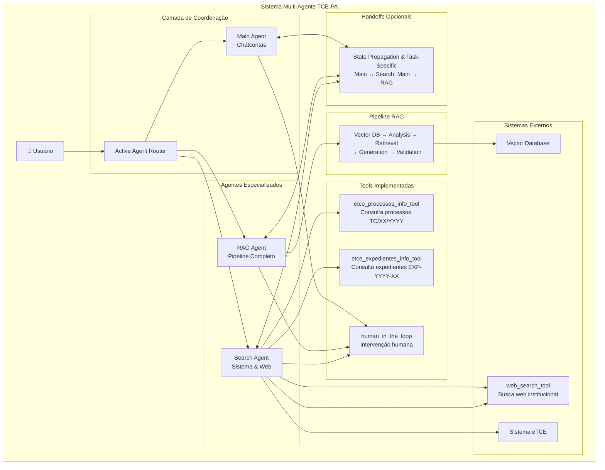
```mermaid
graph TB
    subgraph "Sistema Multi-Agente TCE-PA"
        USER[👤 Usuário]
        
        subgraph "Camada de Coordenação"
            ROUTER[Active Agent Router]
            MAIN[Main Agent<br/>Chatcontas]
        end
        
        subgraph "Agentes Especializados"
            RAG[RAG Agent<br/>Pipeline Completo]
            SEARCH[Search Agent<br/>Sistema & Web]
        end
        
        subgraph "Pipeline RAG"
            RAGP[Vector DB → Analysis → Retrieval<br/>→ Generation → Validation]
        end
        
        subgraph "Sistemas Externos"
            ETCE[Sistema eTCE]
            WEB[Web Search] 
            VDB[Vector Database]
        end
        
        subgraph "Tools Implementadas"
            HITL[human_in_the_loop<br/>Intervenção humana]
            ETCE_PROC[etce_processos_info_tool<br/>Consulta processos TC/XX/YYYY]
            ETCE_EXP[etce_expedientes_info_tool<br/>Consulta expedientes EXP-YYYY-XX]
            WEB[web_search_tool<br/>Busca web institucional]
        end
        
        subgraph "Handoffs Opcionais"
            HANDOFFS[State Propagation & Task-Specific<br/>Main ↔ Search, Main → RAG]
        end
    end
    
    USER --> ROUTER
    ROUTER --> MAIN
    ROUTER --> RAG  
    ROUTER --> SEARCH
    
    MAIN <--> HANDOFFS
    RAG <--> HANDOFFS
    SEARCH <--> HANDOFFS
    
    RAG --> RAGP
    RAGP --> VDB
    
    SEARCH --> ETCE_PROC
    SEARCH --> ETCE_EXP
    SEARCH --> WEB
    SEARCH --> ETCE
    SEARCH --> WEB
    
    MAIN --> HITL
    RAG --> HITL
    SEARCH --> HITL
```

**📋 Componentes Principais Visualizados:**

- **Camada de Coordenação**: Router inteligente + Main Agent para gerenciar fluxo
- **Agentes Especializados**: RAG (documentos) + Search (sistemas) com domínios distintos
- **Pipeline RAG**: Processamento completo com validação de qualidade
- **Tools Implementadas**: 4 ferramentas especializadas com structured output
- **Handoffs Opcionais**: Transferência bidirecional baseada em necessidade
- **Sistemas Externos**: Integração nativa com eTCE, Vector DB e Web

As seções seguintes detalham a **implementação técnica** destes componentes e como eles colaboram para resolver consultas complexas do TCE-PA.

### 3.3. Princípios da Arquitetura Swarm

A implementação **swarm** no ChatContas segue princípios específicos que diferenciam esta arquitetura de abordagens tradicionais multi-agente. Os códigos abaixo mostram como estes princípios se materializam na implementação real:

#### **Agentes**
Cada agente possui **autonomia total** e pode responder diretamente ao usuário:

```python
# Código real do graph.py
workflow = (
    StateGraph(
        state_schema=SwarmState,
        input_schema=ChatContasInputState, 
        output_schema=ChatContasStateOutput,
        config_schema=ChatContasConfiguration,
    )
    .add_node(
        main_agent,
        destinations=("RAG_Agent", "Search_Agent"),
        metadata={"agent_type": "coordinator", "tags": ["autonomous"]},
    )
    .add_node(
        rag_agent,  # É um pipeline completo, não agente conversacional
        destinations=("Main_Agent", "Search_Agent"),
        metadata={"agent_type": "pipeline", "tags": ["autonomous"]},
    )
    .add_node(
        search_agent,
        destinations=("Main_Agent", "RAG_Agent"),
        metadata={"agent_type": "specialist", "tags": ["autonomous"]},
    )
)
```

#### **Handoffs**
```python
# Handoffs baseados em necessidade específica
main_agent_handoff = create_handoff_tool_with_state_propagation(
    agent_name="Main_Agent",
    description="Use this to handoff to the main agent for complex coordination or general institutional queries"
)

rag_agent_handoff = create_handoff_tool_with_task(
    agent_name="RAG_Agent", 
    description="Use this to handoff to the RAG agent for institutional document retrieval and analysis"
)
```

### 3.4. Routing Inteligente

O **routing** no ChatContas determina qual agente processa inicialmente a consulta do usuário. Utilizamos o **Main Agent como padrão**, que pode responder diretamente ou fazer handoff conforme necessário:

```python
# Active Agent Router com default
workflow = add_active_agent_router(
    builder=workflow,
    route_to=["Main_Agent", "RAG_Agent", "Search_Agent"],
    default_active_agent="Main_Agent",
)
```

---

## 4. DIRETRIZES DE ENGENHARIA APLICADAS

### 4.1. Fundamentos das Engenharias Aplicadas

Com a **arquitetura multi-agente estabelecida** na Seção 3, precisamos agora compreender **como** cada aspecto desta arquitetura é implementado na prática. O ChatContas aplica **5 diretrizes de engenharia especializadas** que garantem coesão, performance e maintainability do sistema:

#### 4.1.1. Visão Geral das 5 Engenharias

**🏗️ Por que Múltiplas Engenharias?**

Sistemas multi-agente requerem **decomposição especializada** porque diferentes aspectos da arquitetura têm naturezas e requisitos fundamentalmente distintos. Cada engenharia atua como uma **camada de abstração** que resolve preocupações específicas:

**🔗 Flow de Construção das Engenharias:**

1. **State** → Define **o que** precisa ser mantido e compartilhado
2. **Flow** → Define **como** as execuções coordenam e progridem  
3. **Prompt** → Define **por que** cada agente se comporta de forma específica
4. **Tooling** → Define **onde** buscar informações além do conhecimento base
5. **Handoff** → Define **quando** transferir controle entre especializações

**🧠 Fundamentação Teórica:**

Cada uma dessas questões fundamentais (**o que, como, por que, onde, quando**) representa um **domínio de conhecimento arquitetural** distinto que requer abordagens, ferramentas e padrões específicos. Esta decomposição segue princípios de **engenharia de software** onde **complexidade é gerenciada através de abstrações especializadas**.

A tabela abaixo demonstra como estas questões abstratas se materializam em **preocupações arquiteturais concretas** e os **benefícios sistêmicos** que emergem quando cada domínio é adequadamente endereçado:

| **Engenharia** | **Preocupação Arquitetural** | **Benefício Sistêmico** |
|----------------|------------------------------|------------------------|
| **🗃️ State** | Consistência de dados distribuídos | Coerência entre especializações |
| **🔄 Flow** | Coordenação temporal de execuções | Robustez e recuperação automática |
| **🧠 Prompt** | Comportamentos contextuais especializados | Qualidade e consistência de output |
| **🛠️ Tooling** | Expansão de capacidades além do core | Integração com sistemas externos |
| **🤝 Handoff** | Otimização de transferência de controle | Eficiência e expertise adequada |

#### 4.1.2. Integração entre as Engenharias

As 5 engenharias **operam como um sistema integrado** onde cada uma fornece fundações para as outras:

**🔗 Dependências Arquiteturais:**

- **State** ← **Flow**: Flows lêem/modificam state conforme progressão
- **Flow** ← **Prompt**: Diferentes prompts geram diferentes paths de execução  
- **Prompt** ← **Tooling**: Tools disponíveis influenciam instruções comportamentais
- **Tooling** ← **Handoff**: Handoffs transferem tanto state quanto tool context
- **Handoff** ← **State**: Decisões de transferência baseadas em state analysis

**⚙️ Exemplo de Fluxo Integrado Genérico:**
1. **State**: Request inicial e contexto armazenados em estrutura compartilhada
2. **Flow**: Sistema determina sequência de processamento e conditional paths
3. **Prompt**: Instruções específicas carregadas conforme agente/contexto
4. **Tooling**: Capacidades externas executadas com outputs estruturados
5. **Handoff**: Controle transferido quando expertise específica necessária

#### 4.1.3. Benefícios da Abordagem Estruturada

**📊 Vantagens Arquiteturais:**

- **Separation of Concerns**: Cada engenharia resolve preocupações distintas e bem definidas
- **Modularidade**: Componentes podem evoluir independentemente sem afetar outros
- **Debuggability**: Problemas isoláveis por domínio específico (state vs flow vs prompt)
- **Reusabilidade**: Padrões estabelecidos aplicáveis a novos agentes especializados
- **Composição**: Engenharias combinam de forma emergente para capabilities complexas

**🏗️ Filosofia de Design:**

Esta decomposição segue o princípio de que **arquiteturas robustas emergem de abstrações bem definidas** que colaboram em vez de competir por responsabilidades.

**🎯 Preparação para Detalhamento:**

As seções seguintes detalham **a implementação técnica** de cada engenharia, demonstrando como os conceitos universais se materializam em implementações concretas.

---

### 4.2. ENGENHARIA DE ESTADO (State Engineering)

**State Engineering** em sistemas multi-agente refere-se ao **design e gestão do estado compartilhado** entre diferentes agentes autônomos. No ChatContas, esta engenharia garante que informações críticas sejam mantidas, transferidas e atualizadas corretamente durante handoffs entre agentes.

#### 4.2.1. Por que Estado é Crítico?

**🎯 Desafios Específicos:**
- **Contexto Preservado**: Conversas não podem "esquecer" informações anteriores
- **Estado Distribuído**: Diferentes agentes precisam acessar dados relevantes
- **Performance**: Estado deve ser eficiente para transferências frequentes
- **Consistency**: Dados sempre atualizados e sincronizados

#### 4.2.2. Hierarquia de Estados

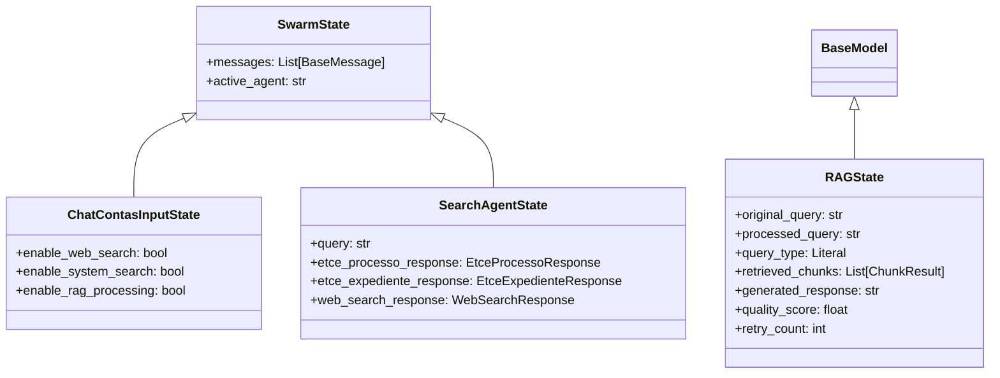
```mermaid
classDiagram
    class SwarmState {
        +messages: List[BaseMessage]
        +active_agent: str
    }
    
    class ChatContasInputState {
        +enable_web_search: bool
        +enable_system_search: bool  
        +enable_rag_processing: bool
    }
    
    class SearchAgentState {
        +query: str
        +etce_processo_response: EtceProcessoResponse
        +etce_expediente_response: EtceExpedienteResponse
        +web_search_response: WebSearchResponse
    }
    
    class RAGState {
        +original_query: str
        +processed_query: str
        +query_type: Literal
        +retrieved_chunks: List[ChunkResult]
        +generated_response: str
        +quality_score: float
        +retry_count: int
    }
    
    SwarmState <|-- ChatContasInputState
    SwarmState <|-- SearchAgentState
    BaseModel <|-- RAGState
```

#### 4.2.3. Estado SwarmState - Base do Sistema

| Campo | Propósito | Setado Em | Usado Em | Exemplo |
|-------|-----------|-----------|----------|---------|
| `messages` | Histórico da conversa | Todos os agentes | Contexto conversacional | `[HumanMessage("query")]` |
| `active_agent` | Agente atualmente ativo | Active Router | Coordenação swarm | `"Main_Agent"` |
| `user_id` | Identificação do usuário | Configuração inicial | Controle de acesso | `"usr_12345"` |
| `session_id` | Sessão específica | Configuração inicial | Isolamento temporal | `"sess_67890"` |

#### 4.2.4. Estado RAGState - Pipeline Especializado

**50+ campos organizados em 9 categorias**:

##### **Query Processing**
| Campo | Propósito | Setado Em | Usado Em | Exemplo |
|-------|-----------|-----------|----------|---------|
| `original_query` | Query preservada | query_analysis_node | Auditoria/comparação | `"Qual lei sobre teletrabalho?"` |
| `processed_query` | Query otimizada | query_analysis_node | document_retrieval_node | `"teletrabalho Lei 14.133"` |
| `query_type` | Classificação | query_analysis_node | chunk_strategy_node | `"legislation"` |
| `query_complexity` | Nível complexidade | query_analysis_node | Pipeline routing | `"medium"` |

##### **Retrieval Results**
| Campo | Propósito | Setado Em | Usado Em | Exemplo |
|-------|-----------|-----------|----------|---------|
| `retrieved_chunks` | Chunks encontrados | document_retrieval_node | relevance_grading_node | `List[ChunkResult]` |
| `graded_chunks` | Chunks avaliados | relevance_grading_node | context_enrichment_node | `List[GradedChunk]` |
| `reranked_chunks` | Chunks reordenados | reranking_node | response_generation_node | `List[RerankedChunk]` |

##### **Workflow Control**
| Campo | Propósito | Setado Em | Usado Em | Exemplo |
|-------|-----------|-----------|----------|---------|
| `needs_rewrite` | Flag reescrita query | relevance_grading_node | Conditional edges | `True/False` |
| `retry_count` | Contador tentativas | query_rewrite_node | quality_check_decision | `2` |
| `max_retries` | Limite tentativas | Inicialização | quality_check_decision | `3` |
| `quality_score` | Score qualidade | quality_validation_node | Decisões retry | `0.85` |

#### 4.2.5. Fluxo de Transição de Estados

**Transição de Estado** em sistemas multi-agente refere-se à **transformação controlada dos dados compartilhados** quando o controle de execução é transferido entre agentes especializados. Esta transição é fundamental para manter **consistência**, **contexto**, e **dados especializados** durante handoffs.

##### **Tipos de Transição Implementados**

**🔄 State Propagation (Main ↔ Search):**
- **SwarmState mantido intacto** durante transferência
- **Contexto completo preservado** (messages, active_agent)
- **SearchAgentState fields adicionados** conforme processamento

**⚙️ Task-Specific Conversion (Main → RAG):**
- **SwarmState convertido para RAGState** para processamento especializado
- **Pipeline sequencial** com 50+ campos específicos de RAG
- **Reconversão para SwarmState** ao final com AIMessage integrada

##### **Mecânica de Transição Ilustrada**

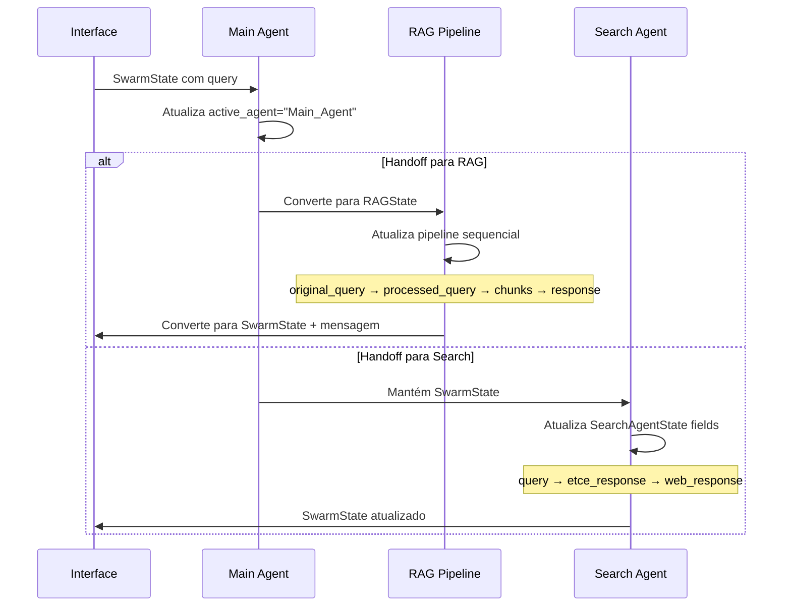
```mermaid
sequenceDiagram
    participant UI as Interface
    participant MAIN as Main Agent
    participant RAG as RAG Pipeline
    participant SEARCH as Search Agent
    
    UI->>MAIN: SwarmState com query
    MAIN->>MAIN: Atualiza active_agent="Main_Agent"
    
    alt Handoff para RAG
        MAIN->>RAG: Converte para RAGState
                 RAG->>RAG: Atualiza pipeline sequencial
        Note over RAG: original_query → processed_query → chunks → response
        RAG->>UI: Converte para SwarmState + mensagem
    else Handoff para Search  
        MAIN->>SEARCH: Mantém SwarmState
        SEARCH->>SEARCH: Atualiza SearchAgentState fields
        Note over SEARCH: query → etce_response → web_response
        SEARCH->>UI: SwarmState atualizado
    end
```

##### **Detalhamento Técnico das Transições**

**📊 Path 1: Main → RAG (Task-Specific Conversion)**
1. **Input**: SwarmState com `query` e `active_agent="Main_Agent"`
2. **Conversion**: Sistema cria novo RAGState com campos especializados
3. **Pipeline**: RAG executa 11 nós sequenciais (setup → retrieval → generation → validation)
4. **Output**: RAGState convertido de volta para SwarmState + AIMessage final
5. **Result**: UI recebe resposta direta sem retornar ao Main Agent

**🔄 Path 2: Main → Search (State Propagation)**
1. **Input**: SwarmState preservado com contexto completo
2. **Enhancement**: SearchAgentState fields adicionados (etce_responses, web_results)
3. **Processing**: Tools específicas executadas com structured output
4. **Update**: SwarmState enriquecido com dados de sistema/web
5. **Result**: UI recebe SwarmState atualizado com informações integradas

**⚙️ Características Críticas:**
- **No Return Path**: Agentes respondem diretamente, evitando round-trips desnecessários
- **Specialized Context**: Cada agente acessa exatamente os dados que precisa
- **State Consistency**: Transformações garantem que nenhuma informação crítica seja perdida
- **Performance**: Conversões otimizadas para minimizar overhead de transferência

### 4.3. ENGENHARIA DE FLUXO (Flow Engineering)

**Flow Engineering** define **como as execuções fluem** através dos agentes e componentes do sistema. No ChatContas, esta engenharia é fundamental para coordenar **execuções sequenciais complexas**, **retry logic**, e **conditional branching** que garantem robustez e performance.

#### 4.3.1. Por que Fluxos Estruturados?

**🎯 Necessidades Específicas:**
- **Coordenação Multi-Agente**: Múltiplos agentes precisam trabalhar de forma orquestrada
- **Retry Logic**: Falhas devem ser tratadas com tentativas automáticas
- **Conditional Paths**: Diferentes tipos de query seguem caminhos específicos
- **Performance**: Evitar execuções desnecessárias e otimizar tempo de resposta

#### 4.3.2. Fluxo Principal - Arquitetura Swarm

O **Fluxo Principal** representa a **orchestração de alto nível** do sistema multi-agente, definindo como as requisições do usuário são **roteadas**, **processadas** e **respondidas** pelos diferentes agentes especializados.

##### **Características do Fluxo Principal:**

**🎯 Entrada Única, Múltiplos Caminhos:**
- **Active Agent Router** determina ponto de entrada (padrão: Main Agent)
- **Autonomous Response**: Cada agente pode responder diretamente ao usuário
- **Optional Handoffs**: Transferência baseada em análise de necessidade

**⚙️ Padrões de Execução:**
- **Direct Response**: Agente processa e responde imediatamente
- **Handoff Response**: Agente transfere para especialização e especialista responde
- **No Return Loops**: Evita ping-pong desnecessário entre agentes

##### **Fluxo Orchestrado Ilustrado:**

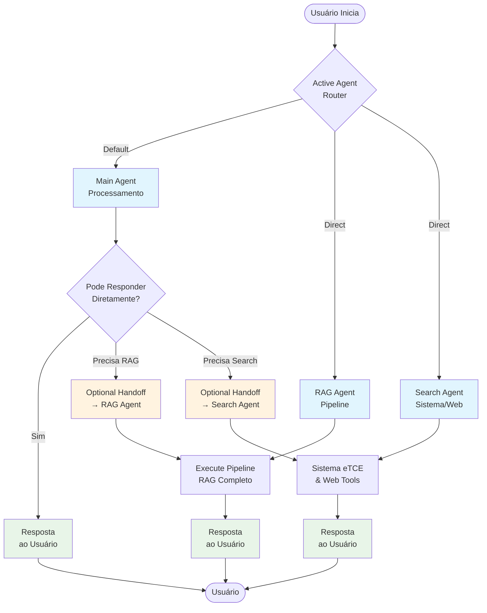
```mermaid
flowchart TD
    START([Usuário Inicia]) --> ROUTER{Active Agent<br/>Router}
    
    ROUTER -->|"Default"| MAIN[Main Agent<br/>Processamento]
    ROUTER -->|"Direct"| RAG[RAG Agent<br/>Pipeline]
    ROUTER -->|"Direct"| SEARCH[Search Agent<br/>Sistema/Web]
    
    MAIN --> MAIN_DECISION{Pode Responder<br/>Diretamente?}
    
    MAIN_DECISION -->|"Sim"| MAIN_RESPONSE[Resposta<br/>ao Usuário]
    MAIN_DECISION -->|"Precisa RAG"| HANDOFF_RAG[Optional Handoff<br/>→ RAG Agent]
    MAIN_DECISION -->|"Precisa Search"| HANDOFF_SEARCH[Optional Handoff<br/>→ Search Agent]
    
    RAG --> RAG_PIPELINE[Execute Pipeline<br/>RAG Completo]
    RAG_PIPELINE --> RAG_RESPONSE[Resposta<br/>ao Usuário]
    
    SEARCH --> SEARCH_TOOLS[Sistema eTCE<br/>& Web Tools]
    SEARCH_TOOLS --> SEARCH_RESPONSE[Resposta<br/>ao Usuário]
    
    HANDOFF_RAG --> RAG_PIPELINE
    HANDOFF_SEARCH --> SEARCH_TOOLS
    
    MAIN_RESPONSE --> END([Usuário])
    RAG_RESPONSE --> END
    SEARCH_RESPONSE --> END
    
    classDef agentNode fill:#e1f5fe
    classDef responseNode fill:#e8f5e8
    classDef handoffNode fill:#fff3e0
    
    class MAIN,RAG,SEARCH agentNode
    class MAIN_RESPONSE,RAG_RESPONSE,SEARCH_RESPONSE responseNode
    class HANDOFF_RAG,HANDOFF_SEARCH handoffNode
```

##### **Detalhamento Técnico dos Caminhos:**

**🔄 Caminho 1: Entry via Router**
- **Default Route** → Main Agent (coordenação geral)
- **Direct Route** → RAG/Search Agent (quando expertise específica conhecida)

**🎯 Caminho 2: Main Agent Decision Points**
- **Direct Response**: Query geral institucional → Main responde imediatamente
- **RAG Handoff**: Legislação/acordão detectado → Transfere para expertise documental
- **Search Handoff**: Expediente/processo detectado → Transfere para expertise sistêmica

**⚙️ Caminho 3: Specialized Processing**
- **RAG Pipeline**: Execução sequencial completa (11 nós) → Response direta
- **Search Tools**: Execução paralela de tools eTCE/web → Response estruturada

**📊 Características de Performance:**
- **No Return Overhead**: Especialistas respondem diretamente ao usuário
- **Smart Routing**: Decisões baseadas em análise de conteúdo, não configuração estática
- **Parallel Capability**: RAG e Search podem operar simultaneamente quando necessário

#### 4.3.3. Fluxo Detalhado - Pipeline RAG

O **Pipeline RAG** representa um **grafo de execução sequencial especializado** para processamento de documentos oficiais. Diferente do fluxo swarm (que é de coordenação), este pipeline implementa **processamento determinístico** com **retry automático** e **conditional branching** para garantir qualidade das respostas documentais.

##### **Arquitetura do Pipeline:**

**🔗 Execução Sequencial com Branches:**
- **11 nós principais** conectados por conditional edges
- **3 pontos de decisão** que determinam caminhos alternativos
- **Retry logic** integrada com limite máximo de tentativas

**⚙️ Padrões de Controle:**
- **Setup Phase**: Preparação de recursos (Vector DB, análise)
- **Conditional Ingestion**: Ingestão apenas quando necessária
- **Retrieval & Grading**: Busca híbrida + avaliação de relevância
- **Quality Loops**: Retry automático até qualidade adequada ou limite

##### **Pipeline Sequencial Ilustrado:** 

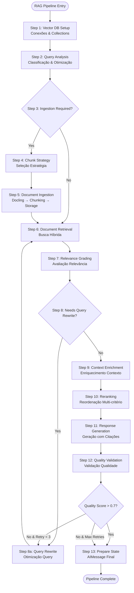
```mermaid
flowchart TD
    START(["RAG Pipeline Entry"]) --> VECTOR_DB["Step 1: Vector DB Setup<br>Conexões & Collections"]
    
    VECTOR_DB --> QUERY_ANALYSIS["Step 2: Query Analysis<br>Classificação & Otimização"]
    
    QUERY_ANALYSIS --> INGESTION_CHECK{"Step 3: Ingestion Required?"}
    
    INGESTION_CHECK -- "Yes" --> CHUNK_STRATEGY["Step 4: Chunk Strategy<br>Seleção Estratégia"]
    INGESTION_CHECK -- "No" --> DOCUMENT_RETRIEVAL["Step 6: Document Retrieval<br>Busca Híbrida"]
    
    CHUNK_STRATEGY --> DOCUMENT_INGESTION["Step 5: Document Ingestion<br>Docling → Chunking → Storage"]
    DOCUMENT_INGESTION --> DOCUMENT_RETRIEVAL
    
    DOCUMENT_RETRIEVAL --> RELEVANCE_GRADING["Step 7: Relevance Grading<br>Avaliação Relevância"]
    
    RELEVANCE_GRADING --> REWRITE_CHECK{"Step 8: Needs Query Rewrite?"}
    
    REWRITE_CHECK -- "Yes" --> QUERY_REWRITE["Step 8a: Query Rewrite<br>Otimização Query"]
    REWRITE_CHECK -- "No" --> CONTEXT_ENRICHMENT["Step 9: Context Enrichment<br>Enriquecimento Contexto"]
    
    QUERY_REWRITE --> DOCUMENT_RETRIEVAL
    
    CONTEXT_ENRICHMENT --> RERANKING["Step 10: Reranking<br>Reordenação Multi-critério"]
    
    RERANKING --> RESPONSE_GENERATION["Step 11: Response Generation<br>Geração com Citações"]
    
    RESPONSE_GENERATION --> QUALITY_VALIDATION["Step 12: Quality Validation<br>Validação Qualidade"]
    
    QUALITY_VALIDATION --> QUALITY_CHECK{"Quality Score > 0.7?"}
    
    QUALITY_CHECK -- "Yes" --> PREPARE_STATE["Step 13: Prepare State<br>AIMessage Final"]
    QUALITY_CHECK -- "No & Retry < 3" --> QUERY_REWRITE
    QUALITY_CHECK -- "No & Max Retries" --> PREPARE_STATE
    
    PREPARE_STATE --> END(["Pipeline Complete"])

```

##### **Detalhamento Técnico dos Nós:**

**🔧 Setup Phase (Nós 1-3):**
- **Vector DB Setup**: Inicialização de conexões e collections vetoriais
- **Query Analysis**: Classificação de query e otimização para busca
- **Ingestion Check**: Decisão condicional baseada em `ingestion_required` flag

**📊 Processing Phase (Nós 4-7):**
- **Chunk Strategy**: Seleção de estratégia de chunking (Chonkie/traditional)
- **Document Ingestion**: Pipeline Docling → Chunking → Vector Storage
- **Document Retrieval**: Busca híbrida (semântica + keyword) no vector database
- **Relevance Grading**: Avaliação de relevância dos chunks retrieved

**🔄 Quality Control Phase (Nós 8-13):**
- **Query Rewrite Loop**: Otimização iterativa da query quando relevância baixa
- **Context Enrichment**: Enriquecimento de contexto com metadata adicional
- **Reranking**: Reordenação multi-critério dos chunks mais relevantes
- **Response Generation**: Geração de resposta com citações estruturadas
- **Quality Validation**: Score mínimo 0.7 com retry automático até limite

**⚙️ Características de Robustez:**
- **Conditional Branching**: 3 pontos de decisão que adaptam o fluxo conforme necessidade
- **Automatic Retry**: Retry logic para quality score < 0.7 até máximo de tentativas
- **Graceful Degradation**: Sistema prossegue mesmo com qualidade subótima após max retries
- **State Progression**: Cada nó enriquece o RAGState com informações específicas

#### 4.3.4. Conditional Edges - Lógica de Decisão

**Conditional Edges** são **rotas condicionais em grafos** que determinam dinamicamente o próximo nó de execução baseado no **estado atual** e **lógica de decisão específica**. Diferente de edges estáticos (que sempre conectam os mesmos nós), conditional edges implementam **branching inteligente** que adapta o fluxo conforme necessidades em tempo de execução.

##### **Por que Conditional Edges são Fundamentais?**

**🎯 Tomada de Decisão Dinâmica:**
- **Adaptação ao Contexto**: Fluxo muda baseado em dados específicos (qualidade, flags, contadores)
- **Otimização de Performance**: Evita execução desnecessária (ex: pular ingestão se dados já existem)
- **Robustez**: Permite retry logic e graceful degradation em falhas
- **Inteligência**: Sistema "decide" o melhor caminho baseado em análise do estado

**🔀 Tipos de Rotas Condicionais no Pipeline:**

1. **Conditional Ingestion**: `ingestion_required` → Ingere documentos apenas se necessário
2. **Quality-based Retry**: `quality_score` → Retry até atingir threshold ou limite máximo  
3. **Query Optimization**: `needs_rewrite` → Reformula query quando relevância inadequada

##### **Mecânica de Funcionamento:**

Cada conditional edge executa uma **função de decisão** que:
- **Analisa** o estado atual (RAGState fields)
- **Aplica** lógica específica do domínio  
- **Retorna** string identificando próximo nó
- **Direciona** execução para path apropriado

##### **Implementação das Funções de Decisão:**

```python
# Implementação real dos conditional edges
def needs_ingestion_decision(state: RAGState) -> str:
    """Decide se necessita ingestão de documentos"""
    return "ingestion" if state.ingestion_required else "continue"

def needs_rewrite_decision(state: RAGState) -> str:
    """Decide se necessita reescrita da query"""
    return "rewrite" if state.needs_rewrite else "continue"

def quality_check_decision(state: RAGState) -> str:
    """Decide se qualidade está adequada ou precisa retry"""
    if state.quality_score > 0.7:
        return "prepare"
    elif state.retry_count < state.max_retries:
        return "retry"
    else:
        return "prepare"
```

##### **Características Técnicas dos Conditional Edges:**

**⚙️ Padrões de Decisão Implementados:**

- **Binary Choice** (`needs_ingestion_decision`): Simples true/false baseado em flag booleana
- **Threshold-based** (`quality_check_decision`): Comparação numérica com limite definido (0.7)
- **Counter-based** (`quality_check_decision`): Lógica de retry com limite máximo de tentativas  
- **Graceful Fallback**: Sempre retorna valor válido, mesmo em edge cases

**🔄 Implicações no Fluxo do Grafo:**

- **Dynamic Branching**: Mesmo input inicial pode seguir paths completamente diferentes
- **State-Driven**: Decisões baseadas em estado acumulado, não configuração estática  
- **Idempotency**: Funções determinísticas - mesmo estado sempre produz mesma decisão
- **Performance**: Elimina nós desnecessários, otimizando tempo total de execução

**📊 Vantagens Arquiteturais:**

- **Maintainability**: Lógica de decisão centralizada em funções específicas
- **Testability**: Cada função de decisão testável independentemente  
- **Flexibility**: Novos conditional edges podem ser adicionados sem reestruturação
- **Debuggability**: Estado e decisão rastreáveis para análise de comportamento

### 4.4. ENGENHARIA DE PROMPT/CONTEXTO (Prompt Engineering)

**Prompt Engineering** no ChatContas implementa uma abordagem inovadora de **Dynamic Prompt Generation** onde prompts são **construídos dinamicamente** baseados no **estado atual do workflow**. Esta técnica resolve limitações fundamentais de prompts estáticos e garante que cada agente receba contexto **precisamente adaptado** à situação específica da execução.

#### 4.4.1. O Problema dos Prompts Estáticos

**⚠️ Limitações Tradicionais:**
- **Contexto Fixo**: Prompts não se adaptam ao estado atual do sistema
- **Informação Desatualizada**: Instruções podem estar fora de contexto para situação específica
- **One-Size-Fits-All**: Mesmo prompt para diferentes cenários de execução
- **Alucinações**: Falta de contexto específico pode gerar respostas inadequadas

#### 4.4.2. Solução: Dynamic Prompt Generation via Pre-hooks

**🎯 Abordagem Inovadora:**

O ChatContas utiliza **pre-hooks** no `create_react_agent` que **interceptam a execução** antes do agente processar e **reconstroem dinamicamente** o system prompt baseado no **state atual do grafo**. Esta técnica garante que cada agente sempre receba contexto **perfeitamente alinhado** com o estado corrente do workflow.

**🏗️ Componentes da Arquitetura:**

1. **Template Base** (`base_agent_prompt.jinja2`): Estrutura fixa com placeholders dinâmicos
2. **State Extractor**: Pre-hook que extrai dados relevantes do estado atual
3. **Dynamic Renderer**: Engine Jinja2 que popula template com dados do state
4. **Context Injection**: System prompt final injetado antes da execução do agente

##### **Template Base Structure:**

```jinja2
# CURRENT_DATETIME: {{ current_datetime }}

## 👤 Identity
You are {{ agent_identity }}.

## 🎯 Responsibilities

- {{ item }}


## 🧠 Behavior Rules
{{ dynamic_block }}

## 🛠️ Tools Available

- `{{ tool.name }}` → {{ tool.description }}



### Constraints:

- {{ c }}


```

#### 4.4.4. Fluxo de Dynamic Prompt Generation

##### **Mecânica de Funcionamento:**

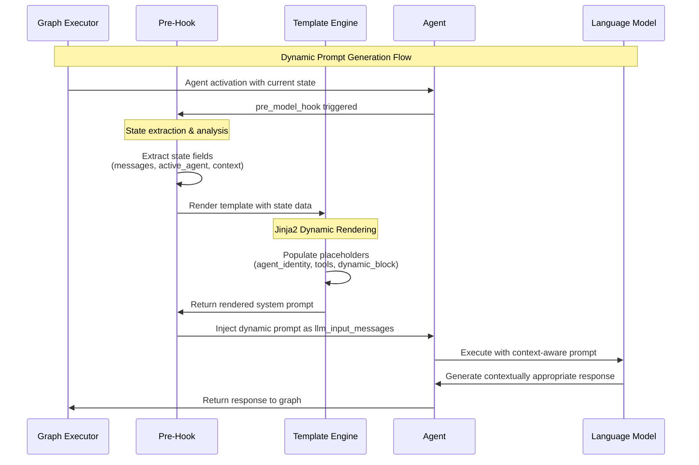
```mermaid
sequenceDiagram
    participant G as Graph Executor
    participant PH as Pre-Hook
    participant TE as Template Engine
    participant A as Agent
    participant LLM as Language Model
    
    Note over G,LLM: Dynamic Prompt Generation Flow
    
    G->>A: Agent activation with current state
    A->>PH: pre_model_hook triggered
    Note over PH: State extraction & analysis
    
    PH->>PH: Extract state fields<br/>(messages, active_agent, context)
    PH->>TE: Render template with state data
    
    Note over TE: Jinja2 Dynamic Rendering
    TE->>TE: Populate placeholders<br/>(agent_identity, tools, dynamic_block)
    TE->>PH: Return rendered system prompt
    
    PH->>A: Inject dynamic prompt as llm_input_messages
    A->>LLM: Execute with context-aware prompt
    LLM->>A: Generate contextually appropriate response
    A->>G: Return response to graph
```

**🔧 Core Implementation - Pre-Hook & Render:**

```python
def _compose_pre_hooks(self) -> RunnableLambda:
    def composed_hook_fn(state: dict) -> dict:
        current_state = state.copy()
        
        # Apply additional hooks (classify_query, etc.)
        for hook in self.additional_pre_hooks:
            hook_result = hook.invoke(current_state)
            current_state.update(hook_result)
        
        # Render dynamic prompt from template + state
        rendered_prompt = self._render_prompt(current_state)
        
        # Inject as llm_input_messages
        current_state["llm_input_messages"] = [
            SystemMessage(content=rendered_prompt)
        ] + current_state.get("messages", [])
        
        return current_state
    
    return RunnableLambda(composed_hook_fn)

def _render_prompt(self, state: dict) -> str:
    # Load base template + dynamic block template
    prompt_template = Template(open(self.prompt_template_path).read())
    dynamic_block = Template(open(self.dynamic_block_template_path).read()).render(**state) if self.dynamic_block_template_path else ""
    
    # Populate with agent config + runtime state
    return prompt_template.render(
        current_datetime=datetime.utcnow().isoformat(),
        agent_identity=self.agent_identity,
        responsibilities=self.responsibilities,
        tools=self._extract_tool_infos(),
        dynamic_block=dynamic_block,
        **state  # Runtime state injection
    )
```

#### 4.4.6. Arquitetura do AgentBuilder - Implementação Completa

##### **Fluxo de Construção do Agente:**

```mermaid
graph TD
    subgraph "AgentBuilder Components"
        CONFIG[Agent Configuration<br/>• name, identity<br/>• responsibilities<br/>• constraints]
        TEMPLATES[Template System<br/>• base_agent_prompt.jinja2<br/>• dynamic_block_template<br/>• state placeholders]
        TOOLS[Tool System<br/>• tools list<br/>• tool metadata extraction<br/>• _extract_tool_infos()]
        HOOKS[Pre-Hook System<br/>• additional_pre_hooks<br/>• compose chain<br/>• state processing]
    end
    
    subgraph "Build Process"
        BUILD[AgentBuilder.build()]
        BIND[Model Tool Binding<br/>bound_model = model.bind_tools()]
        COMPOSE[Pre-Hook Composition<br/>pre_hook = _compose_pre_hooks()]
        CREATE[create_react_agent()]
    end
    
    subgraph "Runtime Execution"
        GRAPH[Graph Execution]
        STATE[Current State]
        PREHOOK[Pre-Hook Execution]
        RENDER[Template Rendering]
        INJECT[Prompt Injection]
        AGENT[Agent Processing]
    end
    
    CONFIG --> BUILD
    TEMPLATES --> BUILD
    TOOLS --> BUILD
    HOOKS --> BUILD
    
    BUILD --> BIND
    BIND --> COMPOSE
    COMPOSE --> CREATE
    
    CREATE --> GRAPH
    GRAPH --> STATE
    STATE --> PREHOOK
    PREHOOK --> RENDER
    RENDER --> INJECT
    INJECT --> AGENT
    
    classDef configNode fill:#e1f5fe
    classDef buildNode fill:#f3e5f5
    classDef runtimeNode fill:#e8f5e8
    
    class CONFIG,TEMPLATES,TOOLS,HOOKS configNode
    class BUILD,BIND,COMPOSE,CREATE buildNode
    class GRAPH,STATE,PREHOOK,RENDER,INJECT,AGENT runtimeNode
```

##### **Create React Agent - Setup Final:**

```python
# AgentBuilder.build() - Consolidação Final
def build(self) -> CompiledStateGraph:
    # 1. Bind tools to model
    bound_model = self.model.bind_tools(
        self.tools,
        parallel_tool_calls=False,
    )
    
    # 2. Compose pre-hooks with dynamic prompt generation
    pre_hook = self._compose_pre_hooks()
    
    # 3. Create final ReAct agent with all components
    return create_react_agent(
        model=bound_model,              # Model + tools
        tools=self.tools,               # Tool implementations  
        pre_model_hook=pre_hook,        # Dynamic prompt injection
        name=self.name,                 # Agent identifier
        state_schema=self.state_schema, # State structure
        response_format=self.response_format,
        checkpointer=MemorySaver(),     # State persistence
         )
```

##### **Características Inovadoras da Implementação:**

**🎯 Dynamic Configuration Assembly:**
- **Components → Build Process**: Configuração, templates, tools e hooks se consolidam no `build()`
- **Runtime Integration**: Pre-hooks executam automaticamente a cada ativação do agente
- **State-driven Adaptation**: Template renderizado dinamicamente baseado no estado corrente

**⚙️ Vantagens Arquiteturais:**
- **Separation of Concerns**: Configuração, rendering e execução bem separados
- **Reusability**: Mesmo AgentBuilder cria diferentes tipos de agentes especializados
- **Maintainability**: Template base facilita updates globais de comportamento
- **Testability**: Pre-hooks e rendering testáveis independentemente

**🚀 Resultado Final:**
Todo agente construído via **AgentBuilder** recebe automaticamente:
- **System prompt adaptativo** que reflete estado atual do workflow
- **Context awareness** temporal e situacional
- **Tool integration** dinâmica baseada em capacidades disponíveis
- **Consistent behavior** seguindo padrões estabelecidos do template base


### 4.5. ENGENHARIA DE TOOLING

**Tooling Engineering** refere-se ao **design e implementação de ferramentas especializadas** que permitem aos agentes interagir com sistemas externos, obter informações específicas, e executar ações que expandem suas capacidades além do conhecimento pré-treinado.

#### 4.5.1. Por que Tools Especializadas?

**🎯 Limitações dos LLMs Base:**
- **Dados Dinâmicos**: Informações em tempo real (processos, expedientes)
- **Sistemas Proprietários**: Integração com eTCE institucional
- **Structured Output**: Respostas padronizadas para integração sistêmica
- **Human-in-the-Loop**: Intervenção humana para casos ambíguos

**🏗️ Padrão Implementado**: Todas as tools seguem **Command Pattern** com Pydantic para structured output.

#### 4.5.2. Inventário Completo de Tools

##### **Tools Implementadas**

| Tool | Agente | Assinatura | Objetivo | Response Model |
|------|--------|------------|----------|----------------|
| `human_in_the_loop` | Main, RAG, Search | `question_to_user: str` | Intervenção humana estratégica | `str` |
| `etce_processos_info_tool` | Search | `numero_processo: str` | Consulta dados processo TCE-PA | `EtceProcessoResponse` |
| `etce_expedientes_info_tool` | Search | `numero_expediente: str` | Consulta dados expediente TCE-PA | `EtceExpedienteResponse` |
| `web_search_tool` | Search | `query: str, context: str` | Busca web institucional | `WebSearchResponse` |

##### **Main Agent Tools**
```python
tools = [human_in_the_loop]
if handoff_tools:
    tools.extend(handoff_tools)  # rag_agent_handoff, search_agent_handoff
```

##### **Search Agent Tools**
```python
tools = [
    etce_processos_info_tool,     # Consulta processos TC/XXXXXX/YYYY
    etce_expedientes_info_tool,   # Consulta expedientes EXP-YYYY-XXXXX  
    web_search_tool,              # Busca web institucional
    human_in_the_loop,            # Esclarecimentos e intervenção humana
]
```

#### 4.5.3. Command Pattern no LangGraph - State Update Mechanism

**🎯 Como Tools Executam Ações e Atualizam States:**

No LangGraph, tools implementam **Command Pattern** onde cada tool execution pode **disparar ações** e **atualizar states** de forma controlada. Este mecanismo permite que tools não apenas retornem dados, mas **modifiquem o estado** tanto do agente chamador quanto do **parent state** (no caso de handoffs).

##### **Mecânica de State Updates:**

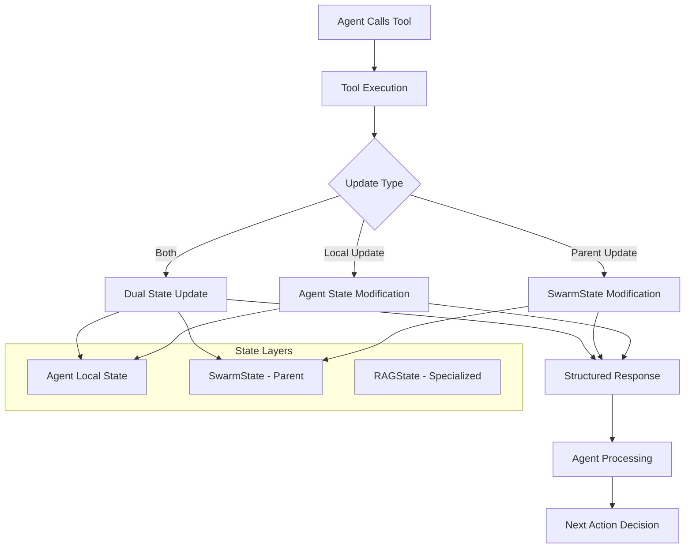
```mermaid
graph TD
    A[Agent Calls Tool] --> B[Tool Execution]
    B --> C{Update Type}
    
    C -->|Local Update| D[Agent State Modification]
    C -->|Parent Update| E[SwarmState Modification]
    C -->|Both| F[Dual State Update]
    
    D --> G[Structured Response]
    E --> G
    F --> G
    
    G --> H[Agent Processing]
    H --> I[Next Action Decision]
    
    subgraph "State Layers"
        J[Agent Local State]
        K[SwarmState - Parent]
        L[RAGState - Specialized]
    end
    
    D --> J
    E --> K
    F --> K
    F --> J
```

##### **Tipos de State Updates:**

**🔄 1. Local Agent State Update:**
```python
# Tool atualiza estado local do agente que a chamou
def etce_processos_info_tool(state, numero_processo: str):
    resultado = consultar_processo(numero_processo)
    # Atualiza context local do agente
    state.tool_results.append(resultado)
    return EtceProcessoResponse(**resultado)
```

**🔄 2. Parent State Update (Handoffs):**
```python
# Tool dispara handoff e atualiza SwarmState parent
def rag_agent_handoff(state, query: str, context: str):
    # Atualiza SwarmState para próximo agente
    return {
        "next_agent": "rag_agent",
        "rag_query": query,
        "rag_context": context,
        "handoff_reason": "Necessita busca em documentos"
    }
```

**🔄 3. Dual Update (Local + Parent):**
```python
# Tool atualiza tanto agent local quanto parent state
def web_search_tool(state, query: str, context: str):
    resultados = realizar_busca_web(query, context)
    
    # Update local: adiciona aos resultados do agente
    state.search_results.extend(resultados.web_results)
    
    # Update parent: disponibiliza para outros agentes
    return {
        "web_search_results": resultados,
        "search_completed": True,
        "last_search_query": query
    }
```

##### **Command Pattern Implementation:**

**🏗️ Estrutura do Command:**
- **Command Interface**: Signature da tool (input parameters)
- **Concrete Command**: Implementação específica da tool
- **Receiver**: State object que será modificado
- **Invoker**: Agent que executa a tool call

**⚙️ Execution Flow:**
1. **Agent Decision**: Agente decide chamar tool baseado em context
2. **Command Dispatch**: LangGraph dispatcha tool call com parameters
3. **State Access**: Tool recebe acesso ao state atual (local + parent)
4. **Action Execution**: Tool executa ação (consulta, busca, handoff)
5. **State Modification**: Tool modifica state conforme tipo de update
6. **Structured Response**: Tool retorna response no contrato definido
7. **State Propagation**: LangGraph propaga updates para states apropriados

##### **Vantagens do Command Pattern:**

**🎯 State Management:**
- **Controlled Updates**: Tools modificam state de forma controlada e auditável
- **Type Safety**: Updates seguem contratos estruturados (Pydantic)
- **Isolation**: Cada tool tem escopo específico de modificação
- **Rollback Capability**: States podem ser revertidos em caso de erro

**🔄 Multi-Level Updates:**
- **Local Scope**: Tools podem manter context específico do agente
- **Global Scope**: Tools podem compartilhar dados entre agentes via parent state
- **Specialized Scope**: Tools podem atualizar states especializados (RAGState)

#### 4.5.4. Contratos de Output - Structured Responses

**🏗️ Arquitetura de Integração:**

As tools utilizam **contratos estruturados** (Pydantic/TypedDict) que garantem **integração consistente** com o state principal. Cada tool retorna dados em formato padronizado que o system pode processar de forma determinística, **integrando-se ao Command Pattern** para state updates precisos.

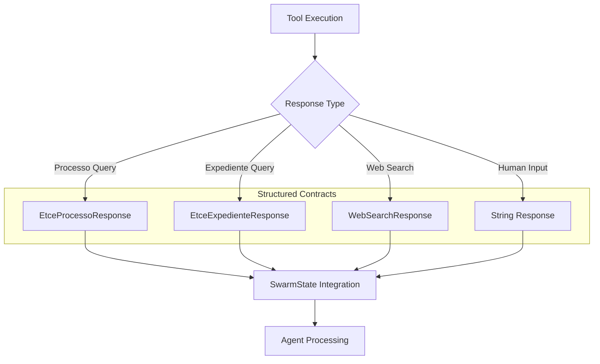
```mermaid
graph TD
    A[Tool Execution] --> B{Response Type}
    
    B -->|Processo Query| C[EtceProcessoResponse]
    B -->|Expediente Query| D[EtceExpedienteResponse]  
    B -->|Web Search| E[WebSearchResponse]
    B -->|Human Input| F[String Response]
    
    C --> G[SwarmState Integration]
    D --> G
    E --> G
    F --> G
    
    G --> H[Agent Processing]
    
    subgraph "Structured Contracts"
        C
        D
        E
        F
    end
```

##### **Contratos Implementados (models.py):**

**📋 1. EtceProcessoResponse (TypedDict)**
```python
class EtceProcessoResponse(TypedDict):
    numero_processo: Optional[str] = None      # Ex: "TC/001234/2024"
    data_autuacao: Optional[str] = None        # Ex: "2024-01-15"
    unidade_jurisdicionada: Optional[str] = None  # Ex: "Prefeitura de Belém"
    classe_subclasse: Optional[str] = None     # Ex: "Prestação de Contas"
    relator: Optional[str] = None              # Ex: "Conselheiro João Silva"
    situacao_atual: Optional[str] = None       # Ex: "Em análise técnica"
    localizacao_atual: Optional[str] = None    # Ex: "SEGECEX/DICAM"
```

**📂 2. EtceExpedienteResponse (TypedDict)**
```python
class EtceExpedienteResponse(TypedDict):
    numero_expediente: Optional[str] = None    # Ex: "EXP-2024-12345"
    data_abertura: Optional[str] = None        # Ex: "2024-02-10"
    tipo_expediente: Optional[str] = None      # Ex: "Denúncia"
    unidade_originaria: Optional[str] = None   # Ex: "Ouvidoria"
    assunto: Optional[str] = None              # Ex: "Irregularidade em licitação"
    situacao_atual: Optional[str] = None       # Ex: "Aguardando manifestação"
```

**🌐 3. WebSearchResponse (BaseModel)**
```python
class WebSearchResult(BaseModel):
    title: Optional[str] = None                # Título da página encontrada
    url: Optional[str] = None                  # URL da fonte
    summary: Optional[str] = None              # Resumo do conteúdo

class WebSearchResponse(BaseModel):
    web_results: Optional[List[WebSearchResult]] = None  # Lista de resultados
    overall_summary: Optional[str] = None      # Síntese geral dos achados
    relevance_score: Optional[float] = None    # Score de relevância (0.0-1.0)
```

**💬 4. Human-in-the-Loop Response**
```python
# Retorno direto como string
return "Resposta do operador humano baseada na pergunta formulada"
```

##### **Integração com SwarmState:**

**🔄 Fluxo de Dados:**
1. **Tool Execution**: Agente chama tool com parâmetros específicos
2. **Structured Response**: Tool retorna dados no contrato definido 
3. **State Integration**: Response é integrado ao SwarmState apropriado
4. **Agent Processing**: Agente processa dados estruturados para resposta final

**⚙️ Vantagens dos Contratos Estruturados:**
- **Type Safety**: Pydantic garante validação automática de tipos
- **Consistent Interface**: Padrão uniforme para todas as tools
- **Easy Integration**: State management simplificado com structured data
- **Error Handling**: Validação automática previne erros de integração
- **Documentation**: Contratos servem como documentação viva da API

**Detalhamento das Tools:**
- **`etce_processos_info_tool`**: Retorna dados estruturados de processos conforme `EtceProcessoResponse`
- **`etce_expedientes_info_tool`**: Retorna dados de expedientes conforme `EtceExpedienteResponse`  
- **`web_search_tool`**: Busca web especializada retornando `WebSearchResponse` com resultados rankeados
- **`human_in_the_loop`**: Interrupção estratégica retornando string com input do operador humano

#### 4.5.3. Tool Response Pattern - Command Pattern

```python
def etce_expedientes_info_tool(
    numero_expediente: str,
    tool_call_id: Annotated[str, InjectedToolCallId] = None,
):
    """Retorna dados sobre expediente TCE-PA"""
    
    # 1. Generate structured response via LLM
    response: EtceExpedienteResponse = llm_model.with_structured_output(
        EtceExpedienteResponse
    ).invoke([HumanMessage(content=prompt)])
    
    # 2. Return Command with state update
    return Command(
        update={
            "query": numero_expediente,
            "etce_expediente_response": response,
            "messages": [
                ToolMessage(
                    f"Dados do expediente {numero_expediente}: {response}",
                    tool_call_id=tool_call_id,
                )
            ],
        }
    )
```

#### 4.5.4. Human-in-the-Loop Tool

```python
def human_in_the_loop(
    question_to_user: str, 
    tool_call_id: Annotated[str, InjectedToolCallId]
):
    """Strategic human intervention tool"""
    
    user_response = interrupt({
        "type": "human_intervention",
        "question": question_to_user,
        "tool_call_id": tool_call_id,
        "priority": "high",
        "context": "main_workflow",
    })
    
    return f"Human operator responded: {user_response}"
```

### 4.6. ENGENHARIA DE HANDOFF

**Handoff** em sistemas multi-agente é o mecanismo de transferência de controle entre agentes especializados, permitindo que cada agente trabalhe dentro de sua expertise específica. No ChatContas, o handoff é **opcional e baseado em necessidade**, onde um agente pode transferir uma consulta para outro agente mais especializado quando identifica que não possui as ferramentas ou conhecimento adequado para responder de forma otimizada.

#### 4.6.1. Conceitos e Vantagens

##### **Por que usar Handoffs?**
- **Especialização**: Cada agente foca em sua área de expertise (coordenação, documentos, sistemas)
- **Otimização**: Evita sobrecarregar um agente único com todas as responsabilidades
- **Flexibilidade**: Permite respostas diretas quando possível, handoff apenas quando necessário
- **Escalabilidade**: Facilita adicionar novos agentes especializados no futuro

##### **Tipos de Handoff no ChatContas**
1. **State Propagation**: Mantém todo o contexto da conversa (Main ↔ Search)
2. **Task-Specific**: Converte estado para necessidades específicas (Main → RAG)
3. **Optional**: Agentes podem responder diretamente sem transferir controle

#### 4.6.2. Implementação dos Tipos de Handoff

##### **State Propagation Handoff**
```python
main_agent_handoff = create_handoff_tool_with_state_propagation(
    agent_name="Main_Agent",
    description="Use this to handoff to the main agent for complex coordination"
)

search_agent_handoff = create_handoff_tool_with_state_propagation(
    agent_name="Search_Agent", 
    description="Use this to handoff to the search agent for expediente/processo queries"
)
```

##### **Task-Specific Handoff**
```python
rag_agent_handoff = create_handoff_tool_with_task(
    agent_name="RAG_Agent",
    description="Use this to handoff to the RAG agent for institutional document retrieval and analysis"
)
```

#### 4.6.3. Critérios de Decisão de Handoff

O sistema utiliza análise inteligente da query do usuário para determinar **se** e **para onde** fazer handoff:

##### **Matriz de Decisão e Transferência**

| **Origem** | **Destino** | **Trigger (Quando Fazer)** | **Dados Transferidos** | **Exemplo de Query** |
|------------|-------------|----------------------------|----------------------|---------------------|
| Main → RAG | Legislação/Acordão detectado | `query`, `document_type` | "Lei 14.133 teletrabalho" |
| Main → Search | Expediente/Processo detectado | `query`, `expediente_number` | "Expediente 004506/2023" |
| RAG → Search | Dados sistema necessários | `query`, `context` | "Expedientes sobre Lei X" |
| Search → RAG | Contexto legal necessário | `query`, `system_results` | "Contexto legal processo Y" |
| Any → Main | Coordenação complexa necessária | `query`, `agent_context` | "Consolidar múltiplas fontes" |

#### 4.6.4. Fluxo de Handoff com Transição de Estado

##### **Mecânica de Transferência**

O handoff no ChatContas envolve três etapas principais:
1. **Detecção**: Agente atual identifica necessidade de especialização
2. **Preparação**: Conversão/manutenção do estado conforme tipo de handoff
3. **Execução**: Agente especializado processa e responde diretamente ao usuário

##### **Diagrama de Sequência dos Handoffs**

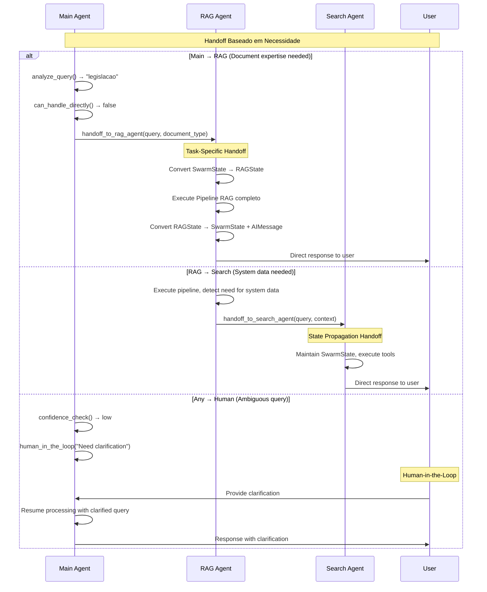
```mermaid
sequenceDiagram
    participant M as Main Agent
    participant R as RAG Agent  
    participant S as Search Agent
    participant U as User
    
    Note over M,U: Handoff Baseado em Necessidade
    
    alt Main → RAG (Document expertise needed)
        M->>M: analyze_query() → "legislacao"
        M->>M: can_handle_directly() → false
        M->>R: handoff_to_rag_agent(query, document_type)
        Note over R: Task-Specific Handoff
        R->>R: Convert SwarmState → RAGState
        R->>R: Execute Pipeline RAG completo
        R->>R: Convert RAGState → SwarmState + AIMessage
        R->>U: Direct response to user
    
    else RAG → Search (System data needed)
        R->>R: Execute pipeline, detect need for system data
        R->>S: handoff_to_search_agent(query, context)
        Note over S: State Propagation Handoff
        S->>S: Maintain SwarmState, execute tools
        S->>U: Direct response to user
    
    else Any → Human (Ambiguous query)
        M->>M: confidence_check() → low
        M->>M: human_in_the_loop("Need clarification")
        Note over U: Human-in-the-Loop
        U->>M: Provide clarification
        M->>M: Resume processing with clarified query
        M->>U: Response with clarification
    end
```

##### **Características Importantes**
- **Sem Return**: Agente que recebe handoff responde diretamente ao usuário
- **Estado Preservado**: Contexto da conversa é mantido através das transferências
- **Decisão Inteligente**: Handoff apenas quando necessário, não por padrão
- **Flexibilidade**: Qualquer agente pode fazer handoff para qualquer outro quando apropriado

---

## 6. PIPELINE RAG - DETALHAMENTO TÉCNICO

### 6.1. Arquitetura

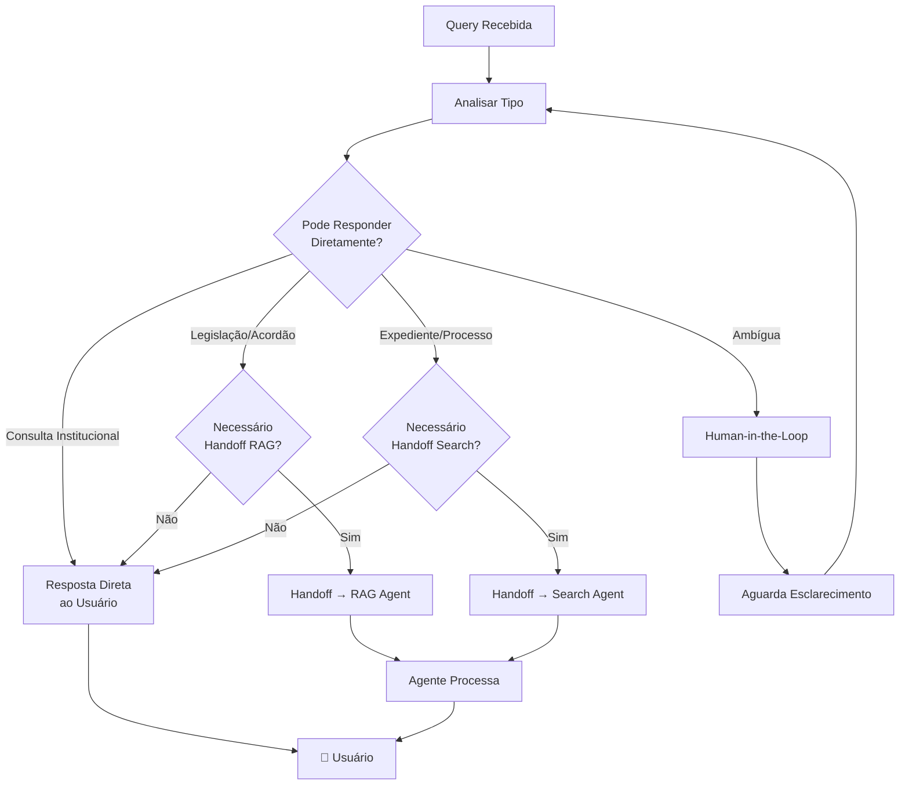
```mermaid
flowchart TD
    QUERY[Query Recebida] --> ANALYZE[Analisar Tipo]
    
    ANALYZE --> DECISION{Pode Responder<br/>Diretamente?}
    
    DECISION -->|"Consulta Institucional"| DIRECT[Resposta Direta<br/>ao Usuário]
    DECISION -->|"Legislação/Acordão"| EVALUATE_RAG{Necessário<br/>Handoff RAG?}
    DECISION -->|"Expediente/Processo"| EVALUATE_SEARCH{Necessário<br/>Handoff Search?}
    DECISION -->|"Ambígua"| HUMAN[Human-in-the-Loop]
    
    EVALUATE_RAG -->|"Sim"| HANDOFF_RAG[Handoff → RAG Agent]
    EVALUATE_RAG -->|"Não"| DIRECT
    
    EVALUATE_SEARCH -->|"Sim"| HANDOFF_SEARCH[Handoff → Search Agent] 
    EVALUATE_SEARCH -->|"Não"| DIRECT
    
    HANDOFF_RAG --> AGENT_PROCESSING[Agente Processa]
    HANDOFF_SEARCH --> AGENT_PROCESSING
    
    HUMAN --> CLARIFICATION[Aguarda Esclarecimento]
    CLARIFICATION --> ANALYZE
    
    DIRECT --> USER[👤 Usuário]
    AGENT_PROCESSING --> USER
```

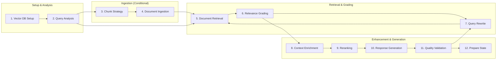
```mermaid
graph LR
    subgraph "Setup & Analysis"
        N1[1. Vector DB Setup]
        N2[2. Query Analysis] 
    end
    
    subgraph "Ingestion (Conditional)"
        N3[3. Chunk Strategy]
        N4[4. Document Ingestion]
    end
    
    subgraph "Retrieval & Grading"
        N5[5. Document Retrieval]
        N6[6. Relevance Grading]
        N7[7. Query Rewrite]
    end
    
    subgraph "Enhancement & Generation"
        N8[8. Context Enrichment]
        N9[9. Reranking]
        N10[10. Response Generation]
        N11[11. Quality Validation]
        N12[12. Prepare State]
    end
    
    N1 --> N2
    N2 --> N3
    N3 --> N4
    N4 --> N5
    N2 --> N5
    N5 --> N6
    N6 --> N7
    N7 --> N5
    N6 --> N8
    N8 --> N9
    N9 --> N10
    N10 --> N11
    N11 --> N7
    N11 --> N12
```

### 6.2. Conditional Edges - Implementação

```python
# Conditional edges implementados no graph.py
rag_graph.add_conditional_edges(
    "query_analysis",
    needs_ingestion_decision,
    {"ingestion": "chunk_strategy_selection", "continue": "document_retrieval"}
)

rag_graph.add_conditional_edges(
    "relevance_grading", 
    needs_rewrite_decision,
    {"rewrite": "query_rewrite", "continue": "context_enrichment"}
)

rag_graph.add_conditional_edges(
    "quality_validation",
    quality_check_decision,
    {"retry": "query_rewrite", "prepare": "prepare_state"}
)
```

### 6.3. RAG State Transitions

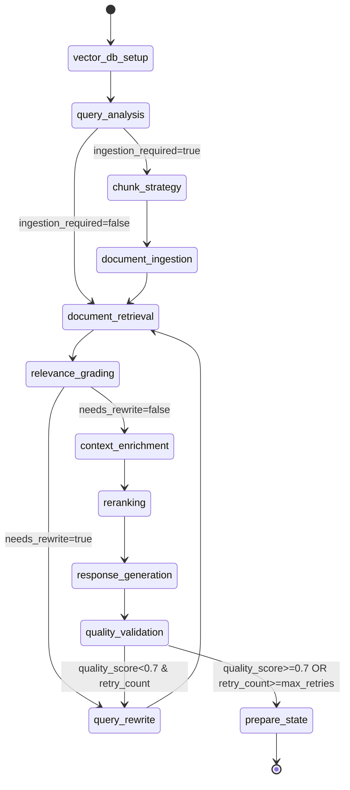
```mermaid
stateDiagram-v2
    [*] --> vector_db_setup
    vector_db_setup --> query_analysis
    query_analysis --> chunk_strategy: ingestion_required=true
    query_analysis --> document_retrieval: ingestion_required=false
    chunk_strategy --> document_ingestion
    document_ingestion --> document_retrieval
    document_retrieval --> relevance_grading
    relevance_grading --> query_rewrite: needs_rewrite=true
    relevance_grading --> context_enrichment: needs_rewrite=false
    query_rewrite --> document_retrieval
    context_enrichment --> reranking
    reranking --> response_generation
    response_generation --> quality_validation
    quality_validation --> query_rewrite: quality_score<0.7 & retry_count<max_retries
    quality_validation --> prepare_state: quality_score>=0.7 OR retry_count>=max_retries
    prepare_state --> [*]
```

---

## 7. FLUXOS REAIS DE INTERAÇÃO

### 7.1. Cenário 1: Consulta Legislação - Pipeline RAG

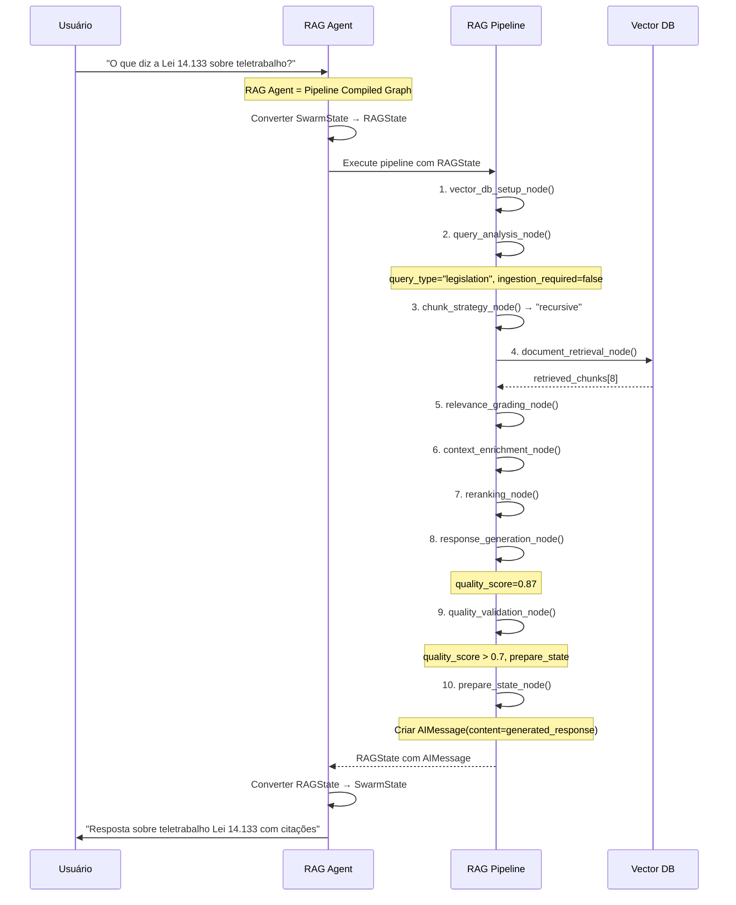
```mermaid
sequenceDiagram
    participant U as Usuário
    participant R as RAG Agent
    participant P as RAG Pipeline
    participant V as Vector DB
    
    U->>R: "O que diz a Lei 14.133 sobre teletrabalho?"
    
    Note over R: RAG Agent = Pipeline Compiled Graph
    
    R->>R: Converter SwarmState → RAGState
    R->>P: Execute pipeline com RAGState
    
    P->>P: 1. vector_db_setup_node()
    P->>P: 2. query_analysis_node()
    Note over P: query_type="legislation", ingestion_required=false
    
    P->>P: 3. chunk_strategy_node() → "recursive"
    P->>V: 4. document_retrieval_node()
    V-->>P: retrieved_chunks[8]
    
    P->>P: 5. relevance_grading_node()
    P->>P: 6. context_enrichment_node()
    P->>P: 7. reranking_node()
    P->>P: 8. response_generation_node()
    Note over P: quality_score=0.87
    
    P->>P: 9. quality_validation_node()
    Note over P: quality_score > 0.7, prepare_state
    
    P->>P: 10. prepare_state_node()
    Note over P: Criar AIMessage(content=generated_response)
    
    P-->>R: RAGState com AIMessage
    R->>R: Converter RAGState → SwarmState
    
    R->>U: "Resposta sobre teletrabalho Lei 14.133 com citações"
```

### 7.2. Cenário 2: Consulta Expediente - Search Agent Direto

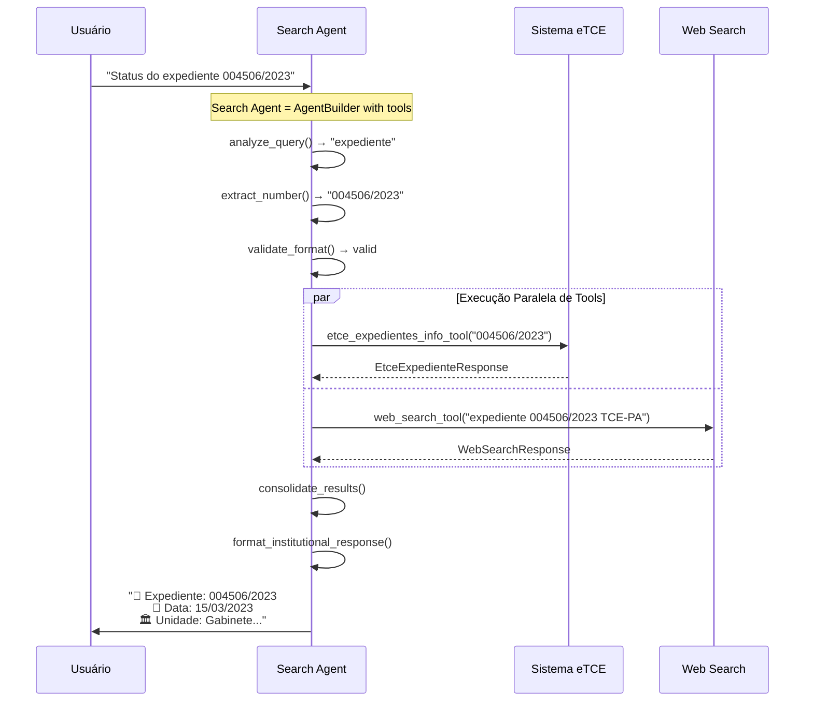
```mermaid
sequenceDiagram
    participant U as Usuário  
    participant S as Search Agent
    participant E as Sistema eTCE
    participant W as Web Search
    
    U->>S: "Status do expediente 004506/2023"
    
    Note over S: Search Agent = AgentBuilder with tools
    
    S->>S: analyze_query() → "expediente"
    S->>S: extract_number() → "004506/2023"
    S->>S: validate_format() → valid
    
    par Execução Paralela de Tools
        S->>E: etce_expedientes_info_tool("004506/2023")
        E-->>S: EtceExpedienteResponse
    and
        S->>W: web_search_tool("expediente 004506/2023 TCE-PA")
        W-->>S: WebSearchResponse
    end
    
    S->>S: consolidate_results()
    S->>S: format_institutional_response()
    
    S->>U: "📂 Expediente: 004506/2023<br/>📅 Data: 15/03/2023<br/>🏛️ Unidade: Gabinete..."
```

### 7.3. Cenário 3: Handoff Main → RAG

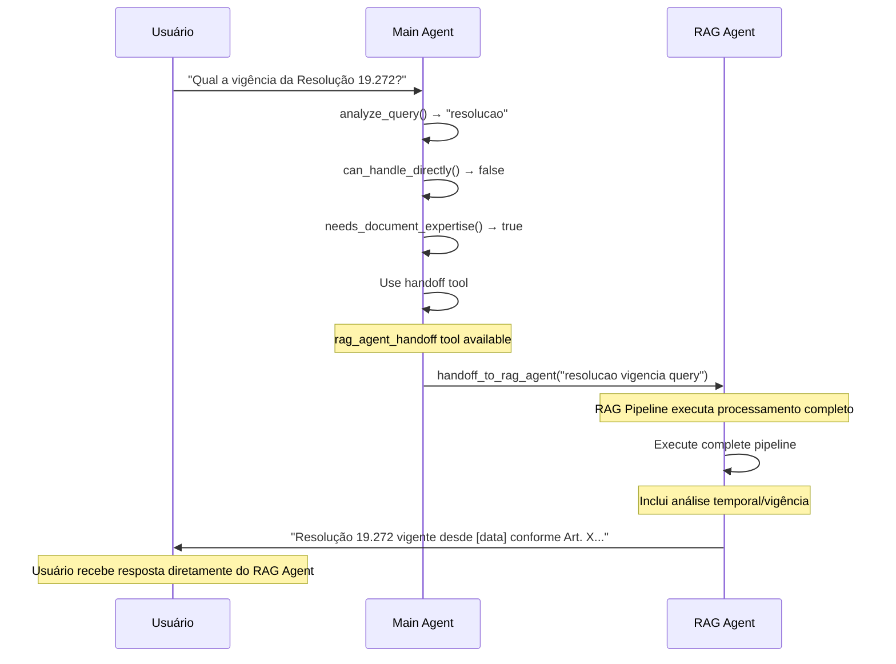
```mermaid
sequenceDiagram
    participant U as Usuário
    participant M as Main Agent
    participant R as RAG Agent
    
    U->>M: "Qual a vigência da Resolução 19.272?"
    
    M->>M: analyze_query() → "resolucao"
    M->>M: can_handle_directly() → false
    M->>M: needs_document_expertise() → true
    
    M->>M: Use handoff tool
    Note over M: rag_agent_handoff tool available
    
    M->>R: handoff_to_rag_agent("resolucao vigencia query")
    
         Note over R: RAG Pipeline executa processamento completo
    R->>R: Execute complete pipeline
    Note over R: Inclui análise temporal/vigência
    
    R->>U: "Resolução 19.272 vigente desde [data] conforme Art. X..."
    
    Note over U: Usuário recebe resposta diretamente do RAG Agent
```

### 7.4. Cenário 4: Human-in-the-Loop

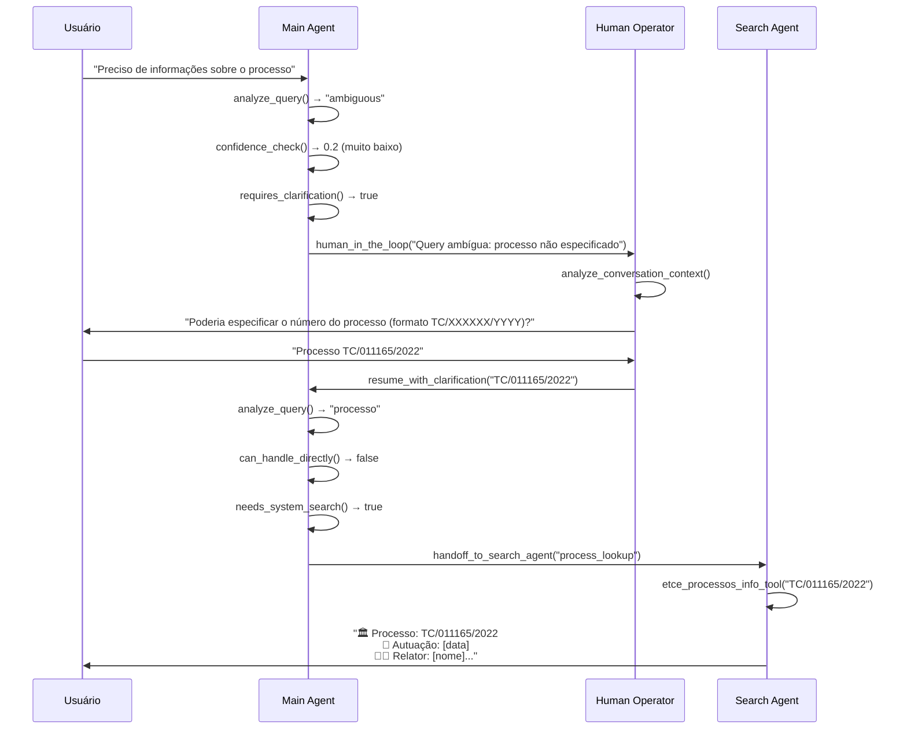
```mermaid
sequenceDiagram
    participant U as Usuário
    participant M as Main Agent  
    participant H as Human Operator
    participant S as Search Agent
    
    U->>M: "Preciso de informações sobre o processo"
    
    M->>M: analyze_query() → "ambiguous"
    M->>M: confidence_check() → 0.2 (muito baixo)
    M->>M: requires_clarification() → true
    
    M->>H: human_in_the_loop("Query ambígua: processo não especificado")
    
    H->>H: analyze_conversation_context()
    H->>U: "Poderia especificar o número do processo (formato TC/XXXXXX/YYYY)?"
    
    U->>H: "Processo TC/011165/2022"
    
    H->>M: resume_with_clarification("TC/011165/2022")
    
    M->>M: analyze_query() → "processo" 
    M->>M: can_handle_directly() → false
    M->>M: needs_system_search() → true
    
    M->>S: handoff_to_search_agent("process_lookup")
    
    S->>S: etce_processos_info_tool("TC/011165/2022")
    
    S->>U: "🏛️ Processo: TC/011165/2022<br/>📅 Autuação: [data]<br/>👨‍⚖️ Relator: [nome]..."
```

---

## 8. PLANO DE IMPLEMENTAÇÃO

### 8.1. Stack Tecnológico Recomendado

#### 8.1.1. Tecnologias Core

**🏗️ Framework Base:**
- **LangGraph**: Framework para multi-agent systems e state management
- **Python 3.11+**: Linguagem principal com suporte completo a type hints
- **Pydantic v2**: Validação de dados e contratos estruturados
- **FastAPI**: API REST para exposição do sistema

**🤖 LLM Provider:**
- **Azure OpenAI**: Provider exclusivo para todos os modelos
  - GPT-4o para agentes principais (reasoning complexo)
  - GPT-4o-mini para tarefas auxiliares (classificação, validação)
  - text-embedding-3-large para embeddings do RAG pipeline

**💾 Infraestrutura de Dados:**
- **PostgreSQL**: Cache principal e state persistence (substitui SQLite)
- **Redis**: Cache de sessão, rate limiting e temporary storage
- **Azure Index Search**: Vector database para RAG pipeline
- **Azure Blob Storage**: Storage para documentos ingeridos

**📊 Observabilidade:**
- **Langfuse**: Tracing e observabilidade completa

### 8.2. Estrutura de Projeto Sugerida

```
chatcontas-tce/
├── src/
│   ├── core/                     # Arquitetura principal
│   │   ├── swarm_graph.py       # StateGraph do swarm principal
│   │   ├── agent_builder.py     # AgentBuilder com dynamic prompts
│   │   ├── state_models.py      # SwarmState, RAGState, AgentState
│   │   └── handoff_manager.py   # Lógica de handoffs opcionais
│   │
│   ├── agents/                   # Implementação dos agentes
│   │   ├── main_agent.py        # Coordenador principal
│   │   ├── search_agent.py      # Especialista eTCE + Web
│   │   └── rag_agent/           # Pipeline RAG completo
│   │       ├── pipeline.py      # StateGraph do RAG
│   │       ├── nodes/          # Nós especializados (11+ nodes)
│   │       ├── models/         # Contratos Pydantic específicos
│   │       └── processors/     # Docling + Chonkie integration
│   │
│   ├── tools/                   # Tools especializadas
│   │   ├── etce_integration.py  # Processo/Expediente tools
│   │   ├── web_search.py        # Web search tool
│   │   └── human_loop.py        # Human-in-the-loop
│   │
│   ├── infrastructure/          # Camada de infraestrutura
│   │   ├── cache/              # PostgreSQL + Redis managers
│   │   ├── vector_db/          # Vector database integration
│   │   ├── observability/      # Langfuse integration
│   │   └── azure_openai/       # Azure OpenAI client
│   │
│   ├── api/                    # Camada de API
│   │   ├── routers/           # FastAPI routers
│   │   ├── middleware/        # Auth, CORS, rate limiting
│   │   └── schemas/           # Request/response models
│   │
│   └── config/                # Configuração do sistema
│       ├── settings.py        # Pydantic Settings
│       ├── prompts/          # Templates Jinja2
│       └── deployment/       # Docker, Kubernetes configs
│
├── tests/                     # Testes automatizados
├── docs/                     # Documentação técnica
├── scripts/                  # Scripts deployment/setup
└── requirements/            # Dependencies por ambiente
```

### 8.3. Roadmap de Implementação

#### 8.3.1. Fase 1: Foundation Infrastructure

**🎯 Milestone 1.1: Core Infrastructure Setup**
- Setup PostgreSQL cluster para state persistence
- Configuração Redis para cache e rate limiting
- Integração Azure OpenAI com credential management
- Setup Langfuse para observabilidade e tracing

**🎯 Milestone 1.2: Framework Foundation**
- Implementação base do LangGraph SwarmState
- AgentBuilder com dynamic prompt generation via pre-hooks
- Sistema de handoffs opcionais entre agentes
- State management hierarchy (SwarmState → AgentState → RAGState)

#### 8.3.2. Fase 2: Agent Development

**🎯 Milestone 2.1: Main Agent (Coordenador)**
- Router inteligente com decision logic
- Integration com human-in-the-loop tool
- Handoff tools para RAG e Search agents
- Autonomous response capability

**🎯 Milestone 2.2: Search Agent (eTCE + Web)**
- Integração com APIs eTCE (processos/expedientes)
- Web search tool especializada em fontes institucionais
- Structured responses com contratos Pydantic
- Error handling e graceful degradation

**🎯 Milestone 2.3: RAG Pipeline Agent**
- Pipeline completo com nós especializados
- Vector database setup e collection management
- Document ingestion com Chonkie + Docling
- Quality control com retry logic automático

#### 8.3.3. Fase 3: Production Readiness

**🎯 Milestone 3.1: API e Interface**
- FastAPI REST endpoints com authentication
- Rate limiting e security hardening
- Frontend interface (Streamlit ou React)
- User session management

**🎯 Milestone 3.2: DevOps e Monitoring**
- Containerização Docker completa
- CI/CD pipeline (Azure DevOps/GitHub Actions)
- Kubernetes deployment configs
- Monitoring dashboards e alertas


### 8.4. Deployment Architecture

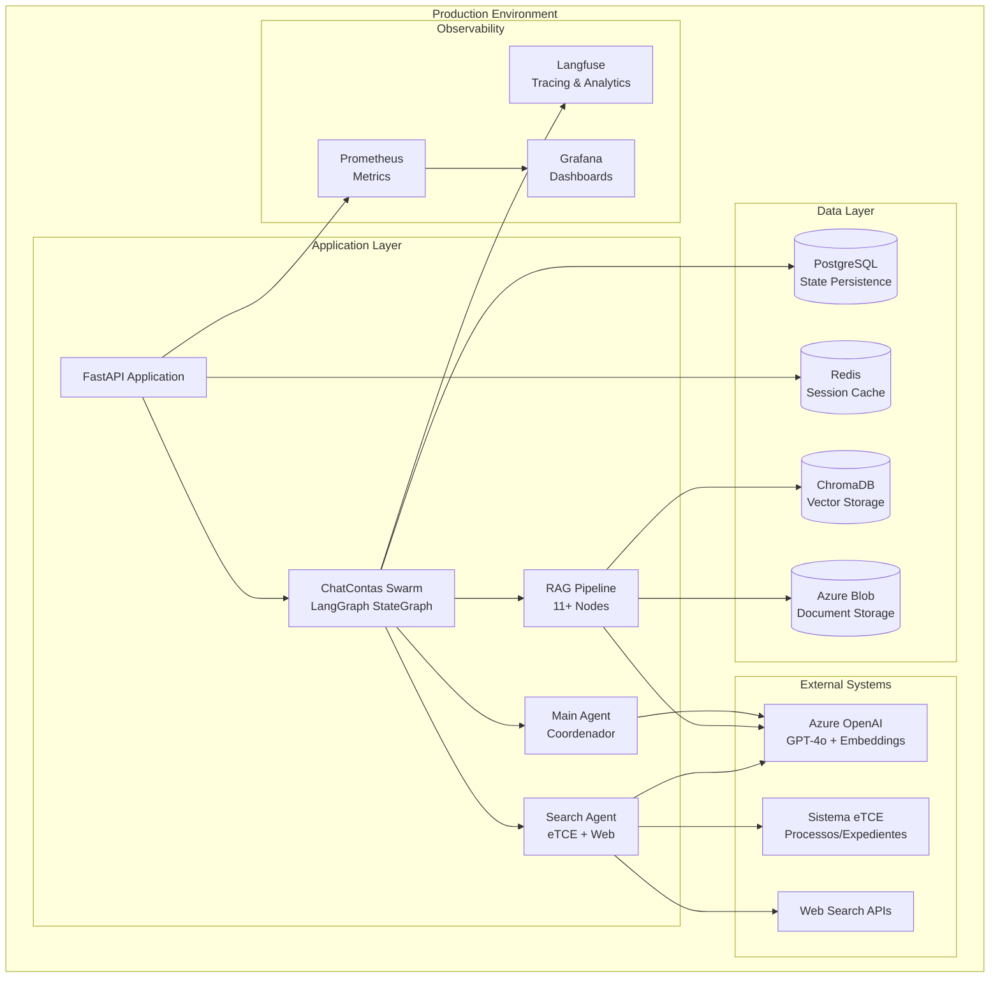
```mermaid
graph TB
    subgraph "Production Environment"
        subgraph "Application Layer"
            API[FastAPI Application]
            SWARM[ChatContas Swarm<br/>LangGraph StateGraph]
            MAIN[Main Agent<br/>Coordenador]
            RAG[RAG Pipeline<br/>11+ Nodes]
            SEARCH[Search Agent<br/>eTCE + Web]
        end
        
        subgraph "Data Layer"  
            PG[(PostgreSQL<br/>State Persistence)]
            REDIS[(Redis<br/>Session Cache)]
            VDB[(ChromaDB<br/>Vector Storage)]
            BLOB[(Azure Blob<br/>Document Storage)]
        end
        
        subgraph "External Systems"
            AZURE[Azure OpenAI<br/>GPT-4o + Embeddings]
            ETCE[Sistema eTCE<br/>Processos/Expedientes]
            WEB[Web Search APIs]
        end
        
        subgraph "Observability"
            LANGFUSE[Langfuse<br/>Tracing & Analytics]
            PROMETHEUS[Prometheus<br/>Metrics]
            GRAFANA[Grafana<br/>Dashboards]
        end
    end
    
    API --> SWARM
    SWARM --> MAIN
    SWARM --> RAG
    SWARM --> SEARCH
    
    SWARM --> PG
    API --> REDIS
    RAG --> VDB
    RAG --> BLOB
    
    MAIN --> AZURE
    RAG --> AZURE
    SEARCH --> AZURE
    
    SEARCH --> ETCE
    SEARCH --> WEB
    
    SWARM --> LANGFUSE
    API --> PROMETHEUS
    PROMETHEUS --> GRAFANA
```

---

## 9. GLOSSÁRIO TÉCNICO E REFERÊNCIAS

### 9.1. Glossário de Termos

| Termo | Definição | Contexto no Sistema |
|-------|-----------|-------------------|
| **Swarm Architecture** | Coordenação distribuída entre agentes especializados | Arquitetura principal com 3 agentes autônomos |
| **Optional Handoff** | Transferência de controle baseada em necessidade | Main→RAG, RAG→Search conforme expertise |
| **Pipeline Agent** | Agente implementado como pipeline de processamento | RAG Agent = StateGraph compilado, não conversacional |
| **Autonomous Agent** | Agente que pode responder diretamente ao usuário | Todos os 3 agentes podem responder sem consolidação |
| **State Propagation** | Transferência de estado entre agentes | SwarmState→RAGState→SwarmState |
| **Conditional Edges** | Decisões de fluxo baseadas em estado | needs_ingestion, needs_rewrite, quality_check |
| **Quality Validation** | Validação automática com retry | Score > 0.7 ou retry até max_retries |
| **Structured Output** | LLM com Pydantic models | Todos os nodes usam contratos tipados |

### 9.2. Design Patterns Aplicados

| Pattern | Aplicação | Benefício no Sistema |
|---------|-----------|---------------------|
| **Swarm Pattern** | Coordenação multi-agente | Especialização e autonomia dos agentes |
| **Pipeline Pattern** | RAG processing | Processamento sequencial e modular |
| **Command Pattern** | Tool responses | State updates estruturados e auditáveis |
| **Strategy Pattern** | Chunking strategies | Flexibilidade na estratégia de processamento |
| **Builder Pattern** | Agent construction | Configuração dinâmica e reutilização |
| **State Machine** | Pipeline flow control | Fluxo determinístico com branching inteligente |
| **Template Method** | Prompt templates | Prompts adaptativos baseados em contexto |

### 9.3. Tecnologias e Frameworks

| Tecnologia | Versão | Uso no Sistema |
|------------|--------|----------------|
| **LangGraph** | Latest | Framework multi-agente base |
| **LangChain** | Latest | LLM integration e tools |
| **Pydantic** | v2 | Type safety e validation |
| **Jinja2** | Latest | Template engine para prompts |

### 9.4. Referências Arquiteturais

#### **9.4.1. Padrões de Nomenclature**
- **Agents**: `{type}_agent` (main_agent, search_agent)
- **Nodes**: `{function}_node` (query_analysis_node)
- **Tools**: `{domain}_{action}_tool` (etce_expedientes_info_tool)
- **States**: `{scope}State` (RAGState, SearchAgentState)
- **Responses**: `{function}Result` (QueryAnalysisResult)
