# ARQUITETURA TÉCNICA INTEGRADA — CHAT CONTAS TCE-PA
## Sistema Multi-Agente com Pipeline RAG para Documentos Oficiais

**Versão:** 1.0  
**Data:** Junho 2025  
**Última Atualização:** 2024-12-15

---

## 1. RESUMO EXECUTIVO

O **Chat Contas TCE-PA** é um sistema multi-agente implementado com LangGraph, projetado para processar consultas especializadas do Tribunal de Contas do Estado do Pará. O sistema integra três agentes especializados em uma **arquitetura swarm** com pipeline RAG avançado para processamento de documentos oficiais.

### Características Principais
- **Arquitetura Swarm**: Coordenação inteligente entre 3 agentes especializados
- **Pipeline RAG Agentico**: 11 nós de processamento com quality validation
- **Processamento Estruturado**: Docling + Chonkie para documentos oficiais
- **Instrumentação Completa**: LangSmith/Langfuse tracing e monitoramento distribuído
- **Human-in-the-Loop**: Intervenção humana estratégica em pontos críticos

## 2. CONTEXTO E MOTIVAÇÃO

### 2.1. Desafios Institucionais

O TCE-PA enfrenta desafios únicos no processamento de consultas especializadas:

1. **Diversidade de Documentos**: Legislação, acordãos, resoluções, expedientes, processos
2. **Complexidade Jurídica**: Interpretação contextual e temporal de normas
3. **Volume de Consultas**: Centenas de queries diárias com diferentes níveis de complexidade
4. **Necessidade de Precisão**: Zero tolerância a informações incorretas ou desatualizadas

### 2.2. Motivação Técnica

**Problema Central**: Sistemas tradicionais de busca não conseguem processar adequadamente consultas contextuais sobre documentos jurídicos estruturados.

**Solução Proposta**: Sistema multi-agente com especialização funcional e pipeline RAG otimizado para documentos oficiais.

### 2.3. Requisitos Funcionais

- **RF01**: Processar consultas sobre legislação com citações específicas
- **RF02**: Buscar expedientes no sistema eletrônico com validação de formato
- **RF03**: Integrar informações de múltiplas fontes com transparência
- **RF04**: Manter contexto temporal e vigência de documentos
- **RF05**: Permitir intervenção humana em casos complexos

---

## 3. VISÃO GERAL DA ARQUITETURA MULTI-AGENTE

### 3.1. Arquitetura de Alto Nível

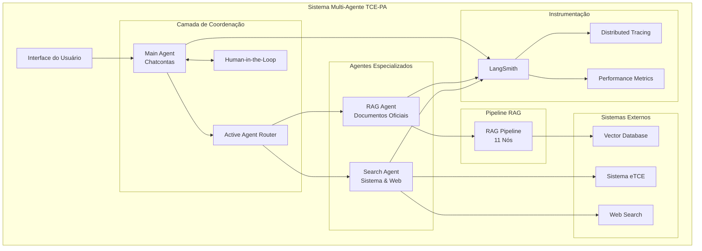
```mermaid
graph TB
    subgraph "Sistema Multi-Agente TCE-PA"
        UI[Interface do Usuário]
        
        subgraph "Camada de Coordenação"
            MAIN[Main Agent<br/>Chatcontas]
            ROUTER[Active Agent Router]
            HITL[Human-in-the-Loop]
        end
        
        subgraph "Agentes Especializados"
            RAG[RAG Agent<br/>Documentos Oficiais]
            SEARCH[Search Agent<br/>Sistema & Web]
        end
        
        subgraph "Pipeline RAG"
            RAGP[RAG Pipeline<br/>11 Nós]
        end
        
        subgraph "Sistemas Externos"
            ETCE[Sistema eTCE]
            WEB[Web Search]
            VDB[Vector Database]
        end
        
        subgraph "Instrumentação"
            LS[LangSmith]
            TRACES[Distributed Tracing]
            METRICS[Performance Metrics]
        end
    end
    
    UI --> MAIN
    MAIN --> ROUTER
    ROUTER --> RAG
    ROUTER --> SEARCH
    MAIN <--> HITL
    
    RAG --> RAGP
    RAGP --> VDB
    
    SEARCH --> ETCE
    SEARCH --> WEB
    
    MAIN --> LS
    RAG --> LS
    SEARCH --> LS
    
    LS --> TRACES
    LS --> METRICS
```

### 3.2. Princípios da Arquitetura Swarm

#### **Coordenação Distribuída**
- **Agentes especializados** com capacidades específicas
- **Handoffs baseados em necessidade** para funcionalidades específicas
- **Estado compartilhado** para coordenação eficiente
- **Especialização funcional** com autonomia operacional

#### **Fluxos Inteligentes**
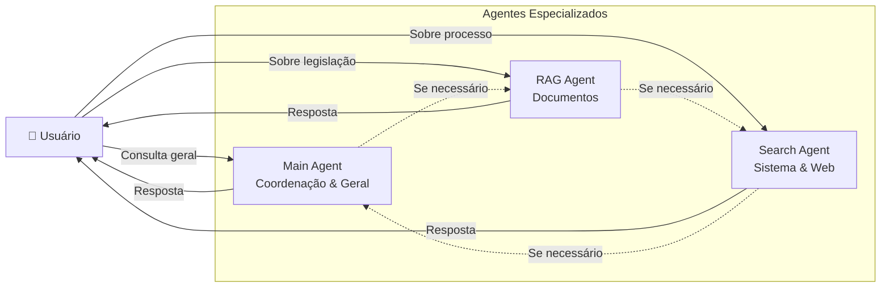
```mermaid
graph LR
    USER[👤 Usuário]
    
    subgraph "Agentes Especializados"
        MAIN[Main Agent<br/>Coordenação & Geral]
        RAG[RAG Agent<br/>Documentos]
        SEARCH[Search Agent<br/>Sistema & Web]
    end
    
    USER -->|"Consulta geral"| MAIN
    USER -->|"Sobre legislação"| RAG
    USER -->|"Sobre processo"| SEARCH
    
    MAIN -->|"Resposta"| USER
    RAG -->|"Resposta"| USER
    SEARCH -->|"Resposta"| USER
    
    MAIN -.->|"Se necessário"| RAG
    RAG -.->|"Se necessário"| SEARCH
    SEARCH -.->|"Se necessário"| MAIN
```

### 3.3. Padrões de Design Aplicados

#### **Swarm Pattern**
- **Definição**: Coordenação distribuída entre agentes especializados
- **Aplicação**: Agentes autônomos com handoffs inteligentes
- **Benefícios**: Especialização funcional, escalabilidade, fault tolerance

#### **Optional Handoff Pattern**
- **Definição**: Transferência de controle baseada em necessidade
- **Aplicação**: Agentes usam handoff para capacidades específicas
- **Benefícios**: Eficiência, redução de latência, simplicidade

#### **Pipeline Pattern**
- **Definição**: Sequência de processamento com etapas especializadas
- **Aplicação**: RAG Pipeline com 11 nós sequenciais e condicionais
- **Benefícios**: Modularidade, testabilidade, rastreabilidade

#### **Command Pattern**
- **Definição**: Encapsulamento de operações como objetos
- **Aplicação**: Tools como comandos executáveis com state updates
- **Benefícios**: Undo/redo, logging, composição de operações

---

## 4. DIRETRIZES DE ENGENHARIA APLICADAS

### 4.1. ENGENHARIA DE ESTADO (State Engineering)

#### 4.1.1. Arquitetura do Estado

O sistema utiliza um **SwarmState** consolidado que herda de `SwarmState` + `AgentState`, proporcionando coordenação swarm e funcionalidades de conversação.

#### 4.1.2. Campos de Estado por Categoria

##### **USER CONTEXT**
| Campo | Propósito | Setado Em | Usado Em | Exemplo |
|-------|-----------|-----------|----------|---------|
| `username` | Personalização de cumprimentos | main_agent (inicialização) | response formatting | "Dr. João Silva" |
| `user_id` | Session management e filtros | graph initialization | rag_agent (filtros de acesso) | "usr_12345" |
| `current_date` | Contexto temporal | graph initialization | temporal filtering | "2024-12-15T10:30:00Z" |

##### **QUERY CONTEXT**
| Campo | Propósito | Setado Em | Usado Em | Exemplo |
|-------|-----------|-----------|----------|---------|
| `query` | Consulta atual processada | main_agent (user input) | todos os agentes | "Qual o tema do Acórdão 192?" |
| `query_type` | Classificação para roteamento | main_agent (get_query_type) | routing decisions | "acordao" |
| `original_query` | Preservação para auditoria | main_agent (primeira captura) | RAG pipeline | "Qual o tema do Acórdão 192?" |

##### **RAG PROCESSING**
| Campo | Propósito | Setado Em | Usado Em | Exemplo |
|-------|-----------|-----------|----------|---------|
| `document_type` | Configuração de pipeline | rag_agent (análise) | chunk_strategy_node | "legislation" |
| `chunks` | Transparência de processamento | rag_agent (conversão) | debug/auditoria | ["chunk1", "chunk2"] |
| `confidence_score` | Quality indicators | rag_agent (RAGState) | decisões de retry | 0.85 |

##### **SEARCH RESULTS**
| Campo | Propósito | Setado Em | Usado Em | Exemplo |
|-------|-----------|-----------|----------|---------|
| `system_results` | Transparência de busca | search_agent (tools) | consolidação | [{"processo": "TC/001/2024"}] |
| `web_results` | Source attribution | search_agent (web_tool) | fact verification | [{"title": "TCE News"}] |

#### 4.1.3. Fluxo de Dados do Estado

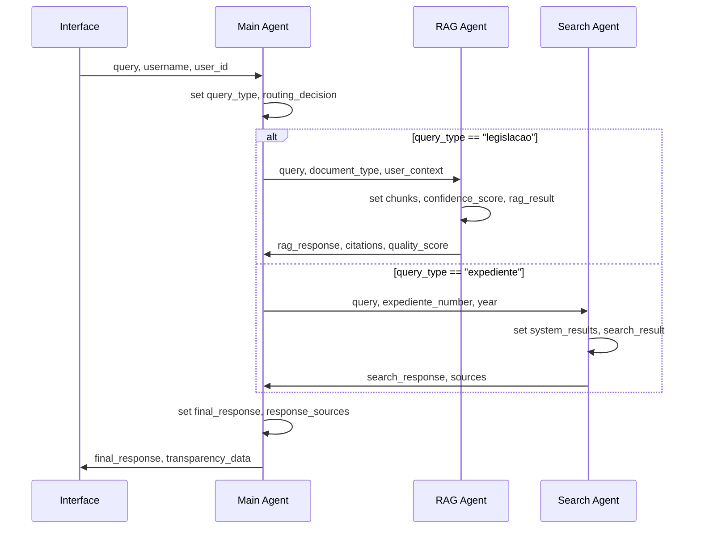
```mermaid
sequenceDiagram
    participant UI as Interface
    participant MAIN as Main Agent
    participant RAG as RAG Agent
    participant SEARCH as Search Agent
    
    UI->>MAIN: query, username, user_id
    MAIN->>MAIN: set query_type, routing_decision
    
    alt query_type == "legislacao"
        MAIN->>RAG: query, document_type, user_context
        RAG->>RAG: set chunks, confidence_score, rag_result
        RAG->>MAIN: rag_response, citations, quality_score
    else query_type == "expediente"
        MAIN->>SEARCH: query, expediente_number, year
        SEARCH->>SEARCH: set system_results, search_result
        SEARCH->>MAIN: search_response, sources
    end
    
    MAIN->>MAIN: set final_response, response_sources
    MAIN->>UI: final_response, transparency_data
```

### 4.2. ENGENHARIA DE FLUXO (Flow Engineering)

#### 4.2.1. Fluxo Principal do Sistema

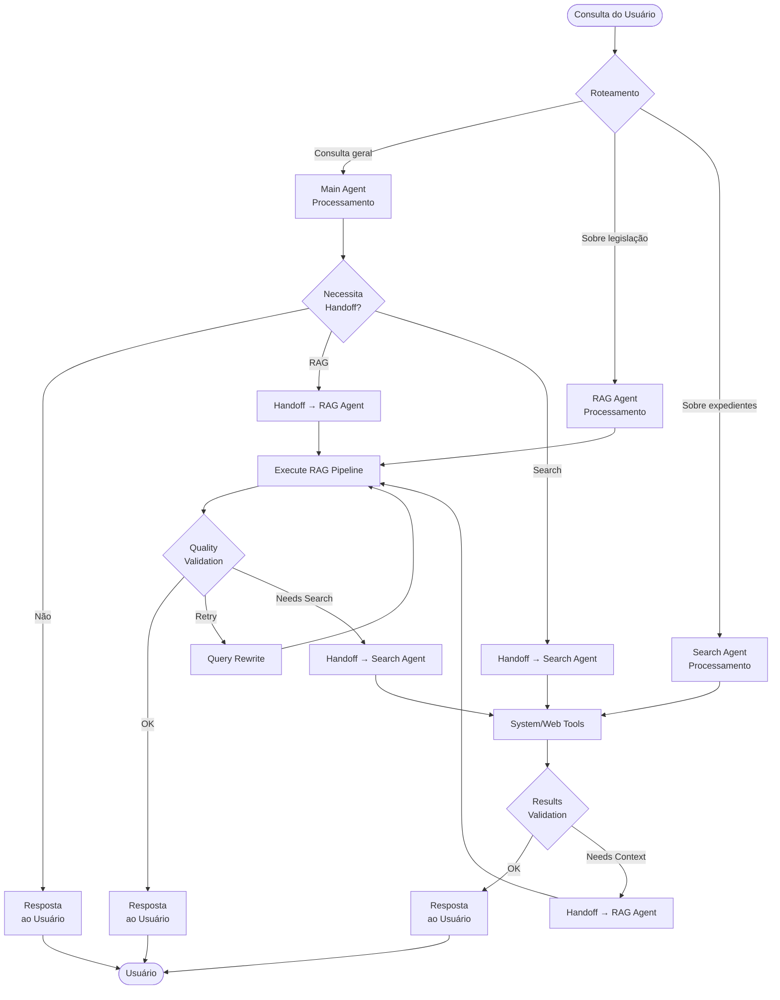
```mermaid
flowchart TD
    START([Consulta do Usuário]) --> ENTRY_POINT{Roteamento}
    
    ENTRY_POINT -->|"Consulta geral"| MAIN_PROCESS[Main Agent<br/>Processamento]
    ENTRY_POINT -->|"Sobre legislação"| RAG_PROCESS[RAG Agent<br/>Processamento]
    ENTRY_POINT -->|"Sobre expedientes"| SEARCH_PROCESS[Search Agent<br/>Processamento]
    
    MAIN_PROCESS --> MAIN_DECISION{Necessita<br/>Handoff?}
    MAIN_DECISION -->|"Não"| MAIN_RESPONSE[Resposta<br/>ao Usuário]
    MAIN_DECISION -->|"RAG"| HANDOFF_RAG[Handoff → RAG Agent]
    MAIN_DECISION -->|"Search"| HANDOFF_SEARCH[Handoff → Search Agent]
    
    RAG_PROCESS --> RAG_PIPELINE[Execute RAG Pipeline]
    RAG_PIPELINE --> RAG_VALIDATION{Quality<br/>Validation}
    RAG_VALIDATION -->|"OK"| RAG_RESPONSE[Resposta<br/>ao Usuário]
    RAG_VALIDATION -->|"Retry"| RAG_RETRY[Query Rewrite]
    RAG_VALIDATION -->|"Needs Search"| HANDOFF_SEARCH_RAG[Handoff → Search Agent]
    
    SEARCH_PROCESS --> SEARCH_TOOLS[System/Web Tools]
    SEARCH_TOOLS --> SEARCH_VALIDATION{Results<br/>Validation}
    SEARCH_VALIDATION -->|"OK"| SEARCH_RESPONSE[Resposta<br/>ao Usuário]
    SEARCH_VALIDATION -->|"Needs Context"| HANDOFF_RAG_SEARCH[Handoff → RAG Agent]
    
    HANDOFF_RAG --> RAG_PIPELINE
    HANDOFF_SEARCH --> SEARCH_TOOLS
    HANDOFF_SEARCH_RAG --> SEARCH_TOOLS
    HANDOFF_RAG_SEARCH --> RAG_PIPELINE
    
    RAG_RETRY --> RAG_PIPELINE
    
    MAIN_RESPONSE --> END([Usuário])
    RAG_RESPONSE --> END
    SEARCH_RESPONSE --> END
```

#### 4.2.2. Fluxo de Dados Estado

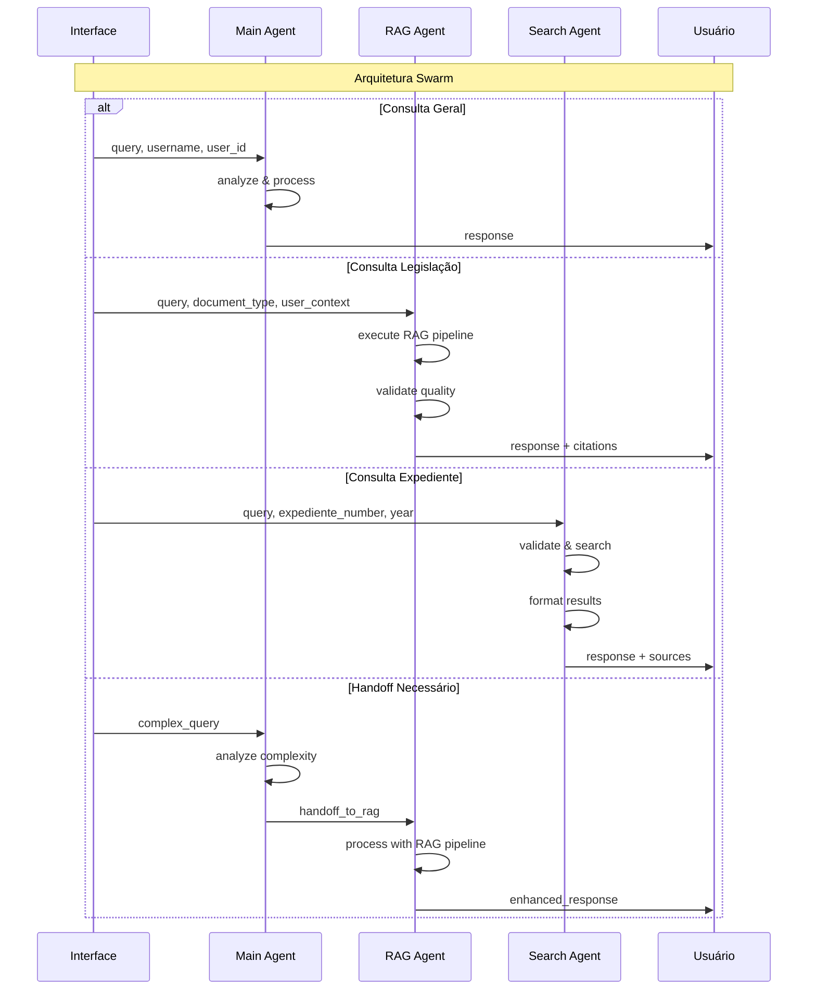
```mermaid
sequenceDiagram
    participant UI as Interface
    participant MAIN as Main Agent
    participant RAG as RAG Agent
    participant SEARCH as Search Agent
    participant USER as Usuário
    
    Note over UI,USER: Arquitetura Swarm
    
    alt Consulta Geral
        UI->>MAIN: query, username, user_id
        MAIN->>MAIN: analyze & process
        MAIN->>USER: response
    else Consulta Legislação
        UI->>RAG: query, document_type, user_context
        RAG->>RAG: execute RAG pipeline
        RAG->>RAG: validate quality
        RAG->>USER: response + citations
    else Consulta Expediente
        UI->>SEARCH: query, expediente_number, year
        SEARCH->>SEARCH: validate & search
        SEARCH->>SEARCH: format results
        SEARCH->>USER: response + sources
    else Handoff Necessário
        UI->>MAIN: complex_query
        MAIN->>MAIN: analyze complexity
        MAIN->>RAG: handoff_to_rag
        RAG->>RAG: process with RAG pipeline
        RAG->>USER: enhanced_response
    end
```

#### 4.2.3. Fluxo Detalhado RAG Pipeline

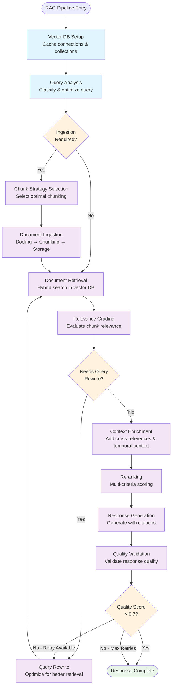
```mermaid
flowchart TD
    START([RAG Pipeline Entry]) --> VECTOR_DB[Vector DB Setup<br/>Cache connections & collections]
    
    VECTOR_DB --> QUERY_ANALYSIS[Query Analysis<br/>Classify & optimize query]
    
    QUERY_ANALYSIS --> INGESTION_CHECK{Ingestion<br/>Required?}
    
    INGESTION_CHECK -->|Yes| CHUNK_STRATEGY[Chunk Strategy Selection<br/>Select optimal chunking]
    INGESTION_CHECK -->|No| DOCUMENT_RETRIEVAL[Document Retrieval<br/>Hybrid search in vector DB]
    
    CHUNK_STRATEGY --> DOCUMENT_INGESTION[Document Ingestion<br/>Docling → Chunking → Storage]
    DOCUMENT_INGESTION --> DOCUMENT_RETRIEVAL
    
    DOCUMENT_RETRIEVAL --> RELEVANCE_GRADING[Relevance Grading<br/>Evaluate chunk relevance]
    
    RELEVANCE_GRADING --> REWRITE_CHECK{Needs Query<br/>Rewrite?}
    
    REWRITE_CHECK -->|Yes| QUERY_REWRITE[Query Rewrite<br/>Optimize for better retrieval]
    REWRITE_CHECK -->|No| CONTEXT_ENRICHMENT[Context Enrichment<br/>Add cross-references & temporal context]
    
    QUERY_REWRITE --> DOCUMENT_RETRIEVAL
    
    CONTEXT_ENRICHMENT --> RERANKING[Reranking<br/>Multi-criteria scoring]
    
    RERANKING --> RESPONSE_GENERATION[Response Generation<br/>Generate with citations]
    
    RESPONSE_GENERATION --> QUALITY_VALIDATION[Quality Validation<br/>Validate response quality]
    
    QUALITY_VALIDATION --> QUALITY_CHECK{Quality Score<br/>> 0.7?}
    
    QUALITY_CHECK -->|Yes| END([Response Complete])
    QUALITY_CHECK -->|No - Retry Available| QUERY_REWRITE
    QUALITY_CHECK -->|No - Max Retries| END
    
    classDef setupNode fill:#e1f5fe
    classDef processNode fill:#f3e5f5
    classDef decisionNode fill:#fff3e0
    classDef completeNode fill:#e8f5e8
    
    class VECTOR_DB,QUERY_ANALYSIS setupNode
    class CHUNK_STRATEGY,DOCUMENT_INGESTION,DOCUMENT_RETRIEVAL,RELEVANCE_GRADING,CONTEXT_ENRICHMENT,RERANKING,RESPONSE_GENERATION,QUALITY_VALIDATION,QUERY_REWRITE processNode
    class INGESTION_CHECK,REWRITE_CHECK,QUALITY_CHECK decisionNode
    class END completeNode
```

#### 4.2.3.1. Estado RAG Pipeline

O estado RAG (`RAGState`) contém 50+ campos especializados organizados em 9 categorias principais:

**Query Processing:**
- `original_query`: Query preservada para comparação
- `processed_query`: Query otimizada para retrieval
- `query_type`: Classificação (legislation, acordao, resolucao, jurisprudencia)
- `query_complexity`: Nível de processamento (simple, medium, complex)

**Document Context & Access:**
- `target_databases`: Bases selecionadas para busca
- `temporal_context`: Filtros temporais (vigência, exercício)
- `document_scope`: Controle de acesso (global, user_specific, session_specific)
- `user_id`, `session_id`: Identificação para filtros

**Vector Database Management:**
- `vector_db_type`: Tipo de database (azure_ai_search, lancedb)
- `vector_db_instances`: Cache de conexões ativas
- `collection_names`: Coleções específicas para busca
- `embedding_model`: Modelo consistente para embeddings

**Chunking Strategy:**
- `selected_chunker`: Estratégia otimizada (recursive, semantic, sdpm, late)
- `chunk_size`, `chunk_overlap`: Configurações de segmentação
- `chunking_metadata`: Configurações específicas da estratégia

**Ingestion Control:**
- `ingestion_required`: Flag para ingestão de novos documentos
- `documents_to_ingest`: Lista de documentos para processar
- `ingestion_strategy`: Modo de processamento (batch, streaming)
- `ingestion_status`: Status por documento

**Retrieval Results:**
- `retrieved_chunks`: Chunks encontrados na busca
- `reranked_chunks`: Chunks reordenados por relevância
- `final_context`: Contexto consolidado para geração

**Generation & Validation:**
- `generated_response`: Resposta final gerada
- `quality_score`: Score de qualidade (0-1)
- `validation_passed`: Flag de validação aprovada
- `citations`: Citações específicas dos documentos

**Workflow Control:**
- `retry_count`, `max_retries`: Controle de tentativas
- `needs_rewrite`: Flag para reescrita de query

**Performance Metrics:**
- `retrieval_time`, `processing_time`, `ingestion_time`: Métricas de tempo
- `total_tokens_used`: Controle de custos LLM
- `vector_db_queries`: Número de consultas ao database

#### 4.2.4. Fluxos de Handoff

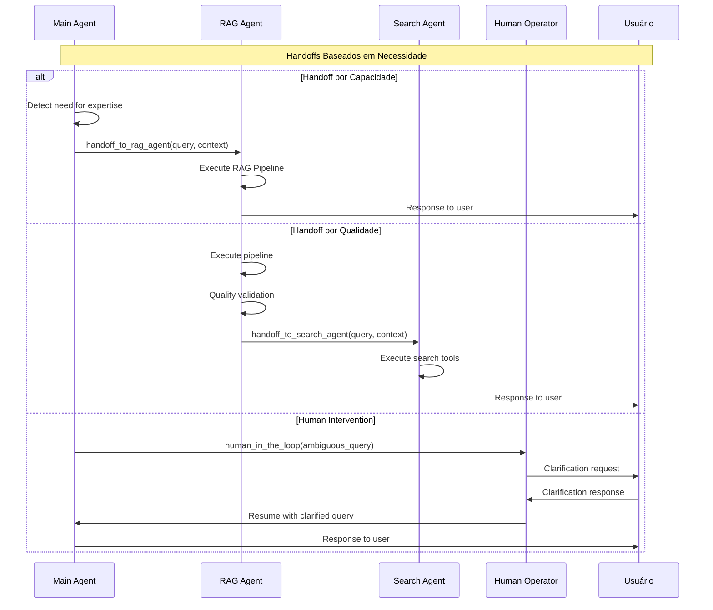
```mermaid
sequenceDiagram
    participant M as Main Agent
    participant RAG as RAG Agent
    participant S as Search Agent
    participant H as Human Operator
    participant U as Usuário
    
    Note over M,U: Handoffs Baseados em Necessidade
    
    alt Handoff por Capacidade
        M->>M: Detect need for expertise
        M->>RAG: handoff_to_rag_agent(query, context)
        RAG->>RAG: Execute RAG Pipeline
        RAG->>U: Response to user
    else Handoff por Qualidade
        RAG->>RAG: Execute pipeline
        RAG->>RAG: Quality validation
        RAG->>S: handoff_to_search_agent(query, context)
        S->>S: Execute search tools
        S->>U: Response to user
    else Human Intervention
        M->>H: human_in_the_loop(ambiguous_query)
        H->>U: Clarification request
        U->>H: Clarification response
        H->>M: Resume with clarified query
        M->>U: Response to user
    end
```

### 4.3. ENGENHARIA DE PROMPT (Prompt Engineering)

#### 4.3.1. Arquitetura de Prompts

O sistema utiliza **prompt templating modular** com Jinja2, separando responsabilidades:

- **Base Template**: Estrutura comum para todos os agentes
- **Dynamic Blocks**: Comportamentos específicos por agente
- **Fragment Templates**: Reutilização de componentes especializados

#### 4.3.2. Estrutura do Prompt Base

```jinja2
# CURRENT_DATETIME: {{ current_datetime }}

## 👤 Identity
You are {{ agent_identity }}.

## 🎯 Responsibilities

- {{ item }}


## 🧠 Behavior Rules
{{ dynamic_block }}

## 🛠️ Tools Available

- `{{ tool.name }}` → {{ tool.description }}



### Constraints:

- {{ c }}


```

#### 4.3.3. Prompts Especializados por Agente

##### **Main Agent Prompt**
```jinja2
## 🏛️ Contexto do Sistema TCE-PA
Você é o **Chatcontas**, assistente oficial do TCE-PA.

## 🎯 Workflow de Coordenação
### 1. Análise de Consulta
- Analise para determinar tipo: legislação, expediente, processo, web, geral
- Verifique clareza e completude

### 2. Roteamento Inteligente
- Legislação/Acordãos → RAG Agent
- Expedientes/Processos → Search Agent
- Informações atuais → Search Agent
- Consultas ambíguas → Human-in-the-Loop

### 3. Gestão de Estado
- Mantenha contexto: username, user_id, current_date
- Atualize: query_type, thread_mode, task_type
```

##### **RAG Agent Prompt**
```jinja2
## 🧠 Behavior Rules - RAG Agent

### 📚 Document Processing Strategy
- Primary Tool: execute_rag_pipeline_tool para queries complexas
- Chunking Strategies: Recursive (legislação), Semantic (acordãos)
- Quality Validation: score > 0.7 obrigatório

### 🔄 RAG Pipeline Workflow
1. Query Analysis → Classify type & complexity
2. Vector DB Setup → Initialize collections
3. Document Ingestion → Docling → Chunking → Storage
4. Retrieval → Hybrid search with filters
5. Grading → Multi-criteria relevance evaluation
6. Enrichment → Juridical context & cross-references
7. Reranking → Multi-criteria scoring
8. Generation → Formal response with citations
9. Validation → Quality checks & retry logic
```

##### **Search Agent Prompt**
```jinja2
## 🔍 Especialista em Busca - eTCE e Web Search

### 📋 Estrutura de Resposta
#### Para Expedientes
📂 Expediente: [número]
📅 Data: [data_autuacao]
🏛️ Unidade: [unidade_jurisdicionada]
👨‍⚖️ Relator: [relator]

### ⚡ Execução Eficiente
1. Analise → Identifique tipo e extraia identificadores
2. Valide → Confirme formato e disponibilidade
3. Execute → Use ferramentas em paralelo
4. Integre → Combine resultados
5. Formate → Estruture resposta clara
```

#### 4.3.4. Estratégias de Versionamento

| Versão | Mudanças | Impacto | Rollback |
|--------|----------|---------|----------|
| 1.0 | Prompt base inicial | Baseline | N/A |
| 1.1 | Melhorias no roteamento | +5% accuracy | Automático |
| 1.2 | Refinamento RAG | +10% quality | Manual |
| 2.0 | Reestruturação completa | Breaking changes | Planejado |

### 4.4. ENGENHARIA DE TOOLING

#### 4.4.1. Arquitetura de Ferramentas

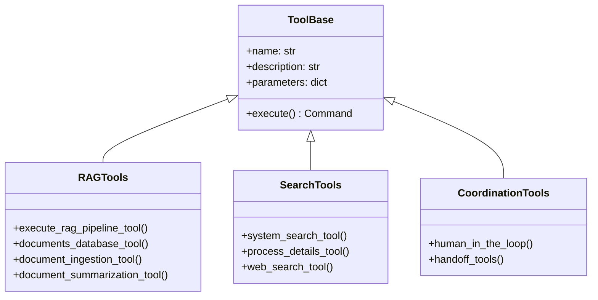
```mermaid
classDiagram
    class ToolBase {
        +name: str
        +description: str
        +parameters: dict
        +execute() Command
    }
    
    class RAGTools {
        +execute_rag_pipeline_tool()
        +documents_database_tool()
        +document_ingestion_tool()
        +document_summarization_tool()
    }
    
    class SearchTools {
        +system_search_tool()
        +process_details_tool()
        +web_search_tool()
    }
    
    class CoordinationTools {
        +human_in_the_loop()
        +handoff_tools()
    }
    
    ToolBase <|-- RAGTools
    ToolBase <|-- SearchTools
    ToolBase <|-- CoordinationTools
```

#### 4.4.2. Inventário de Ferramentas

##### **RAG Agent Tools**

| Tool | Assinatura | Objetivo | Design Pattern | Exemplo |
|------|------------|----------|----------------|---------|
| `execute_rag_pipeline_tool` | `query, user_id, session_id` | Pipeline RAG completo | Pipeline | "Qual lei sobre teletrabalho?" |
| `documents_database_tool` | `query, document_type` | Busca simples documentos | Repository | "Resolução 19.272" |
| `document_ingestion_tool` | `content, type, metadata` | Processamento documentos | Strategy | Upload PDF legislação |
| `document_summarization_tool` | `document_content` | Resumo documentos | Template Method | Resumir acordão |

##### **Search Agent Tools**

| Tool | Assinatura | Objetivo | Design Pattern | Exemplo |
|------|------------|----------|----------------|---------|
| `system_search_tool` | `expediente_number, year` | Busca eTCE | Adapter | "004506/2023" |
| `process_details_tool` | `processo_number` | Detalhes processo | Facade | "TC/011165/2022" |
| `web_search_tool` | `query` | Busca web | Proxy | "últimas notícias TCE" |

##### **Coordination Tools**

| Tool | Assinatura | Objetivo | Design Pattern | Exemplo |
|------|------------|----------|----------------|---------|
| `human_in_the_loop` | `question_to_user` | Intervenção humana | Interrupt | "Esclareça o período" |
| `handoff_tools` | `agent_name, state` | Transferência agentes | Command | Handoff to RAG |

#### 4.4.3. Tool Response Patterns

##### **Command Pattern Implementation**
```python
def tool_function(params, tool_call_id):
    # 1. Execute business logic
    result = process_request(params)
    
    # 2. Return Command with state updates
    return Command(
        update={
            "field1": result.data,
            "field2": result.metadata,
            "messages": [
                ToolMessage(
                    content=f"Tool executed: {result.summary}",
                    tool_call_id=tool_call_id
                )
            ]
        }
    )
```

##### **Error Handling Pattern**
```python
try:
    result = execute_tool_logic(params)
    return success_command(result)
except ValidationError as e:
    return error_command(f"Validation failed: {e}")
except SystemError as e:
    return fallback_command(f"System error: {e}")
```

### 4.5. ENGENHARIA DE HANDOFF

#### 4.5.1. Padrões de Handoff

##### **State Propagation Pattern**
```python
def create_handoff_tool_with_state_propagation(agent_name, description):
    def handoff_tool(state: SwarmState):
        # 1. Preserve critical state
        preserved_state = {
            "user_id": state.user_id,
            "session_id": state.session_id,
            "query": state.query,
            "context": state.context
        }
        
        # 2. Add handoff metadata
        handoff_metadata = {
            "source_agent": state.active_agent,
            "target_agent": agent_name,
            "handoff_reason": description,
            "timestamp": datetime.now().isoformat()
        }
        
        # 3. Update agent interactions log
        state.agent_interactions.append(handoff_metadata)
        
        # 4. Transfer control
        return Command(
            update={
                "active_agent": agent_name,
                **preserved_state,
                "handoff_metadata": handoff_metadata
            }
        )
    
    return handoff_tool
```

#### 4.5.2. Handoff Triggers e Mecanismos

##### **Routing-Based Handoff**
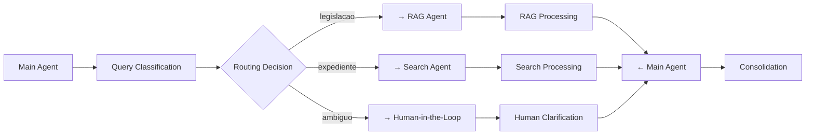
```mermaid
flowchart LR
    MAIN[Main Agent] --> CLASSIFY[Query Classification]
    CLASSIFY --> DECISION{Routing Decision}
    
    DECISION -->|legislacao| RAG_HANDOFF[→ RAG Agent]
    DECISION -->|expediente| SEARCH_HANDOFF[→ Search Agent]
    DECISION -->|ambiguo| HUMAN_HANDOFF[→ Human-in-the-Loop]
    
    RAG_HANDOFF --> RAG_PROCESS[RAG Processing]
    SEARCH_HANDOFF --> SEARCH_PROCESS[Search Processing]
    HUMAN_HANDOFF --> HUMAN_PROCESS[Human Clarification]
    
    RAG_PROCESS --> RETURN_MAIN[← Main Agent]
    SEARCH_PROCESS --> RETURN_MAIN
    HUMAN_PROCESS --> RETURN_MAIN
    
    RETURN_MAIN --> CONSOLIDATE[Consolidation]
```

##### **Quality-Based Handoff**
```python
def quality_based_handoff(state: SwarmState):
    if state.confidence_score < 0.7:
        if state.retry_count < 3:
            return handoff_to_agent("RAG_Agent", "quality_retry")
        else:
            return handoff_to_agent("Human_Operator", "quality_validation")
    return continue_processing(state)
```

#### 4.5.3. Handoff Monitoring e Auditoria

##### **Interaction Tracking**
```python
@dataclass
class HandoffMetadata:
    source_agent: str
    target_agent: str
    reason: str
    timestamp: str
    state_snapshot: Dict[str, Any]
    success: bool
    error_message: Optional[str] = None
```

##### **Handoff Metrics**
| Métrica | Descrição | Threshold | Ação |
|---------|-----------|-----------|------|
| `handoff_latency` | Tempo de transferência | <100ms | Alerta se >500ms |
| `handoff_success_rate` | Taxa de sucesso | >99% | Investigar se <95% |
| `circular_handoff_count` | Transfers circulares | 0 | Alerta imediato |
| `state_integrity_score` | Integridade do estado | 100% | Rollback se <100% |

---

## 5. DESCRIÇÃO DETALHADA DOS AGENTES, TOOLS E HANDOFFS

### 5.1. Main Agent (Chatcontas)

#### 5.1.1. Responsabilidades Principais

**Função**: Coordenador e ponto de entrada do sistema
**Padrão**: Coordinator Pattern
**Ciclo de Vida**: Ponto de entrada para consultas gerais e coordenação

##### **Responsabilidades Específicas**
1. **Coordenação**: Gerenciar o fluxo de conversação com usuários
2. **Análise de Intent**: Classificar consultas usando `get_query_type()`
3. **Roteamento Inteligente**: Decidir quando acionar agentes especializados
4. **Gestão de Estado**: Manter contexto global e coordenação
5. **Interface com Usuário**: Manter tom formal e personalização

#### 5.1.2. Design Patterns Aplicados

##### **Coordination Pattern**
```python
def process_query(self, query: str) -> str:
    # 1. Query Analysis
    query_type = self.analyze_query(query)
    
    # 2. Decision: Can handle directly or needs handoff?
    if self.can_handle_directly(query_type):
        return self.generate_response(query)
    
    # 3. Handoff to specialized agent
    if query_type in ["legislacao", "acordao"]:
        return self.handoff_to_rag_agent(query)
    elif query_type in ["expediente", "processo"]:
        return self.handoff_to_search_agent(query)
    else:
        return self.handle_with_human_assistance(query)
```

##### **State Machine Pattern**
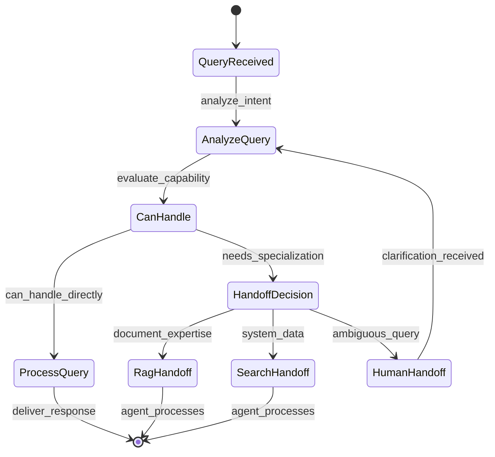
```mermaid
stateDiagram-v2
    [*] --> QueryReceived
    QueryReceived --> AnalyzeQuery: analyze_intent
    AnalyzeQuery --> CanHandle: evaluate_capability
    CanHandle --> ProcessQuery: can_handle_directly
    CanHandle --> HandoffDecision: needs_specialization
    ProcessQuery --> [*]: deliver_response
    HandoffDecision --> RagHandoff: document_expertise
    HandoffDecision --> SearchHandoff: system_data
    HandoffDecision --> HumanHandoff: ambiguous_query
    RagHandoff --> [*]: agent_processes
    SearchHandoff --> [*]: agent_processes
    HumanHandoff --> AnalyzeQuery: clarification_received
```

#### 5.1.3. Fluxos de Interação

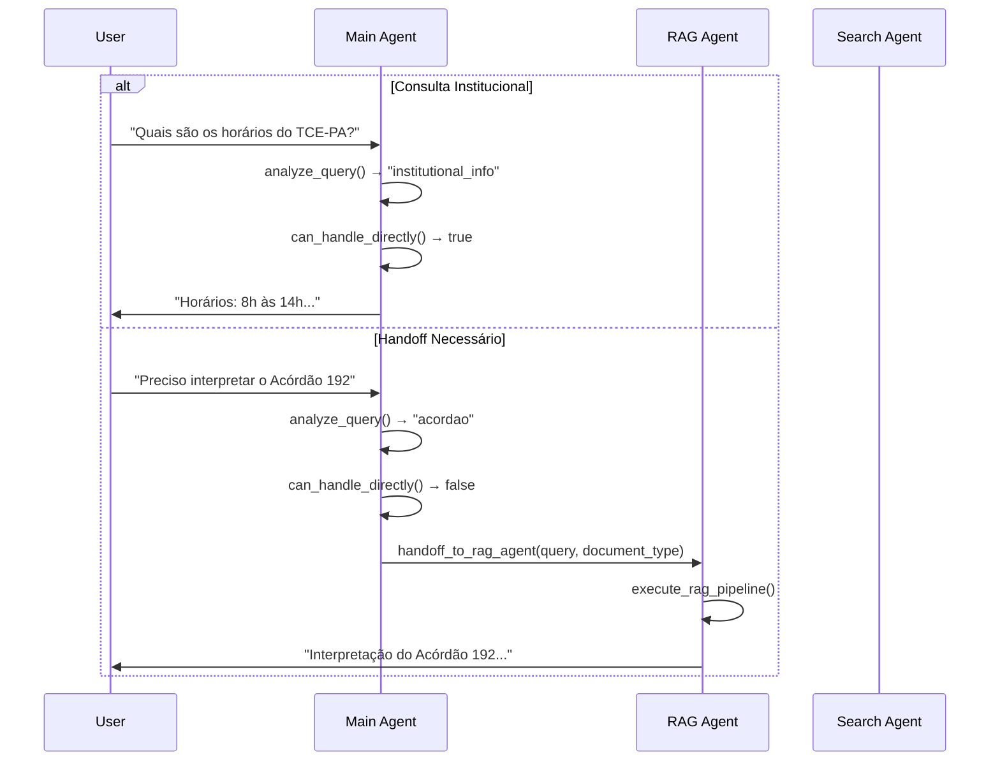
```mermaid
sequenceDiagram
    participant U as User
    participant M as Main Agent
    participant R as RAG Agent
    participant S as Search Agent
    
    alt Consulta Institucional
        U->>M: "Quais são os horários do TCE-PA?"
        M->>M: analyze_query() → "institutional_info"
        M->>M: can_handle_directly() → true
        M->>U: "Horários: 8h às 14h..."
         else Handoff Necessário
         U->>M: "Preciso interpretar o Acórdão 192"
         M->>M: analyze_query() → "acordao"
         M->>M: can_handle_directly() → false
         M->>R: handoff_to_rag_agent(query, document_type)
         R->>R: execute_rag_pipeline()
         R->>U: "Interpretação do Acórdão 192..."
    end
```

### 5.2. RAG Agent (Especialista em Documentos)

#### 5.2.1. Responsabilidades Principais

**Função**: Processamento avançado de documentos oficiais
**Padrão**: Pipeline + Strategy Pattern
**Ciclo de Vida**: Ativado para consultas sobre documentos

##### **Responsabilidades Específicas**
1. **Pipeline RAG**: Executar processamento completo via `execute_rag_pipeline_tool`
2. **Estratégias de Chunking**: Aplicar chunking otimizado por tipo de documento
3. **Quality Validation**: Garantir qualidade mínima de 0.7 nas respostas
4. **Citações**: Fornecer referências específicas e precisas
5. **Contexto Temporal**: Considerar vigência e exercícios fiscais

#### 5.2.2. Fluxos de Processamento

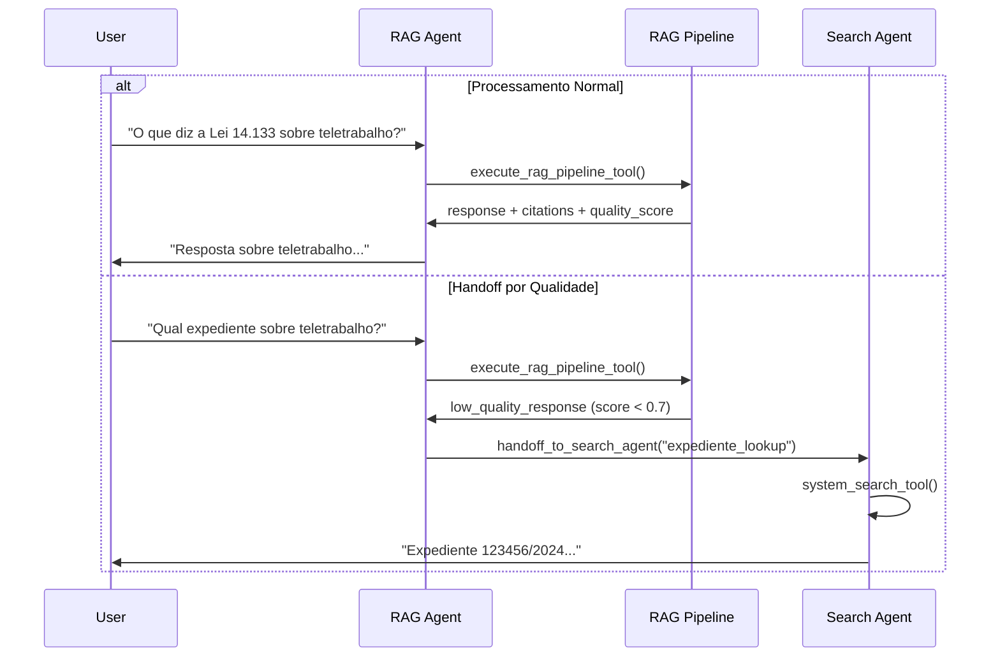
```mermaid
sequenceDiagram
    participant U as User
    participant R as RAG Agent
    participant P as RAG Pipeline
    participant S as Search Agent
    
    alt Processamento Normal
        U->>R: "O que diz a Lei 14.133 sobre teletrabalho?"
        R->>P: execute_rag_pipeline_tool()
        P->>R: response + citations + quality_score
        R->>U: "Resposta sobre teletrabalho..."
    else Handoff por Qualidade
        U->>R: "Qual expediente sobre teletrabalho?"
        R->>P: execute_rag_pipeline_tool()
        P->>R: low_quality_response (score < 0.7)
        R->>S: handoff_to_search_agent("expediente_lookup")
        S->>S: system_search_tool()
        S->>U: "Expediente 123456/2024..."
    end
```

#### 5.2.3. Estratégias de Chunking - Swarm Architecture

| Estratégia | Documento Ideal | Chunk Size | Características |
|------------|----------------|------------|----------------|
| `recursive` | Legislação | 512 tokens | Preserva hierarquia (Art., §, Inc.) |
| `semantic` | Acordãos | 400 tokens | Agrupamento semântico por tema |
| `sdpm` | Resoluções | 300 tokens | Precisão semântica máxima |
| `late` | Jurisprudência | 600 tokens | Contexto global preservado |

### 5.3. Search Agent (Especialista em Busca)

#### 5.3.1. Responsabilidades Principais

**Função**: Busca em sistema eletrônico e web
**Padrão**: Adapter + Facade Pattern
**Ciclo de Vida**: Ativado para consultas sobre expedientes/processos

##### **Responsabilidades Específicas**
1. **Validação de Formatos**: Verificar padrões de expedientes e processos
2. **Busca Híbrida**: Combinar sistema eTCE e web search
3. **Estruturação de Dados**: Formatar respostas de forma consistente
4. **Integração de Fontes**: Consolidar informações de múltiplas origens
5. **Contexto Temporal**: Aplicar filtros por exercício e período

#### 5.3.2. Fluxos de Busca

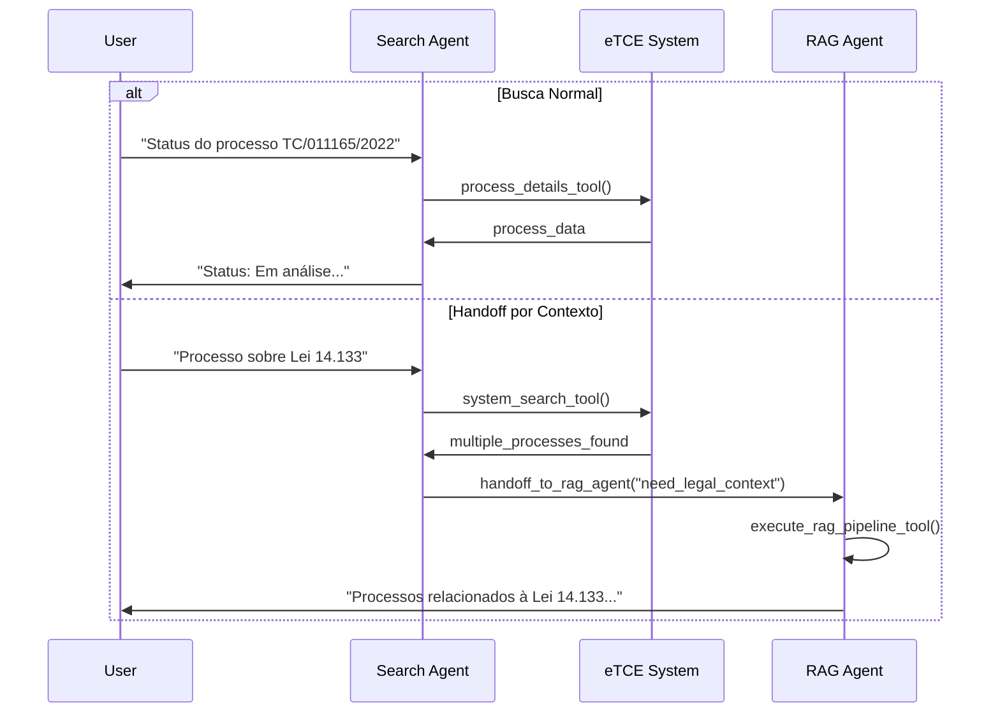
```mermaid
sequenceDiagram
    participant U as User
    participant S as Search Agent
    participant E as eTCE System
    participant R as RAG Agent
    
    alt Busca Normal
        U->>S: "Status do processo TC/011165/2022"
        S->>E: process_details_tool()
        E->>S: process_data
        S->>U: "Status: Em análise..."
    else Handoff por Contexto
        U->>S: "Processo sobre Lei 14.133"
        S->>E: system_search_tool()
        E->>S: multiple_processes_found
        S->>R: handoff_to_rag_agent("need_legal_context")
        R->>R: execute_rag_pipeline_tool()
        R->>U: "Processos relacionados à Lei 14.133..."
    end
```

### 5.4. Human-in-the-Loop Integration

#### 5.4.1. Trigger Conditions

##### **Ambiguous Queries**
```python
def requires_human_intervention(agent_name: str, query: str, confidence: float) -> bool:
    """Qualquer agente pode solicitar intervenção humana"""
    ambiguous_indicators = [
        "pode ser", "talvez", "não sei", "qual seria",
        "como devo", "o que fazer", "preciso de ajuda"
    ]
    
    return (
        confidence < 0.5 or
        any(indicator in query.lower() for indicator in ambiguous_indicators) or
        len(query.split()) < 3
    )
```

#### 5.4.2. Human Intervention Workflow

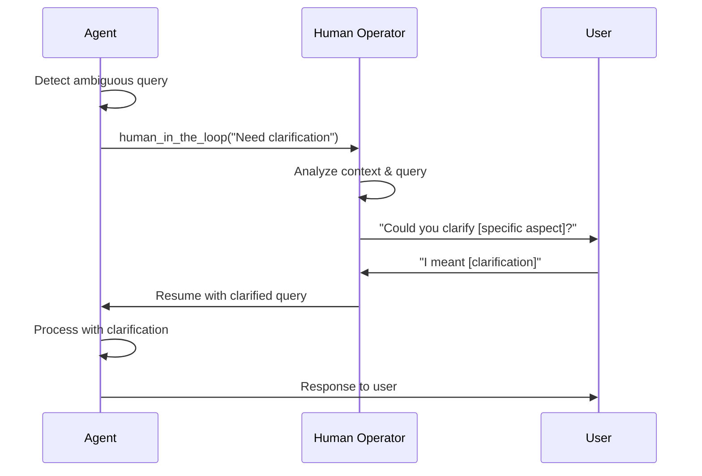
```mermaid
sequenceDiagram
    participant A as Agent
    participant H as Human Operator
    participant U as User
    
    A->>A: Detect ambiguous query
    A->>H: human_in_the_loop("Need clarification")
    H->>H: Analyze context & query
    H->>U: "Could you clarify [specific aspect]?"
    U->>H: "I meant [clarification]"
    H->>A: Resume with clarified query
    A->>A: Process with clarification
    A->>U: Response to user
```

### 5.5. Handoff Strategy

#### 5.5.1. Handoff Decision Logic

```python
def should_handoff(current_agent: str, query: str, capabilities: List[str]) -> bool:
    """Handoff baseado em capacidades necessárias"""
    
    # Current agent pode processar diretamente?
    if current_agent.can_handle_directly(query):
        return False
    
    # Precisa de capacidade específica de outro agente?
    required_capabilities = analyze_required_capabilities(query)
    return not all(cap in capabilities for cap in required_capabilities)
```

#### 5.5.2. Handoff Flow

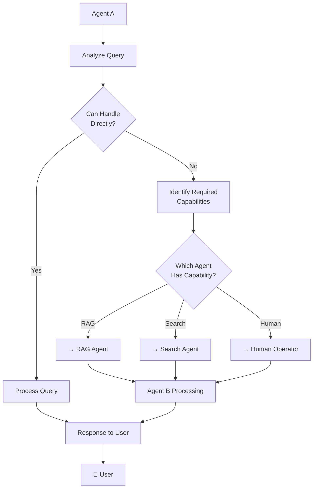
```mermaid
graph TD
    AGENT_A[Agent A] --> ANALYZE[Analyze Query]
    ANALYZE --> CAN_HANDLE{Can Handle<br/>Directly?}
    
    CAN_HANDLE -->|Yes| PROCESS[Process Query]
    CAN_HANDLE -->|No| NEED_HANDOFF[Identify Required<br/>Capabilities]
    
    NEED_HANDOFF --> HANDOFF_DECISION{Which Agent<br/>Has Capability?}
    
    HANDOFF_DECISION -->|RAG| HANDOFF_RAG[→ RAG Agent]
    HANDOFF_DECISION -->|Search| HANDOFF_SEARCH[→ Search Agent]
    HANDOFF_DECISION -->|Human| HANDOFF_HUMAN[→ Human Operator]
    
    HANDOFF_RAG --> AGENT_B[Agent B Processing]
    HANDOFF_SEARCH --> AGENT_B
    HANDOFF_HUMAN --> AGENT_B
    
    PROCESS --> RESPONSE[Response to User]
    AGENT_B --> RESPONSE
    
    RESPONSE --> USER[👤 User]
```

---

## 6. PROMPT TEMPLATING E HOOKS

### 6.1. Arquitetura de Templates

#### 6.1.1. Estrutura Hierárquica

```
prompts/
├── base_agent_prompt.jinja2          # Template base comum
├── fragments/                        # Componentes reutilizáveis
│   ├── alice.jinja2                 # Agente Alice (exemplo)
│   └── bob.jinja2                   # Agente Bob (exemplo)
└── tce_fragments/                   # Componentes TCE específicos
    ├── main_agent.jinja2            # Comportamento Main Agent
    ├── rag_agent.jinja2             # Comportamento RAG Agent
    └── search_agent.jinja2          # Comportamento Search Agent
```

#### 6.1.2. Template Base Structure

```jinja2
# CURRENT_DATETIME: {{ current_datetime }}

## 👤 Identity
You are {{ agent_identity }}.

## 🎯 Responsibilities

- {{ item }}


## 🧠 Behavior Rules
{{ dynamic_block }}

## 🛠️ Tools Available

- `{{ tool.name }}` → {{ tool.description }}



### Constraints:

- {{ c }}


```

### 6.2. Dynamic Block System

#### 6.2.1. Runtime Template Injection

```python
def build_agent_prompt(agent_config: AgentConfig) -> str:
    # 1. Load base template
    base_template = load_template("base_agent_prompt.jinja2")
    
    # 2. Load dynamic block
    dynamic_block = load_template(agent_config.dynamic_block_path)
    
    # 3. Render dynamic block with context
    rendered_block = dynamic_block.render(
        current_state=agent_config.current_state,
        system_config=agent_config.system_config
    )
    
    # 4. Inject into base template
    return base_template.render(
        agent_identity=agent_config.identity,
        responsibilities=agent_config.responsibilities,
        dynamic_block=rendered_block,
        tools=agent_config.tools,
        constraints=agent_config.constraints,
        current_datetime=datetime.now().isoformat()
    )
```

### 6.3. Template Versioning e Hooks

#### 6.3.1. Version Management

```python
@dataclass
class TemplateVersion:
    version: str
    path: str
    changelog: str
    compatibility: List[str]
    deprecated: bool = False

template_registry = {
    "main_agent": [
        TemplateVersion("1.0", "main_agent_v1.jinja2", "Initial version"),
        TemplateVersion("1.1", "main_agent_v1_1.jinja2", "Improved routing"),
        TemplateVersion("2.0", "main_agent_v2.jinja2", "Complete rewrite")
    ]
}
```

#### 6.3.2. Runtime Hooks

```python
def apply_template_hooks(template: str, context: Dict) -> str:
    # Pre-render hooks
    template = pre_render_hook(template, context)
    
    # Main rendering
    rendered = template.render(**context)
    
    # Post-render hooks
    rendered = post_render_hook(rendered, context)
    
    return rendered

def pre_render_hook(template: str, context: Dict) -> str:
    # Inject system-wide variables
    context["system_version"] = get_system_version()
    context["deployment_env"] = get_deployment_env()
    
    return template

def post_render_hook(rendered: str, context: Dict) -> str:
    # Apply security filters
    rendered = security_filter(rendered)
    
    # Add monitoring markers
    rendered = add_monitoring_markers(rendered)
    
    return rendered
```

---

## 7. PIPELINE RAG

### 7.1. Visão Geral do Pipeline

O Pipeline RAG é um sistema agentico de 11 nós que processa consultas sobre documentos oficiais com validação de qualidade e retry automático.

#### 7.1.1. Arquitetura do Pipeline

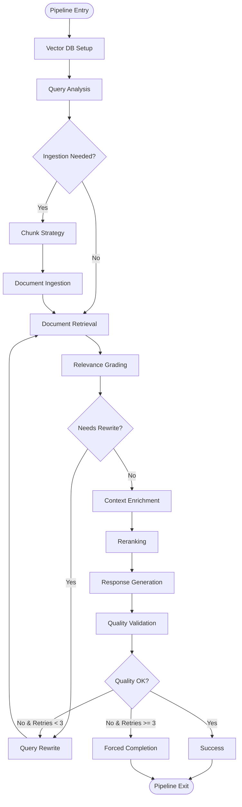
```mermaid
graph TD
    START([Pipeline Entry]) --> VDB[Vector DB Setup]
    VDB --> QA[Query Analysis]
    QA --> ING_CHECK{Ingestion Needed?}
    
    ING_CHECK -->|Yes| CS[Chunk Strategy]
    ING_CHECK -->|No| DR[Document Retrieval]
    
    CS --> DI[Document Ingestion]
    DI --> DR
    
    DR --> RG[Relevance Grading]
    RG --> RW_CHECK{Needs Rewrite?}
    
    RW_CHECK -->|Yes| QR[Query Rewrite]
    RW_CHECK -->|No| CE[Context Enrichment]
    
    QR --> DR
    
    CE --> RR[Reranking]
    RR --> RES[Response Generation]
    RES --> QV[Quality Validation]
    
    QV --> FINAL_CHECK{Quality OK?}
    
    FINAL_CHECK -->|Yes| SUCCESS[Success]
    FINAL_CHECK -->|No & Retries < 3| QR
    FINAL_CHECK -->|No & Retries >= 3| FORCED[Forced Completion]
    
    SUCCESS --> END([Pipeline Exit])
    FORCED --> END
```

### 7.2. Nós do Pipeline RAG

#### 7.2.1. Vector DB Setup Node

**Função**: Inicializar conexões e configurar collections
**Padrão**: Singleton + Factory

```python
def vector_db_setup_node(state: RAGState) -> RAGState:
    """
    Configura instâncias de vector database em memória
    """
    
    # Cache de instâncias para performance
    if state.vector_db_type not in state.vector_db_instances:
        db_instance = create_vector_db_instance(
            db_type=state.vector_db_type,
            embedding_model=state.embedding_model
        )
        
        state.vector_db_instances[state.vector_db_type] = {
            "instance": db_instance,
            "initialized_at": time.time(),
            "status": "active"
        }
    
    # Determinar collections baseadas no escopo
    collections = determine_collections(
        scope=state.document_scope,
        databases=state.target_databases,
        user_id=state.user_id,
        session_id=state.session_id
    )
    
    return state.copy(collection_names=collections)
```

#### 7.2.2. Query Analysis Node

**Função**: Classificar e processar queries
**Padrão**: Strategy Pattern

```python
def query_analysis_node(state: RAGState) -> RAGState:
    """
    Analisa query usando LLM structured output
    """
    
    analysis_prompt = f"""
    Analise a consulta e classifique conforme padrões TCE-PA:
    
    Query: "{state.original_query}"
    
    Determine:
    1. Tipo (legislation, acordao, resolucao, jurisprudencia)
    2. Complexidade (simple, medium, complex)
    3. Contexto temporal necessário
    4. Bases de dados relevantes
    5. Necessidade de ingestão
    """
    
    analysis = llm_structured_output(
        prompt=analysis_prompt,
        output_model=QueryAnalysisResult,
        context={"user_id": state.user_id}
    )
    
    return state.copy(
        processed_query=analysis.processed_query,
        query_type=analysis.query_type,
        query_complexity=analysis.query_complexity,
        target_databases=analysis.target_databases,
        temporal_context=analysis.temporal_context,
        ingestion_required=analysis.needs_ingestion
    )
```

#### 7.2.3. Document Ingestion Node

**Função**: Processar documentos (Docling → Chunking → Storage)
**Padrão**: Pipeline + Template Method

```python
def document_ingestion_node(state: RAGState) -> RAGState:
    """
    Processa ingestão completa de documentos
    """
    
    if not state.ingestion_required:
        return state
    
    for doc_info in state.documents_to_ingest:
        # Etapa 1: Document Reading & Parsing
        docling_result = docling_processor.process(
            file_path=doc_info["file_path"],
            doc_type=doc_info.get("type", "legislation")
        )
        
        # Etapa 2: Chunking Strategy Application
        chunks = chonkie_processor.chunk(
            content=docling_result.raw_markdown,
            strategy=state.selected_chunker,
            config=state.chunking_metadata
        )
        
        # Etapa 3: Vector Storage
        vector_db.store_chunks(
            chunks=chunks.chunks,
            collection=state.collection_names,
            metadata=enrich_metadata(doc_info, state)
        )
        
        # Etapa 4: Update State
        state.user_documents.append(doc_info["id"])
    
    return state.copy(ingestion_required=False)
```

#### 7.2.4. Document Retrieval Node

**Função**: Busca híbrida (semântica + keywords)
**Padrão**: Strategy + Composite

```python
def document_retrieval_node(state: RAGState) -> RAGState:
    """
    Executa retrieval híbrido com filtros de acesso
    """
    
    # Configurar filtros baseados no escopo
    filters = build_access_filters(state)
    
    all_chunks = []
    state.vector_db_queries = 0
    
    for collection in state.collection_names:
        # Busca semântica
        semantic_results = vector_db.semantic_search(
            query=state.processed_query,
            collection=collection,
            filters={**filters, "search_type": "semantic"}
        )
        
        # Busca por keywords
        keyword_results = vector_db.keyword_search(
            query=state.processed_query,
            collection=collection,
            filters={**filters, "search_type": "keyword"}
        )
        
        # Combinar resultados (70% semantic, 30% keyword)
        combined_results = combine_search_results(
            semantic_results,
            keyword_results,
            weights={"semantic": 0.7, "keyword": 0.3}
        )
        
        all_chunks.extend(combined_results)
        state.vector_db_queries += 2
    
    # Deduplicação e ranking final
    final_chunks = deduplicate_and_rank(all_chunks)
    
    return state.copy(
        retrieved_chunks=final_chunks,
        retrieval_time=time.time() - start_time
    )
```

#### 7.2.5. Response Generation Node

**Função**: Gerar resposta final com citações
**Padrão**: Template Method + Builder

```python
def response_generation_node(state: RAGState) -> RAGState:
    """
    Gera resposta final com contexto e citações
    """
    
    # Construir contexto consolidado
    context_builder = ContextBuilder()
    for chunk in state.reranked_chunks:
        context_builder.add_chunk(chunk)
    
    final_context = context_builder.build()
    
    # Gerar resposta com template institucional
    generation_prompt = f"""
    Como assistente especializado do TCE-PA, gere resposta formal:
    
    CONSULTA: {state.original_query}
    
    CONTEXTO:
    {final_context}
    
    DIRETRIZES:
    1. Linguagem formal e técnica
    2. Citar fontes específicas [fonte]
    3. Indicar vigência temporal
    4. Destacar especificidades TCE-PA
    5. Estruturar resposta claramente
    
    TEMPORAL: {state.temporal_context}
    TIPO: {state.query_type}
    """
    
    response = llm_generate(
        prompt=generation_prompt,
        context=final_context,
        constraints=get_institutional_constraints()
    )
    
    # Extrair citações
    citations = extract_citations(state.reranked_chunks)
    
    return state.copy(
        generated_response=response.text,
        citations=citations,
        final_context=final_context,
        quality_score=response.quality_score
    )
```

### 7.3. Conditional Edges e Decision Logic

#### 7.3.1. Ingestion Decision

```python
def needs_ingestion_decision(state: RAGState) -> str:
    """Decide se necessita ingestão de documentos"""
    return "ingestion" if state.ingestion_required else "continue"
```

#### 7.3.2. Quality Check Decision

```python
def quality_check_decision(state: RAGState) -> str:
    """Decide se qualidade está adequada"""
    if state.quality_score > 0.7:
        return "complete"
    elif state.retry_count < state.max_retries:
        return "retry"
    else:
        return "complete"  # Força conclusão
```

#### 7.3.3. Rewrite Decision

```python
def needs_rewrite_decision(state: RAGState) -> str:
    """Decide se necessita reescrita da query"""
    return "rewrite" if state.needs_rewrite else "continue"
```

### 7.4. Performance Optimization

#### 7.4.1. Caching Strategy

```python
class RAGPipelineCache:
    def __init__(self):
        self.vector_db_cache = {}
        self.query_analysis_cache = {}
        self.chunk_strategy_cache = {}
    
    def get_cached_analysis(self, query: str) -> Optional[QueryAnalysisResult]:
        cache_key = hashlib.md5(query.encode()).hexdigest()
        return self.query_analysis_cache.get(cache_key)
    
    def cache_analysis(self, query: str, result: QueryAnalysisResult):
        cache_key = hashlib.md5(query.encode()).hexdigest()
        self.query_analysis_cache[cache_key] = result
```

#### 7.4.2. Parallel Processing

```python
async def parallel_retrieval(state: RAGState) -> RAGState:
    """Execute retrieval em paralelo para múltiplas collections"""
    
    tasks = []
    for collection in state.collection_names:
        task = asyncio.create_task(
            retrieve_from_collection(state, collection)
        )
        tasks.append(task)
    
    results = await asyncio.gather(*tasks)
    combined_chunks = combine_parallel_results(results)
    
    return state.copy(retrieved_chunks=combined_chunks)
```

---

## 8. FLUXOS REAIS DE INTERAÇÃO

### 8.1. Cenário 1: Consulta sobre Legislação

#### 8.1.1. Fluxo Completo

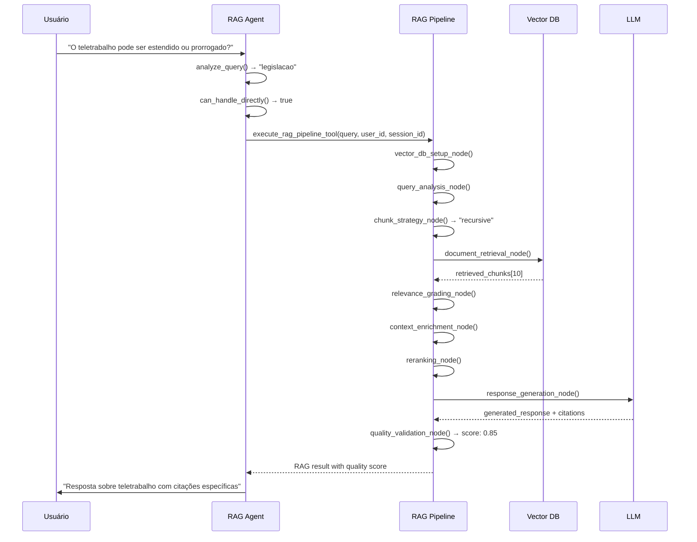
```mermaid
sequenceDiagram
    participant U as Usuário
    participant R as RAG Agent
    participant P as RAG Pipeline
    participant V as Vector DB
    participant L as LLM
    
    U->>R: "O teletrabalho pode ser estendido ou prorrogado?"
    
    R->>R: analyze_query() → "legislacao"
    R->>R: can_handle_directly() → true
    
    R->>P: execute_rag_pipeline_tool(query, user_id, session_id)
    
    P->>P: vector_db_setup_node()
    P->>P: query_analysis_node()
    P->>P: chunk_strategy_node() → "recursive"
    
    P->>V: document_retrieval_node()
    V-->>P: retrieved_chunks[10]
    
    P->>P: relevance_grading_node()
    P->>P: context_enrichment_node()
    P->>P: reranking_node()
    
    P->>L: response_generation_node()
    L-->>P: generated_response + citations
    
    P->>P: quality_validation_node() → score: 0.85
    
    P-->>R: RAG result with quality score
    
    R->>U: "Resposta sobre teletrabalho com citações específicas"
```

#### 8.1.2. Trace de Execução

```json
{
  "trace_id": "trace_123456",
  "entry_point": "RAG_Agent",
  "query": "O teletrabalho pode ser estendido ou prorrogado?",
  "classification": "legislacao",
  "handoff_used": false,
  "rag_pipeline": {
    "nodes_executed": [
      "vector_db_setup", "query_analysis", "chunk_strategy_selection",
      "document_retrieval", "relevance_grading", "context_enrichment",
      "reranking", "response_generation", "quality_validation"
    ],
    "chunk_strategy": "recursive",
    "chunks_processed": 10,
    "quality_score": 0.85,
    "processing_time": 4.2
  },
  "final_response": {
    "delivered_by": "RAG_Agent",
    "confidence": 0.85,
    "citations": 3,
    "sources": ["Lei 14.133/2021", "Resolução TCE-PA 19.272"],
    "response_time": "4.2s"
  }
}
```

### 8.2. Cenário 2: Consulta sobre Expediente

#### 8.2.1. Fluxo Completo

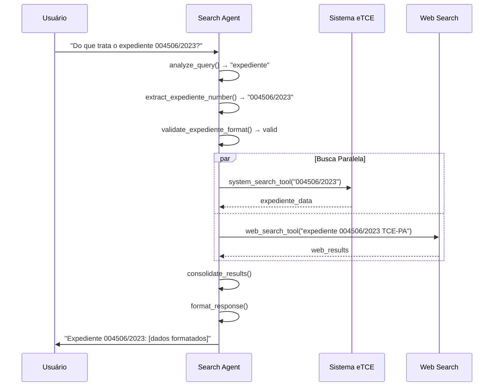
```mermaid
sequenceDiagram
    participant U as Usuário
    participant S as Search Agent
    participant E as Sistema eTCE
    participant W as Web Search
    
    U->>S: "Do que trata o expediente 004506/2023?"
    
    S->>S: analyze_query() → "expediente"
    S->>S: extract_expediente_number() → "004506/2023"
    S->>S: validate_expediente_format() → valid
    
    par Busca Paralela
        S->>E: system_search_tool("004506/2023")
        E-->>S: expediente_data
    and
        S->>W: web_search_tool("expediente 004506/2023 TCE-PA")
        W-->>S: web_results
    end
    
    S->>S: consolidate_results()
    S->>S: format_response()
    
    S->>U: "Expediente 004506/2023: [dados formatados]"
```

### 8.3. Cenário 3: Handoff por Necessidade

#### 8.3.1. Fluxo de Handoff Baseado em Capacidade

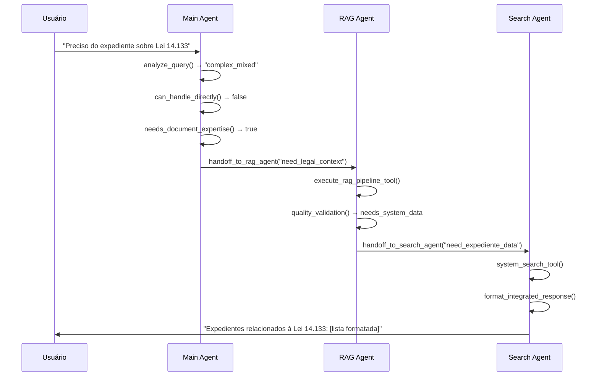
```mermaid
sequenceDiagram
    participant U as Usuário
    participant M as Main Agent
    participant R as RAG Agent
    participant S as Search Agent
    
    U->>M: "Preciso do expediente sobre Lei 14.133"
    
    M->>M: analyze_query() → "complex_mixed"
    M->>M: can_handle_directly() → false
    M->>M: needs_document_expertise() → true
    
    M->>R: handoff_to_rag_agent("need_legal_context")
    
    R->>R: execute_rag_pipeline_tool()
    R->>R: quality_validation() → needs_system_data
    
    R->>S: handoff_to_search_agent("need_expediente_data")
    
    S->>S: system_search_tool()
    S->>S: format_integrated_response()
    
    S->>U: "Expedientes relacionados à Lei 14.133: [lista formatada]"
```

### 8.4. Cenário 4: Human-in-the-Loop

#### 8.4.1. Fluxo de Intervenção Humana

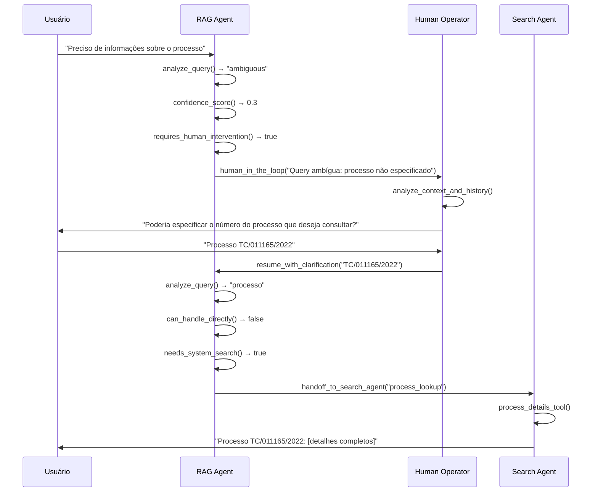
```mermaid
sequenceDiagram
    participant U as Usuário
    participant R as RAG Agent
    participant H as Human Operator
    participant S as Search Agent
    
    U->>R: "Preciso de informações sobre o processo"
    
    R->>R: analyze_query() → "ambiguous"
    R->>R: confidence_score() → 0.3
    R->>R: requires_human_intervention() → true
    
    R->>H: human_in_the_loop("Query ambígua: processo não especificado")
    
    H->>H: analyze_context_and_history()
    H->>U: "Poderia especificar o número do processo que deseja consultar?"
    
    U->>H: "Processo TC/011165/2022"
    
    H->>R: resume_with_clarification("TC/011165/2022")
    
    R->>R: analyze_query() → "processo"
    R->>R: can_handle_directly() → false
    R->>R: needs_system_search() → true
    
    R->>S: handoff_to_search_agent("process_lookup")
    
    S->>S: process_details_tool()
    
    S->>U: "Processo TC/011165/2022: [detalhes completos]"
```

---

**Documento gerado em:** Junho 2025  
**Versão:** 1.0  
**Última atualização:** 2024-12-15

---

*Este documento representa a arquitetura técnica completa do sistema Chat Contas TCE-PA, servindo como referência definitiva para desenvolvimento, manutenção e evolução do sistema multi-agente.*