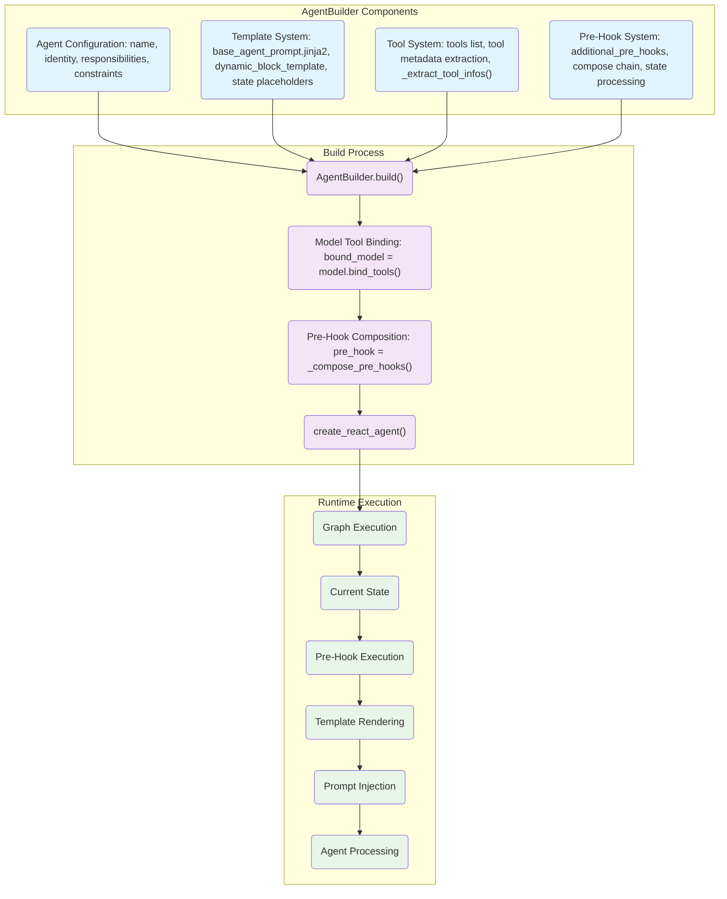
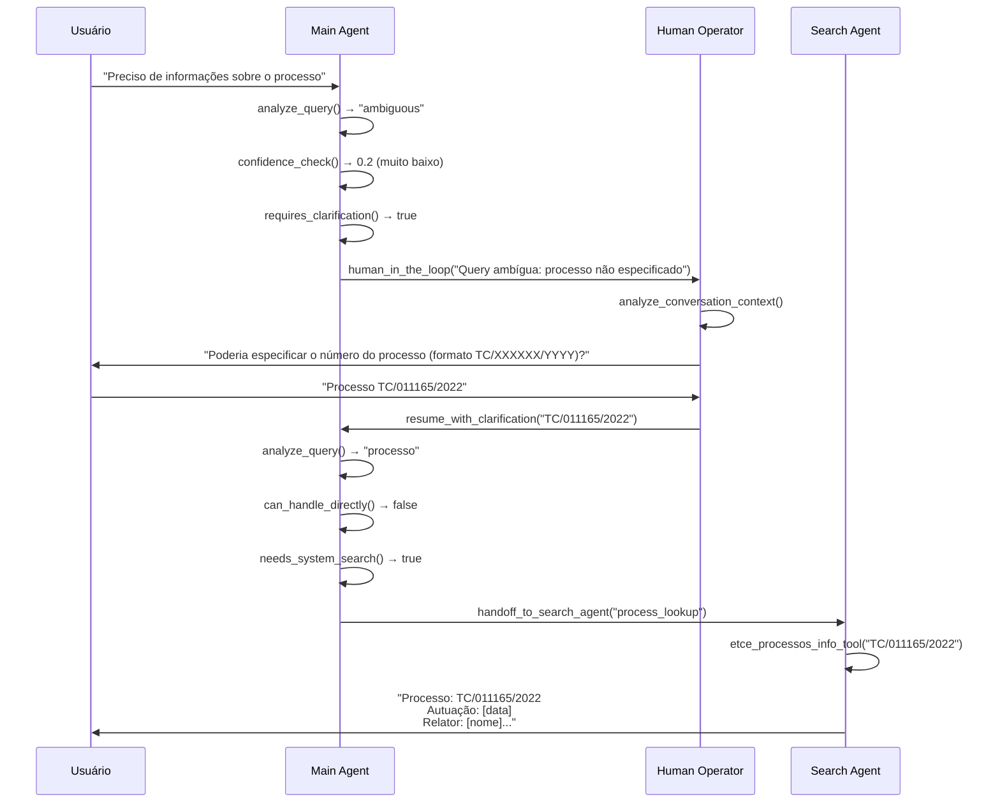

# ChatContas 2.0 | Arquitetura Multi-Agente com Pipeline RAG para Ingestão e Busca de Documentos Oficiais

**Versão:** 1.0  
**Data:** Junho/2025
**Projeto:** Chat Contas | TCE-PA


## 1. CONTEXTO E MOTIVAÇÃO

### 1.1. Desafios Institucionais do TCE-PA
    
O Tribunal de Contas do Estado do Pará trabalha com um volume considerável de consultas especializadas que apresentam características muito específicas do ambiente jurídico-administrativo. Atualmente, a arquitetura monolítica do ChatContas, embora funcional, apresenta limitações quando precisa lidar com a complexidade e variedade dessas consultas.

O tribunal processa diferentes tipos de demandas que requerem tratamento especializado:

- **Legislação**: Leis, decretos e resoluções normativas que demandam compreensão profunda do contexto jurídico
- **Acordãos**: Análise de decisões e jurisprudência com seus precedentes específicos  
- **Expedientes**: Processos administrativos e consultas estruturadas
- **Processos**: Acompanhamento de tramitação com integração direta ao sistema eTCE

A abordagem atual de **agente único** enfrenta dificuldades significativas nestes cenários. O sistema não consegue compreender adequadamente o **contexto jurídico especializado**, apresenta **limitações técnicas** no processamento de documentos estruturados do TCE-PA.


### 1.2. Necessidades Identificadas

A migração para uma **arquitetura multi-agente** busca resolver essas limitações através de **especialização funcional**. Os principais requisitos incluem:

**Funcionalidades Necessárias:**
- Processamento contextual dedicado para documentos oficiais
- Integração com multiplos sistemas auxiliares, como sistema eTCE (processos/expedientes)  
- Pipeline de validação de qualidade com retry automático
- Especialização por tipo de consulta distribuída entre agentes

**Aspectos Arquiteturais:**
- Escalabilidade para adição de novos agentes especializados
- Handoffs inteligentes baseados em necessidade específica (não obrigatórios)
- Estado distribuído que preserve contexto durante transferências  
- Structured output consistente para integração sistêmica

---

## 2. RESUMO EXECUTIVO DA SOLUÇÃO

A versão 2.0 do ChatContas TCE-PA representa uma **evolução significativa** da arquitetura atual. Migramos de um **sistema monolítico** baseado em agente único para uma **arquitetura multi-agente** implementada com **LangGraph**, especificamente desenhada para atender as complexidades operacionais do Tribunal de Contas do Estado do Pará. 

A nova abordagem organiza **três agentes especializados** em uma **arquitetura swarm**, onde cada componente possui **expertise específica** mas mantém **capacidade de resposta autônoma**. Esta estrutura elimina os **gargalos da arquitetura anterior** ao distribuir responsabilidades de forma inteligente, permitindo que cada agente trabalhe dentro de sua área de competência.

### 2.1. Características Fundamentais

O sistema implementa **coordenação distribuída** entre os três agentes especializados, onde cada um pode processar consultas de forma independente quando possui a **expertise necessária**. As principais inovações incluem:

**Arquitetura Distribuída:**
- Coordenação inteligente entre agentes especializados
- Autonomia de resposta sem necessidade de consolidação central
- Pipeline RAG redesenhado como agente dedicado

**Sistema de Handoffs Inteligente:**
- Transferência opcional baseada em necessidade específica
- Aproveitamento de expertise especializada quando necessário
- Handoffs bidirecionais que preservam contexto completo

**Processamento Avançado:**
- Integração Docling + Chonkie para documentos oficiais do tribunal
- Validação de qualidade com score mínimo definido
- Retry automático para garantir qualidade das respostas

### 2.2. Componentes da Arquitetura

A estrutura se organiza em torno de três agentes principais com responsabilidades bem definidas:

**Agentes Especializados:**
- **Main Agent**: Coordenador e ponto de entrada, responde consultas gerais e coordena handoffs
- **RAG Agent**: Pipeline completo para processamento de documentos oficiais, legislação e acordãos  
- **Search Agent**: Expertise em consultas ao sistema eTCE e busca web contextual

**Sistema de Handoffs:**
- **State Propagation**: Mantém contexto completo em transferências bidirecionais (Main ↔ Search)
- **Task-Specific**: Transferências direcionadas para expertise específica (Main → RAG)

**Ferramentas Especializadas:**
- `etce_processos_info_tool`: Consulta processos formato TC/XXXXXX/YYYY
- `etce_expedientes_info_tool`: Consulta expedientes formato EXP-YYYY-XXXXX  
- `web_search_tool`: Busca web focada em informações institucionais
- `human_in_the_loop`: Intervenção humana para casos ambíguos

Todas as ferramentas utilizam **contratos estruturados Pydantic** para output consistente. O sistema de templates implementa **base modular Jinja2** com **blocos dinâmicos por agente**, enquanto a gestão de estado utiliza hierarquia com **SwarmState** para coordenação geral, **RAGState** para pipeline especializado, e **SearchAgentState** para funcionalidades de busca.

### 2.3. Estratégia de Migração

A transição da **arquitetura monolítica** para **multi-agente** preserva toda **funcionalidade existente** enquanto adiciona **capacidades especializadas**:

**Preservação de Funcionalidades:**
- **Main Agent**: Mantém compatibilidade com consultas gerais que funcionam bem hoje
- **RAG Agent**: Encapsula e melhora processamento de documentos com limitações atuais
- **Search Agent**: Adiciona capacidades de integração eTCE antes limitadas

**Benefícios da Migração:**
- Migração incremental e controlada minimizando riscos operacionais
- Melhorias substanciais na qualidade e capacidade de resposta
- Adição de expertise especializada sem perda de funcionalidade atual

---

## 3. VISÃO GERAL DA ARQUITETURA MULTI-AGENTE

### 3.1. Fundamentos Conceituais

#### 3.1.1. O que é Arquitetura Multi-Agente?

**Arquitetura Multi-Agente** é um paradigma de design onde **múltiplos agentes autônomos especializados** colaboram para resolver **problemas complexos** que seriam difíceis ou ineficientes para um agente único processar. 

**Características Fundamentais:**
- **Autonomia**: Capacidade de operar independentemente
- **Especialização**: Foco em domínio específico de conhecimento/ferramentas
- **Colaboração**: Habilidade de transferir tarefas e compartilhar contexto
- **Responsividade**: Resposta direta ao usuário quando possui competência

#### 3.1.2. Por que Multi-Agente para o TCE-PA?

Considerando os **desafios institucionais identificados** na Seção 1, a arquitetura multi-agente resolve limitações específicas:

**Mapeamento Problema → Solução:**

| **Limitação Tradicional** | **Solução Multi-Agente** | **Agente Responsável** |
|---------------------------|--------------------------|----------------------|
| Contexto jurídico especializado | Pipeline RAG dedicado para documentos oficiais | **RAG Agent** |
| Integração sistema eTCE e Busca especializada| Tools específicas para processos/expedientes e Busca na Web| **Search Agent** |
| Coordenação de tarefas complexas | Roteamento inteligente e handoffs | **Main Agent** |
| Escalabilidade especializada | Adição modular de novos agentes | **Arquitetura Swarm** |

#### 3.1.3. Princípios de Design Aplicados

**Especialização Funcional:**
- Cada agente domina ferramentas e conhecimento específico
- Evita sobreposição de responsabilidades
- Otimiza performance por domínio

**Handoffs Opcionais:**
- Transferência baseada em necessidade, não obrigatória
- Agentes podem responder diretamente quando competentes
- Melhora eficiência evitando transferências desnecessárias

**Estado Distribuído:**
- Contexto da conversa preservado através das transferências
- Informações compartilhadas conforme necessidade
- Garante continuidade da experiência do usuário

**Autonomia Responsável:**
- Cada agente decide quando pode responder diretamente
- Transfere controle apenas quando detecta limitação própria
- Reduz latência e melhora experiência

### 3.2. Arquitetura de Alto Nível

Com os **fundamentos conceituais** estabelecidos, apresentamos a **visão geral da arquitetura** implementada para o ChatContas. O diagrama abaixo ilustra como os princípios multi-agente se materializam em componentes concretos que atendem especificamente às necessidades do TCE-PA:


**Componentes Principais Visualizados:**

- **Camada de Coordenação**: Router inteligente + Main Agent para gerenciar fluxo
- **Agentes Especializados**: RAG (documentos) + Search (sistemas) com domínios distintos
- **Pipeline RAG**: Processamento completo com validação de qualidade
- **Tools Implementadas**: 4 ferramentas especializadas com structured output
- **Handoffs Opcionais**: Transferência bidirecional baseada em necessidade
- **Sistemas Externos**: Integração nativa eTCE, Vector DB e Web

As seções seguintes detalham a **implementação técnica** destes componentes e como eles colaboram para resolver consultas complexas do TCE-PA.

### 3.3. Princípios da Arquitetura Swarm

A implementação **swarm** no ChatContas segue princípios específicos que diferenciam esta arquitetura de abordagens tradicionais multi-agente. Os códigos abaixo mostram como estes princípios se materializam na implementação real:

#### **Agentes**
Cada agente possui **autonomia total** e pode responder diretamente ao usuário:

```python
# Código real do graph.py
workflow = (
    StateGraph(
        state_schema=SwarmState,
        input_schema=ChatContasInputState, 
        output_schema=ChatContasStateOutput,
        config_schema=ChatContasConfiguration,
    )
    .add_node(
        main_agent,
        destinations=("RAG_Agent", "Search_Agent"),
        metadata={"agent_type": "coordinator", "tags": ["autonomous"]},
    )
    .add_node(
        rag_agent,  # É um pipeline completo, não agente conversacional
        destinations=("Main_Agent", "Search_Agent"),
        metadata={"agent_type": "pipeline", "tags": ["autonomous"]},
    )
    .add_node(
        search_agent,
        destinations=("Main_Agent", "RAG_Agent"),
        metadata={"agent_type": "specialist", "tags": ["autonomous"]},
    )
)
```

#### **Handoffs**
```python
# Handoffs baseados em necessidade específica
main_agent_handoff = create_handoff_tool_with_state_propagation(
    agent_name="Main_Agent",
    description="Use this to handoff to the main agent for complex coordination or general institutional queries"
)

rag_agent_handoff = create_handoff_tool_with_task(
    agent_name="RAG_Agent", 
    description="Use this to handoff to the RAG agent for institutional document retrieval and analysis"
)
```

### 3.4. Routing Inteligente

O **routing** no ChatContas determina qual agente processa inicialmente a consulta do usuário. Utilizamos o **Main Agent como padrão**, que pode responder diretamente ou fazer handoff conforme necessário:

```python
# Active Agent Router com default
workflow = add_active_agent_router(
    builder=workflow,
    route_to=["Main_Agent", "RAG_Agent", "Search_Agent"],
    default_active_agent="Main_Agent",
)
```

---

## 4. DIRETRIZES DE ENGENHARIA APLICADAS

### 4.1. Fundamentos das Engenharias Aplicadas

Com a **arquitetura multi-agente estabelecida** na Seção 3, precisamos agora compreender **como** cada aspecto desta arquitetura é implementado na prática. O ChatContas aplica **5 diretrizes de engenharia especializadas** que garantem coesão, performance e maintainability do sistema:

#### 4.1.1. Visão Geral das 5 Engenharias

**Por que Múltiplas Engenharias?**

Sistemas multi-agente requerem **decomposição especializada** porque diferentes aspectos da arquitetura têm naturezas e requisitos fundamentalmente distintos. Cada engenharia atua como uma **camada de abstração** que resolve preocupações específicas:

**Flow de Construção das Engenharias:**

1. **State** → Define **o que** precisa ser mantido e compartilhado
2. **Flow** → Define **como** as execuções coordenam e progridem  
3. **Prompt** → Define **por que** cada agente se comporta de forma específica
4. **Tooling** → Define **onde** buscar informações além do conhecimento base
5. **Handoff** → Define **quando** transferir controle entre especializações

**Fundamentação Teórica:**

Cada uma dessas questões fundamentais (o que, como, por que, onde, quando) representa um domínio de conhecimento arquitetural distinto que requer abordagens, ferramentas e padrões específicos. Esta decomposição segue princípios de engenharia de software onde complexidade é gerenciada através de abstrações especializadas.

A tabela abaixo demonstra como estas questões se materializam em preocupações arquiteturais concretas e os benefícios sistêmicos resultantes:

| **Engenharia** | **Preocupação Arquitetural** | **Benefício Sistêmico** |
|----------------|------------------------------|------------------------|
| **State** | Consistência de dados distribuídos | Coerência entre especializações |
| **Flow** | Coordenação temporal de execuções | Robustez e recuperação automática |
| **Prompt** | Comportamentos contextuais especializados | Qualidade e consistência de output |
| **Tooling** | Expansão de capacidades além do core | Integração com sistemas externos |
| **Handoff** | Otimização de transferência de controle | Eficiência e expertise adequada |

#### 4.1.2. Integração entre as Engenharias

As **cinco engenharias** operam como um **sistema integrado** onde cada uma fornece fundações para as outras:

**Dependências Arquiteturais:**
- **State** ← **Flow**: Flows lêem/modificam state conforme progressão
- **Flow** ← **Prompt**: Diferentes prompts geram diferentes paths de execução  
- **Prompt** ← **Tooling**: Tools disponíveis influenciam instruções comportamentais
- **Tooling** ← **Handoff**: Handoffs transferem tanto state quanto tool context
- **Handoff** ← **State**: Decisões de transferência baseadas em state analysis

**Fluxo Integrado Típico:**
1. **State**: Request inicial e contexto armazenados em estrutura compartilhada
2. **Flow**: Sistema determina sequência de processamento e conditional paths
3. **Prompt**: Instruções específicas carregadas conforme agente/contexto
4. **Tooling**: Capacidades externas executadas com outputs estruturados
5. **Handoff**: Controle transferido quando expertise específica necessária

#### 4.1.3. Benefícios da Abordagem Estruturada

Esta decomposição em engenharias especializadas oferece vantagens arquiteturais significativas:

**Vantagens Principais:**
- **Separation of Concerns**: Cada engenharia resolve preocupações distintas e bem definidas
- **Modularidade**: Componentes podem evoluir independentemente sem afetar outros
- **Debuggability**: Problemas isoláveis por domínio específico (state vs flow vs prompt)
- **Reusabilidade**: Padrões estabelecidos aplicáveis a novos agentes especializados
- **Composição**: Engenharias combinam de forma emergente para capabilities complexas

A **filosofia de design** segue o princípio de que **arquiteturas robustas** emergem de **abstrações bem definidas** que colaboram em vez de competir por responsabilidades. As seções seguintes detalham a **implementação técnica** de cada engenharia, demonstrando como os conceitos universais se materializam em implementações concretas.

---

### 4.2. ENGENHARIA DE ESTADO (State Engineering)

**State Engineering** em sistemas multi-agente refere-se ao **design e gestão do estado compartilhado** entre diferentes agentes autônomos. No ChatContas, esta engenharia garante que informações críticas sejam mantidas, transferidas e atualizadas corretamente durante handoffs entre agentes.

#### 4.2.1. Por que Estado é Crítico?

Em **sistemas multi-agente**, o **gerenciamento de estado** apresenta **desafios únicos** que não existem em **arquiteturas monolíticas**:

**Desafios Específicos:**
- **Contexto Preservado**: Conversas não podem "esquecer" informações anteriores ( estruturadas e não-estruturadas)
- **Estado Distribuído**: Diferentes agentes precisam acessar dados relevantes
- **Performance**: Estado deve ser eficiente para transferências frequentes
- **Consistency**: Dados sempre atualizados e sincronizados

#### 4.2.2. Hierarquia de Estados


#### 4.2.3. Estado SwarmState - Base do Sistema

| Campo | Propósito | Setado Em | Usado Em | Exemplo |
|-------|-----------|-----------|----------|---------|
| `messages` | Histórico da conversa | Todos os agentes | Contexto conversacional | `[HumanMessage("query")]` |
| `active_agent` | Agente atualmente ativo | Active Router | Coordenação swarm | `"Main_Agent"` |
| `user_id` | Identificação do usuário | Configuração inicial | Controle de acesso | `"usr_12345"` |
| `session_id` | Sessão específica | Configuração inicial | Isolamento temporal | `"sess_67890"` |

#### 4.2.4. Estado RAGState - Pipeline Especializado

##### **Query Processing**
| Campo | Propósito | Setado Em | Usado Em | Exemplo |
|-------|-----------|-----------|----------|---------|
| `original_query` | Query preservada | query_analysis_node | Auditoria/comparação | `"Qual lei sobre teletrabalho?"` |
| `processed_query` | Query otimizada | query_analysis_node | document_retrieval_node | `"teletrabalho Lei 14.133"` |
| `query_type` | Classificação | query_analysis_node | chunk_strategy_node | `"legislation"` |
| `query_complexity` | Nível complexidade | query_analysis_node | Pipeline routing | `"medium"` |

##### **Retrieval Results**
| Campo | Propósito | Setado Em | Usado Em | Exemplo |
|-------|-----------|-----------|----------|---------|
| `retrieved_chunks` | Chunks encontrados | document_retrieval_node | relevance_grading_node | `List[ChunkResult]` |
| `graded_chunks` | Chunks avaliados | relevance_grading_node | context_enrichment_node | `List[GradedChunk]` |
| `reranked_chunks` | Chunks reordenados | reranking_node | response_generation_node | `List[RerankedChunk]` |

##### **Workflow Control**
| Campo | Propósito | Setado Em | Usado Em | Exemplo |
|-------|-----------|-----------|----------|---------|
| `needs_rewrite` | Flag reescrita query | relevance_grading_node | Conditional edges | `True/False` |
| `retry_count` | Contador tentativas | query_rewrite_node | quality_check_decision | `2` |
| `max_retries` | Limite tentativas | Inicialização | quality_check_decision | `3` |
| `quality_score` | Score qualidade | quality_validation_node | Decisões retry | `0.85` |

#### 4.2.5. Fluxo de Transição de Estados

**Transição de Estado** em sistemas multi-agente refere-se à **transformação controlada dos dados compartilhados** quando o controle de execução é transferido entre agentes especializados. Esta transição é fundamental para manter **consistência**, **contexto**, e **dados especializados** durante handoffs.

##### **Tipos de Transição Implementados**

**State Propagation (Main ↔ Search):**
- **SwarmState mantido intacto** durante transferência
- **Contexto completo preservado** (messages, active_agent)
- **SearchAgentState fields adicionados** conforme processamento

**Task-Specific Conversion (Main → RAG):**
- **SwarmState convertido para RAGState** para processamento especializado
- **Pipeline sequencial** com 50+ campos específicos de RAG
- **Reconversão para SwarmState** ao final com AIMessage integrada

##### **Mecânica de Transição Ilustrada**


##### **Detalhamento Técnico das Transições**

**Path 1: Main → RAG (Task-Specific Conversion)**
1. **Input**: SwarmState com `query` e `active_agent="Main_Agent"`
2. **Conversion**: Sistema cria novo RAGState com campos especializados
3. **Pipeline**: RAG executa 11 nós sequenciais (setup → retrieval → generation → validation)
4. **Output**: RAGState convertido de volta para SwarmState + AIMessage final
5. **Result**: UI recebe resposta direta sem retornar ao Main Agent

**Path 2: Main → Search (State Propagation)**
1. **Input**: SwarmState preservado com contexto completo
2. **Enhancement**: SearchAgentState fields adicionados (etce_responses, web_results)
3. **Processing**: Tools específicas executadas com structured output
4. **Update**: SwarmState enriquecido com dados de sistema/web
5. **Result**: UI recebe SwarmState atualizado com informações integradas

**Características Críticas:**
- **No Return Path**: Agentes respondem diretamente, evitando round-trips desnecessários
- **Specialized Context**: Cada agente acessa exatamente os dados que precisa
- **State Consistency**: Transformações garantem que nenhuma informação crítica seja perdida
- **Performance**: Conversões otimizadas para minimizar overhead de transferência

### 4.3. ENGENHARIA DE FLUXO (Flow Engineering)

**Flow Engineering** define **como as execuções fluem** através dos agentes e componentes do sistema. No ChatContas, esta engenharia é fundamental para coordenar **execuções sequenciais complexas**, **retry logic**, e **conditional branching** que garantem robustez e performance.

#### 4.3.1. Por que Fluxos Estruturados?

**Necessidades Específicas:**
- **Coordenação Multi-Agente**: Múltiplos agentes precisam trabalhar de forma orquestrada
- **Retry Logic**: Falhas devem ser tratadas com tentativas automáticas
- **Conditional Paths**: Diferentes tipos de query seguem caminhos específicos
- **Performance**: Evitar execuções desnecessárias e otimizar tempo de resposta

#### 4.3.2. Fluxo Principal - Arquitetura Swarm

O **Fluxo Principal** representa a **orchestração de alto nível** do sistema multi-agente, definindo como as requisições do usuário são **roteadas**, **processadas** e **respondidas** pelos diferentes agentes especializados.

##### **Características do Fluxo Principal:**

**Entrada Única, Múltiplos Caminhos:**
- **Active Agent Router** determina ponto de entrada (padrão: Main Agent)
- **Autonomous Response**: Cada agente pode responder diretamente ao usuário
- **Optional Handoffs**: Transferência baseada em análise de necessidade

**Padrões de Execução:**
- **Direct Response**: Agente processa e responde imediatamente
- **Handoff Response**: Agente transfere para especialização e especialista responde
- **No Return Loops**: Evita ping-pong desnecessário entre agentes

##### **Fluxo Orchestrado Ilustrado:**


##### **Detalhamento Técnico dos Caminhos:**

**Caminho 1: Entry via Router**
- **Default Route** → Main Agent (coordenação geral)
- **Direct Route** → RAG/Search Agent (quando expertise específica conhecida)

**Caminho 2: Main Agent Decision Points**
- **Direct Response**: Query geral institucional → Main responde imediatamente
- **RAG Handoff**: Legislação/acordão detectado → Transfere para expertise documental
- **Search Handoff**: Expediente/processo detectado → Transfere para expertise sistêmica

**Caminho 3: Specialized Processing**
- **RAG Pipeline**: Execução sequencial completa (11 nós) → Response direta
- **Search Tools**: Execução paralela de tools eTCE/web → Response estruturada

**Características de Performance:**
- **No Return Overhead**: Especialistas respondem diretamente ao usuário
- **Smart Routing**: Decisões baseadas em análise de conteúdo, não configuração estática
- **Parallel Capability**: RAG e Search podem operar simultaneamente quando necessário

#### 4.3.3. Fluxo Detalhado - Pipeline RAG

O **Pipeline RAG** representa um **grafo de execução sequencial especializado** para processamento de documentos oficiais. Diferente do fluxo swarm (que é de coordenação), este pipeline implementa **processamento determinístico** com **retry automático** e **conditional branching** para garantir qualidade das respostas documentais.

##### **Arquitetura do Pipeline:**

**Execução Sequencial com Branches:**
- **11 nós principais** conectados por conditional edges
- **3 pontos de decisão** que determinam caminhos alternativos
- **Retry logic** integrada com limite máximo de tentativas

**Padrões de Controle:**
- **Setup Phase**: Preparação de recursos (Vector DB, análise)
- **Conditional Ingestion**: Ingestão apenas quando necessária
- **Retrieval & Grading**: Busca híbrida + avaliação de relevância
- **Quality Loops**: Retry automático até qualidade adequada ou limite

##### **Pipeline Sequencial Ilustrado:** 


##### **Detalhamento Técnico dos Nós:**

**Setup Phase (Nós 1-3):**
- **Vector DB Setup**: Inicialização de conexões e collections vetoriais
- **Query Analysis**: Classificação de query e otimização para busca
- **Ingestion Check**: Decisão condicional baseada em `ingestion_required` flag

**Processing Phase (Nós 4-7):**
- **Chunk Strategy**: Seleção de estratégia de chunking (Chonkie/traditional)
- **Document Ingestion**: Pipeline Docling → Chunking → Vector Storage
- **Document Retrieval**: Busca híbrida (semântica + keyword) no vector database
- **Relevance Grading**: Avaliação de relevância dos chunks retrieved

**Quality Control Phase (Nós 8-13):**
- **Query Rewrite Loop**: Otimização iterativa da query quando relevância baixa
- **Context Enrichment**: Enriquecimento de contexto com metadata adicional
- **Reranking**: Reordenação multi-critério dos chunks mais relevantes
- **Response Generation**: Geração de resposta com citações estruturadas
- **Quality Validation**: Score mínimo 0.7 com retry automático até limite

**Características de Robustez:**
- **Conditional Branching**: 3 pontos de decisão que adaptam o fluxo conforme necessidade
- **Automatic Retry**: Retry logic para quality score < 0.7 até máximo de tentativas
- **Graceful Degradation**: Sistema prossegue mesmo com qualidade subótima após max retries
- **State Progression**: Cada nó enriquece o RAGState com informações específicas

#### 4.3.4. Conditional Edges - Lógica de Decisão

**Conditional Edges** são **rotas condicionais em grafos** que determinam dinamicamente o próximo nó de execução baseado no **estado atual** e **lógica de decisão específica**. Diferente de edges estáticos (que sempre conectam os mesmos nós), conditional edges implementam **branching inteligente** que adapta o fluxo conforme necessidades em tempo de execução.

##### **Por que Conditional Edges são Fundamentais?**

**Tomada de Decisão Dinâmica:**
- **Adaptação ao Contexto**: Fluxo muda baseado em dados específicos (qualidade, flags, contadores)
- **Otimização de Performance**: Evita execução desnecessária (ex: pular ingestão se dados já existem)
- **Robustez**: Permite retry logic e graceful degradation em falhas
- **Inteligência**: Sistema "decide" o melhor caminho baseado em análise do estado

**Tipos de Rotas Condicionais no Pipeline:**

1. **Conditional Ingestion**: `ingestion_required` → Ingere documentos apenas se necessário
2. **Quality-based Retry**: `quality_score` → Retry até atingir threshold ou limite máximo  
3. **Query Optimization**: `needs_rewrite` → Reformula query quando relevância inadequada

##### **Mecânica de Funcionamento:**

Cada conditional edge executa uma **função de decisão** que:
- **Analisa** o estado atual (RAGState fields)
- **Aplica** lógica específica do domínio  
- **Retorna** string identificando próximo nó
- **Direciona** execução para path apropriado

##### **Implementação das Funções de Decisão:**

```python
# Implementação real dos conditional edges
def needs_ingestion_decision(state: RAGState) -> str:
    """Decide se necessita ingestão de documentos"""
    return "ingestion" if state.ingestion_required else "continue"

def needs_rewrite_decision(state: RAGState) -> str:
    """Decide se necessita reescrita da query"""
    return "rewrite" if state.needs_rewrite else "continue"

def quality_check_decision(state: RAGState) -> str:
    """Decide se qualidade está adequada ou precisa retry"""
    if state.quality_score > 0.7:
        return "prepare"
    elif state.retry_count < state.max_retries:
        return "retry"
    else:
        return "prepare"
```

##### **Características Técnicas dos Conditional Edges:**

**Padrões de Decisão Implementados:**

- **Binary Choice** (`needs_ingestion_decision`): Simples true/false baseado em flag booleana
- **Threshold-based** (`quality_check_decision`): Comparação numérica com limite definido (0.7)
- **Counter-based** (`quality_check_decision`): Lógica de retry com limite máximo de tentativas  
- **Graceful Fallback**: Sempre retorna valor válido, mesmo em edge cases

**Implicações no Fluxo do Grafo:**

- **Dynamic Branching**: Mesmo input inicial pode seguir paths completamente diferentes
- **State-Driven**: Decisões baseadas em estado acumulado, não configuração estática  
- **Idempotency**: Funções determinísticas - mesmo estado sempre produz mesma decisão
- **Performance**: Elimina nós desnecessários, otimizando tempo total de execução

**Vantagens Arquiteturais:**

- **Maintainability**: Lógica de decisão centralizada em funções específicas
- **Testability**: Cada função de decisão testável independentemente  
- **Flexibility**: Novos conditional edges podem ser adicionados sem reestruturação
- **Debuggability**: Estado e decisão rastreáveis para análise de comportamento

### 4.4. ENGENHARIA DE PROMPT/CONTEXTO (Prompt Engineering)

**Prompt Engineering** no ChatContas implementa uma abordagem inovadora de **Dynamic Prompt Generation** onde prompts são **construídos dinamicamente** baseados no **estado atual do workflow**. Esta técnica resolve limitações fundamentais de prompts estáticos e garante que cada agente receba contexto **precisamente adaptado** à situação específica da execução.

#### 4.4.1. O Problema dos Prompts Estáticos

**Limitações Tradicionais:**
- **Contexto Fixo**: Prompts não se adaptam ao estado atual do sistema
- **Informação Desatualizada**: Instruções podem estar fora de contexto para situação específica
- **One-Size-Fits-All**: Mesmo prompt para diferentes cenários de execução
- **Alucinações**: Falta de contexto específico pode gerar respostas inadequadas

#### 4.4.2. Solução: Dynamic Prompt Generation via Pre-hooks

**Abordagem Inovadora:**

O ChatContas utiliza **pre-hooks** no `create_react_agent` que **interceptam a execução** antes do agente processar e **reconstroem dinamicamente** o system prompt baseado no **state atual do grafo**. Esta técnica garante que cada agente sempre receba contexto **perfeitamente alinhado** com o estado corrente do workflow.

**Componentes da Arquitetura:**

1. **Template Base** (`base_agent_prompt.jinja2`): Estrutura fixa com placeholders dinâmicos
2. **State Extractor**: Pre-hook que extrai dados relevantes do estado atual
3. **Dynamic Renderer**: Engine Jinja2 que popula template com dados do state
4. **Context Injection**: System prompt final injetado antes da execução do agente

##### **Template Base Structure:**

```jinja2
# CURRENT_DATETIME: {{ current_datetime }}

## Identity
You are {{ agent_identity }}.

## Responsibilities

- {{ item }}


## Behavior Rules
{{ dynamic_block }}

## Tools Available

- `{{ tool.name }}` → {{ tool.description }}



### Constraints:

- {{ c }}


```

#### 4.4.4. Fluxo de Dynamic Prompt Generation

##### **Mecânica de Funcionamento:**


**Core Implementation - Pre-Hook & Render:**

```python
def _compose_pre_hooks(self) -> RunnableLambda:
    def composed_hook_fn(state: dict) -> dict:
        current_state = state.copy()
        
        # Apply additional hooks (classify_query, etc.)
        for hook in self.additional_pre_hooks:
            hook_result = hook.invoke(current_state)
            current_state.update(hook_result)
        
        # Render dynamic prompt from template + state
        rendered_prompt = self._render_prompt(current_state)
        
        # Inject as llm_input_messages
        current_state["llm_input_messages"] = [
            SystemMessage(content=rendered_prompt)
        ] + current_state.get("messages", [])
        
        return current_state
    
    return RunnableLambda(composed_hook_fn)

def _render_prompt(self, state: dict) -> str:
    # Load base template + dynamic block template
    prompt_template = Template(open(self.prompt_template_path).read())
    dynamic_block = Template(open(self.dynamic_block_template_path).read()).render(**state) if self.dynamic_block_template_path else ""
    
    # Populate with agent config + runtime state
    return prompt_template.render(
        current_datetime=datetime.utcnow().isoformat(),
        agent_identity=self.agent_identity,
        responsibilities=self.responsibilities,
        tools=self._extract_tool_infos(),
        dynamic_block=dynamic_block,
        **state  # Runtime state injection
    )
```

#### 4.4.6. Arquitetura do AgentBuilder - Implementação Completa

##### **Fluxo de Construção do Agente:**



##### **Create React Agent - Setup Final:**

```python
# AgentBuilder.build() - Consolidação Final
def build(self) -> CompiledStateGraph:
    # 1. Bind tools to model
    bound_model = self.model.bind_tools(
        self.tools,
        parallel_tool_calls=False,
    )
    
    # 2. Compose pre-hooks with dynamic prompt generation
    pre_hook = self._compose_pre_hooks()
    
    # 3. Create final ReAct agent with all components
    return create_react_agent(
        model=bound_model,              # Model + tools
        tools=self.tools,               # Tool implementations  
        pre_model_hook=pre_hook,        # Dynamic prompt injection
        name=self.name,                 # Agent identifier
        state_schema=self.state_schema, # State structure
        response_format=self.response_format,
        checkpointer=MemorySaver(),     # State persistence
         )
```

##### **Características Inovadoras da Implementação:**

**Dynamic Configuration Assembly:**
- **Components → Build Process**: Configuração, templates, tools e hooks se consolidam no `build()`
- **Runtime Integration**: Pre-hooks executam automaticamente a cada ativação do agente
- **State-driven Adaptation**: Template renderizado dinamicamente baseado no estado corrente

**Vantagens Arquiteturais:**
- **Separation of Concerns**: Configuração, rendering e execução bem separados
- **Reusability**: Mesmo AgentBuilder cria diferentes tipos de agentes especializados
- **Maintainability**: Template base facilita updates globais de comportamento
- **Testability**: Pre-hooks e rendering testáveis independentemente

**Resultado Final:**
Todo agente construído via **AgentBuilder** recebe automaticamente:
- **System prompt adaptativo** que reflete estado atual do workflow
- **Context awareness** temporal e situacional
- **Tool integration** dinâmica baseada em capacidades disponíveis
- **Consistent behavior** seguindo padrões estabelecidos do template base


### 4.5. ENGENHARIA DE TOOLING

**Tooling Engineering** refere-se ao **design e implementação de ferramentas especializadas** que permitem aos agentes interagir com sistemas externos, obter informações específicas, e executar ações que expandem suas capacidades além do conhecimento pré-treinado.

#### 4.5.1. Por que Tools Especializadas?

**Limitações dos LLMs Base:**
- **Dados Dinâmicos**: Informações em tempo real (processos, expedientes)
- **Sistemas Proprietários**: Integração com eTCE institucional
- **Structured Output**: Respostas padronizadas para integração sistêmica
- **Human-in-the-Loop**: Intervenção humana para casos ambíguos

**Padrão Implementado**: Todas as tools seguem **Command Pattern** com Pydantic para structured output.

#### 4.5.2. Inventário Completo de Tools

##### **Tools Implementadas**

| Tool | Agente | Assinatura | Objetivo | Response Model |
|------|--------|------------|----------|----------------|
| `human_in_the_loop` | Main, RAG, Search | `question_to_user: str` | Intervenção humana estratégica | `str` |
| `etce_processos_info_tool` | Search | `numero_processo: str` | Consulta dados processo TCE-PA | `EtceProcessoResponse` |
| `etce_expedientes_info_tool` | Search | `numero_expediente: str` | Consulta dados expediente TCE-PA | `EtceExpedienteResponse` |
| `web_search_tool` | Search | `query: str, context: str` | Busca web institucional | `WebSearchResponse` |


#### 4.5.3. Command Pattern no LangGraph: Mecanismo para atualizaçao do estado do workflow

No LangGraph, tools implementam **Command Pattern** onde cada tool execution pode **disparar ações** e **atualizar states** de forma controlada. Este mecanismo permite que tools não apenas retornem dados, mas **modifiquem o estado** tanto do agente chamador quanto do **parent state** (no caso de handoffs).

##### **Mecânica de State Updates:**


##### **Implementação do Padrão Command**

O **ChatContas** implementa o padrão Command através de uma arquitetura onde cada ferramenta atua como um **comando encapsulado** que pode tanto executar ações específicas quanto **modificar o estado do sistema** de forma controlada. Esta abordagem resolve o desafio fundamental de sistemas multi-agente onde **múltiplas especializações** precisam atualizar **estados compartilhados** sem criar inconsistências.

A estrutura fundamental do padrão organiza-se em torno de **quatro componentes principais**: a **interface de comando** define a assinatura da ferramenta com seus parâmetros de entrada; o **comando concreto** representa a implementação específica de cada tool; o **receptor** corresponde ao objeto de estado que será modificado; e o **invocador** é o agente que executa a chamada da ferramenta.

**Fluxo de Execução Integrado:**

O fluxo de execução segue uma sequência bem definida onde o **agente analisa o contexto** e decide qual ferramenta chamar baseado na necessidade específica. O **LangGraph então despacha** a chamada da ferramenta com os parâmetros apropriados, permitindo que a tool **acesse tanto o estado local** quanto o estado pai conforme necessário. A ferramenta **executa sua ação específica** (consulta ao eTCE, busca web, handoff) e **modifica o estado** de acordo com o tipo de atualização requerida. Finalmente, a tool **retorna uma resposta estruturada** seguindo o contrato definido, e o LangGraph **propaga as atualizações** para os estados apropriados.

**Vantagens do Gerenciamento de Estado:**

Esta implementação oferece **atualizações controladas** onde as ferramentas modificam o estado de forma auditável e determinística, garantindo **segurança de tipos** através de contratos estruturados Pydantic que validam automaticamente todas as modificações. O sistema mantém **isolamento** adequado onde cada ferramenta tem escopo específico de modificação, evitando interferências indesejadas, além de oferecer **capacidade de reversão** onde estados podem ser revertidos em caso de erro ou falha.

O padrão também permite **atualizações em múltiplos níveis**: ferramentas podem manter **contexto específico do agente** para informações locais, **compartilhar dados entre agentes** via estado pai para coordenação geral, e **atualizar estados especializados** como RAGState para processamento específico de domínio.

#### 4.5.4. Contratos de Output - Structured Responses

**Arquitetura de Integração:**

As tools utilizam **contratos estruturados** (Pydantic/TypedDict) que garantem **integração consistente** com o state principal. Cada tool retorna dados em formato padronizado que o system pode processar de forma determinística, **integrando-se ao Command Pattern** para state updates precisos.


##### **Contratos Estruturados:**

**1. EtceProcessoResponse (TypedDict)**
```python
class EtceProcessoResponse(TypedDict):
    numero_processo: Optional[str] = None      # Ex: "TC/001234/2024"
    data_autuacao: Optional[str] = None        # Ex: "2024-01-15"
    unidade_jurisdicionada: Optional[str] = None  # Ex: "Prefeitura de Belém"
    classe_subclasse: Optional[str] = None     # Ex: "Prestação de Contas"
    relator: Optional[str] = None              # Ex: "Conselheiro João Silva"
    situacao_atual: Optional[str] = None       # Ex: "Em análise técnica"
    localizacao_atual: Optional[str] = None    # Ex: "SEGECEX/DICAM"
```

**2. EtceExpedienteResponse (TypedDict)**
```python
class EtceExpedienteResponse(TypedDict):
    numero_expediente: Optional[str] = None    # Ex: "EXP-2024-12345"
    data_abertura: Optional[str] = None        # Ex: "2024-02-10"
    tipo_expediente: Optional[str] = None      # Ex: "Denúncia"
    unidade_originaria: Optional[str] = None   # Ex: "Ouvidoria"
    assunto: Optional[str] = None              # Ex: "Irregularidade em licitação"
    situacao_atual: Optional[str] = None       # Ex: "Aguardando manifestação"
```

**3. WebSearchResponse (BaseModel)**
```python
class WebSearchResult(BaseModel):
    title: Optional[str] = None                # Título da página encontrada
    url: Optional[str] = None                  # URL da fonte
    summary: Optional[str] = None              # Resumo do conteúdo

class WebSearchResponse(BaseModel):
    web_results: Optional[List[WebSearchResult]] = None  # Lista de resultados
    overall_summary: Optional[str] = None      # Síntese geral dos achados
    relevance_score: Optional[float] = None    # Score de relevância (0.0-1.0)
```
#### 4.5.3. Padrão de Resposta das Ferramentas

O **padrão de resposta das ferramentas** no ChatContas demonstra a aplicação prática do **Command Pattern** anteriormente descrito, onde cada tool não apenas executa sua funcionalidade específica, mas também **atualiza o estado do sistema** de forma estruturada. Este padrão garante que todas as ferramentas sigam uma **interface consistente** para modificação de estado e retorno de dados estruturados.

A implementação segue uma **abordagem dual** onde a ferramenta primeiro **gera uma resposta estruturada** utilizando o modelo LLM com output tipado, e em seguida **retorna um Command** que encapsula tanto os dados obtidos quanto as atualizações necessárias no estado do workflow. Esta estratégia permite que o **LangGraph gerencie automaticamente** a propagação das mudanças através dos diferentes níveis de estado do sistema.

```python
def etce_expedientes_info_tool(
    numero_expediente: str,
    tool_call_id: Annotated[str, InjectedToolCallId] = None,
):
    """Retorna dados sobre expediente TCE-PA"""
    
    # 1. Generate structured response via LLM
    response: EtceExpedienteResponse = llm_model.with_structured_output(
        EtceExpedienteResponse
    ).invoke([HumanMessage(content=prompt)])
    
    # 2. Return Command with state update
    return Command(
        update={
            "query": numero_expediente,
            "etce_expediente_response": response,
            "messages": [
                ToolMessage(
                    f"Dados do expediente {numero_expediente}: {response}",
                    tool_call_id=tool_call_id,
                )
            ],
        }
    )
```

**Características Técnicas da Implementação:**

A ferramenta demonstra **dois aspectos fundamentais** do padrão implementado. Primeiro, a **geração de resposta estruturada** utiliza o método `with_structured_output()` para garantir que os dados retornados sigam exatamente o contrato `EtceExpedienteResponse`, eliminando ambiguidades e garantindo **type safety** em todo o sistema. Segundo, o **retorno via Command** permite que a ferramenta atualize múltiplos aspectos do estado simultaneamente: a query original é preservada, a resposta estruturada é armazenada no campo apropriado, e uma mensagem formatada é adicionada ao histórico da conversa.

Esta abordagem oferece **vantagens arquiteturais significativas** ao permitir que cada ferramenta seja **testável independentemente**, **auditável** através do histórico de comandos executados, e **composável** com outras ferramentas sem criar conflitos de estado. O padrão também facilita a **extensibilidade** do sistema, onde novas ferramentas podem ser adicionadas seguindo a mesma interface padronizada.


### 4.6. ENGENHARIA DE HANDOFF

**Handoff** em sistemas multi-agente é o mecanismo de transferência de controle entre agentes especializados, permitindo que cada agente trabalhe dentro de sua expertise específica. No ChatContas, o handoff é **opcional e baseado em necessidade**, onde um agente pode transferir uma consulta para outro agente mais especializado quando identifica que não possui as ferramentas ou conhecimento adequado para responder de forma otimizada.

#### 4.6.1. Conceitos e Vantagens

##### **Por que usar Handoffs?**
- **Especialização**: Cada agente foca em sua área de expertise (coordenação, documentos, sistemas)
- **Otimização**: Evita sobrecarregar um agente único com todas as responsabilidades
- **Flexibilidade**: Permite respostas diretas quando possível, handoff apenas quando necessário
- **Escalabilidade**: Facilita adicionar novos agentes especializados no futuro

##### **Tipos de Handoff no ChatContas**
1. **State Propagation**: Mantém todo o contexto da conversa (Main ↔ Search)
2. **Task-Specific**: Converte estado para necessidades específicas (Main → RAG)
3. **Optional**: Agentes podem responder diretamente sem transferir controle

#### 4.6.2. Implementação dos Tipos de Handoff

##### **State Propagation Handoff**
```python
main_agent_handoff = create_handoff_tool_with_state_propagation(
    agent_name="Main_Agent",
    description="Use this to handoff to the main agent for complex coordination"
)

search_agent_handoff = create_handoff_tool_with_state_propagation(
    agent_name="Search_Agent", 
    description="Use this to handoff to the search agent for expediente/processo queries"
)
```

##### **Task-Specific Handoff**
```python
rag_agent_handoff = create_handoff_tool_with_task(
    agent_name="RAG_Agent",
    description="Use this to handoff to the RAG agent for institutional document retrieval and analysis"
)
```

#### 4.6.3. Critérios de Decisão de Handoff

O sistema utiliza análise inteligente da query do usuário para determinar **se** e **para onde** fazer handoff:

##### **Matriz de Decisão e Transferência**

| **Origem** | **Contexto** | **Trigger (Quando Fazer)** | **Dados Transferidos** |
|------------|-------------|----------------------------|----------------------|
| Main → RAG | Legislação/Acordão detectado | `query`, `document_type` |
| Main → Search | Expediente/Processo detectado | `query`, `expediente_number` |
| RAG → Search | Dados sistema necessários | `query`, `context` |
| Search → RAG | Contexto legal necessário | `query`, `system_results` |
| Any → Main | Coordenação complexa necessária | `query`, `agent_context` |

#### 4.6.4. Fluxo de Handoff com Transição de Estado

##### **Mecânica de Transferência**

O handoff no ChatContas envolve três etapas principais:
1. **Detecção**: Agente atual identifica necessidade de especialização
2. **Preparação**: Conversão/manutenção do estado conforme tipo de handoff
3. **Execução**: Agente especializado processa e responde diretamente ao usuário

##### **Diagrama de Sequência dos Handoffs**


##### **Características Importantes**
- **Sem Return**: Agente que recebe handoff responde diretamente ao usuário
- **Estado Preservado**: Contexto da conversa é mantido através das transferências
- **Decisão Inteligente**: Handoff apenas quando necessário, não por padrão
- **Flexibilidade**: Qualquer agente pode fazer handoff para qualquer outro quando apropriado

---

## 6. AGENTE RAG - PIPELINE ESPECIALIZADO

### Contexto e Justificativa

O **RAG Agent** diferencia-se dos demais agentes por ser implementado como um **grafo de processamento sequencial** com **11 nós especializados**, ao invés de um agente conversacional tradicional. Esta abordagem resolve **desafios específicos** do processamento de documentos jurídico-administrativos: **preservação de contexto legal**, **validação automática de qualidade**, **retry logic inteligente**, e **integração com tecnologias especializadas** como Docling e Chonkie.

O Pipeline RAG representa a **inovação técnica central** do ChatContas 2.0, onde **técnicas avançadas de recuperação** se integram com **processamento especializado** para documentos oficiais. Diferente dos RAG tradicionais que seguem o padrão simples "retrieve-then-generate", este pipeline implementa **conditional branching**, **quality control loops**, e **estratégias adaptativas de chunking** que garantem **respostas de qualidade institucional**.

Esta seção apresenta a **arquitetura interna detalhada**, **fluxos de decisão condicionais**, **transições de estado especializadas**, e **configurações técnicas** que materializam os conceitos arquiteturais em **implementação executável**. O objetivo é fornecer o **conhecimento técnico necessário** para implementação, manutenção e evolução do componente mais crítico do sistema.

### 6.1. Arquitetura de Alto Nível


### 6.2. Lógica Condicional do Pipeline

A **lógica condicional** representa um dos aspectos mais **inovadores do Pipeline RAG**, permitindo que o sistema **adapte dinamicamente** seu fluxo de processamento baseado no **estado atual** e nas **características específicas** de cada consulta. Diferente de pipelines RAG lineares que seguem sempre a mesma sequência, o ChatContas implementa **branching inteligente** que otimiza o processamento conforme a necessidade específica de cada documento ou query.

O sistema utiliza **três pontos de decisão críticos** que determinam caminhos alternativos de execução: **ingestão condicional de documentos**, **reescrita adaptativa de queries**, e **controle de qualidade com retry automático**. Cada ponto de decisão analisa o **estado específico do RAGState** e direciona a execução para o **caminho mais apropriado**, garantindo tanto **eficiência operacional** quanto **qualidade das respostas**.

**Características Fundamentais da Implementação:**

A arquitetura implementa **conditional edges** através de funções de decisão especializadas que examinam campos específicos do estado atual e retornam **identificadores de próximo nó**. Esta abordagem permite que o **LangGraph execute automaticamente** o branching apropriado sem intervenção manual, mantendo **determinismo** nas decisões enquanto oferece **adaptabilidade** às variações de entrada.

```python
# Conditional edges implementados no graph.py
rag_graph.add_conditional_edges(
    "query_analysis",
    needs_ingestion_decision,
    {"ingestion": "chunk_strategy_selection", "continue": "document_retrieval"}
)

rag_graph.add_conditional_edges(
    "relevance_grading", 
    needs_rewrite_decision,
    {"rewrite": "query_rewrite", "continue": "context_enrichment"}
)

rag_graph.add_conditional_edges(
    "quality_validation",
    quality_check_decision,
    {"retry": "query_rewrite", "prepare": "prepare_state"}
)
```

**Benefícios do Branching Condicional:**

Esta implementação oferece **vantagens operacionais significativas** ao evitar processamento desnecessário quando documentos já estão disponíveis no vector database, **otimizar iterativamente** a qualidade da query quando relevância é inadequada, e **garantir padrões de qualidade** através de retry automático até atingir score mínimo ou limite de tentativas. O sistema também mantém **graceful degradation**, onde mesmo consultas que não atingem qualidade ideal são processadas após esgotar tentativas de melhoria, garantindo **responsividade** mesmo em cenários desafiadores.

### 6.3. Transições de Estado no Pipeline

As **transições de estado** no Pipeline RAG representam a **progressão sistemática** dos dados através dos diferentes estágios de processamento, onde cada nó especializado **enriquece o RAGState** com informações específicas de sua função. Esta arquitetura de **máquina de estados** garante que **cada etapa do pipeline** tenha acesso aos dados necessários enquanto **mantém isolamento** entre responsabilidades distintas.

O fluxo de transições implementa **três padrões fundamentais**: **progressão linear** através dos nós de setup e análise inicial, **branching condicional** nos pontos de decisão que permitem otimização do processamento, e **loops de qualidade** que garantem retry automático até atingir padrões mínimos ou esgotar tentativas. Cada transição é **determinística** baseada no estado atual, mas o **path específico** pode variar conforme as características da consulta.

**Fases de Transição Detalhadas:**

A **fase de setup** (vector_db_setup → query_analysis) inicializa recursos necessários e classifica a query para determinar estratégia de processamento. A **fase condicional** (query_analysis → chunk_strategy/document_retrieval) demonstra o primeiro branching, onde ingestão de documentos ocorre apenas quando necessária. A **fase de processamento** (document_retrieval → relevance_grading → context_enrichment/query_rewrite) implementa a lógica central de recuperação e avaliação, com possibilidade de **otimização iterativa** da query. Finalmente, a **fase de finalização** (response_generation → quality_validation → prepare_state/retry) garante qualidade através de **controle automático** com retry até limite estabelecido.


**Características Técnicas das Transições:**

O sistema implementa **transições thread-safe** onde cada mudança de estado é **atômica** e **auditável**, permitindo rollback em caso de falha. Os **conditional edges** utilizam **funções determinísticas** que analisam campos específicos do RAGState (ingestion_required, needs_rewrite, quality_score, retry_count) e retornam **identificadores precisos** do próximo nó. Esta arquitetura garante **previsibilidade** no comportamento do pipeline enquanto oferece **flexibilidade** para diferentes tipos de consulta e **robustez** através de **graceful degradation** em cenários desafiadores.

---

## 7. FLUXOS REAIS DE INTERAÇÃO

Com a **arquitetura multi-agente** e o **Pipeline RAG** detalhados nas seções anteriores, esta seção apresenta **cenários práticos de uso** que demonstram como os diferentes componentes do ChatContas colaboram para resolver consultas específicas do TCE-PA. Cada cenário ilustra **fluxos reais de interação** entre usuários, agentes especializados, e sistemas externos, mostrando tanto o **comportamento operacional** quanto as **decisões técnicas** que ocorrem durante o processamento.

Os cenários selecionados representam os **casos de uso mais frequentes** na operação institucional: consultas sobre legislação que requerem processamento de documentos oficiais, expedientes que necessitam integração com sistema eTCE, handoffs entre agentes para aproveitamento de expertise específica, e intervenção humana para casos ambíguos que requerem esclarecimento.

### 7.1. Cenário: Consulta Legislação - Pipeline RAG Completo


**Análise do Fluxo Operacional:**

Este cenário demonstra a **especialização documental** do RAG Agent em ação, onde uma consulta sobre **legislação específica** aciona automaticamente o **pipeline completo de processamento**. O fluxo ilustra como o sistema **converte state entre formatos** (SwarmState → RAGState → SwarmState) para permitir processamento especializado while preserving context.

**Decisões Técnicas Críticas:**

O **ponto de entrada** via RAG Agent (direto ou por handoff) desencadeia **conversão automática** para RAGState, permitindo acesso aos 50+ campos especializados do pipeline. A **classificação da query** (query_type="legislation") determina estratégias específicas de chunking e retrieval otimizadas para documentos jurídicos. O **ingestion_required=false** indica que documentos da Lei 14.133 já estão indexados, pulando a ingestão e otimizando performance. A **estratégia "recursive"** do chunk_strategy_node respeita a estrutura hierárquica (artigos, parágrafos, incisos) típica de legislação.

**Qualidade e Validação:**

O **quality_score=0.87** supera o threshold mínimo (0.7), permitindo que o sistema prossiga direto para prepare_state sem necessidade de retry. Esta validação automática garante que respostas sobre legislação atendam **padrões de qualidade institucional** antes de serem apresentadas ao usuário. O **resultado final** inclui citações estruturadas e referências precisas aos artigos específicos da lei consultada.

### 7.2. Cenário 2: Consulta Expediente - Search Agent Direto


**Características da Especialização Sistêmica:**

Este cenário exemplifica a **expertise de integração** do Search Agent, onde consultas sobre **expedientes específicos** acionam **ferramentas especializadas** para acesso direto ao sistema eTCE. Diferente do cenário anterior que requer processamento de documentos, este fluxo foca em **recuperação de dados estruturados** de sistemas transacionais em tempo real.

**Execução de Ferramentas:**

O **processamento** das tools (etce_expedientes_info_tool + web_search_tool) demonstra a **eficiência operacional** do Search Agent em **consolidar múltiplas fontes** simultaneamente. A **validação de formato** garante que o número do expediente segue o padrão institucional (EXP-YYYY-XXXXX) antes de executar consultas custosas ao sistema eTCE. O **structured output** via EtceExpedienteResponse e WebSearchResponse permite **integração determinística** dos resultados no response final.

**Integração Multi-fonte:**

A **consolidação de resultados** combina dados oficiais do sistema eTCE com informações contextuais da busca web, oferecendo ao usuário uma **visão completa** do expediente consultado. O **formato de resposta institucional** mantém padrões de apresentação que facilitam compreensão e ação por parte dos usuários do TCE-PA. Esta abordagem elimina necessidade de **consultas manuais** a múltiplos sistemas, centralizando informações em uma interface única.

### 7.3. Cenário 3: Handoff Main → RAG


**Mecânica de Transferência Inteligente:**

Este cenário demonstra o **handoff opcional baseado em necessidade**, onde o Main Agent **identifica limitações** em sua capacidade para processar consultas sobre documentos específicos e **transfere controle** para o agente especializado. O processo ilustra **análise automática** de competência e **tomada de decisão** sobre quando delegar versus responder diretamente.

**Análise de Competência Automática:**

A **sequência de decisão** (analyze_query → can_handle_directly → needs_document_expertise) representa um **padrão de especialização inteligente** onde cada agente **avalia suas limitações** antes de assumir responsabilidade. A **detecção de "resolucao"** aciona **heurísticas específicas** que reconhecem necessidade de processamento documental especializado, exemplificando como o sistema **adapta comportamento** conforme o tipo de consulta.

**Valor do Handoff Especializado:**

O **RAG Pipeline completo** executado após o handoff inclui **análise temporal/vigência** específica para resoluções normativas, demonstrando como **especialização técnica** resulta em **qualidade superior** das respostas. O **usuário recebe resposta diretamente** do RAG Agent, eliminando **round-trip desnecessário** de volta ao Main Agent e otimizando **latência total** do sistema. Esta arquitetura permite que **cada agente foque** em sua expertise enquanto **mantém experiência fluida** para o usuário final.

### 7.4. Cenário 4: Human-in-the-Loop



**Padrão de Intervenção Humana Estratégica:**

Este cenário ilustra a **ferramenta human-in-the-loop** em ação, onde o sistema **reconhece limitações** em sua capacidade de processar consultas ambíguas e **solicita intervenção humana** estratégica para esclarecimento. O fluxo demonstra como **inteligência artificial** e **expertise humana** colaboram para resolver casos que requerem **interpretação contextual** ou **conhecimento tácito** não disponível nos sistemas automatizados.

**Análise de Confiança e Trigger de Intervenção:**

A **sequência de avaliação** (analyze_query → confidence_check → requires_clarification) implementa um **sistema de confiança** que identifica quando queries são **excessivamente ambíguas** para processamento automatizado. O **confidence_check() → 0.2** representa um **threshold baixo** que aciona automaticamente a ferramenta de intervenção humana, exemplificando como o sistema **monitora sua própria performance** e **escala para expertise humana** quando necessário.

**Fluxo de Esclarecimento e Retomada:**

O **operador humano** analisa contexto conversacional e **formula pergunta específica** que elicita informação necessária para processar a consulta original. O **resume_with_clarification** permite que o sistema **retome processamento** com dados esclarecidos, demonstrando **integração fluida** entre intervenção humana e automação. A **subsequente transferência** para Search Agent mostra como **esclarecimento humano** habilita **processamento automatizado especializado**, otimizando recursos humanos para casos que realmente requerem intervenção enquanto **maximiza automação** para consultas que podem ser esclarecidas.

---

## 8. PLANO DE IMPLEMENTAÇÃO

### 8.1. Stack Tecnológico Recomendado

#### 8.1.1. Tecnologias Core

**Framework Base:**
- **LangGraph**: Framework para multi-agent systems e state management
- **Python 3.11+**: Linguagem principal com suporte completo a type hints
- **Pydantic v2**: Validação de dados e contratos estruturados
- **FastAPI**: API REST para exposição do sistema

**LLM Provider:**
- **Azure OpenAI**: Provider exclusivo para todos os modelos
  - GPT-4o para agentes principais (reasoning complexo)
  - GPT-4o-mini para tarefas auxiliares (classificação, validação)
  - text-embedding-3-large para embeddings do RAG pipeline

**Infraestrutura de Dados:**
- **PostgreSQL**: Cache principal e state persistence (substitui SQLite)
- **Redis**: Cache de sessão, rate limiting e temporary storage
- **Azure Index Search**: Vector database para RAG pipeline
- **Azure Blob Storage**: Storage para documentos ingeridos

**Observabilidade:**
- **Langfuse**: Tracing e observabilidade completa

### 8.2. Estrutura de Projeto Sugerida

```
chatcontas-tce/
├── src/
│   ├── core/                     # Arquitetura principal
│   │   ├── swarm_graph.py       # StateGraph do swarm principal
│   │   ├── agent_builder.py     # AgentBuilder com dynamic prompts
│   │   ├── state_models.py      # SwarmState, RAGState, AgentState
│   │   └── handoff_manager.py   # Lógica de handoffs opcionais
│   │
│   ├── agents/                   # Implementação dos agentes
│   │   ├── main_agent.py        # Coordenador principal
│   │   ├── search_agent.py      # Especialista eTCE + Web
│   │   └── rag_agent/           # Pipeline RAG completo
│   │       ├── pipeline.py      # StateGraph do RAG
│   │       ├── nodes/          # Nós especializados (11+ nodes)
│   │       ├── models/         # Contratos Pydantic específicos
│   │       └── processors/     # Docling + Chonkie integration
│   │
│   ├── tools/                   # Tools especializadas
│   │   ├── etce_integration.py  # Processo/Expediente tools
│   │   ├── web_search.py        # Web search tool
│   │   └── human_loop.py        # Human-in-the-loop
│   │
│   ├── infrastructure/          # Camada de infraestrutura
│   │   ├── cache/              # PostgreSQL + Redis managers
│   │   ├── vector_db/          # Vector database integration
│   │   ├── observability/      # Langfuse integration
│   │   └── azure_openai/       # Azure OpenAI client
│   │
│   ├── api/                    # Camada de API
│   │   ├── routers/           # FastAPI routers
│   │   ├── middleware/        # Auth, CORS, rate limiting
│   │   └── schemas/           # Request/response models
│   │
│   └── config/                # Configuração do sistema
│       ├── settings.py        # Pydantic Settings
│       ├── prompts/          # Templates Jinja2
│       └── deployment/       # Docker, Kubernetes configs
│
├── tests/                     # Testes automatizados
├── docs/                     # Documentação técnica
├── scripts/                  # Scripts deployment/setup
└── requirements/            # Dependencies por ambiente
```

### 8.3. Roadmap de Implementação

#### 8.3.1. Fase 1: Foundation Infrastructure

A primeira fase foca na construção da **infraestrutura base** necessária para suportar a **arquitetura multi-agente**:

**Milestone 1.1: Core Infrastructure Setup**
- Setup PostgreSQL cluster para state persistence
- Configuração Redis para cache e rate limiting
- Integração Azure OpenAI com credential management
- Setup Langfuse para observabilidade e tracing

**Milestone 1.2: Framework Foundation**
- Implementação base do LangGraph SwarmState
- AgentBuilder com dynamic prompt generation via pre-hooks
- Sistema de handoffs opcionais entre agentes
- State management hierarchy (SwarmState → AgentState → RAGState)

#### 8.3.2. Fase 2: Agent Development

A segunda fase concentra-se no desenvolvimento dos **três agentes especializados** que compõem o sistema:

**Milestone 2.1: Main Agent (Coordenador)**
- Router inteligente com decision logic
- Integration com human-in-the-loop tool
- Handoff tools para RAG e Search agents
- Autonomous response capability

**Milestone 2.2: Search Agent (eTCE + Web)**
- Integração com APIs eTCE (processos/expedientes)
- Web search tool especializada em fontes institucionais
- Structured responses com contratos Pydantic
- Error handling e graceful degradation

**Milestone 2.3: RAG Pipeline Agent**
- Pipeline completo com nós especializados
- Vector database setup e collection management
- Document ingestion com Chonkie + Docling
- Quality control com retry logic automático

#### 8.3.3. Fase 3: Production Readiness

A fase final prepara o sistema para **ambiente produtivo** com todas as **funcionalidades operacionais**:

**Milestone 3.1: API e Interface**
- FastAPI REST endpoints com authentication
- Rate limiting e security hardening
- Frontend interface (Streamlit ou React)
- User session management

**Milestone 3.2: DevOps e Monitoring**
- Containerização Docker completa
- CI/CD pipeline (Azure DevOps/GitHub Actions)
- Kubernetes deployment configs
- Monitoring dashboards e alertas


### 8.4. Deployment Architecture


---

## 9. GLOSSÁRIO TÉCNICO E REFERÊNCIAS

### 9.1. Glossário de Termos

| Termo | Definição | Contexto no Sistema |
|-------|-----------|-------------------|
| **Swarm Architecture** | Coordenação distribuída entre agentes especializados | Arquitetura principal com 3 agentes autônomos |
| **Optional Handoff** | Transferência de controle baseada em necessidade | Main→RAG, RAG→Search conforme expertise |
| **Pipeline Agent** | Agente implementado como pipeline de processamento | RAG Agent = StateGraph compilado, não conversacional |
| **Autonomous Agent** | Agente que pode responder diretamente ao usuário | Todos os 3 agentes podem responder sem consolidação |
| **State Propagation** | Transferência de estado entre agentes | SwarmState→RAGState→SwarmState |
| **Conditional Edges** | Decisões de fluxo baseadas em estado | needs_ingestion, needs_rewrite, quality_check |
| **Quality Validation** | Validação automática com retry | Score > 0.7 ou retry até max_retries |
| **Structured Output** | LLM com Pydantic models | Todos os nodes usam contratos tipados |

### 9.2. Design Patterns Aplicados

| Pattern | Aplicação | Benefício no Sistema |
|---------|-----------|---------------------|
| **Swarm Pattern** | Coordenação multi-agente | Especialização e autonomia dos agentes |
| **Pipeline Pattern** | RAG processing | Processamento sequencial e modular |
| **Command Pattern** | Tool responses | State updates estruturados e auditáveis |
| **Strategy Pattern** | Chunking strategies | Flexibilidade na estratégia de processamento |
| **Builder Pattern** | Agent construction | Configuração dinâmica e reutilização |
| **State Machine** | Pipeline flow control | Fluxo determinístico com branching inteligente |
| **Template Method** | Prompt templates | Prompts adaptativos baseados em contexto |

### 9.3. Tecnologias e Frameworks

| Tecnologia | Versão | Uso no Sistema |
|------------|--------|----------------|
| **LangGraph** | Latest | Framework multi-agente base |
| **LangChain** | Latest | LLM integration e tools |
| **Pydantic** | v2 | Type safety e validation |
| **Jinja2** | Latest | Template engine para prompts |

### 9.4. Referências Arquiteturais

#### **9.4.1. Padrões de Nomenclature**
- **Agents**: `{type}_agent` (main_agent, search_agent)
- **Nodes**: `{function}_node` (query_analysis_node)
- **Tools**: `{domain}_{action}_tool` (etce_expedientes_info_tool)
- **States**: `{scope}State` (RAGState, SearchAgentState)
- **Responses**: `{function}Result` (QueryAnalysisResult)
