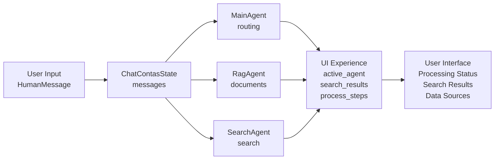

# ENGENHARIA DE ESTADO — CHATCONTAS
## Arquitetura de Estados para Workflow Conversacional

**Versão:** 2.0  
**Data:** Dezembro 2024  
**Módulo:** `sample_agent/agents/tce_swarm/states.py`

---

## 1. ARQUITETURA LANGGRAPH

### 1.1. Estrutura do StateGraph

```python
from langgraph.graph import StateGraph, MessagesState

# Hierarquia de herança
class SwarmState(MessagesState):
    user_id: str
    session_id: str

class ChatContasState(SwarmState):
    # Campos UI + Internos
    pass

# Configuração do grafo
builder = StateGraph(ChatContasState)
```

### 1.2. Workflow Conversacional

```mermaid
graph TB
    INPUT[User Input<br/>HumanMessage] --> MESSAGES[messages: List[BaseMessage]]
    MESSAGES --> CHATCONTAS[ChatContasState]
    
    subgraph "Workflow Conversacional"
        CHATCONTAS --> MAIN[MainAgent]
        CHATCONTAS --> RAG[RagAgent]
        CHATCONTAS --> SEARCH[SearchAgent]
    end
    
    subgraph "UI Experience"
        MAIN --> UI[Interface do Usuário]
        RAG --> UI
        SEARCH --> UI
    end
```

**Hierarquia:**
- **MessagesState**: Base do langgraph com thread conversacional
- **SwarmState**: Adiciona identificação (user_id, session_id)
- **ChatContasState**: Estado principal com campos UI + internos
- **Agent Pattern**: Todos operam com ChatContasState

---

## 2. SWARMSTATE - BASE CONVERSACIONAL

### 2.1. Definição

Estado base que herda de `MessagesState` do langgraph para workflow conversacional.

```python
from langgraph.graph import MessagesState
from langgraph_swarm import SwarmState

class SwarmState(MessagesState):
    """Estado base para workflow conversacional"""
    # Herda automaticamente messages: List[BaseMessage]
    user_id: str
    session_id: str
```

### 2.2. Campos Herdados

| Campo | Tipo | Fonte | Propósito |
|-------|------|-------|-----------|
| `messages` | `List[BaseMessage]` | MessagesState | Thread conversacional |
| `user_id` | `str` | SwarmState | Identificação do usuário |
| `session_id` | `str` | SwarmState | Identificação da sessão |

---

## 3. CHATCONTASSTATE - ESTADO PRINCIPAL

### 3.1. Definição

Estado principal que herda de `SwarmState` e adiciona campos específicos para UI.

```python
class ChatContasState(SwarmState):
    """Estado principal do sistema ChatContas"""
    # Herda messages, user_id, session_id do SwarmState
    
    # Campos para UI
    active_agent: str
    processing_status: str
    search_results: List[SearchResult]
    data_sources: List[str]
    process_steps: List[str]
    error_messages: List[str]
    trace_id: str
    
    # Campos internos
    query: str
    query_type: str
    current_step: str
    routing_decision: str
    expediente_number: str
    processo_number: str
    document_type: str
    requires_user_input: bool
    pending_user_question: str
```

### 3.2. Campos do ChatContasState

#### 3.2.1. Herdados (SwarmState → MessagesState)
| Campo | Tipo | Propósito |
|-------|------|-----------|
| `messages` | `List[BaseMessage]` | Thread conversacional |
| `user_id` | `str` | Identificação do usuário |
| `session_id` | `str` | Identificação da sessão |

#### 3.2.2. Para UI (Exportados)
| Campo | Tipo | Propósito |
|-------|------|-----------|
| `active_agent` | `str` | Agente ativo no momento |
| `processing_status` | `str` | Status do processamento atual |
| `search_results` | `List[SearchResult]` | Resultados com query, url, fonte, confiabilidade |

```python
class SearchResult(TypedDict):
    query: str           # Query utilizada
    url: str            # URL do resultado
    title: str          # Título do resultado
    content: str        # Conteúdo/snippet
    source: str         # Origem (banco_interno, sistema_eletronico, websearch)
    confidence: float   # Confiabilidade (0.0 a 1.0)
    timestamp: str      # Timestamp da busca
```

| `data_sources` | `List[str]` | Fontes utilizadas no processo |
| `process_steps` | `List[str]` | Etapas executadas no processo |
| `error_messages` | `List[str]` | Erros para mostrar ao usuário |
| `trace_id` | `str` | ID de rastreamento |

**Fontes disponíveis:**
- `banco_interno` - Base de dados interna
- `sistema_eletronico` - Sistema de processo eletrônico (API)
- `websearch` - Engine de busca web

**Exemplos de process_steps:**
- `"Analisando consulta"`
- `"Buscando em base interna"`
- `"Consultando sistema eletrônico"`
- `"Processando documentos"`
- `"Consolidando resultados"`

#### 3.2.3. Campos Internos (Não Exportados)
| Campo | Tipo | Propósito |
|-------|------|-----------|
| `query` | `str` | Query extraída de messages para processamento |
| `query_type` | `str` | Classificação (legislacao, expediente, acordao, web) |
| `current_step` | `str` | Etapa atual do processamento interno |
| `routing_decision` | `str` | Decisão de roteamento entre agentes |
| `expediente_number` | `str` | Número extraído para busca específica |
| `processo_number` | `str` | Número do processo para consulta |
| `document_type` | `str` | Tipo de documento sendo processado |
| `requires_user_input` | `bool` | Flag para solicitar input do usuário |
| `pending_user_question` | `str` | Pergunta aguardando resposta |

---

## 4. ESTADOS DOS AGENTES

### 4.1. Padrão dos Agentes

Todos os agentes operam com subconjuntos do `ChatContasState`, focando apenas nos campos necessários para suas funções específicas.

```python
# Todos os agentes recebem e retornam ChatContasState
def main_agent(state: ChatContasState) -> ChatContasState:
    # Acessa campos: messages, query, query_type, routing_decision
    # Atualiza: active_agent, process_steps, current_step
    return state

def rag_agent(state: ChatContasState) -> ChatContasState:
    # Acessa campos: messages, query, document_type
    # Atualiza: search_results, data_sources, process_steps, processing_status
    return state

def search_agent(state: ChatContasState) -> ChatContasState:
    # Acessa campos: messages, query, expediente_number, processo_number
    # Atualiza: search_results, data_sources, process_steps, processing_status
    return state
```

### 4.2. Campos por Agente

#### 4.2.1. MainAgent
**Acessa:** `messages`, `query`, `query_type`, `routing_decision`, `current_step`  
**Atualiza:** `active_agent`, `process_steps`, `current_step`

#### 4.2.2. RagAgent
**Acessa:** `messages`, `query`, `document_type`  
**Atualiza:** `search_results`, `data_sources`, `process_steps`, `processing_status`

#### 4.2.3. SearchAgent
**Acessa:** `messages`, `query`, `expediente_number`, `processo_number`  
**Atualiza:** `search_results`, `data_sources`, `process_steps`, `processing_status`

---

## 5. FLUXO DE DADOS

### 5.1. Workflow Conversacional



### 5.2. Atualização de Process Steps

```python
# Exemplo de atualização durante o fluxo
def update_process_steps(state: ChatContasState, step: str):
    """Adiciona step ao processo para feedback da UI"""
    state["process_steps"].append(step)
    return state

# Nos agentes:
# MainAgent: "Analisando consulta", "Definindo roteamento"
# RagAgent: "Buscando documentos", "Processando chunks"
# SearchAgent: "Consultando sistema", "Buscando na web"
```

### 5.3. Atualização de Search Results

```python
def add_search_result(state: ChatContasState, result: SearchResult):
    """Adiciona resultado à lista para mostrar na UI"""
    state["search_results"].append(result)
    return state

# Exemplo de resultado
result = SearchResult(
    query="Lei 14.133 teletrabalho",
    url="https://sistema.tce.pa.gov.br/doc/123",
    title="Lei 14.133 - Art. 37 sobre teletrabalho",
    content="O teletrabalho é modalidade...",
    source="banco_interno",
    confidence=0.95,
    timestamp="2024-12-01T10:30:00Z"
)
```

---

## 6. MAPEAMENTO DE CAMPOS

### 6.1. Hierarquia de Herança

```python
MessagesState
    ├── messages: List[BaseMessage]
    └── SwarmState
        ├── user_id: str
        ├── session_id: str
        └── ChatContasState
            ├── active_agent: str
            ├── processing_status: str
            ├── search_results: List[SearchResult]
            ├── data_sources: List[str]
            ├── process_steps: List[str]
            ├── error_messages: List[str]
            ├── trace_id: str
            ├── query: str (interno)
            ├── query_type: str (interno)
            ├── current_step: str (interno)
            ├── routing_decision: str (interno)
            ├── expediente_number: str (interno)
            ├── processo_number: str (interno)
            ├── document_type: str (interno)
            ├── requires_user_input: bool (interno)
            └── pending_user_question: str (interno)
```

### 6.2. Campos por Categoria

#### 6.2.1. Base (MessagesState)
| Campo | Tipo | Propósito |
|-------|------|-----------|
| `messages` | `List[BaseMessage]` | Thread conversacional |

#### 6.2.2. Identificação (SwarmState)
| Campo | Tipo | Propósito |
|-------|------|-----------|
| `user_id` | `str` | Identificação do usuário |
| `session_id` | `str` | Identificação da sessão |

#### 6.2.3. UI (ChatContasState - Exportados)
| Campo | Tipo | Propósito |
|-------|------|-----------|
| `active_agent` | `str` | Agente ativo no momento |
| `processing_status` | `str` | Status do processamento |
| `search_results` | `List[SearchResult]` | Resultados de busca |
| `data_sources` | `List[str]` | Fontes consultadas |
| `process_steps` | `List[str]` | Etapas do processo |
| `error_messages` | `List[str]` | Mensagens de erro |
| `trace_id` | `str` | ID de rastreamento |

#### 6.2.4. Processamento (ChatContasState - Internos)
| Campo | Tipo | Propósito |
|-------|------|-----------|
| `query` | `str` | Query extraída de messages |
| `query_type` | `str` | Classificação da query |
| `current_step` | `str` | Etapa interna |
| `routing_decision` | `str` | Decisão de roteamento |
| `expediente_number` | `str` | Número do expediente |
| `processo_number` | `str` | Número do processo |
| `document_type` | `str` | Tipo de documento |
| `requires_user_input` | `bool` | Flag de input usuário |
| `pending_user_question` | `str` | Pergunta pendente |

---

## 7. IMPLEMENTAÇÃO

### 7.1. Configuração do StateGraph

```python
from langgraph.graph import StateGraph
from langgraph.graph import MessagesState

# Definir hierarquia de estados
class SwarmState(MessagesState):
    user_id: str
    session_id: str

class ChatContasState(SwarmState):
    # UI Fields
    active_agent: str
    processing_status: str
    search_results: List[SearchResult]
    data_sources: List[str]
    process_steps: List[str]
    error_messages: List[str]
    trace_id: str
    
    # Internal Fields
    query: str
    query_type: str
    current_step: str
    routing_decision: str
    expediente_number: str
    processo_number: str
    document_type: str
    requires_user_input: bool
    pending_user_question: str

def create_workflow():
    builder = StateGraph(ChatContasState)
    
    builder.add_node("main_agent", main_agent)
    builder.add_node("rag_agent", rag_agent)
    builder.add_node("search_agent", search_agent)
    
    return builder.compile()
```

### 7.2. Inicialização de Estado

```python
def initialize_state(messages: List[BaseMessage], user_id: str, session_id: str) -> ChatContasState:
    """Inicializa o estado com valores padrão"""
    return ChatContasState(
        # Herdados
        messages=messages,
        user_id=user_id,
        session_id=session_id,
        
        # UI
        active_agent="main_agent",
        processing_status="initializing",
        search_results=[],
        data_sources=[],
        process_steps=["Inicializando sistema"],
        error_messages=[],
        trace_id=generate_trace_id(),
        
        # Internal
        query=extract_query_from_messages(messages),
        query_type="",
        current_step="initialization",
        routing_decision="",
        expediente_number="",
        processo_number="",
        document_type="",
        requires_user_input=False,
        pending_user_question=""
    )
```

### 7.3. Exemplo de Uso nos Agentes

```python
def rag_agent(state: ChatContasState) -> ChatContasState:
    # Atualiza status e steps
    state["active_agent"] = "rag_agent"
    state["processing_status"] = "processando_documentos"
    state["process_steps"].append("Processando documentos")
    
    # Processa documentos
    results = process_documents(state["query"])
    
    # Adiciona resultados
    for result in results:
        state["search_results"].append(SearchResult(
            query=state["query"],
            url=result["url"],
            title=result["title"],
            content=result["content"],
            source="banco_interno",
            confidence=result["confidence"],
            timestamp=datetime.now().isoformat()
        ))
    
    # Adiciona fonte utilizada
    state["data_sources"].append("banco_interno")
    state["process_steps"].append("Documentos processados")
    
    return state
```

---

## 8. RESUMO

### 8.1. Arquitetura Final

- **MessagesState**: Base do langgraph com `messages: List[BaseMessage]`
- **SwarmState**: Herda de MessagesState, adiciona `user_id` e `session_id`
- **ChatContasState**: Herda de SwarmState, adiciona 16 campos (7 UI + 9 internos)
- **Agent Pattern**: Todos operam com ChatContasState completo

### 8.2. Experiência do Usuário

#### 8.2.1. Campos UI Exportados
- **active_agent**: Indicador de agente ativo
- **processing_status**: Status em tempo real
- **search_results**: Lista estruturada com query, URL, fonte, confiabilidade
- **data_sources**: Fontes consultadas (banco_interno, sistema_eletronico, websearch)
- **process_steps**: Etapas executadas para transparência
- **error_messages**: Mensagens de erro para o usuário
- **trace_id**: ID de rastreamento para debug

#### 8.2.2. Campos Internos
- **query**: Query extraída de messages
- **query_type**: Classificação para roteamento
- **current_step**: Controle interno de fluxo
- **routing_decision**: Decisão de roteamento
- **expediente_number**: Número do expediente
- **processo_number**: Número do processo
- **document_type**: Tipo de documento
- **requires_user_input**: Flag para interação
- **pending_user_question**: Pergunta pendente

### 8.3. Herança Correta

```python
MessagesState (langgraph)
  └── SwarmState (custom)
      └── ChatContasState (main)
```

- **Base**: MessagesState do langgraph
- **Extensão**: SwarmState para identificação
- **Implementação**: ChatContasState para sistema completo
- **Padrão**: Todos os agentes operam com ChatContasState

---

**Documento técnico - ChatContas State Engineering**  
**Versão:** 2.0 | **Data:** Dezembro 2024  
**Foco:** Workflow conversacional e experiência do usuário
